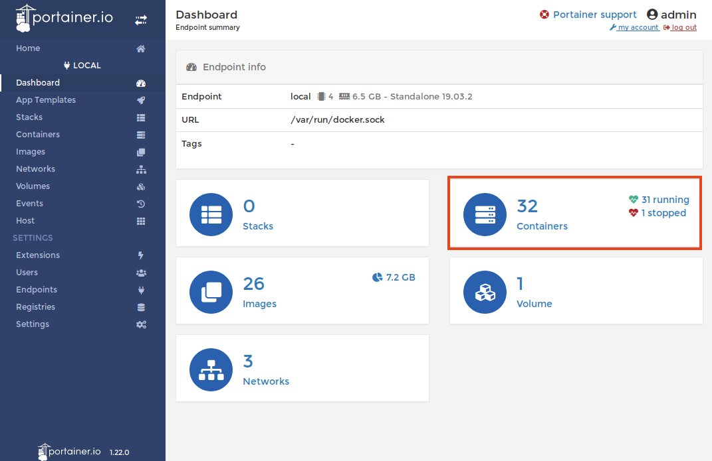

:course_title: JTC04 Docker

:course_desc: This course contains Labs for the Docker introduction.

:course_max: 18


:course_auto: no

:button1_label: Task

:button2_label: Hint

:button2_delay: 9999999

:button3_label: Complete

:button3_delay: 30


#### Task Lab0_DockerIntroduction

----


# Lab 0 - Docker Introduction

Kaaaaaa


#### Hint Lab0_DockerIntroduction

No hint available


#### Complete Lab0_DockerIntroduction

> Confirm Lab1_NetworkPoliciesIntro complete


#### Task Lab1_CreateYourFirstImage

----


aaaa

```
$ cd ~/training/demo-app/k8sdemo_backend

$ docker build -t k8sdemo-backend:lab .

Sending build context to Docker daemon  6.975MB
Step 1/11 : FROM node:8-stretch
 ---> 7a9afc16a57f
Step 2/11 : WORKDIR "/app"
 ---> Using cache
 ---> a2515f8a3ec5
...
Step 11/11 : CMD ["npm", "start"]
 ---> Using cache
 ---> b9b0f3fea9f7
Successfully built b9b0f3fea9f7
Successfully tagged k8sdemo-backend:lab

```


#### Hint Lab1_CreateYourFirstImage

No hint available


#### Complete Lab1_CreateYourFirstImage

> Confirm Lab1_NetworkPoliciesFirst complete


#### Task Lab1_RunYourFirstImage

----


aaaa

```
$ docker run --rm --name k8sdemo-backend -p 3001:3000 k8sdemo-backend:lab

> test@0.0.0 start /app
> node ./bin/www

```

This command runs the backend server:
* --rm makes sure that the container is deleted once it's stopped
* --name gives the container a fixed name (otherwise you get some pretty funny, automatically generated names - think drunken-weasel)
* -p exposes the container port 3000 to the outside port 3001 (we do this so that it does not conflict with port 3000 of the k8sdemo web application we will start later)
* k8sdemo-backend:lab is the image we created before


#### Hint Lab1_RunYourFirstImage

No hint available


#### Complete Lab1_RunYourFirstImage

> Confirm Lab1_NetworkPoliciesFirst complete


#### Task Lab1_UsePortainer

----
Portainer Community Edition is a powerful, open-source management toolset that allows you to easily build, manage and maintain Docker environments. 


1. [Open URL](http://localhost:9010) or use the Portainer Bookmark

2. Login in with `admin`/`admin` (already prefilled)

3. Select `local` for our Endpoint

	

	Now you get an overview of your local Docker instance.

5. Select `Containers`

	

6. You get a list of all running containers and you can see our `k8sdemo-backend` container running.

	

7. Click on the PublishedPorts 3001:3000 to open the backend web interface.
	
8. In your terminal you will see that this generated some traffic:
 	
	```
	$ docker run --rm --name k8sdemo-backend -p 3001:3000 k8sdemo-backend:lab
	
	> test@0.0.0 start /app
	> node ./bin/www
	
	GET / 304 225.805 ms - -
	GET /stylesheets/style.css 304 2.175 ms - -
	
	```

9. Stop the container by hitting `CTRL-C` in the terminal


## So now we have our backend componenet running.

#### Hint Lab1_UsePortainer

No hint available


#### Complete Lab1_UsePortainer

> Confirm Lab1_UsePortainer complete


#### Task Lab1_CreateTheFrontendImage

----


aaaa

```
$ cd ~/training/demo-app/k8sdemo

$ docker build -t k8sdemo:lab .

Sending build context to Docker daemon  13.23MB
Step 1/11 : FROM node:8-stretch
 ---> 7a9afc16a57f
Step 2/11 : WORKDIR "/app"
 ---> Using cache
 ---> a2515f8a3ec5
...
Step 11/11 : CMD ["npm", "start"]
 ---> Using cache
 ---> 5293cb32d1f6
Successfully built 5293cb32d1f6
Successfully tagged k8sdemo:lab

```


#### Hint Lab1_CreateTheFrontendImage

No hint available


#### Complete Lab1_CreateTheFrontendImage

> Confirm Lab1_NetworkPoliciesFirst complete


#### Task Lab1_RunTheFrontendImage

----


1. First let's run the backend container again, but this time in the background

	```
	$ docker run --rm -d --name k8sdemo-backend -p 3001:3000 k8sdemo-backend:lab
	
	444b0570058b97f0532ef89c92963bb7da6aa1f2d3e27bf8c989da5fb8277fe0
	```
	
	This command runs the backend server:
	* -d runs the container in the background (as a daemon)
	

2. Then we start the new Web Frontend container

	```
	$ docker run --rm --name k8sdemo -p 3000:3000 --env BACKEND_URL=http://10.0.2.15:3001/api k8sdemo:lab
	
	
	> test@0.0.0 start /app
	> node ./bin/www
	
	```
	
	
	This command runs the frontend server:
	* --rm makes sure that the container is deleted once it's stopped
	* --name gives the container a fixed name 
	* --env defines the environment variable that points to the `k8sdemo-backend` server API
	* -p exposes the container port 3000 to the outside port 3000
	* k8sdemo:lab is the image we created before


3. Go back to Portainer and refresh the browser

	

4. Click on the PublishedPorts 3000:3000 for `k8sdemo` to open the web interface. 

5. Refresh several times and check in the terminal that some traffic is being generated

	
	```
	GET / 304 6.314 ms - -
	GET /public/bootstrap.min.css 304 0.975 ms - -
	GET /public/bootstrap-theme.min.css 304 0.843 ms - -
	GET /public/stylesheets/style.css 304 2.568 ms - -
	GET /public/images/ibm_cloud.png 304 0.522 ms - -
	GET /public/images/cloud_private.png 304 1.057 ms - -
	GET /public/images/back.png 304 0.411 ms - -
	The value of BACKEND_URL is: http://k8sdemo-backend
	Error: getaddrinfo ENOTFOUND k8sdemo-backend k8sdemo-backend:80
	
	
	```


#### Hint Lab1_RunTheFrontendImage

No hint available


#### Complete Lab1_RunTheFrontendImage

> Confirm Lab1_RunTheFrontendImage complete


