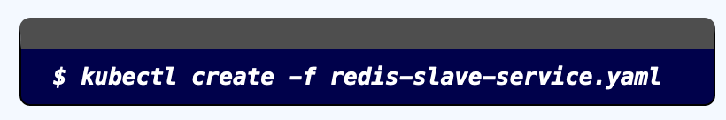
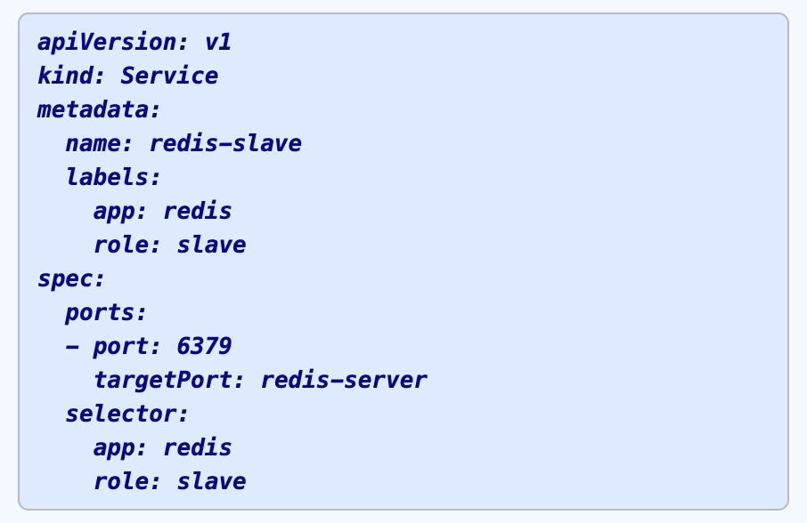

:course_title: JTC14 Kubernetes Operators

:course_desc: This course contains the Kubernetes Operators Labs.  

:course_max: 17

:course_auto: no

:button1_label: Task

:button2_label: Hint

:button2_delay: 9999999

:button3_label: Complete

:button3_delay: 1000


#### Task LabInformation

----


# Lab information

The Operator Framework (intro blog post) is an open source toolkit to manage Kubernetes native applications, called operators, in an effective, automated, and scalable way. Operators take advantage of Kubernetes's extensibility to deliver the automation advantages of cloud services like provisioning, scaling, and backup/restore while being able to run anywhere that Kubernetes can run.

This guide shows how to build a simple memcached operator and how to manage its lifecycle from install to update to a new version. For that, we will use two center pieces of the framework:

    Operator SDK: Allows your developers to build an operator based on your expertise without requiring knowledge of Kubernetes API complexities.
    Operator Lifecycle Manager: Helps you to install, update, and generally manage the lifecycle of all of the operators (and their associated services) running across your clusters.


##  Lab overview

* Lab 0: Provides a walkthrough for getting to know command-line tools and check if minikube is running.

* Lab 1: This lab walks through creating and deploying a simple "guestbook" app written in Go as a net/http Server and accessing it.

* Lab 2: Builds on lab 1 to expand to a more resilient setup which can survive having containers fail and recover. Lab 2 will also walk through basic services you need to get started with Kubernetes

* Lab 3: Builds on lab 2 by increasing the capabilities of the deployed Guestbook application. This lab covers basic distributed application design and how kubernetes helps you use standard design practices.

---
---


# Nomenclatures

### Shell Commands

The commands that you are going to execute to progress the Labs will look like this:



> **IMPORTANT NOTE:** You do not have to enter the `$` character, it's only there for better legibility.
> 
> So in the above example you would only enter/copy-paste `kubectl create -f redis-slave-service.yaml`
> 


### Code Examples
Code examples are presented like this:



This is only for illustration and is not being actively used in the Labs.


#### Hint LabInformation

No hint available


#### Complete LabInformation

> Confirm Lab Information complete
> 


----


#### Task Get Source Code

----

# Download the Workshop Source Code
Repo [training](https://github.com/niklaushirt/training) has the source code for this Lab.

```
$ git clone https://github.com/niklaushirt/training.git
```


#### Hint Get Source Code

No hint available


#### Complete Get Source Code

> Confirm Get Source Code complete


#### Task Lab1_CreateLabOperatorProject

----

# Lab 1. Create and deploy your first Kubernetes Operator

The Operator SDK makes it easier to build Kubernetes native applications.


## Lab 1 - Create the Lab Operator Project

In this part of the lab we will create a demo operator and deploy it to our minikube instance.


1. Create  the `lab-operator` Project

	```
   	$ cd $GOPATH/src
	
	$ operator-sdk new lab-operator 
	
	operator-sdk new lab-operator 
	INFO[0000] Creating new Go operator 'lab-operator'.     
	INFO[0000] Created go.mod                               
	INFO[0000] Created tools.go                             
	INFO[0000] Created cmd/manager/main.go                  
	INFO[0000] Created build/Dockerfile                     
	INFO[0000] Created build/bin/entrypoint                 
	INFO[0000] Created build/bin/user_setup                 
	INFO[0000] Created deploy/service_account.yaml          
	INFO[0000] Created deploy/role.yaml                     
	INFO[0000] Created deploy/role_binding.yaml             
	INFO[0000] Created deploy/operator.yaml                 
	INFO[0000] Created pkg/apis/apis.go    
	...
	
	```


2. Change to the `lab-operator` directory		
	```
	$ cd lab-operator 
	
	```


2. Change to the `lab-operator` directory		
	```
	$ cd lab-operator 

	```

#### Hint Lab1_CreateLabOperatorProject

No hint available


#### Complete Lab1_CreateLabOperatorProject

> Confirm Lab1_CreateLabOperatorProject complete


#### Task Lab1_CreateLabOperatorAPI

----


## Lab 1 - Create the Lab Operator API

Add a new Custom Resource Definition (CRD) API called Memcached, with APIVersion `lab.ibm.com/v1beta1` and Kind `MyLabDemo`.

1. Create the CRD API

	```
   	$ cd $GOPATH/src/lab-operator
	
	$ operator-sdk add api --api-version=lab.ibm.com/v1beta1 --kind=MyLabDemo

	INFO[0000] Generating api version lab.ibm.com/v1beta1 for kind MyLabDemo. 
	INFO[0000] Created pkg/apis/lab/group.go                
	INFO[0007] Created pkg/apis/lab/v1beta1/mylabdemo_types.go 
	INFO[0007] Created pkg/apis/addtoscheme_lab_v1beta1.go  
	INFO[0007] Created pkg/apis/lab/v1beta1/register.go     
	INFO[0007] Created pkg/apis/lab/v1beta1/doc.go          
	INFO[0007] Created deploy/crds/lab_v1beta1_mylabdemo_cr.yaml 
	INFO[0013] Created deploy/crds/lab_v1beta1_mylabdemo_crd.yaml 
	INFO[0013] Running deepcopy code-generation for Custom Resource group versions: [lab:[v1beta1], ] 
	INFO[0019] Code-generation complete.                    
	INFO[0019] Running OpenAPI code-generation for Custom Resource group versions: [lab:[v1beta1], ] 
	INFO[0031] Created deploy/crds/lab_v1beta1_mylabdemo_crd.yaml 
	INFO[0031] Code-generation complete.                    
	INFO[0031] API generation complete.          
	```


2. Define an additional parameter `image` to the Custom Resource Definition
		
	```
	$ gedit ./pkg/apis/lab/v1beta1/mylabdemo_types.go

	```

	Add `Image` as a parameter to the `MyLabDemoSpec struct` and save
	
	```shell
	type MyLabDemoSpec struct {
	// INSERT ADDITIONAL SPEC FIELDS - desired state of cluster
	// Important: Run "operator-sdk generate k8s" to regenerate code after modifying this file
	// Add custom validation using kubebuilder tags: https://book-v1.book.kubebuilder.io/beyond_basics/generating_crd.html
	
	// Image is the Docker image to run for the daemon
   Image string `json:"image"`
}
	```


3. Add a image field to the Custom Resource
		
	```
	$ gedit ./deploy/crds/lab_v1beta1_mylabdemo_cr.yaml

	```

	Add `image: busybox` at the end of the file and save
	
	```yaml
	apiVersion: lab.ibm.com/v1beta1
	kind: MyLabDemo
	metadata:
	  name: example-mylabdemo
	spec:
	  # Add fields here
	  size: 3
	  image: busybox
	```


4. Generate the API		

	```
	$ operator-sdk generate k8s
	
	INFO[0000] Running deepcopy code-generation for Custom Resource group versions: [lab:[v1beta1], ] 
	INFO[0005] Code-generation complete.   
	```
	
	```
   	$ operator-sdk generate openapi
   	
   	INFO[0000] Running OpenAPI code-generation for Custom Resource group versions: [lab:[v1beta1], ] 
	INFO[0011] Created deploy/crds/lab_v1beta1_mylabdemo_crd.yaml 
	INFO[0011] Code-generation complete.  
	```


## We have now finished to set up the API nad CRDs

#### Hint Lab1_CreateLabOperatorAPI

No hint available


#### Complete Lab1_CreateLabOperatorAPI

> Confirm Lab1_CreateLabOperatorAPI complete


#### Task Lab1_CreateLabOperatorController

----


## Lab 1 - Create the Lab Operator Controller


1. Create  the `lab-operator` Controller
	
	```
	$ operator-sdk add controller --api-version=lab.ibm.com/v1beta1 --kind=MyLabDemo
	
	INFO[0000] Generating controller version lab.ibm.com/v1beta1 for kind MyLabDemo. 
	INFO[0000] Created pkg/controller/mylabdemo/mylabdemo_controller.go 
	INFO[0000] Created pkg/controller/add_mylabdemo.go      
	INFO[0000] Controller generation complete. 

	```
	

2. Edit the `lab-operator` Controller		
	```
	$ gedit ./pkg/controller/mylabdemo/mylabdemo_controller.go

	```


2. Scroll to line 148 
   
   and replace `Image:   "busybox"`, with `Image:   cr.Spec.Image`,
   		
	```
	$ cd lab-operator 

	```
	
	
2. Now let's build the Operator container 
   
   		
	```	
	operator-sdk build localhost:5000/lab-operator:v0.0.1
	INFO[0033] Building OCI image lab-operator:v0.0.1       
	Sending build context to Docker daemon  42.22MB
	Step 1/7 : FROM registry.access.redhat.com/ubi7/ubi-minimal:latest
	latest: Pulling from ubi7/ubi-minimal
	...
	Successfully built 84824c0c5876
	Successfully tagged lab-operator:v0.0.1
	INFO[0048] Operator build complete.  
	```	
	
2. Now let's build the Operator container 
   
   		
	```		
	sed -i 's|REPLACE_IMAGE|localhost:5000/lab-operator:v0.0.1|g' deploy/operator.yaml
	```

3. And push the Operator container to the local registry 
   
   		
	```		
	docker push localhost:5000/lab-operator:v0.0.1
	```


#### Hint Lab1_CreateLabOperatorController

No hint available


#### Complete Lab1_CreateLabOperatorController

> Confirm Lab1_CreateLabOperatorController complete


#### Task Lab1_DeployLabOperator

----


## Lab 1 - Deploy the Lab Operator


1. Deploy  the `lab-operator` Custom Resource Definition
	
	```
	$ kubectl create -f ./deploy/crds/lab_v1beta1_mylabdemo_crd.yaml 
	
	customresourcedefinition.apiextensions.k8s.io/mylabdemos.lab.ibm.com created

	
	```

2. Create  the `lab-operator` Service Account
	
	```
	kubectl create -f ./deploy/service_account.yaml
	kubectl create -f ./deploy/role.yaml
	kubectl create -f ./deploy/role_binding.yaml
	
	serviceaccount/lab-operator created
	role.rbac.authorization.k8s.io/lab-operator created
	rolebinding.rbac.authorization.k8s.io/lab-operator created

	```

3. Create  the `lab-operator` Operator
	
	```
	kubectl create -f ./deploy/operator.yaml
	
	deployment.apps/lab-operator created

	```
	
	Check and wait for the Operator running
	
	```
	kubectl get pods
	
	NAME                            READY   STATUS    RESTARTS   AGE
	lab-operator-6cf66c6d4f-24pqm   1/1     Running   0          43m
	training@training:~/go/src/lab-operator$ 

	```
	

1. Deploy  the `lab-operator` Custom Resource
	
	
	
	
	
	```
	kubectl create -f ./deploy/crds/lab_v1beta1_mylabdemo_cr.yaml
	
	MyLabDemo.lab.ibm.com/example-MyLabDemo created
	```
	
	
	```yaml
	apiVersion: lab.ibm.com/v1beta1
	kind: MyLabDemo
	metadata:
	  name: example-mylabdemo
	spec:
	  # Add fields here
	  size: 3
	  image: busybox
	```


	```
	kubectl get pods
	NAME                            READY   STATUS    RESTARTS   AGE
	example-mylabdemo-pod           1/1     Running   0          43m
	lab-operator-6cf66c6d4f-24pqm   1/1     Running   0          43m
	training@training:~/go/src/lab-operator$ 

	

	```
	

#### Hint Lab1_DeployLabOperator

No hint available


#### Complete Lab1_DeployLabOperator

> Confirm Lab1_DeployLabOperator complete


#### Task Lab1_CleanUpLabOperator

----


## Lab 1 - Clean-up the Lab


1. Deploy  the `lab-operator` Custom Resource Definition
	
	```
	$ 
	kubectl delete -f ./deploy/crds/lab_v1beta1_mylabdemo_crd.yaml
	kubectl delete -f ./deploy/service_account.yaml
	kubectl delete -f ./deploy/role.yaml
	kubectl delete -f ./deploy/role_binding.yaml
	kubectl delete -f ./deploy/operator.yaml
	kubectl delete -f ./deploy/crds/lab_v1beta1_mylabdemo_cr.yaml
	
	
	```


# Congratulations!!! This concludes Lab 1 on Kubernetes Operators
	

#### Hint Lab1_CleanUpLabOperator

No hint available


#### Complete Lab1_CleanUpLabOperator

> Confirm Lab1_CleanUpLabOperator complete


