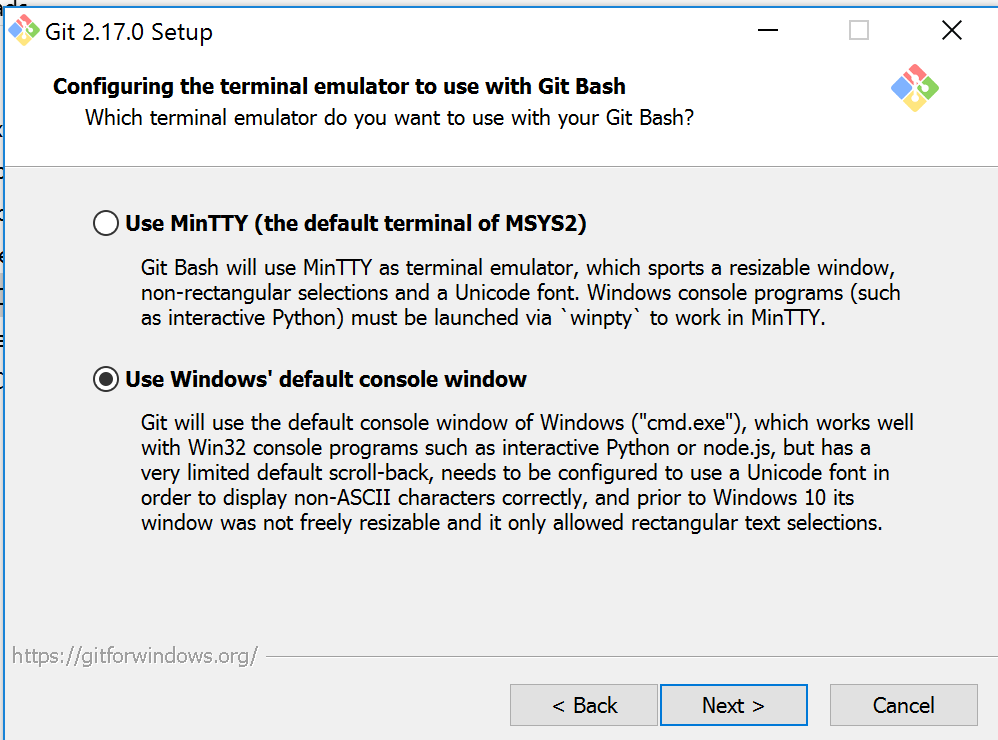

:course_title: JTC90 Kubernetes Lab Setup

:course_desc: This course walks you through the Lab preparations for the Journey to Cloud.

:course_max: 3


:course_auto: no

:button1_label: Task

:button2_label: Hint

:button2_delay: 9999999

:button3_label: Complete

:button3_delay: 300


:infotab: <h1 id="toc_0">Tips and Tricks for getting around in the labs</h1>
:infotab: 
:infotab: <h2 id="toc_1">Mac Tips</h2>
:infotab: 
:infotab: <h3 id="toc_2">Opening Terminal</h3>
:infotab: 
:infotab: <p>In order to rapidly open the terminal application, hit CMD - SPACE and type terminal.</p>
:infotab: 
:infotab: <p></p>
:infotab: <HR>
:infotab: <h2 id="toc_3">Kubernetes Tips</h2>
:infotab: 
:infotab: <h3 id="toc_4">Pod Logs</h3>
:infotab: 
:infotab: <p>You can look at the logs of any of the pods running under your deployments as follows</p>
:infotab: 
:infotab: <div><pre><code class="language-console">$ kubectl logs &lt;podname&gt;</code></pre></div>
:infotab: 
:infotab: <p>Remember that if you have multiple containers running in your pod, you
:infotab: have to specify the specific container you want to see logs from.</p>
:infotab: 
:infotab: <div><pre><code class="language-console">$ kubectl logs &lt;pod-name&gt; &lt;container-name&gt;</code></pre></div>
:infotab: 
:infotab: <p>This subcommand operates like <code>tail</code>. Including the <code>-f</code> flag will
:infotab: continue to stream the logs live once the current time is reached.</p>
:infotab: 
:infotab: <h3 id="toc_5">kubectl edit and vi</h3>
:infotab: 
:infotab: <p>By default, on many Linux and macOS systems, you will be dropped into the editor <code>vi</code>.
:infotab: If you end up in vi you can quit by typing <code>ESC :q!</code></p>
:infotab: 
:infotab: <p>IF you prefer using nano as an editor, execute </p>
:infotab: 
:infotab: <div><pre><code class="language-none">export EDITOR=nano</code></pre></div>
:infotab: 
:infotab: <p>On Windows, a copy of <code>notepad.exe</code> will be opened with the contents of the file.</p>
:infotab: 
:infotab: <h3 id="toc_6">nano basic commands</h3>
:infotab: 
:infotab: <div><pre><code class="language-none">Ctrl-O      To save your work (WriteOut)
:infotab: <BR>Ctrl-X      To exit nano
:infotab: <BR>Ctrl-W      To search for text in a document
:infotab: <BR>Ctrl-K      To cut a line of text</code></pre></div>
:infotab: 
:infotab: <h3 id="toc_7">busybox pod</h3>
:infotab: 
:infotab: <p>For debugging live, this command frequently helps me:</p>
:infotab: 
:infotab: <div><pre><code class="language-console">kubectl run bb --image busybox --restart=Never -it --rm</code></pre></div>
:infotab: 
:infotab: <p>In the busybox image is a basic shell that contains useful utilities.</p>
:infotab: 
:infotab: <p>Utils I often use are <code>nslookup</code> and <code>wget</code>. </p>
:infotab: 
:infotab: <p><code>nslookup</code> is useful for testing DNS resolution in a pod.</p>
:infotab: 
:infotab: <p><code>wget</code> is useful for trying to do network requests.</p>
:infotab: 
:infotab: <h3 id="toc_8">Service Endpoints</h3>
:infotab: 
:infotab: <p>Endpoint resource can be used to see all the service endpoints.</p>
:infotab: 
:infotab: <div><pre><code class="language-console">$ kubectl get endpoints &lt;service&gt;</code></pre></div>
:infotab: 
:infotab: <h3 id="toc_9">ImagePullPolicy</h3>
:infotab: 
:infotab: <p>By default Kubernetes will only pull the image on first use. This can
:infotab: be confusing during development when you expect changes to show up.</p>
:infotab: 
:infotab: <p>You should be aware of the three <code>ImagePullPolicy</code>:</p>
:infotab: 
:infotab: <ul>
:infotab: <li>IfNotPresent - the default, only request the image if not present.</li>
:infotab: <li>Always - always request the image.</li>
:infotab: <li>Never</li>
:infotab: </ul>
:infotab: 
:infotab: <p>More details on image management may be <a href="https://kubernetes.io/docs/concepts/containers/images/">found here</a>.</p>


#### Task SetUpMinishift

----
# Setting up Minishift

### Getting set up

Before we dive into Kubernetes, you need to provision a local Minishift cluster for your containerized app. Then you won't have to wait for it to be ready for the subsequent labs. 

----

## Part 1 - Install a Hypervisor

If you do not already have a hypervisor installed, install one for your OS now:

Operating system	Supported hypervisors:

* macOS	[VirtualBox](https://www.virtualbox.org/wiki/Downloads), VMware Fusion, HyperKit
* Linux	[VirtualBox](https://www.virtualbox.org/wiki/Downloads), KVM
* Windows	[VirtualBox](https://www.virtualbox.org/wiki/Downloads), Hyper-V

    Note: Minishift also supports a --vm-driver=none option that runs the Kubernetes components on the host and not in a VM. Using this driver requires Docker and a Linux environment but not a hypervisor.
    
---

## Part 2 - Install Minishift on your OS

---

### macOS

Requires installing a hypervisor, such as [hyperkit](https://github.com/kubernetes/minishift/blob/master/docs/drivers.md#hyperkit-driver) (recommended) or VirtualBox.

The easiest way to install Minishift on macOS is using Homebrew:


#### Install brew

```
$ /usr/bin/ruby -e "$(curl -fsSL https://raw.githubusercontent.com/Homebrew/install/master/install)"
```

#### Install minishift

```
$ brew cask install minishift

```


Or if you don't want to use **brew**

```
$ curl -Lo minishift https://github.com/minishift/minishift/releases/download/v1.34.1/minishift-1.34.1-darwin-amd64.tgz \
  && chmod +x minishift

$ sudo mv minishift /usr/local/bin
```


---

### Linux
  * Requires either the [kvm2 driver](https://github.com/kubernetes/minishift/blob/master/docs/drivers.md#kvm2-driver) (recommended), or VirtualBox
  * VT-x/AMD-v virtualization must be enabled in BIOS
  * and by using
  
	   ```
	  $ curl -LO https://github.com/minishift/minishift/releases/download/v1.34.1/minishift-1.34.1-linux-amd64.tgz /usr/local/bin/minishift
	   ```

---

### Windows 10
  * Requires a hypervisor, such as VirtualBox (recommended) or HyperV
  * VT-x/AMD-v virtualization must be enabled in BIOS
  * You can install minishift:
	  * either using [chocolatey](https://chocolatey.org/) 
	  
	  ```
	  $ choco install minishift
	  ```
	  
	  * or manually: Download and run the [installer](https://github.com/minishift/minishift/releases/download/v1.34.1/minishift-1.34.1-windows-amd64.zip)


---


## Part 3 - Starting minishift (all macOS, Windows and Linux)

Then we start minishift (parameters are important for the Istio Lab):

```
$ minishift start --vm-driver virtualbox --memory=8192 --cpus=4                                                                                                                                             
-- Starting profile 'minishift'
-- Check if deprecated options are used ... OK
-- Checking if https://github.com is reachable ... OK
-- Checking if requested OpenShift version 'v3.11.0' is valid ... OK
-- Checking if requested OpenShift version 'v3.11.0' is supported ... OK
-- Checking if requested hypervisor 'virtualbox' is supported on this platform ... OK
-- Checking if VirtualBox is installed ... OK
-- Checking the ISO URL ... OK
-- Checking if provided oc flags are supported ... OK
-- Starting the OpenShift cluster using 'virtualbox' hypervisor ...
-- Minishift VM will be configured with ...
   Memory:    8 GB
   vCPUs :    4
   Disk size: 20 GB
-- Starting Minishift VM .....................................


```

Wait for minishift to start this may take some time to download and start the cluster.


If you need some more details: [Install MiniShift](https://docs.okd.io/latest/minishift/getting-started/installing.html)

To conclude, run the following command in order to get access to the `oc` command line tool.

```
eval $(minishift oc-env)

```

---
---
---


## Some Tips and Tricks if you run into problems

---

> **Hint**
> 
> If you get trhe error `no external vswitch found`
> 
> Start minishift with this additional switch `--hyperv-virtual-switch "minishift"`


---


> **Hint**
> 
> If you want to use hyperkit you have to install it with
> 
> ```
> $ brew install hyperkit
> $ brew install docker-machine-driver-hyperkit
> $ sudo chown root:wheel /usr/local/bin/docker-machine-driver-hyperkit && sudo chmod u+s /usr/local/bin/docker-machine-driver-hyperkit
> ```
> 
> And start minishift with
> 
> ```
> $ minishift start --vm-driver hyperkit --memory=8192 --cpus=4                                                                                                                                              
> ```


---

> 
> **Hint:**
> 
> IF you get the following error:
> 💣 Error starting cluster: wait: waiting for component=kube-apiserver: timed out waiting for the condition
> 
> Try deactivating your VPN (Cisco AnyConnect, ...) and/or reboot.

---

> **Hint:**
> 
> If needed you can specify the VM provider:
> 
> `minishift start --memory=8192 --cpus=4 --vm-driver=virtualbox`
> 
> 
> `minishift start --memory=8192 --cpus=4 --vm-driver=vmwarefusion`
> 

---

> **Hint:**
> 
> If you have previously installed minishift, and run:
> 
> `minishift start`
> 
> And the command returns an error:
> 
> `machine does not exist`
> 
> You need to wipe the configuration files:
> 
> `rm -rf ~/.minishift`


#### Hint SetUpminishift

No hint available


#### Complete SetUpminishift

> Confirm SetUpminishift complete


#### Task SetUpKubectl

----


# Install the Kubernetes CLI

To view a local version of the Kubernetes dashboard and to deploy apps into your clusters, you will need to install the Kubernetes CLI that corresponds with your operating system:


**For Windows users:** 

You can install kubectl: 

* either manually: 
	* [Download for Windows](https://storage.googleapis.com/kubernetes-release/release/v1.14.0/bin/windows/amd64/kubectl.exe) and 
	* add the binary in to your PATH.
	
* or using [chocolatey](https://chocolatey.org/) 
	
	```
	$ choco install kubernetes-cli
	```

---

**For OS X and Linux users:**

#### Install via command line (preferred)

```
$ curl -LO https://storage.googleapis.com/kubernetes-release/release/v1.14.0/bin/darwin/amd64/kubectl

$ mv ./kubectl /usr/local/bin/kubectl

$ chmod +x /usr/local/bin/kubectl


```


#### Direct download

Download from:

* [OS X](https://storage.googleapis.com/kubernetes-release/release/v1.14.0/bin/darwin/amd64/kubectl)
* [Linux](https://storage.googleapis.com/kubernetes-release/release/v1.14.0/bin/linux/amd64/kubectl)

1. Move the executable file to the `/usr/local/bin` directory using the command `mv /<path_to_file>/kubectl /usr/local/bin/kubectl` .

2. Make sure that `/usr/local/bin` is listed in your PATH system variable.

	```
	$ echo $PATH
	/usr/local/bin:/usr/bin:/bin:/usr/sbin:/sbin
	```

3. Convert the binary file to an executable: `chmod +x /usr/local/bin/kubectl`


#### Hint SetUpKubectl

No hint available


#### Complete SetUpKubectl

> Confirm SetUpKubectl complete


#### Task SetUpGIT

----

# Install Git on your laptop

To do so : 

For MacOS :
http://mac.github.com

For Windows: 
http://git-scm.com/download/win

At some point during the installation, change to the **"Use Windows default console"** and continue the installation.


#### Hint SetUpGIT

No hint available


#### Complete SetUpGIT

> Confirm SetUpGIT complete


# OC

##Logging Into the Cluster

By default, cluster up uses AllowAllPasswordIdentityProvider to authenticate against the local cluster. This means any non-empty user name and password can be used to login to the local cluster.

The recommended user name and password is developer and developer, respectively. This is because they are already assigned to the default project myproject and also can impersonate the administrator. This allows you to run administrator commands using the --as system:admin parameter.

To login as administrator, use the system account:

$ oc login -u system:admin


## Accessing the Web Console

To access the [OpenShift Web console](https://docs.okd.io/latest/architecture/infrastructure_components/web_console.html), you can run this command in a shell after starting Minishift to get the URL of the Web console:
    
    $ minishift console --url

Alternatively, after starting Minishift, you can use the following command to directly open the console in a browser:
    
    $ minishift console


## Logging Into the Registry

  1. Start Minishift and add the `oc` binary to the `PATH`. For a detailed example, see the [Minishift Quickstart](https://docs.okd.io/latest/minishift/getting-started/quickstart.html) section.

  2. Make sure your shell is configured to [reuse the Minishift docker daemon](https://docs.okd.io/latest/minishift/using/docker-daemon.html).

  3. Log into the OpenShift Docker registry.
    
     $ docker login -u developer -p $(oc whoami -t) $(minishift openshift registry)

## [](https://docs.okd.io/latest/minishift/openshift/openshift-docker-registry.html#deploy-applications)Deploying Applications

The following example shows how to deploy an OpenShift application directly from a locally-built Docker image. This example uses the OpenShift project **myproject**. This project is automatically created by `minishift start`.

  1. Make sure your shell is configured to [reuse the Minishift docker daemon](https://docs.okd.io/latest/minishift/using/docker-daemon.html).

  2. Build the Docker image as usual.

  3. Tag the image against the OpenShift registry:
    
     $ docker tag my-app $(minishift openshift registry)/myproject/my-app

  4. Push the image to the registry to create an image stream with the same name as the application:
    
     $ docker push $(minishift openshift registry)/myproject/my-app

  5. Create an application from the image stream and expose the service:
    
     $ oc new-app --image-stream=my-app --name=my-app $ oc expose service my-app

__

If you want to deploy an application using `oc run --image […​]` then exposed internal registry route doesn’t work. You should use internal registry IP along with your project and app to deploy, as following:
    
    $ oc run myapp --image 172.30.1.1:5000/myproject/myapp


## Viewing OpenShift Logs

To access OpenShift logs, run the following command after starting Minishift:

$ minishift logs

