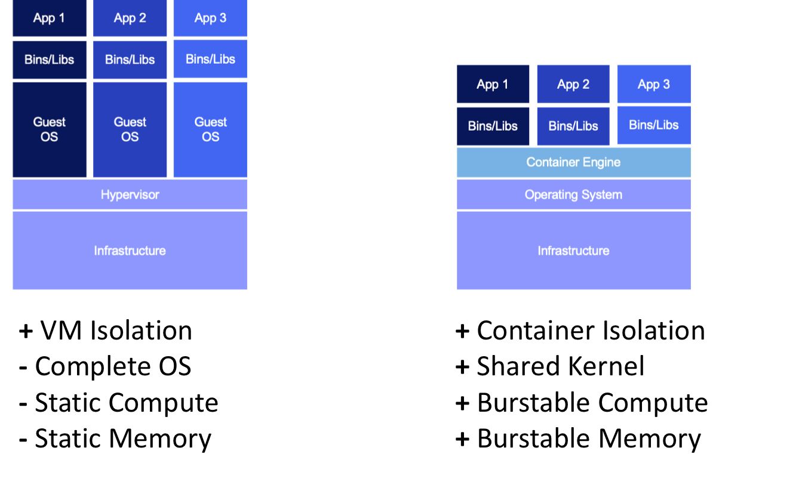
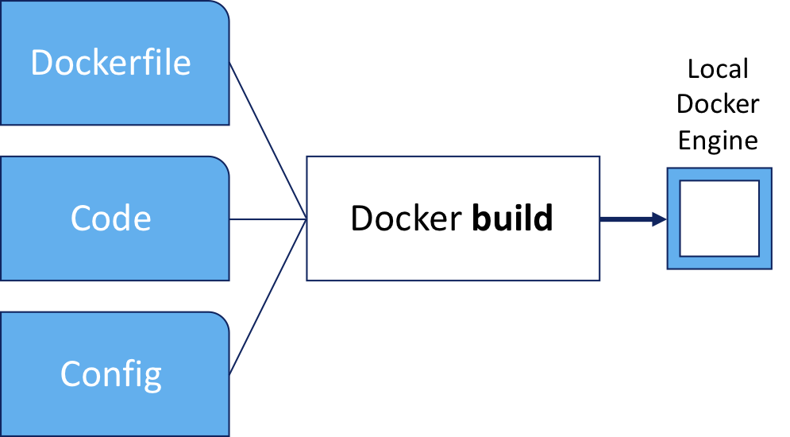
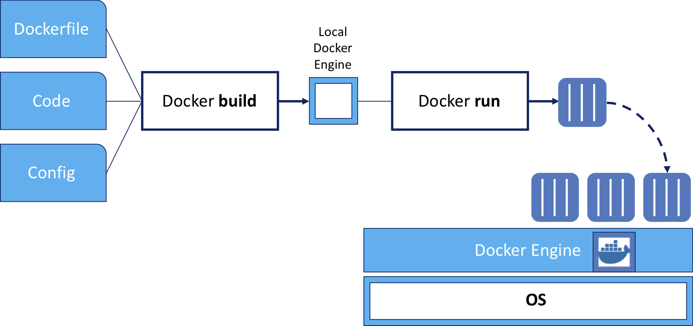
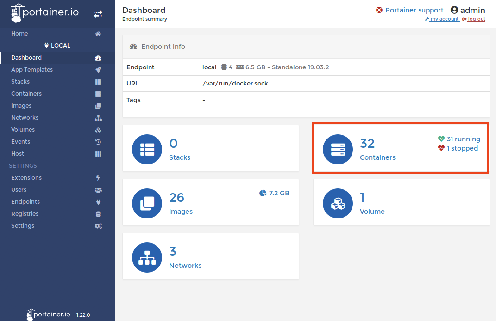
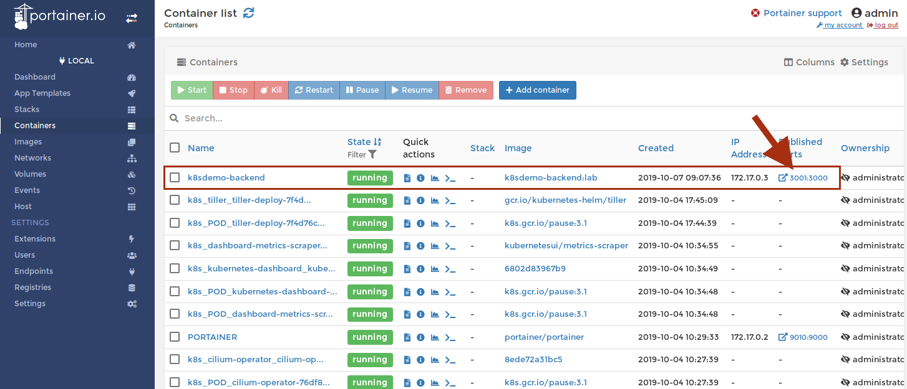
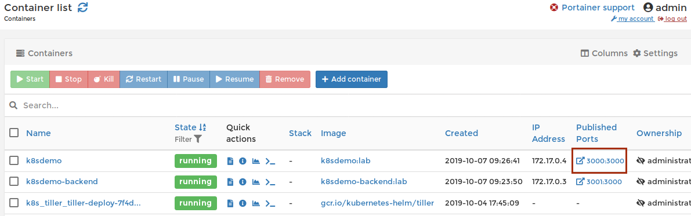
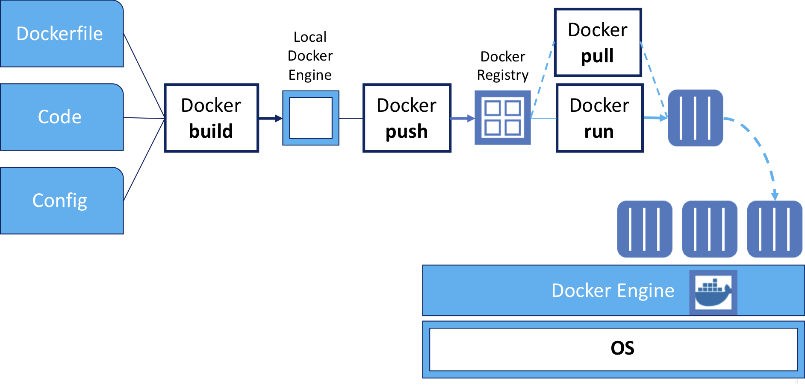

:course_title: JTC01 Docker

:course_desc: This course contains Labs for the Docker introduction.

:course_max: 12


:course_auto: no

:button1_label: Task

:button2_label: Hint

:button2_delay: 9999999

:button3_label: Complete

:button3_delay: 30


:infotab: <h1>Prerequisites for the Lab</h1>
:infotab: <ul>
:infotab: <li><p>Internet Access</p>
:infotab: </li>
:infotab: <li><p>PC with at least:</p>
:infotab: <ul>
:infotab: <li>4 Core CPU</li>
:infotab: <li>16GB of RAM</li>
:infotab: <li>30GB of free Disk Space</li>
:infotab: 
:infotab: </ul>
:infotab: </li>
:infotab: 
:infotab: </ul>
:infotab: <h1>Tips and Tricks for getting around in the labs</h1>
:infotab: <h2>Login to the VM</h2>
:infotab: <pre><code>The userid is      training
:infotab: <BR>the password is    passw0rd
:infotab: </code></pre>
:infotab: <p>&nbsp;</p>
:infotab: <hr />
:infotab: <p>&nbsp;</p>
:infotab: <h2>Mac Tips</h2>
:infotab: <h3>Opening Terminal</h3>
:infotab: <p>In order to rapidly open the terminal application, hit CMD - SPACE and type terminal.</p>
:infotab: <p></p>
:infotab: <hr />
:infotab: <p>&nbsp;</p>
:infotab: <h2>Minikube Tips</h2>
:infotab: <p>You can open a deployed Kubernetes application by typing:</p>
:infotab: <pre><code>minikube service &lt;my-service-name&gt;
:infotab: </code></pre>
:infotab: <p>&nbsp;</p>
:infotab: <hr />
:infotab: <p>&nbsp;</p>
:infotab: <h2>Kubernetes Tips</h2>
:infotab: <h3>Pod Logs</h3>
:infotab: <p>You can look at the logs of any of the pods running under your deployments as follows</p>
:infotab: <pre><code class='language-console' lang='console'>$<$ kubectl logs &lt;pod-name&gt; &lt;container-name&gt;
:infotab: </code></pre>
:infotab: <p>This subcommand operates like <code>tail</code>. Including the <code>-f</code> flag will
:infotab: continue to stream the logs live once the current time is reached.</p>
:infotab: <h3>kubectl edit and vi</h3>
:infotab: <p>By default, on many Linux and macOS systems, you will be dropped into the editor <code>vi</code>.
:infotab: If you end up in vi you can quit by typing <code>ESC :q!</code></p>
:infotab: <p>IF you prefer using nano as an editor, execute </p>
:infotab: <pre><code>export EDITOR=nano
:infotab: </code></pre>
:infotab: <p>On Windows, a copy of <code>notepad.exe</code> will be opened with the contents of the file.</p>
:infotab: <h3>nano basic commands</h3>
:infotab: <pre><code>Ctrl-O		To save your work (WriteOut)
:infotab: <BR>Ctrl-X		To exit nano
:infotab: <BR>Ctrl-W		To search for text in a document
:infotab: <BR>Ctrl-K		To cut a line of text
:infotab: </code></pre>
:infotab: <p>&nbsp;</p>
:infotab: <h3>busybox pod</h3>
:infotab: <p>For debugging live, this command frequently helps me:</p>
:infotab: <pre><code class='language-console' lang='console'>kubectl run bb --image busybox --restart=Never -it --rm
:infotab: </code></pre>
:infotab: <p>In the busybox image is a basic shell that contains useful utilities.</p>
:infotab: <p>Utils I often use are <code>nslookup</code> and <code>wget</code>. </p>
:infotab: <p><code>nslookup</code> is useful for testing DNS resolution in a pod.</p>
:infotab: <p><code>wget</code> is useful for trying to do network requests.</p>
:infotab: <h3>Service Endpoints</h3>
:infotab: <p>Endpoint resource can be used to see all the service endpoints.</p>
:infotab: <pre><code class='language-console' lang='console'>$ kubectl get endpoints &lt;service&gt;
:infotab: </code></pre>
:infotab: <h3>ImagePullPolicy</h3>
:infotab: <p>By default Kubernetes will only pull the image on first use. This can
:infotab: be confusing during development when you expect changes to show up.</p>
:infotab: <p>You should be aware of the three <code>ImagePullPolicy</code>:</p>
:infotab: <ul>
:infotab: <li>IfNotPresent - the default, only request the image if not present.</li>
:infotab: <li>Always - always request the image.</li>
:infotab: <li>Never</li>
:infotab: 
:infotab: </ul>
:infotab: <p>More details on image management may be <a href='https://kubernetes.io/docs/concepts/containers/images/'>found here</a>.</p>
:infotab: 


#### Task Lab0_LabInformation

----


# Lab0 - Lab information

Docker is an open platform for developing, shipping, and running applications. 

Docker enables you to separate your applications from your infrastructure so you can deliver software quickly. With Docker, you can manage your infrastructure in the same ways you manage your applications. By taking advantage of Docker’s methodologies for shipping, testing, and deploying code quickly, you can significantly reduce the delay between writing code and running it in production.

In this Lab you will learn the basic operations for building and running Docker containers.


## Lab sources

All the source code for the lab is available here:

https://github.com/niklaushirt/training


##  Lab overview

* In this Lab you will learn the basics of Docker:

1. Docker basics
2. Build a Docker image
3. Run a Docker image
4. Use the Portainer tool
5. Deploy a more complex Docker application
6. Push a Docker image into a registry 


---

#### Hint Lab0_LabInformation

No hint available


#### Complete Lab0_LabInformation

Confirm Lab0_LabInformation complete

----


#### Task Lab0_LabSemantics

----


# Lab0 - Lab semantics


## Nomenclatures

---

### Shell Commands

The commands that you are going to execute to progress the Labs will look like this:

```
   kubectl create -f redis-slave-service.yaml
	
	> Output Line 1     
	> Output Line 2
	> Output Line 3
	...
	
```


> **IMPORTANT NOTE:** The example output of a command is prefixed by ">" in order to make it more distinguishable. 
> 
> So in the above example you would only enter/copy-paste `kubectl create -f redis-slave-service.yaml` and the output from the command is "Output Line 1" to "Output Line 3" 
> 

---

### Code Examples
Code examples are presented like this:

```yaml
apiVersion: lab.ibm.com/v1beta1
kind: MyResource
metadata:
  name: example
spec:
  size: 3
  image: busybox
```

This is only for illustration and is not being actively used in the Labs.


#### Hint Lab0_LabSemantics

No hint available


#### Complete Lab0_LabSemantics

Confirm Lab0_LabSemantics complete


#### Task Lab0_Prepare

---

# Lab 0 - Prepare the Lab environment

Before starting the Labs, let's make sure that we have the latest source code from the GitHub repository:

https://github.com/niklaushirt/training


1. Open a Terminal window by clicking on the Termnial icon in the left sidebar - we will use this extensively later as well


2. Execute the following commands to pull the latest example code from my GitHub repository

   

```
cd training/
gitrefresh 

```


#### Hint Lab0_Prepare

No hint available


#### Complete Lab0_Prepare

Confirm Lab0_Prepare complete

----


#### Task Lab1_DockerIntroduction

----


# Lab 1 - Get to know Docker

Docker is an open platform for developing, shipping, and running applications. 

Docker enables you to separate your applications from your infrastructure so you can deliver software quickly. With Docker, you can manage your infrastructure in the same ways you manage your applications. By taking advantage of Docker’s methodologies for shipping, testing, and deploying code quickly, you can significantly reduce the delay between writing code and running it in production.

Docker provides the ability to package and run an application in a loosely isolated environment called a container. The isolation and security allow you to run many containers simultaneously on a given host. Containers are lightweight because they don’t need the extra load of a hypervisor, but run directly within the host machine’s kernel. This means you can run more containers on a given hardware combination than if you were using virtual machines. You can even run Docker containers within host machines that are actually virtual machines!

More details on `Docker` can be found [here](https://docs.docker.com/engine/docker-overview/).




## Dockerfile 

A `Dockerfile` is a text document that contains all the commands a user could call on the command line to assemble an image. 

```yaml
FROM node:8-stretch

# Change working directory
WORKDIR "/app"

# Update packages and install dependency packages for services
RUN apt-get update \
 && apt-get dist-upgrade -y \
 && apt-get clean \
 && echo 'Finished installing dependencies'

# Install npm production packages
COPY package.json /app/
RUN cd /app; npm install --production

COPY . /app

ENV NODE_ENV production
ENV BACKEND_URL https://api.nasa.gov/planetary/apod\?api_key\=DEMO_KEY
ENV PORT 3000

EXPOSE 3000

CMD ["npm", "start"]
```

The `docker build` command creates the container from the `Dockerfile`.

More details on Dockerfiles can be found [here](https://docs.docker.com/engine/reference/builder/).

#### Hint Lab1_DockerIntroduction

No hint available


#### Complete Lab1_DockerIntroduction

Confirm Lab1_DockerIntroduction complete


#### Task Lab2_CreateYourFirstImage

----




Let's create our first image (the `k8sdemo-backend` image) from this `Dockerfile`:


```yaml
FROM node:8-stretch

# Change working directory
WORKDIR "/app"

# Update packages and install dependency packages for services
RUN apt-get update \
 && apt-get dist-upgrade -y \
 && apt-get clean \
 && echo 'Finished installing dependencies'

# Install npm production packages
COPY package.json /app/
RUN cd /app; npm install --production

COPY . /app

ENV NODE_ENV production
ENV BACKEND_MESSAGE HelloWorld

ENV PORT 3000

EXPOSE 3000

CMD ["npm", "start"]
```


```
cd ~/training/demo-app/k8sdemo_backend

docker build -t k8sdemo-backend:lab .

> Sending build context to Docker daemon  6.975MB
> Step 1/11 : FROM node:8-stretch
>  ---> 7a9afc16a57f
> Step 2/11 : WORKDIR "/app"
>  ---> Using cache
>  ---> a2515f8a3ec5
...
> Step 11/11 : CMD ["npm", "start"]
>  ---> Using cache
>  ---> b9b0f3fea9f7
> Successfully built b9b0f3fea9f7
> Successfully tagged k8sdemo-backend:lab

```


#### Hint Lab2_CreateYourFirstImage

No hint available


#### Complete Lab2_CreateYourFirstImage

Confirm Lab2_CreateYourFirstImage complete


#### Task Lab2_RunYourFirstImage

----




```
docker run --rm --name k8sdemo-backend -p 3001:3000 k8sdemo-backend:lab

> test@0.0.0 start /app
> node ./bin/www

```

This command runs the backend server:
* --rm makes sure that the container is deleted once it's stopped
* --name gives the container a fixed name (otherwise you get some pretty funny, automatically generated names - think drunken-weasel)
* -p exposes the container port 3000 to the outside port 3001 (we do this so that it does not conflict with port 3000 of the k8sdemo web application we will start later)
* k8sdemo-backend:lab is the image we created before


#### Hint Lab2_RunYourFirstImage

No hint available


#### Complete Lab2_RunYourFirstImage

Confirm Lab2_RunYourFirstImage complete


#### Task Lab2_UsePortainer

----
Portainer Community Edition is a powerful, open-source management toolset that allows you to easily build, manage and maintain Docker environments. 


1. [Open URL](http://localhost:9010) or use the Portainer Bookmark

2. Login in with `admin`/`admin` (already prefilled)

3. Select `local` for our Endpoint

	

	Now you get an overview of your local Docker instance.

5. Select `Containers`

	

6. You get a list of all running containers and you can see our `k8sdemo-backend` container running.

	

7. Click on the PublishedPorts 3001:3000 to open the backend web interface.
	
8. In your terminal you will see that this generated some traffic:
	 	
	```
	docker run --rm --name k8sdemo-backend -p 3001:3000 k8sdemo-backend:lab
	
	> test@0.0.0 start /app
	> node ./bin/www
	
	> GET / 304 225.805 ms - -
	> GET /stylesheets/style.css 304 2.175 ms - -
	
	```

9. Stop the container by hitting `CTRL-C` in the terminal


## So now we have tested our backend component.

#### Hint Lab2_UsePortainer

No hint available


#### Complete Lab2_UsePortainer

Confirm Lab2_UsePortainer complete


#### Task Lab2_CreateTheFrontendImage

----

Let's create our first image (the `k8sdemo` frontend image) from this `Dockerfile`:

```yaml
FROM node:8-stretch

# Change working directory
WORKDIR "/app"

# Update packages and install dependency packages for services
RUN apt-get update \
 && apt-get dist-upgrade -y \
 && apt-get clean \
 && echo 'Finished installing dependencies'

# Install npm production packages
COPY package.json /app/
RUN cd /app; npm install --production

COPY . /app

ENV NODE_ENV production
ENV BACKEND_URL https://api.nasa.gov/planetary/apod\?api_key\=DEMO_KEY
ENV PORT 3000

EXPOSE 3000

CMD ["npm", "start"]
```

```
cd ~/training/demo-app/k8sdemo

docker build -t k8sdemo:lab .

> Sending build context to Docker daemon  13.23MB
> Step 1/11 : FROM node:8-stretch
>  ---> 7a9afc16a57f
> Step 2/11 : WORKDIR "/app"
>  ---> Using cache
>  ---> a2515f8a3ec5
...
> Step 11/11 : CMD ["npm", "start"]
>  ---> Using cache
>  ---> 5293cb32d1f6
> Successfully built 5293cb32d1f6
> Successfully tagged k8sdemo:lab

```


#### Hint Lab2_CreateTheFrontendImage

No hint available


#### Complete Lab2_CreateTheFrontendImage

Confirm Lab2_CreateTheFrontendImage complete


#### Task Lab2_RunTheFrontendImage

----


1. First let's run the backend container again, but this time in the background

	```
	docker run --rm -d --name k8sdemo-backend -p 3001:3000 k8sdemo-backend:lab
	
	> 444b0570058b97f0532ef89c92963bb7da6aa1f2d3e27bf8c989da5fb8277fe0
	```
	
	This command runs the backend server:
	
	* -d runs the container in the background (as a daemon)
	
2. Then we start the new Web Frontend container

	```
	docker run --rm --name k8sdemo -p 3000:3000 --env BACKEND_URL=http://10.0.2.15:3001/api k8sdemo:lab
	
	> test@0.0.0 start /app
	> node ./bin/www
	
	```
	
	
  This command runs the frontend server:
  * --rm makes sure that the container is deleted once it's stopped
  * --name gives the container a fixed name 
  * --env defines the environment variable that points to the `k8sdemo-backend` server API
  * -p exposes the container port 3000 to the outside port 3000
  * k8sdemo:lab is the image we created before


3. Go back to Portainer and refresh the browser

	

4. Click on the PublishedPorts 3000:3000 for `k8sdemo` to open the web interface. 

5. Refresh several times and check in the terminal that some traffic is being generated

	
  ```
  GET / 304 6.314 ms - -
  GET /public/bootstrap.min.css 304 0.975 ms - -
  GET /public/bootstrap-theme.min.css 304 0.843 ms - -
  GET /public/stylesheets/style.css 304 2.568 ms - -
  GET /public/images/ibm_cloud.png 304 0.522 ms - -
  GET /public/images/cloud_private.png 304 1.057 ms - -
  GET /public/images/back.png 304 0.411 ms - -
  The value of BACKEND_URL is: http://k8sdemo-backend
  Error: getaddrinfo ENOTFOUND k8sdemo-backend k8sdemo-backend:80
  ```

6. Stop the container by hitting `CTRL-C` in the terminal


#### Hint Lab2_RunTheFrontendImage

No hint available


#### Complete Lab2_RunTheFrontendImage

Confirm Lab2_RunTheFrontendImage complete


#### Task Lab2_PushImageRegistry

----




1. Let's tag the image with the address of the local Docker registry (localhost:5000).

	```
	docker tag k8sdemo:lab localhost:5000/k8sdemo:lab
	```
	
2. Expose the local Docker registry.
  
   First execute this in order to be able to access the private registry:
	   
	```
	kubectl port-forward --namespace kube-system registry-5ng6b 5000:5000 &
		
	```
	
	This exposes the Docker Registry to the Terminal we are using.
	

3. And now push the image to the local registry:
  	
	```
	docker push localhost:5000/k8sdemo:lab
	```
	
  Messages like `Handling connection for 5000` and `Retrying in x seconds` are due to the Lab setup and can be ignored.

Now the image is available to be aquired (pulled) from any machine that has access to the Docker registry.


#### Hint Lab2_PushImageRegistry

No hint available


#### Complete Lab2_PushImageRegistry

Confirm Lab2_PushImageRegistry complete


#### Task Lab2_RunTheFrontendImageFromRegistry

----
	
1. Now let's start the Web Frontend container with the image from the registry
	
	```
	docker run -d --rm --name k8sdemo -p 3000:3000 --env BACKEND_URL=http://10.0.2.15:3001/api localhost:5000/k8sdemo:lab
	
	> b6e46d8bd60978af7e9e45260111e938da63a64247c9cff3b4e398a6498670a6
	
	```
	
		
  This command runs the frontend server:
  * --rm makes sure that the container is deleted once it's stopped
  * --name gives the container a fixed name 
  * --env defines the environment variable that points to the `k8sdemo-backend` server API
  * -p exposes the container port 3000 to the outside port 3000
  * -d runs the container in the background (as a daemon)
  * localhost:5000/k8sdemo:lab is the image we have pushed to the registry before


3. Go back to your browser and refresh the `k8sdemo` web application to make sure that the container has been started. 


#### Hint Lab2_RunTheFrontendImageFromRegistry

No hint available


#### Complete Lab2_RunTheFrontendImageFromRegistry

Confirm Lab2_RunTheFrontendImageFromRegistry complete


#### Task Lab2_CleanUp

----
	
To conclude this Lab we have to clean up the containers that we have created

1. Terminate the frontend 
	
	```
	docker kill k8sdemo
	
	> k8sdemo
	```	
	
2. And Terminate the backend

	```
	docker kill k8sdemo-backend
	
	> k8sdemo-backend

	```
	
3. Verify that the two containers have been terminated
	
	```
	docker ps | grep k8sdemo
	```
	
	This command must return no result.
	
# Congratulations!!! This concludes Lab 2 on Docker


#### Hint Lab2_CleanUp

No hint available


#### Complete Lab2_CleanUp

Confirm Lab2_CleanUp complete
