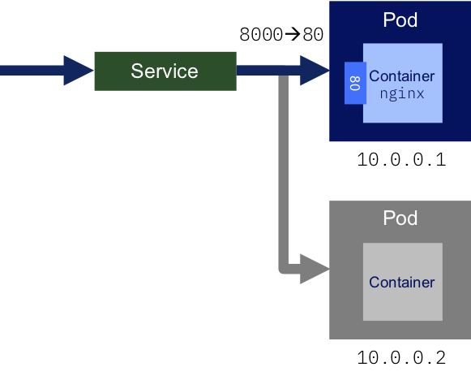

:course_title: JTC02 Kubernetes Labs Light

:course_desc: This course contains the Kubernetes Labs.  

:course_max: 17

:course_auto: no

:button1_label: Task

:button2_label: Hint

:button2_delay: 9999999

:button3_label: Complete

:button3_delay: 1000


#### Task LabInformation

----


# Lab information

The Operator Framework (intro blog post) is an open source toolkit to manage Kubernetes native applications, called operators, in an effective, automated, and scalable way. Operators take advantage of Kubernetes's extensibility to deliver the automation advantages of cloud services like provisioning, scaling, and backup/restore while being able to run anywhere that Kubernetes can run.

This guide shows how to build a simple memcached operator and how to manage its lifecycle from install to update to a new version. For that, we will use two center pieces of the framework:

    Operator SDK: Allows your developers to build an operator based on your expertise without requiring knowledge of Kubernetes API complexities.
    Operator Lifecycle Manager: Helps you to install, update, and generally manage the lifecycle of all of the operators (and their associated services) running across your clusters.


##  Lab overview

* Lab 0: Provides a walkthrough for getting to know command-line tools and check if minikube is running.

* Lab 1: This lab walks through creating and deploying a simple "guestbook" app written in Go as a net/http Server and accessing it.

* Lab 2: Builds on lab 1 to expand to a more resilient setup which can survive having containers fail and recover. Lab 2 will also walk through basic services you need to get started with Kubernetes

* Lab 3: Builds on lab 2 by increasing the capabilities of the deployed Guestbook application. This lab covers basic distributed application design and how kubernetes helps you use standard design practices.

---
---


# Nomenclatures

### Shell Commands

The commands that you are going to execute to progress the Labs will look like this:

```
   kubectl create -f redis-slave-service.yaml
	
	> Output Line 1     
	> Output Line 2
	> Output Line 3
	...
	
```


> **IMPORTANT NOTE:** The example output of a command is prefixed by ">" in order to make it more distinguishable. 
> 
> So in the above example you would only enter/copy-paste `kubectl create -f redis-slave-service.yaml` and the output from the command is "Output Line 1" to "Output Line 3" 
> 


### Code Examples
Code examples are presented like this:

```yaml
apiVersion: lab.ibm.com/v1beta1
kind: MyResource
metadata:
  name: example
spec:
  size: 3
  image: busybox
```

This is only for illustration and is not being actively used in the Labs.


#### Hint LabInformation

No hint available


#### Complete LabInformation

> Confirm Lab Information complete
> 


----


#### Task Minikube

---

# Get to know minikube

The Lab is based on Minikube - a lightweight Kubernetes implementation.

## Getting to know minikube

### What is Minikube?

Minikube is an open source tool that enables you to run Kubernetes on your laptop or other local machine. It can work with Linux, Mac, and Windows operating systems. It runs a single-node cluster inside a virtual machine on your local machine.


minikube runs the official stable release of Kubernetes, with support for standard Kubernetes features like:

* LoadBalancer - using `minikube tunnel`
* Multi-cluster - using `minikube start -p <name>`
* NodePorts - using `minikube service`
* Persistent Volumes
* Ingress
* RBAC
* Dashboard - `minikube dashboard`
* Container runtimes
* Configure apiserver and kubelet options via command-line flags
* Addons - a marketplace for developers to share configurations for running services on minikube

### Useful commands

Start a cluster by running:

`minikube start`

Access Kubernetes Dashboard within Minikube:

`minikube dashboard`

Open this exposed endpoint in your browser:

`minikube service hello-minikube`

Start a second local cluster:

`minikube start -p cluster2`

Stop your local cluster:

`minikube stop`

Delete your local cluster:

`minikube delete`


#### Hint Minikube

No hint available


#### Complete Minikube

> Confirm Minikube complete


#### Task Lab0_Kubernetes

---

# Lab 0. Get to know Kubernetes

TKubernetes was developed by Google as part of the Borg project and handed off to the open source community in 2015. Kubernetes combines more than 15 years of Google research in running a containerized infrastructure with production work loads, open source contributions, and Docker container management tools to provide an isolated and secure app platform that is portable, extensible, and self-healing in case of failovers.


Kubernetes is a solution that automates the orchestration of Container workloads.
It is declarative, which means that you define the desired state and Kubernetes ensures that the state is matched at any given moment. For example you want to deploy three instances of a Container and one dies it will automatically restart a new one to match the desired state.

If you want to learn more about Kubernetes, please follow Course JTC80 Kubernetes Introduction.

In order to define the desired state, we use Resources (aka Objects).
There are a lot of different types of Resources but the most important ones that we will be using are:
* Pods - Smallest deployment unit, usually runs one Container inside
* ReplicaSets - Controls the number of Pods running
* Deployment - defines the deployment of a certain Container - creates a ReplicaSet
* Service - defines how to expose the Container on the network


### Deployment
A Deployment provides declarative updates for Pods (and ReplicaSets).


You describe a desired state in a Deployment, and the Deployment Controller changes the actual state to the desired state at a controlled rate. You can define Deployments to create new ReplicaSets, or to remove existing Deployments and adopt all their resources with new Deployments.

```yaml
kind: Deployment
metadata:
  name: nginx-deployment
spec:
  replicas: 2
  template:
     metadata:
       labels:
         app: nginx
     spec:
       containers:
       - name: nginx
          image: nginx:1.7.9
          ports:
          - containerPort: 80
```


This yaml file defines (amongst others):

|  Field | Description  |  
|---|---|-
|  metadata.name | Name of the Deployment  | 
|  spec.replicas | The number of Pods to run simultaneuosly  |  
|  spec.template.spec.containers.image |  The Container image to run  
|  spec.template.spec.containers.ports |  The networking ports that should be exposed |    


More information on Deployments can be found [here](https://kubernetes.io/docs/concepts/workloads/controllers/deployment/).

### Service

An abstract way to expose an application running on a set of Pods as a network service.

With Kubernetes you don’t need to modify your application to use an unfamiliar service discovery mechanism. Kubernetes gives Pods their own IP addresses and a single DNS name for a set of Pods, and can load-balance across them.

```yaml
kind: Service
metadata:
  name: nginx-service
spec:
  ports:
  - port: 8000
    targetPort: 80
    protocol: TCP
  selector:
    app: nginx
```



This yaml file defines (amongst others):

|  Field | Description  |  
|---|---|-
|  metadata.name | Name of the Service  | 
|  spec.ports |  Port mapping to be exposed (port 80 of the container is exposed as port 8080)   
|  spec. selector.app | Defines the Deployment to map the Servcie to  |  


More information on Services can be found [here](https://kubernetes.io/docs/concepts/services-networking/service/).


#### Hint Lab0_Kubernetes

No hint available


#### Complete Lab0_Kubernetes

> Confirm Lab0_Kubernetes complete


#### Task Lab1_DeployWeb

----

# Lab 1. Set up and deploy your first application

Learn how to deploy an application to a Kubernetes cluster.

Once your client is configured, you are ready to deploy your first application, `k8sdemo`.

## Lab 1 - Deploy the frontend application

In this part of the lab we will deploy an application called `k8sdemo` that has already been built and uploaded to DockerHub under the name `niklaushirt/k8sdemo`.

We will use the following yaml:

```yaml
kind: Deployment
metadata:
  name: k8sdemo-backend
  namespace: default
spec:
  replicas: 2
  template:
    metadata:
      labels:
        app: k8sdemo-backend
    spec:
      containers:
      - name: k8sdemo-backend
        image: niklaushirt/k8sdemo-backend:1.0.0
  	...
          env:   
          - name: BACKEND_MESSAGE
            value: "Hi there from the Security Training..."
```

It defines the Container image to deploy (with 2 instances/replicas) and an environment variable BACKEND_MESSAGE to be used by the Deployment.

If you wish you can have a look at the complete yaml file:

```
gedit training/deployment/demoapp-backend.yaml 
```

### Now let's deploy it

1. Start by running `k8sdemo`

	```
	kubectl create -f https://raw.githubusercontent.com/niklaushirt/training/master/deployment/demoapp.yaml
	```

   This action will take a bit of time. To check the status of the running application, you can use ` kubectl get pods`.

   You should see output similar to the following:

  ```
   kubectl get pods -n default 
   
   > NAME                       READY     STATUS    RESTARTS   AGE
   > k8sdemo-7d46f69d68-bd2cw   0/1       Running   0          17s  
  ```
  
   Eventually, the status should show up as `1/1 Running`.
   
  ```
   kubectl get pods -n default 
   
   > NAME                          READY     STATUS              RESTARTS   AGE
   > k8sdemo-7d46f69d68-bd2cw      1/1       Running             0          5m
  ```
   
   The end result of the run command is to create a Deployment resource that manages the lifecycle of those pods.
 
   
3. Once the status reads `Running`, we need to expose that deployment as a service so we can access it through the IP of the worker nodes.
   The `k8sdemo` application listens on port 3000.  Run:

  ```
   kubectl expose deployment k8sdemo --name k8sdemo-service -n default --type="NodePort" --port=3000
   
   > service "k8sdemo-service" exposed
  ```

4. To find the port used on that worker node, examine your new service:

  ```
   kubectl get service -n default k8sdemo-service
   
   > NAME              TYPE       CLUSTER-IP      EXTERNAL-IP   PORT(S)          AGE
	> k8sdemo-service   NodePort   10.109.30.227   <none>        3000:30931/TCP   11m
  ```
   
   We can see that our in this example`<nodeport>` is `31208`. We can see in the output the port mapping from 3000 inside  the pod exposed to the cluster on port 30931. This port in the 31000 range is automatically chosen, and **will probably be different for you**.

5. `k8sdemo` is now running on your cluster, and exposed to the internet. 
 	You can open the webpage directly by typing:

	```  
	minikube service k8sdemo-service
	```   

	where k8sdemo-service is the name of the exposed kubernetes service.
   
5. Your `k8sdemo` should now be open in the your default browser.
   However it will show an error, because we have not yet deployed the backend.

	**Testing DEMO_API
	STATUS: ERROR	
	Trying to reach backend ....**


#### Hint Lab1_DeployWeb

No hint available


#### Complete Lab1_DeployWeb

> Confirm Lab1_DeployWeb complete


#### Task Lab1_DeployBackend

----

## Lab 1 - Deploy the application backend

In this part of the lab we will deploy the application backend called `k8sdemo-backend` that has already been built and uploaded to DockerHub under the name `niklaushirt/k8sdemo-backend`.

  

1. Start by running `k8sdemo-backend`

	```
	kubectl create -f https://raw.githubusercontent.com/niklaushirt/training/master/deployment/demoapp-backend.yaml
	```

   This action will take a bit of time. To check the status of the running application, you can use ` kubectl get pods`.

   You should see output similar to the following:

  ```
   kubectl get pods -n default
   
   > NAME                              READY     STATUS    RESTARTS   AGE
	> k8sdemo-7d46f69d68-xcgcw          0/1       Running   0          13m
	> k8sdemo-backend-9c777544b-cp59q   0/1       Running   0          1m
	> k8sdemo-backend-9c777544b-jqjz9   0/1       Running   0          1m  
  ```
  
   Eventually, the status should show up as `1/1 Running`.
   
  ```
   kubectl get pods -n default
   
   > NAME                              READY     STATUS    RESTARTS   AGE
	> k8sdemo-7d46f69d68-xcgcw          1/1       Running   0          13m
	> k8sdemo-backend-9c777544b-cp59q   1/1       Running   0          6m35s
	> k8sdemo-backend-9c777544b-jqjz9   1/1       Running   0          6m35s
  ```
   
   The end result of the run command is to create a Deployment resource that manages the lifecycle of those pods.
 
   
3. Once the status reads `Running`, we need to expose that deployment as a service so we can access it through the IP of the worker nodes.
   The `k8sdemo` application listens on port 3000.  Run:

  ```
   kubectl expose deployment k8sdemo-backend --name k8sdemo-backend-service -n default --type="NodePort" --port=3000
   
   > service "k8sdemo-service" exposed
  ```

4. Now reload the webpage and verify, that it shows 


	**Testing DEMO_API
	STATUS: OK	
	....**

4. If you reload the webpage several times, you should see, tht the IP Address of the backend API Pod is changing between the two Pods that have been spun up. 

---   


# Congratulations!!! This concludes Lab 1 on deploying a web application to Kubernetes

We will be using this deployment in the following Labs.


#### Hint Lab1_DeployBackend 

No hint available


#### Complete Lab1_DeployBackend

> Confirm Lab1_DeployBackend complete


#### Task Lab2_Scale

----

# Lab 2: Scale and Update Deployments

In this lab, you'll learn how to update the number of instances a deployment has and how to modify the API backend. 

> For this lab, you need a running deployment of the `k8sdemo` application from the previous lab. If you deleted it, recreate it.


### Scale apps with replicas

A *replica* is a copy of a pod that contains a running service. By having multiple replicas of a pod, you can ensure your deployment has the available resources to handle increasing load on your application.

1. `kubectl` provides a `scale` subcommand to change the size of an existing deployment. Let's increase our capacity from a single running instance of
   `k8sdemo` up to 10 instances:

  ```
   kubectl scale --replicas=4 deployment k8sdemo-backend -n default
   
   > deployment "k8sdemo" scaled
  ```

   Kubernetes will now try to make reality match the desired state of 4 replicas by starting 2 new pods with the same configuration as the first.

4. To verify that your changes have been rolled out, you can run:

  ```
   kubectl get pods -n default
   
   > NAME                              READY     STATUS    RESTARTS   AGE
	> k8sdemo-7d46f69d68-xcgcw          1/1       Running   0          19m
	> k8sdemo-backend-9c777544b-cp59q   1/1       Running   0          12m
	> k8sdemo-backend-9c777544b-jqjz9   1/1       Running   0          12m
	> k8sdemo-backend-9c777544b-lwssx   1/1       Running   0          12m
	> k8sdemo-backend-9c777544b-t5mlq   1/1       Running   0          12m
  ```
  
  You should see output listing 4 replicas of your deployment.

# Congratulations!!! This concludes Lab 2 on scaling and updating Deployments

#### Hint Lab2_Scale

No hint available


#### Complete Lab2_Scale

> Confirm Lab2_Scale complete


