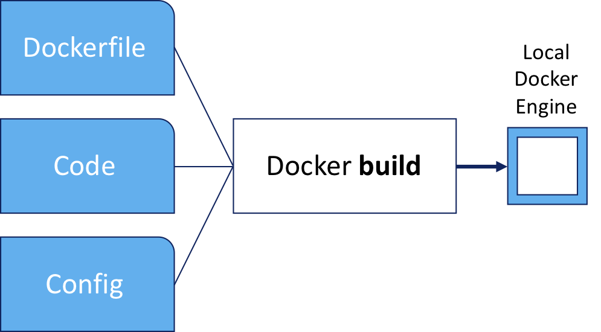
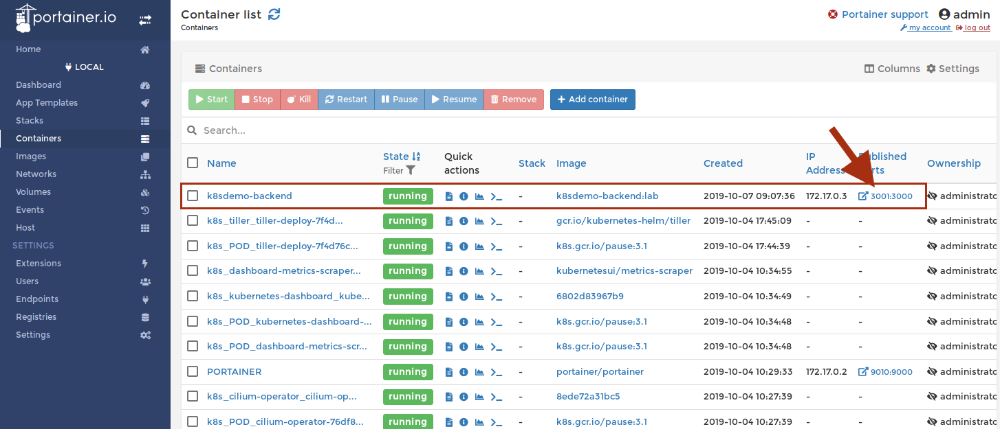
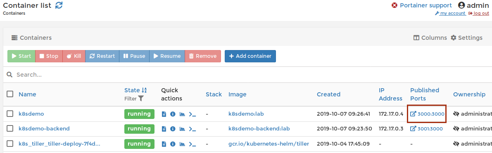

:course_title: JTC04 Docker

:course_desc: This course contains Labs for the Docker introduction.

:course_max: 9


:course_auto: no

:button1_label: Task

:button2_label: Hint

:button2_delay: 9999999

:button3_label: Complete

:button3_delay: 30


#### Task GeneralLabInformation

----


# General Lab information


## Nomenclatures

---

### Shell Commands

The commands that you are going to execute to progress the Labs will look like this:

```
   kubectl create -f redis-slave-service.yaml
	
	> Output Line 1     
	> Output Line 2
	> Output Line 3
	...
	
```


> **IMPORTANT NOTE:** The example output of a command is prefixed by ">" in order to make it more distinguishable. 
> 
> So in the above example you would only enter/copy-paste `kubectl create -f redis-slave-service.yaml` and the output from the command is "Output Line 1" to "Output Line 3" 
> 

--- 

### Code Examples
Code examples are presented like this:

```yaml
apiVersion: lab.ibm.com/v1beta1
kind: MyResource
metadata:
  name: example
spec:
  size: 3
  image: busybox
```

This is only for illustration and is not being actively used in the Labs.


#### Hint GeneralLabInformation

No hint available


#### Complete GeneralLabInformation

> Confirm GeneralLabInformation complete
> 


----


----

#### Task LabsIntroduction

# Docker Lab

In this Lab you will learn about some basic Kubernetes security paradigms.

1. Docker basics
2. Build a Docker image
3. Run a Docker image
4. Use the Portainer tool
5. Deploy a more complex Docker application
6. Push a Docker image into a registry 


#### Hint LabsIntroduction

No hint available


#### Complete LabsIntroduction

> Confirm LabsIntroduction complete
> 


----


#### Task Lab0_DockerIntroduction

----


# Lab 0 - Docker Introduction

Docker is an open platform for developing, shipping, and running applications. 

Docker enables you to separate your applications from your infrastructure so you can deliver software quickly. With Docker, you can manage your infrastructure in the same ways you manage your applications. By taking advantage of Docker’s methodologies for shipping, testing, and deploying code quickly, you can significantly reduce the delay between writing code and running it in production.

Docker provides the ability to package and run an application in a loosely isolated environment called a container. The isolation and security allow you to run many containers simultaneously on a given host. Containers are lightweight because they don’t need the extra load of a hypervisor, but run directly within the host machine’s kernel. This means you can run more containers on a given hardware combination than if you were using virtual machines. You can even run Docker containers within host machines that are actually virtual machines!

More details on `Docker` can be found [here](https://docs.docker.com/engine/docker-overview/).


## Dockerfile 

A `Dockerfile` is a text document that contains all the commands a user could call on the command line to assemble an image. 

```json
FROM node:8-stretch

# Change working directory
WORKDIR "/app"

# Update packages and install dependency packages for services
RUN apt-get update \
 && apt-get dist-upgrade -y \
 && apt-get clean \
 && echo 'Finished installing dependencies'

# Install npm production packages
COPY package.json /app/
RUN cd /app; npm install --production

COPY . /app

ENV NODE_ENV production
ENV BACKEND_URL https://api.nasa.gov/planetary/apod\?api_key\=DEMO_KEY
ENV PORT 3000

EXPOSE 3000

CMD ["npm", "start"]
```

The `docker build` command creates the container from the `Dockerfile`.

More details on Dockerfiles can be found [here](https://docs.docker.com/engine/reference/builder/).

#### Hint Lab0_DockerIntroduction

No hint available


#### Complete Lab0_DockerIntroduction

> Confirm Lab1_NetworkPoliciesIntro complete


#### Task Lab1_CreateYourFirstImage

----




Let's create our first image (the `k8sdemo-backend` image) from this `Dockerfile`:


```json
FROM node:8-stretch

# Change working directory
WORKDIR "/app"

# Update packages and install dependency packages for services
RUN apt-get update \
 && apt-get dist-upgrade -y \
 && apt-get clean \
 && echo 'Finished installing dependencies'

# Install npm production packages
COPY package.json /app/
RUN cd /app; npm install --production

COPY . /app

ENV NODE_ENV production
ENV BACKEND_MESSAGE HelloWorld

ENV PORT 3000

EXPOSE 3000

CMD ["npm", "start"]
```


```
cd ~/training/demo-app/k8sdemo_backend

docker build -t k8sdemo-backend:lab .

> Sending build context to Docker daemon  6.975MB
> Step 1/11 : FROM node:8-stretch
>  ---> 7a9afc16a57f
> Step 2/11 : WORKDIR "/app"
>  ---> Using cache
>  ---> a2515f8a3ec5
...
> Step 11/11 : CMD ["npm", "start"]
>  ---> Using cache
>  ---> b9b0f3fea9f7
> Successfully built b9b0f3fea9f7
> Successfully tagged k8sdemo-backend:lab

```


#### Hint Lab1_CreateYourFirstImage

No hint available


#### Complete Lab1_CreateYourFirstImage

> Confirm Lab1_NetworkPoliciesFirst complete


#### Task Lab1_RunYourFirstImage

----


```
docker run --rm --name k8sdemo-backend -p 3001:3000 k8sdemo-backend:lab

> test@0.0.0 start /app
> node ./bin/www

```

This command runs the backend server:
* --rm makes sure that the container is deleted once it's stopped
* --name gives the container a fixed name (otherwise you get some pretty funny, automatically generated names - think drunken-weasel)
* -p exposes the container port 3000 to the outside port 3001 (we do this so that it does not conflict with port 3000 of the k8sdemo web application we will start later)
* k8sdemo-backend:lab is the image we created before


#### Hint Lab1_RunYourFirstImage

No hint available


#### Complete Lab1_RunYourFirstImage

> Confirm Lab1_NetworkPoliciesFirst complete


#### Task Lab1_UsePortainer

----
Portainer Community Edition is a powerful, open-source management toolset that allows you to easily build, manage and maintain Docker environments. 


1. [Open URL](http://localhost:9010) or use the Portainer Bookmark

2. Login in with `admin`/`admin` (already prefilled)

3. Select `local` for our Endpoint

	

	Now you get an overview of your local Docker instance.

5. Select `Containers`

	

6. You get a list of all running containers and you can see our `k8sdemo-backend` container running.

	

7. Click on the PublishedPorts 3001:3000 to open the backend web interface.
	
8. In your terminal you will see that this generated some traffic:
 	
	```
	docker run --rm --name k8sdemo-backend -p 3001:3000 k8sdemo-backend:lab
	
	> test@0.0.0 start /app
	> node ./bin/www
	
	> GET / 304 225.805 ms - -
	> GET /stylesheets/style.css 304 2.175 ms - -
	
	```

9. Stop the container by hitting `CTRL-C` in the terminal


## So now we have our backend componenet running.

#### Hint Lab1_UsePortainer

No hint available


#### Complete Lab1_UsePortainer

> Confirm Lab1_UsePortainer complete


#### Task Lab1_CreateTheFrontendImage

----

Let's create our first image (the `k8sdemo` frontend image) from this `Dockerfile`:

```json
FROM node:8-stretch

# Change working directory
WORKDIR "/app"

# Update packages and install dependency packages for services
RUN apt-get update \
 && apt-get dist-upgrade -y \
 && apt-get clean \
 && echo 'Finished installing dependencies'

# Install npm production packages
COPY package.json /app/
RUN cd /app; npm install --production

COPY . /app

ENV NODE_ENV production
ENV BACKEND_URL https://api.nasa.gov/planetary/apod\?api_key\=DEMO_KEY
ENV PORT 3000

EXPOSE 3000

CMD ["npm", "start"]
```

```
cd ~/training/demo-app/k8sdemo

docker build -t k8sdemo:lab .

> Sending build context to Docker daemon  13.23MB
> Step 1/11 : FROM node:8-stretch
>  ---> 7a9afc16a57f
> Step 2/11 : WORKDIR "/app"
>  ---> Using cache
>  ---> a2515f8a3ec5
...
> Step 11/11 : CMD ["npm", "start"]
>  ---> Using cache
>  ---> 5293cb32d1f6
> Successfully built 5293cb32d1f6
> Successfully tagged k8sdemo:lab

```


#### Hint Lab1_CreateTheFrontendImage

No hint available


#### Complete Lab1_CreateTheFrontendImage

> Confirm Lab1_NetworkPoliciesFirst complete


#### Task Lab1_RunTheFrontendImage

----


1. First let's run the backend container again, but this time in the background

	```
	docker run --rm -d --name k8sdemo-backend -p 3001:3000 k8sdemo-backend:lab
	
	> 444b0570058b97f0532ef89c92963bb7da6aa1f2d3e27bf8c989da5fb8277fe0
	```
	
	This command runs the backend server:
	* -d runs the container in the background (as a daemon)
	

2. Then we start the new Web Frontend container

	```
	docker run --rm --name k8sdemo -p 3000:3000 --env BACKEND_URL=http://10.0.2.15:3001/api k8sdemo:lab
	
	
	> test@0.0.0 start /app
	> node ./bin/www
	
	```
	
	
	This command runs the frontend server:
	* --rm makes sure that the container is deleted once it's stopped
	* --name gives the container a fixed name 
	* --env defines the environment variable that points to the `k8sdemo-backend` server API
	* -p exposes the container port 3000 to the outside port 3000
	* k8sdemo:lab is the image we created before


3. Go back to Portainer and refresh the browser

	

4. Click on the PublishedPorts 3000:3000 for `k8sdemo` to open the web interface. 

5. Refresh several times and check in the terminal that some traffic is being generated

	
	```
	GET / 304 6.314 ms - -
	GET /public/bootstrap.min.css 304 0.975 ms - -
	GET /public/bootstrap-theme.min.css 304 0.843 ms - -
	GET /public/stylesheets/style.css 304 2.568 ms - -
	GET /public/images/ibm_cloud.png 304 0.522 ms - -
	GET /public/images/cloud_private.png 304 1.057 ms - -
	GET /public/images/back.png 304 0.411 ms - -
	The value of BACKEND_URL is: http://k8sdemo-backend
	Error: getaddrinfo ENOTFOUND k8sdemo-backend k8sdemo-backend:80
	
	
	```


#### Hint Lab1_RunTheFrontendImage

No hint available


#### Complete Lab1_RunTheFrontendImage

> Confirm Lab1_RunTheFrontendImage complete


#### Task Lab1_PushImageRegistry

----


1. Let's tag the image with the address of the local Docker registry (localhost:5000).

	```
	docker tag k8sdemo:lab localhost:5000/k8sdemo:lab
	```
	
2. And now we push the image to the local Docker registry.
   
   First execute this in order to be able to access the private registry:
   
   	```
   kubectl port-forward --namespace kube-system registry-5ng6b 5000:5000 &
	```
  
  	And now push the image to the local registry:
  	
	```
	docker push localhost:5000/k8sdemo:lab
	```

Now the image would be available to be aquired (pulled) from any machine that has access to the Docker registry.


# Congratulations!!! This concludes Lab 1 on Docker


#### Hint Lab1_PushImageRegistry

No hint available


#### Complete Lab1_PushImageRegistry

> Confirm Lab1_PushImageRegistry complete

