:course_title: JTC10 Istio

:course_desc: This course provides the student with the necessary steps to get a basic understanding of Istio.  

:course_max: 9

:course_auto: no

:button1_label: Task

:button2_label: Hint

:button2_delay: 9999999

:button3_label: Complete

:button3_delay: 10000


:infotab: <h1>Prerequisites for the Lab</h1>
:infotab: <ul>
:infotab: <li><p>Internet Access</p>
:infotab: </li>
:infotab: <li><p>PC with at least:</p>
:infotab: <ul>
:infotab: <li>4 Core CPU</li>
:infotab: <li>16GB of RAM</li>
:infotab: <li>30GB of free Disk Space</li>
:infotab: 
:infotab: </ul>
:infotab: </li>
:infotab: 
:infotab: </ul>
:infotab: <h1>Tips and Tricks for getting around in the labs</h1>
:infotab: <h2>Login to the VM</h2>
:infotab: <pre><code>The userid is      training
:infotab: <BR>the password is    passw0rd
:infotab: </code></pre>
:infotab: <p>&nbsp;</p>
:infotab: <hr />
:infotab: <p>&nbsp;</p>
:infotab: <h2>Mac Tips</h2>
:infotab: <h3>Opening Terminal</h3>
:infotab: <p>In order to rapidly open the terminal application, hit CMD - SPACE and type terminal.</p>
:infotab: <p></p>
:infotab: <hr />
:infotab: <p>&nbsp;</p>
:infotab: <h2>Minikube Tips</h2>
:infotab: <p>You can open a deployed Kubernetes application by typing:</p>
:infotab: <pre><code>minikube service &lt;my-service-name&gt;
:infotab: </code></pre>
:infotab: <p>&nbsp;</p>
:infotab: <hr />
:infotab: <p>&nbsp;</p>
:infotab: <h2>Kubernetes Tips</h2>
:infotab: <h3>Pod Logs</h3>
:infotab: <p>You can look at the logs of any of the pods running under your deployments as follows</p>
:infotab: <pre><code class='language-console' lang='console'>$<$ kubectl logs &lt;pod-name&gt; &lt;container-name&gt;
:infotab: </code></pre>
:infotab: <p>This subcommand operates like <code>tail</code>. Including the <code>-f</code> flag will
:infotab: continue to stream the logs live once the current time is reached.</p>
:infotab: <h3>kubectl edit and vi</h3>
:infotab: <p>By default, on many Linux and macOS systems, you will be dropped into the editor <code>vi</code>.
:infotab: If you end up in vi you can quit by typing <code>ESC :q!</code></p>
:infotab: <p>IF you prefer using nano as an editor, execute </p>
:infotab: <pre><code>export EDITOR=nano
:infotab: </code></pre>
:infotab: <p>On Windows, a copy of <code>notepad.exe</code> will be opened with the contents of the file.</p>
:infotab: <h3>nano basic commands</h3>
:infotab: <pre><code>Ctrl-O		To save your work (WriteOut)
:infotab: <BR>Ctrl-X		To exit nano
:infotab: <BR>Ctrl-W		To search for text in a document
:infotab: <BR>Ctrl-K		To cut a line of text
:infotab: </code></pre>
:infotab: <p>&nbsp;</p>
:infotab: <h3>busybox pod</h3>
:infotab: <p>For debugging live, this command frequently helps me:</p>
:infotab: <pre><code class='language-console' lang='console'>kubectl run bb --image busybox --restart=Never -it --rm
:infotab: </code></pre>
:infotab: <p>In the busybox image is a basic shell that contains useful utilities.</p>
:infotab: <p>Utils I often use are <code>nslookup</code> and <code>wget</code>. </p>
:infotab: <p><code>nslookup</code> is useful for testing DNS resolution in a pod.</p>
:infotab: <p><code>wget</code> is useful for trying to do network requests.</p>
:infotab: <h3>Service Endpoints</h3>
:infotab: <p>Endpoint resource can be used to see all the service endpoints.</p>
:infotab: <pre><code class='language-console' lang='console'>$ kubectl get endpoints &lt;service&gt;
:infotab: </code></pre>
:infotab: <h3>ImagePullPolicy</h3>
:infotab: <p>By default Kubernetes will only pull the image on first use. This can
:infotab: be confusing during development when you expect changes to show up.</p>
:infotab: <p>You should be aware of the three <code>ImagePullPolicy</code>:</p>
:infotab: <ul>
:infotab: <li>IfNotPresent - the default, only request the image if not present.</li>
:infotab: <li>Always - always request the image.</li>
:infotab: <li>Never</li>
:infotab: 
:infotab: </ul>
:infotab: <p>More details on image management may be <a href='https://kubernetes.io/docs/concepts/containers/images/'>found here</a>.</p>
:infotab: 


#### Task Lab0_LabInformation

----


# Lab0 - Lab information

Istio a joint collaboration between IBM, Google and Lyft provides an easy way to create a service mesh that will manage many of these complex tasks automatically, without the need to modify the microservices themselves.

In this Lab you will learn the basic operations for setting up and operating an Istio Mesh Network.


## Lab sources

All the source code for the lab is available here:

https://github.com/niklaushirt/training


##  Lab overview

* In this Lab you will learn the basics of Istio:

1. Get to know Istio
2. Install Istio
3. Deploy the Bookinfo Demo App
4. Monitoring with Kiali
5. Traffic flow management
6. Telemetry
7. Clean Up  


---

#### Hint Lab0_LabInformation

No hint available


#### Complete Lab0_LabInformation

Confirm Lab0_LabInformation complete

----


#### Task Lab0_LabSemantics

----


# Lab0 - Lab semantics


## Nomenclatures

---

### Shell Commands

The commands that you are going to execute to progress the Labs will look like this:

```
   kubectl create -f redis-slave-service.yaml
	
	> Output Line 1     
	> Output Line 2
	> Output Line 3
	...
	
```
# THIS IS AN EXAMPLE - DO NOT EXECUTE THIS!

> **IMPORTANT NOTE:** The example output of a command is prefixed by ">" in order to make it more distinguishable. 
> 
> So in the above example you would only enter/copy-paste `kubectl create -f redis-slave-service.yaml` and the output from the command is "Output Line 1" to "Output Line 3" 
> 

---

### Code Examples
Code examples are presented like this:

```yaml
apiVersion: lab.ibm.com/v1beta1
kind: MyResource
metadata:
  name: example
spec:
  size: 3
  image: busybox
```

This is only for illustration and is not being actively used in the Labs.


#### Hint Lab0_LabSemantics

No hint available


#### Complete Lab0_LabSemantics

Confirm Lab0_LabSemantics complete


#### Task Lab0_Prepare

---

# Lab 0 - Prepare the Lab environment

Before starting the Labs, let's make sure that we have the latest source code from the GitHub repository:

https://github.com/niklaushirt/training


1. Open a Terminal window by clicking on the Termnial icon in the left sidebar - we will use this extensively later as well


2. Execute the following commands to pull the latest example code from my GitHub repository

   

```
cd training/
gitrefresh 

~/training/tools/own.sh 
```


#### Hint Lab0_Prepare

No hint available


#### Complete Lab0_Prepare

Confirm Lab0_Prepare complete

----


----
#### Task Lab1_IstioIntroduction

----

# Lab 1 - Get to know ISTIO

Microservices and containers changed application design and deployment patterns, but along with them brought challenges like service discovery, routing, failure handling, and visibility to microservices. "Service mesh" architecture was born to handle these features. Applications are getting decoupled internally as microservices, and the responsibility of maintaining coupling between these microservices is passed to the service mesh.

[Istio](https://istio.io/), a joint collaboration between IBM, Google and Lyft provides an easy way to create a service mesh that will manage many of these complex tasks automatically, without the need to modify the microservices themselves. Istio does this by:

1. Deploying a **control plane** that manages the overall network infrastructure and enforces the policy and traffic rules defined by the devops team

2. Deploying a **data plane** which includes “sidecars”, secondary containers that sit along side of each instance of a microservice and act as a proxy to intercept all incoming and outgoing network traffic. Sidecars are implemented using Envoy, an open source edge proxy

Once Istio is installed some of the key feature which it makes available include

- Traffic management using **Istio Pilot**: In addition to providing content and policy based load balancing and routing, Pilot also maintains a canonical representation of services in the mesh.

- Access control using **Istio Auth**: Istio Auth secures the service-to-service communication and also provides a key management system to manage keys and certificates.

- Monitoring, reporting and quota management using **Istio Mixer**: Istio Mixer provides in depth monitoring and logs data collection for microservices, as well as collection of request traces. Precondition checking like whether the service consumer is on whitelist, quota management like rate limits etc. are also configured using Mixer.

In the first part of this journey we show how we can deploy the sample [BookInfo](https://istio.io/docs/samples/bookinfo.html) application and inject sidecars to get the Istio features mentioned above, and walk through the key ones. The BookInfo is a simple application that is composed of four microservices, written in different languages for each of its microservices namely Python, Java, Ruby, and Node.js. The application does not use a database, and stores everything in local filesystem.

Also since Istio tightly controls traffic routing to provide above mentioned benefits, it introduces some drawbacks. Outgoing traffic to external services outside the Istio data plane can only be enabled by specialized configuration, based on the protocol used to connect to the external service.

In the [second part](#part-b-modify-sample-application-to-use-an-external-datasource-deploy-the-application-and-istio-envoys-with-egress-traffic-enabled) of the journey we focus on how Istio can be configured to allow applications to connect to external services. For that we modify the sample BookInfo application to use an external database and then use it as a base to show Istio configuration for enabling egress traffic.

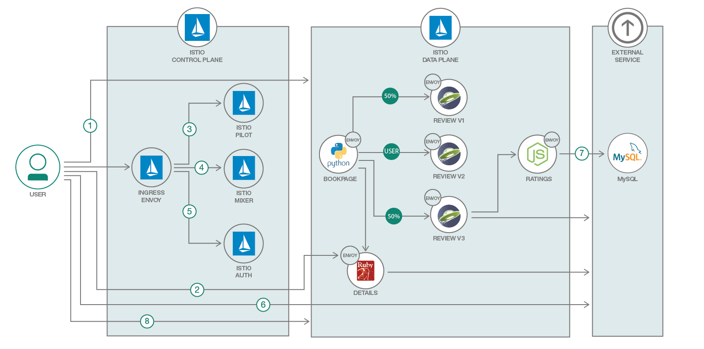

## Included Components
- [Istio](https://istio.io/)
- [Kiali](https://www.kiali.io/)
- [Grafana](http://docs.grafana.org/guides/getting_started)
- [Jaeger](https://www.jaegertracing.io/)
- [Prometheus](https://prometheus.io/)


---


#### Hint Lab1_IstioIntroduction

No hint available


#### Complete Lab1_IstioIntroduction

> Confirm Lab1_IstioIntroduction complete


----


#### Task Lab2_Installing

----

# Lab 2 - Installing Istio 
In this module, you download and install Istio.

1.  Execute the following command to get the latest ISTIO source:

    ```
     export ISTIO_VERSION=1.4.1
    
     ~/training/istio/release/downloadIstioCtl.sh
    
    > Downloading istio-1.4.1 from ...

    ```

2. Change the directory to the Istio file location.

    ```
    cd ~/training/istio/

    ```

3. Add the `istioctl` client to your executables. 

    ```
    sudo cp ~/.istioctl/bin/istioctl /usr/local/bin

    ```

4. Install Istio into the cluster:

    ```
    istioctl manifest apply --set profile=demo
    
    > Preparing manifests for these components:
    > - NodeAgent
    > - Galley
    > - Pilot
    > - EgressGateway
    > - Injector
    > - IngressGateway
    > - Cni
    > ...
    ```

5. Now let's expose the different web interfaces (Kiali, Grafana, Jaeger):

    ```
    kubectl patch service -n istio-system kiali -p '{"spec": {"ports": [{"nodePort": 31710,"port": 20001,"name": "http-kiali"}],"type": "NodePort"}}'
	kubectl patch service -n istio-system grafana -p '{"spec": {"ports": [{"nodePort": 31551,"port": 3000,"name": "http"}],"type": "NodePort"}}'
	kubectl patch service -n istio-system jaeger-query -p '{"spec": {"ports": [{"nodePort": 31553,"port": 16686,"name": "query-http"}],"type": "NodePort"}}'

    ```


6. Label the default namespace for automatic sidecar injection

	```
	kubectl label namespace default istio-injection=enabled                                                                                   
	
	> namespace/default labeled
	```
	
7. Check the labels 
	
	```
	kubectl get ns --show-labels                                                                                                              
	
	> NAME                   STATUS   AGE   LABELS
	> default                Active   66d   istio-injection=enabled
	> istio-system           Active   62s   istio-injection=disabled,istio-operator-managed=Reconcile,operator.istio.io/	> component=Base,operator.istio.io/managed=Reconcile,operator.istio.io/version=1.4.0
	> kube-node-lease        Active   66d   <none>
	> kube-public            Active   66d   <none>
	> kube-system            Active   66d   <none>
	> kubernetes-dashboard   Active   66d   addonmanager.kubernetes.io/mode=Reconcile,kubernetes.io/minikube-addons=dashboard
	```


7. Ensure the corresponding pods are all in **`Running`** state before you continue.

    ```
    kubectl get pods -n istio-system
    
    > NAME                                      READY   STATUS      RESTARTS   AGE
    > grafana-5c45779547-v77cl                  1/1     Running     0          103s
    > istio-citadel-79cb95445b-29wvj            1/1     Running     0          102s
    > istio-cleanup-secrets-1.1.0-mp6qq         0/1     Completed   0          112s
    > istio-egressgateway-6dfb8dd765-jzzxf      1/1     Running     0          104s
    > istio-galley-7bccb97448-tk8bz             1/1     Running     0          104s
    > istio-grafana-post-install-1.1.0-bvng6    0/1     Completed   0          113s
    > istio-ingressgateway-679bd59c6-5bsbr      1/1     Running     0          104s
    > istio-pilot-674d4b8469-ttxs8              2/2     Running     0          103s
    > istio-policy-6b8795b6b5-g5m2k             2/2     Running     2          103s
    > istio-security-post-install-1.1.0-cfqpx   0/1     Completed   0          111s
    > istio-sidecar-injector-646d77f96c-55twm   1/1     Running     0          102s
    > istio-telemetry-76c8fbc99f-hxskk          2/2     Running     2          103s
    > istio-tracing-5fbc94c494-5nkjd            1/1     Running     0          102s
    > kiali-56d95cf466-bpgfq                    1/1     Running     0          103s
    > prometheus-8647cf4bc7-qnp6x               1/1     Running     0          102s
    ```


	
Before you continue, make sure all the pods are deployed and are either in the **`Running`** or **`Completed`** state. If they're in `Pending` or `CrashLoopBackOff` state, wait a few minutes to let the deployment to settle.

Congratulations! You successfully installed Istio into your cluster.


#### Hint Lab2_Installing

No hint available


#### Complete Lab2_Installing

> Confirm Lab2_Installing complete


#### Task Lab3_DeployTheBookinfoApp

----


# Lab 3 - Deploy sample BookInfo application with Istio sidecar injected

In this part, we will be using the sample BookInfo Application that comes as default with Istio code base. As mentioned above, the application that is composed of four microservices, written in different languages for each of its microservices namely Python, Java, Ruby, and Node.js. The default application doesn't use a database and all the microservices store their data in the local file system.


Envoys are deployed as sidecars on each microservice. Injecting Envoy into your microservice means that the Envoy sidecar would manage the ingoing and outgoing calls for the service. To inject an Envoy sidecar to an existing microservice configuration, do:

```
kubectl apply -f ~/training/istio/samples/bookinfo/platform/kube/bookinfo.yaml

> service/details created
> serviceaccount/bookinfo-details created
> deployment.apps/details-v1 created
> service/ratings created
> ...
```


After a few minutes, you should now have your Kubernetes Pods running and have an Envoy sidecar in each of them alongside the microservice. The microservices are **productpage, details, ratings, and reviews**. Note that you'll have three versions of the reviews microservice.


```
kubectl get pods 


> NAME                                        READY     STATUS    RESTARTS   AGE
> details-v1-1520924117-48z17                 2/2       Running   0          6m
> productpage-v1-560495357-jk1lz              2/2       Running   0          6m
> ratings-v1-734492171-rnr5l                  2/2       Running   0          6m
> reviews-v1-874083890-f0qf0                  2/2       Running   0          6m
> reviews-v2-1343845940-b34q5                 2/2       Running   0          6m
> reviews-v3-1813607990-8ch52                 2/2       Running   0          6m
```

### Expose the Application via Ingress Gateway

The components deployed on the service mesh by default are not exposed outside the cluster. External access to individual services so far has been provided by creating an external load balancer or node port on each service.

An Ingress Gateway resource can be created to allow external requests through the Istio Ingress Gateway to the backing services.

Create an Istio ingress gateway to access your services over a public IP address.

```
kubectl apply -f  ~/training/istio/samples/bookinfo/networking/bookinfo-gateway.yaml

> gateway.networking.istio.io/bookinfo-gateway created
> virtualservice.networking.istio.io/bookinfo created

```


Now you can access your application via: [`http://127.0.0.1:31804/productpage`](http://127.0.0.1:31804/productpage) (replace 127.0.0.1 with the address of your cluster)

If you refresh the page multiple times, you'll see that the _reviews_ section of the page changes. That's because there are 3 versions of **reviews**_(reviews-v1, reviews-v2, reviews-v3)_ deployment for our **reviews** service. Istio’s load-balancer is using a round-robin algorithm to iterate through the 3 instances of this service

##### V1 - No ratings


##### V2 - Ratings with black stars


##### V3- Ratings with red stars


## Sidecar injection

In Kubernetes, a sidecar is a utility container in the pod, and its purpose is to support the main container. For Istio to work, Envoy proxies must be deployed as sidecars to each pod of the deployment. There are two ways of injecting the Istio sidecar into a pod: manually using the istioctl CLI tool or automatically using the Istio Initializer. In this exercise, we will use the manual injection. Manual injection modifies the controller configuration, e.g. deployment. It does this by modifying the pod template spec such that all pods for that deployment are created with the injected sidecar.


#### Hint Lab3_DeployTheBookinfoApp

No hint available


#### Complete Lab3_DeployTheBookinfoApp

> Confirm Lab3_DeployTheBookinfoApp complete


#### Task Lab4_MonitoringWithKiali

----


# Lab 4 - Monitoring with Kiali

[Kiali](https://www.kiali.io/) is an open-source project that installs on top of Istio to visualize your service mesh. It provides deeper insight into how your microservices interact with one another, and provides features such as circuit breakers and request rates for your services


**In order to create some more sustained traffic, open a new tab in the Terminal and paste the following code**

```
for i in `seq 1 200000`; do curl http://127.0.0.1:31804/productpage; done
```

**Note**


> If you get this:
>
>	for i in `seq 1 200000`; do curl http://127.0.0.1:31804/productpage\; done
>	for>
>
> Just delete the backslash (\) after productpage.


You can open Kiali via [`http://127.0.0.1:31710/kiali/`](http://127.0.0.1:31710/kiali/) (replace 127.0.0.1 with the address of your cluster - not needed if you're working with the provided VM)

Login is:

	User: admin
	Password: admin

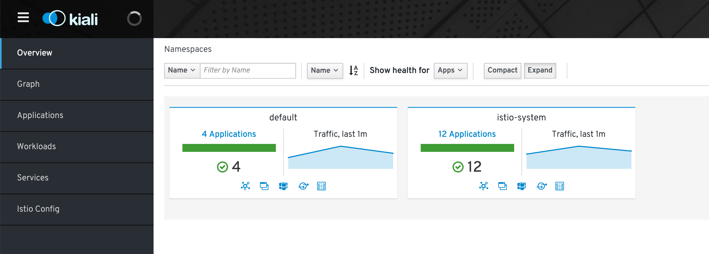


1. Select `Graph` in the left hand menu.
1. Then select `default` from the Namespaces drop-down menu
2. Make sure that you select `Versoned App Graph` from the first drop-down menu
3. And `Requests percent of total` from the second drop-down menu
1. And make sure that you check all types from the `Display` drop-down menu
2. If you see no objects, there might be no traffic flowing through your mesh network yet (you chan change the seeting to display inactive objects too)
3. You might want to change the refresh rate to 10s to more easily observe the changes in traffic

You can then observe traffic flowing through your mesh network.

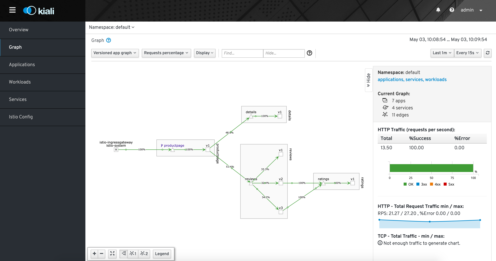


Get more info on the [Kiali](https://www.kiali.io/documentation/overview/) website.

[Visualizing Your Mesh](https://istio.io/docs/tasks/telemetry/kiali/)


#### Hint Lab4_MonitoringWithKiali

No hint available


#### Complete Lab4_MonitoringWithKiali

> Confirm Lab4_MonitoringWithKiali complete


#### Task Lab5_TrafficFlowManagement

----


# Lab 5 - Traffic flow management using Istio Pilot

## Using rules to manage traffic
The core component used for traffic management in Istio is Pilot, which manages and configures all the Envoy proxy instances deployed in a particular Istio service mesh. It lets you specify what rules you want to use to route traffic between Envoy proxies, which run as sidecars to each service in the mesh. Each service consists of any number of instances running on pods, containers, VMs etc. Each service can have any number of versions (a.k.a. subsets). There can be distinct subsets of service instances running different variants of the app binary. These variants are not necessarily different API versions. They could be iterative changes to the same service, deployed in different environments (prod, staging, dev, etc.). Pilot translates high-level rules into low-level configurations and distributes this config to Envoy instances. Pilot uses three types of configuration resources to manage traffic within its service mesh: Virtual Services, Destination Rules, and Service Entries.

### Virtual Services
A [VirtualService](https://istio.io/docs/reference/config/istio.networking.v1alpha3/#VirtualService) defines a set of traffic routing rules to apply when a host is addressed. Each routing rule defines matching criteria for traffic of a specific protocol. If the traffic is matched, then it is sent to a named [destination](https://istio.io/docs/reference/config/istio.networking.v1alpha3.html#Destination) service (or [subset](https://istio.io/docs/reference/config/istio.networking.v1alpha3/#Subset) or version of it) defined in the service registry.

### Destination Rules
A [DestinationRule](https://istio.io/docs/reference/config/istio.networking.v1alpha3/#Destination) defines policies that apply to traffic intended for a service after routing has occurred. These rules specify configuration for load balancing, connection pool size from the sidecar, and outlier detection settings to detect and evict unhealthy hosts from the load balancing pool. Any destination `host` and `subset` referenced in a `VirtualService` rule must be defined in a corresponding `DestinationRule`.

### Service Entries
A [ServiceEntry](https://istio.io/docs/reference/config/istio.networking.v1alpha3.html#ServiceEntry) configuration enables services within the mesh to access a service not necessarily managed by Istio. The rule describes the endpoints, ports and protocols of a white-listed set of mesh-external domains and IP blocks that services in the mesh are allowed to access.

---

## The Bookinfo Application

In this section, Istio will be configured to dynamically modify the network traffic between some of the components of our application. In this case we have 2 versions of the “reviews” component (v1 and v2) but we don’t want to replace review-v1 with review-v2 immediately. In most cases, when components are upgraded it’s useful to deploy the new version but only have a small subset of network traffic routed to it so that it can be tested before the old version is removed. This is often referred to as “canary testing”.


There are multiple ways in which we can control this routing. It can be based on which user or type of device that is accessing it, or a certain percentage of the traffic can be configured to flow to one version.

This step shows you how to configure where you want your service requests to go based on weights and HTTP Headers. You would need to be in the root directory of the Istio release you have downloaded on the Prerequisites section.

---

## Set default Destination Rules

Before moving on, we have to define the destination rules. The destination rules tell Istio what versions (subsets in Istio terminology) are available for routing. This step is required before fine-grained traffic shaping is possible.

```
kubectl apply -f ~/training/istio/samples/bookinfo/networking/destination-rule-reviews.yaml

> destinationrule.networking.istio.io/reviews created

```

For more details, see the [Istio documentation](https://istio.io/docs/tasks/traffic-management/traffic-shifting/).

---

## A/B testing with Istio
A/B testing is a method of performing identical tests against two separate service versions in order to determine which performs better. 

Set Default Routes to `reviews-v1` for all microservices  

This would set all incoming routes on the services (indicated in the line `destination: <service>`) to the deployment with a tag `version: v1`. To set the default routes, run:

  ```
  kubectl create -f ~/training/istio/samples/bookinfo/networking/virtual-service-all-v1.yaml
  
  > virtualservice.networking.istio.io/reviews created


  ```
  
The definition yaml file that we have just applied looks like this 

```yaml
kind: VirtualService
metadata:
  name: reviews
spec:
  hosts:
  - reviews
  http:
  - route:
    - destination:
        host: reviews
        subset: v1
```          


Observe in the Kiali Dashboard. After a short wile you should see that all traffic is going to V1.


**After a theoretical deployment of v2:**

Route 100% of the traffic to the `version: v2` of the **reviews microservices**  

This will direct/switch all incoming traffic to version v2 of the reviews microservice. Run:

  ```
  kubectl apply -f ~/training/istio/samples/bookinfo/networking/virtual-service-all-v2.yaml
  
  > virtualservice.networking.istio.io/reviews configured


  ```
  
The new definition yaml file that we have just applied looks like this 

```yaml
kind: VirtualService
metadata:
  name: reviews
spec:
  hosts:
  - reviews
  http:
  - route:
    - destination:
        host: reviews
        subset: v2
```        
  
Observe in the [Kiali Dashboard](http://127.0.0.1:31710/kiali/). After a short wile you should see that all traffic is going to V2.

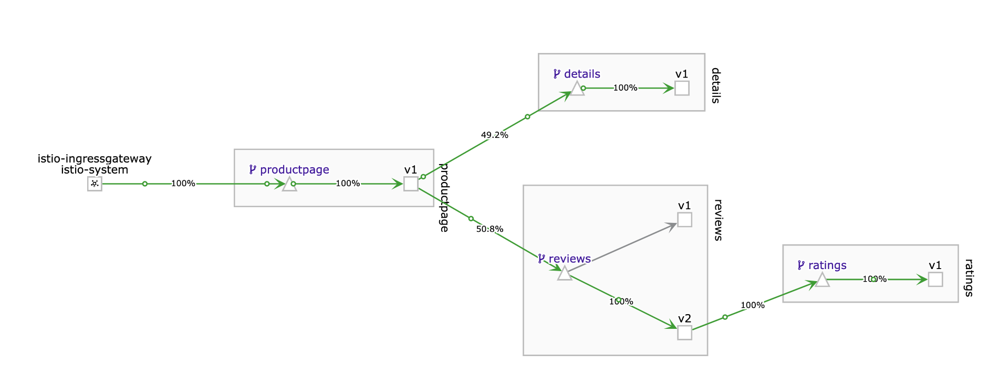


---

  
## Canary deployment
In `Canary Deployments`, newer versions of services are incrementally rolled out to users to minimize the risk and impact of any bugs introduced by the newer version. To begin incrementally routing traffic to the newer version of the guestbook service, modify the original `VirtualService` rule.


Route 80% of traffic on **reviews microservice** to `reviews-v1` and 20% to `reviews-v2`.  

This is indicated by the `weight: 80 and 20` in the yaml file.

  > Using `replace` should allow you to edit existing route-rules.

  ```
  kubectl apply -f ~/training/istio/samples/bookinfo/networking/virtual-service-reviews-80-20.yaml
  ```

The new definition yaml file that we have just applied looks like this 

```yaml
kind: VirtualService
metadata:
  name: reviews
spec:
  hosts:
    - reviews
  http:
  - route:
    - destination:
        host: reviews
        subset: v1
      weight: 80
    - destination:
        host: reviews
        subset: v2
      weight: 20
```

Observe in the [Kiali Dashboard](http://127.0.0.1:31710/kiali/). After a short wile you should see that 80% of the traffic is going to V1 and 80% of the traffic is going to V2.

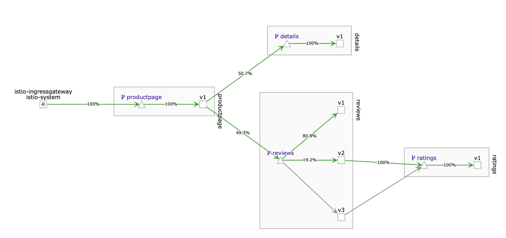

---


## Navigating Kiali
Open [Kiali Dashboard](http://127.0.0.1:31710/kiali/) and select the `reviews` service in the graph.

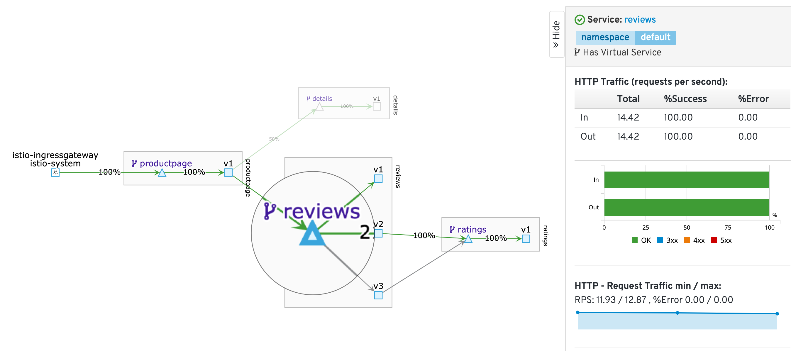

To the right you can observe specific metrics for this service.
Then open the `reviews` service overview:

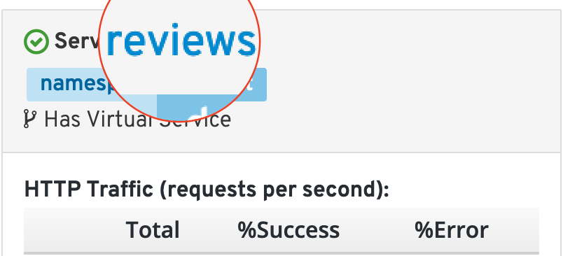

In this view you can get details about the service, like averall Health, assigned `Workloads` and much more.

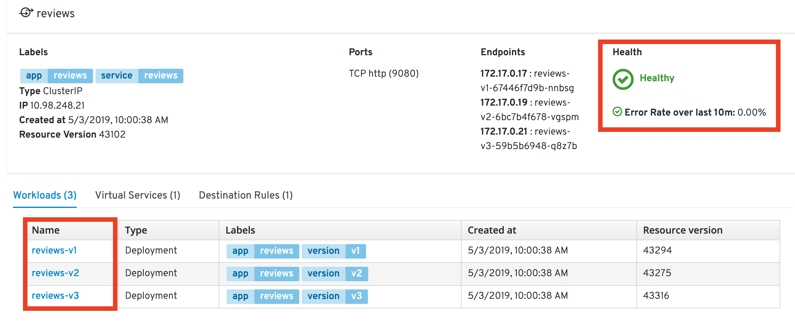

**Feel free to browse some more to get familiar with the interface.**

Now open the `reviews` service details by selecting the `Virtual Services` tab and selecting `reviews`.


Here you get more detailed information about the service, like the weight distribution:

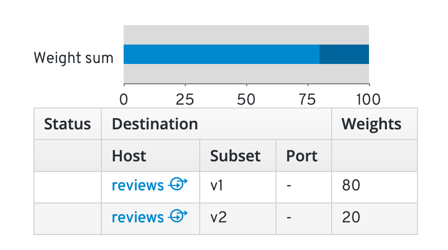


---

## Gradual Rollout

In order to gradually roll out a new release we have to change the weight distribution.

* Click on the `YAML` tab
* Modify the weight to 20%/80% 
* Click `Save`

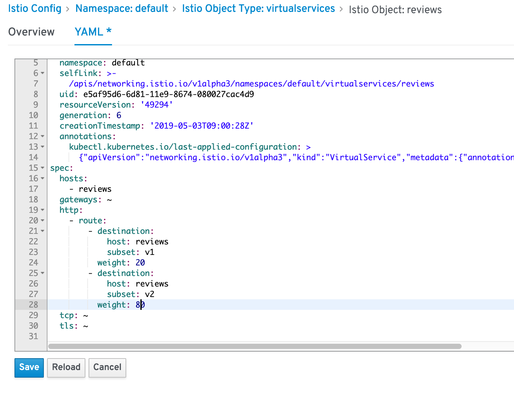

Observe in the [Kiali Dashboard](http://127.0.0.1:31710/kiali/). After a short wile you should see that about 20% of the traffic is going to V1 and 90% of the traffic is going to V2.

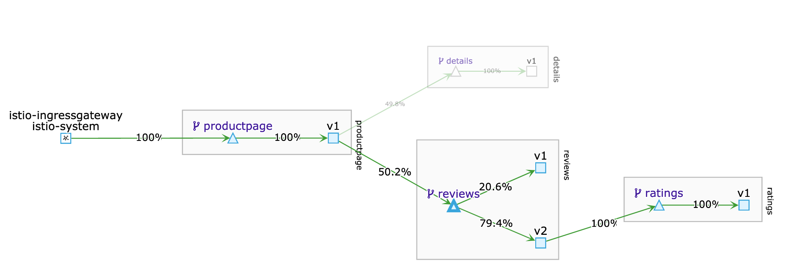

**Note:** The sum of the weights must be equal to 100%

---


## Traffic Steering / Dark Launch
Define certain conditions (Username, type of phone, ...) that will be using the new service.

Set Route to `reviews-v2` of **reviews microservice** for a specific user  

This would set the route for the user `jason` (You can login as _jason_ with any password in your deploy web application) to see the `version: v3` of the reviews microservice. 


Run:

  ```
  kubectl apply -f ~/training/istio/samples/bookinfo/networking/virtual-service-reviews-jason-v2-v3.yaml
  ```
  
  
The new definition yaml file that we have just applied looks like this 

```yaml  
kind: VirtualService
metadata:
  name: reviews
spec:
  hosts:
  - reviews
  http:
  - match:
    - headers:
        end-user:
          exact: jason
    route:
    - destination:
        host: reviews
        subset: v3
  - route:
    - destination:
        host: reviews
        subset: v2
  ```
  
  
  
 Go to the Bookinfo Application: [`http://127.0.0.1:31804/productpage`](http://127.0.0.1:31804/productpage) (replace 127.0.0.1 with the address of your cluster).
 
**Refresh several times** - You should see only black stars, meaning that you are using V2. 
 


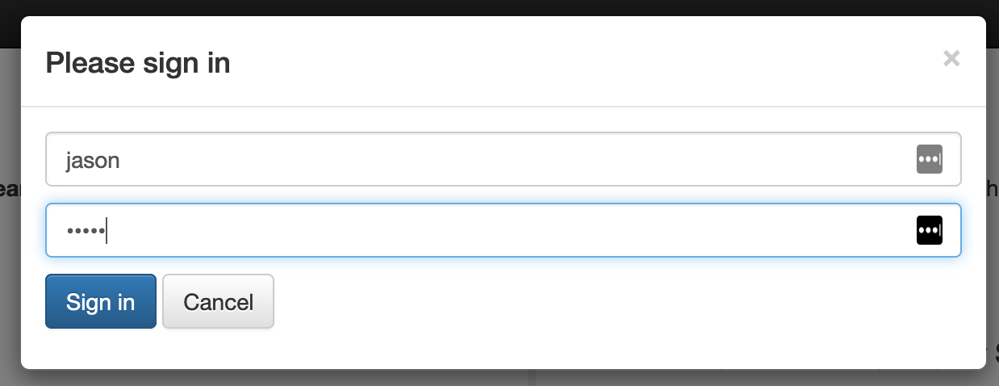

Now login to the Web Application as user jason with password jason and **refresh several times**. You should see only red stars, meaning that you are using V3.

Observe in the [Kiali Dashboard](http://127.0.0.1:31710/kiali/). After a short wile you should see that a small percentage of traffic is going to V3, which corresponds to your page refreshes.

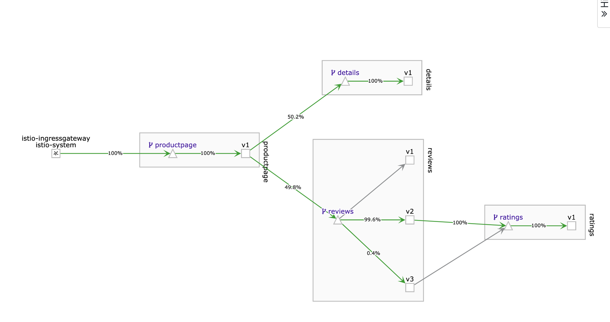

#### Hint Lab5_TrafficFlowManagement

No hint available


#### Complete Lab5_TrafficFlowManagement
> Confirm Lab5_TrafficFlowManagement complete


#### Task Lab6_Telemetry

----
  


# Lab 6 - Telemetry data aggregation - metrics, logs and trace spans

### Challenges with microservices

We all know that microservice architecture is the perfect fit for cloud native applications and it increases the delivery velocities greatly. Envision you have many microservices that are delivered by multiple teams, how do you observe the the overall platform and each of the service to find out exactly what is going on with each of the services?  When something goes wrong, how do you know which service or which communication among the few services are causing the problem?

### Istio telemetry

Istio's tracing and metrics features are designed to provide broad and granular insight into the health of all services. Istio's role as a service mesh makes it the ideal data source for observability information, particularly in a microservices environment. As requests pass through multiple services, identifying performance bottlenecks becomes increasingly difficult using traditional debugging techniques. Distributed tracing provides a holistic view of requests transiting through multiple services, allowing for immediate identification of latency issues. With Istio, distributed tracing comes by default. This will expose latency, retry, and failure information for each hop in a request.

You can read more about how [Istio mixer enables telemetry reporting](https://istio.io/docs/concepts/policy-and-control/mixer.html).


### Collect metrics and logs using Prometheus and Grafana

This step shows you how to configure [Istio Mixer](https://istio.io/docs/concepts/policy-and-control/mixer.html) to gather telemetry for services in your cluster.


* Make sure you still send traffic to that service. You can renew the `for` loop from earlier.

	```
	for i in `seq 1 200000`; do curl http://127.0.0.1:31804/productpage; done
	```

* Point your browser to [`http://127.0.0.1:31551/`](http://127.0.0.1:31551) (replace 127.0.0.1 with the address of your cluster)
* Click on the `Home` button in the upper left hand corner
* Select `Istio Service Dashboard`


  Your dashboard should look like this:  
  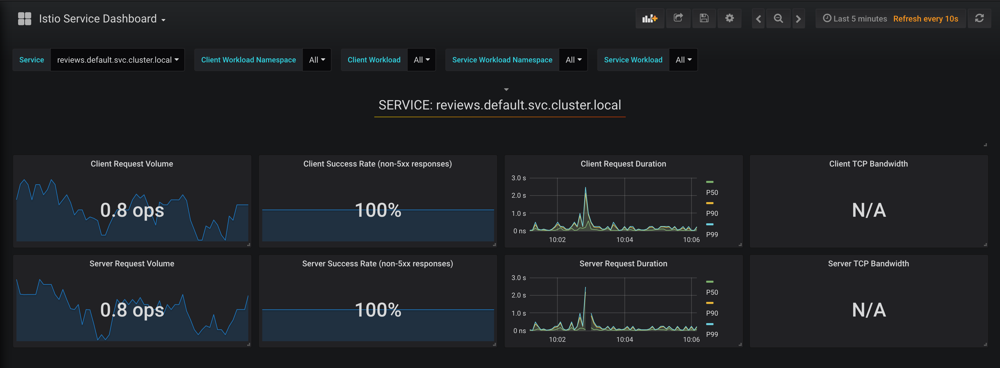
 
Play around and observe the different metrics being collected.

[Collecting Metrics on Istio](https://istio.io/docs/tasks/telemetry/metrics/)

[Collecting Logs on Istio](https://istio.io/docs/tasks/telemetry/logs/)

### Collect request traces using Jaeger

Jaeger is a distributed tracing tool that is available with Istio.

  * Access the Jaeger dashboard at [`http://127.0.0.1:31553/`](http://127.0.0.1:31553) (replace 127.0.0.1 with the address of your cluster)
  * Select `productpage.default` in the left hand `Service` dropdown
  * Click `Find Traces`

  Your dashboard should look something like this:
  
  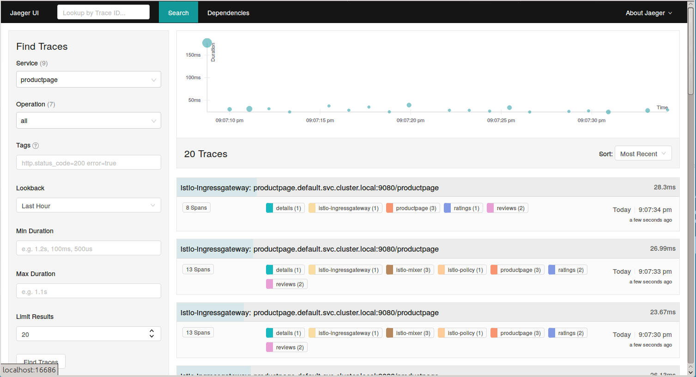

* Make sure you still send traffic to that service. You can renew the `for` loop from earlier.

	```
	for i in `seq 1 200000`; do curl http://127.0.0.1:31804/productpage; done
	```

* Click on one of those traces and you will see the details of the traffic you sent to your BookInfo App. It shows how much time it took for the request on `productpage` to finish. It also shows how much time it took for the requests on the `details`,`reviews`, and `ratings` services.

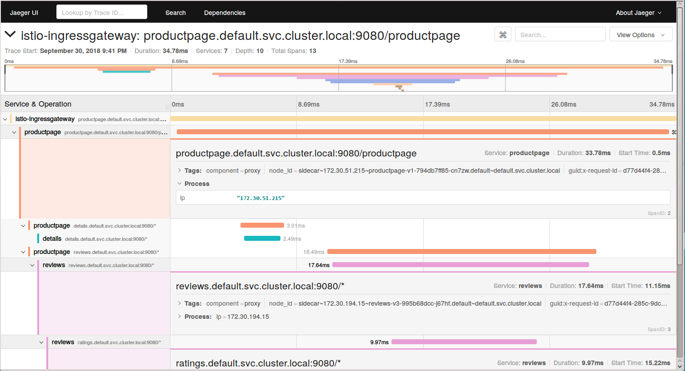

[Jaeger Tracing on Istio](https://istio.io/docs/tasks/telemetry/distributed-tracing/)


#### Hint Lab6_Telemetry

No hint available


#### Complete Lab6_Telemetry

> Confirm Lab6_Telemetry complete


#### Task Lab7_CleanUp

----
  


# Lab 7 - Clean-up


* To delete the BookInfo app and its route-rules: ` ~/training/istio/samples/bookinfo/platform/kube/cleanup.sh`

* To delete Istio from your cluster

```

kubectl delete -f ~/training/istio/samples/bookinfo/policy/mixer-rule-deny-label.yaml
kubectl delete -f ~/training/istio/samples/bookinfo/policy/mixer-rule-ratings-denial.yaml
kubectl delete -f ~/training/istio/samples/bookinfo/networking/virtual-service-all-v1.yaml
kubectl delete -f ~/training/istio/samples/bookinfo/networking/virtual-service-reviews-jason-v2-v3.yaml
kubectl apply -f ~/training/istio/samples/bookinfo/networking/destination-rule-all.yaml

kubectl delete -f ~/training/istio/samples/bookinfo/platform/kube/bookinfo.yaml
kubectl delete -f  ~/training/istio/samples/bookinfo/networking/bookinfo-gateway.yaml

istioctl manifest generate --set profile=demo | kubectl delete -f -

kubectl delete ns istio-system

```


#### Hint Lab7_CleanUp

No hint available


#### Complete Lab7_CleanUp

> Confirm Lab7_CleanUp complete


