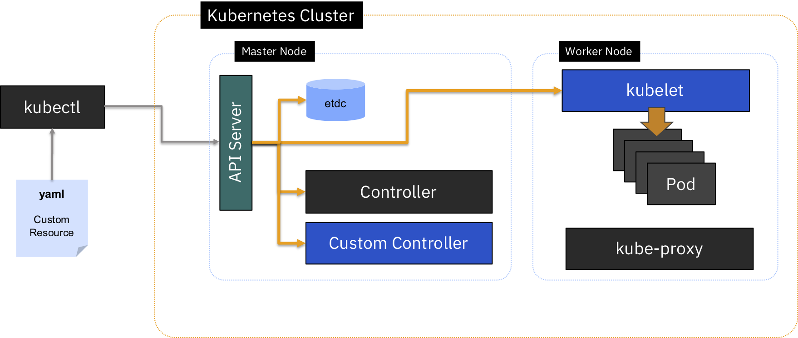

:course_title: JTC14 Kubernetes Ansible Operators

:course_desc: This course contains the Kubernetes Ansible Operators Labs.  

:course_max: 9

:course_auto: no

:button1_label: Task

:button2_label: Hint

:button2_delay: 9999999

:button3_label: Complete

:button3_delay: 1000


#### Task GeneralLabInformation

----


# General Lab information


## Nomenclatures

---

### Shell Commands

The commands that you are going to execute to progress the Labs will look like this:

```
   kubectl create -f redis-slave-service.yaml
	
	> Output Line 1     
	> Output Line 2
	> Output Line 3
	...
	
```


> **IMPORTANT NOTE:** The example output of a command is prefixed by ">" in order to make it more distinguishable. 
> 
> So in the above example you would only enter/copy-paste `kubectl create -f redis-slave-service.yaml` and the output from the command is "Output Line 1" to "Output Line 3" 
> 

---

### Code Examples
Code examples are presented like this:

```yaml
apiVersion: ansiblenlab.ibm.com/v1beta1
kind: MyResource
metadata:
  name: example
spec:
  size: 3
  image: busybox
```

This is only for illustration and is not being actively used in the Labs.


#### Hint GeneralLabInformation

No hint available


#### Complete GeneralLabInformation

> Confirm GeneralLabInformation complete
> 

----

----

#### Task LabsIntroduction

# Kubernetes Operators

In this Lab you will learn about Kubernetes Operator basics and create your first Ansible based Operator.

The Operator Framework is an open source toolkit to manage Kubernetes native applications, called Operators, in an effective, automated, and scalable way.

* Operators are a **design pattern** made public in a 2016 CoreOS blog post.

*  The goal of an Operator is to **put operational knowledge into software**. 
	Previously this knowledge only resided in the minds of administrators, various combinations of shell scripts or automation software like Ansible. It was outside of your Kubernetes cluster and hard to integrate. 

* Operators implement and **automate common Day-1** (installation, configuration, etc) **and Day-2** (re-configuration, update, backup, failover, restore, etc.) **activities** in a piece of software running inside your Kubernetes cluster, by integrating natively with Kubernetes concepts and APIs. 



Operators extend Kubernetes by allowing you to define a **Custom Controller** to watch your application and perform custom tasks based on its state (a perfect fit to automate maintenance of the stateful application we described above).

The application you want to watch is defined in Kubernetes as a new object: a **Custom Resource** (CR) that has its own yaml spec and object type (in K8s, a kind) that is understood by the API server. 

That way, you can define any specific criteria in the custom spec to watch out for, and reconcile the instance when it doesn’t match the spec. The way an operator’s controller reconciles against a spec is very similar to native Kubernetes’ controllers, though it is using mostly custom components. 


### Elements of an Operator implementation

* A **Custom Resource Definition** (CRD) spec that defines the format of the Custom Resource
* A **Custom Controller** to watch our application
	* 	Custom code within the new controller that dictates how to reconcile 	our CR against the spec
* An **Operator** to manage the Custom Controller
* A **Custom Resource** (CR) spec that defines the application we want to watch
* A **deployment** for the Operator and Custom Resource


#### Hint LabsIntroduction

No hint available


#### Complete LabsIntroduction

> Confirm LabsIntroduction complete
> 

----


#### Task Lab1_CreateLabOperatorProject

----

# Lab 1. Create and deploy your first Kubernetes Ansible Operator

The Operator SDK makes it easier to build Kubernetes native applications.


## Lab 1 - Create the Lab Operator Project

In this part of the lab we will create a demo Ansible operator and deploy it to our minikube instance.

1. Create the `ansible-operator-frontend` directory
		
	```
	cd
	mkdir ansible-operator
	cd ~/ansible-operator 
		
	```


2. Create  the `ansible-operator-frontend` Project

	```shell
	 	
	operator-sdk new ansible-operator-frontend --type=ansible --api-version=ansiblenlab.ibm.com/v1beta1 --kind=MyAnsibleLabDemo 
	 
	
	> INFO[0000] Creating new Ansible operator 'ansible-operator-frontend'. 
	> INFO[0000] Created deploy/service_account.yaml          
	> INFO[0000] Created deploy/role.yaml                     
	> INFO[0000] Created deploy/role_binding.yaml             
	> INFO[0000] Created deploy/crds/lab_v1beta1_MyAnsibleLabDemo_crd.yaml       
	...
	
	```


3. Change to the `ansible-operator-frontend` directory
		
	```
	cd ~/ansible-operator/ansible-operator-frontend
		
	```


#### Hint Lab1_CreateLabOperatorProject

No hint available


#### Complete Lab1_CreateLabOperatorProject

> Confirm Lab1_CreateLabOperatorProject complete


#### Task Lab1_CreateLabOperatorAPI

----


## Lab 1 - Create the Lab Operator API

With the above, the API has already been created (unlike for GO operators) and added to the new Custom Resource Definition (CRD), with APIVersion `ansiblenlab.ibm.com/v1beta1` and Kind `MyAnsibleLabDemo`.


1. Add the `deployment.image` field to the Custom Resource
		
	```
	gedit ~/ansible-operator/ansible-operator-frontend/deploy/crds/ansiblenlab_v1beta1_myansiblelabdemo_cr.yaml 

	```

	Add the last two lines from the following at the end of the file and save to make it look the same 
	
	```yaml
	apiVersion: ansiblenlab.ibm.com/v1beta1
	kind: MyAnsibleLabDemo
	metadata:
	  name: example-MyAnsibleLabDemo
	spec:
	  # Add fields here
	  size: 3
	  demo:
	    image: niklaushirt/k8sdemo:1.0.0
	```


2. Save and quit

## We have now finished to set up the API nad CRDs


#### Hint Lab1_CreateLabOperatorAPI

No hint available


#### Complete Lab1_CreateLabOperatorAPI

> Confirm Lab1_CreateLabOperatorAPI complete


#### Task Lab1_CreateLabOperatorController

----


## Lab 1 - Create the Lab Operator Controller

By default, an Ansible role executes the tasks defined at `roles/tasks/main.yml`. 
For defining our deployment we will use the k8s module of Ansible.

### 1) Define the Lab Operator Controller


1. Edit the `ansible-operator-frontend` Controller		

	```
	gedit ~/ansible-operator/ansible-operator-frontend/roles/myansiblelabdemo/tasks/main.yml
	```


2. Replace the content with the following:
   		
	```
	- name: Create the k8sdemo deployment
	  k8s:
	    definition:
	      apiVersion: apps/v1beta1
	      kind: Deployment
	      metadata:
	        name: k8sdemo
	        namespace: default
	      spec:
	        replicas: 1
	        template:
	          metadata:
	            labels:
	              app: k8sdemo
	          spec:
	            containers:
	            - name: k8sdemo
	              image: "{{demo.image}}"
	              imagePullPolicy: IfNotPresent 
	              ports:
	              - containerPort: 3000
	              env:
	                - name: PORT
	                  value : "3000"
	                - name: APPLICATION_NAME
	                  value: k8sdemo
	                - name: BACKEND_URL
	                  value: http://k8sdemo-backend-service.default.svc:3000/api
	
	- name: Create the k8sdemo service
	  k8s:
	    definition:
	      apiVersion: v1
	      kind: Service
	      metadata:
	        name: k8sdemo-service
	        namespace: default
	      spec:
	        selector:
	          app: k8sdemo
	        ports:
	          - protocol: TCP
	            port: 3000
	            targetPort: 3000
	            nodePort: 32123
	        type: NodePort  
	
	```
	
	> 	This will ensure that the Pod will be created with the Image information defined in 	the Custom Resource (CR) definition ("{{deployment.image}}"). This picks up the value 	defined in the CR.
	

	
	
	
4. Save and Quit


---	
	
### 2) Build the Lab Operator Controller

	
1. Now let's build the Operator container 


  ```	
  operator-sdk build localhost:5000/ansible-operator-frontend:ansible
  
  > INFO[0000] Building OCI image localhost:5000/ansible-operator-frontend:ansible
  > Sending build context to Docker daemon  49.15kB
  > Step 1/3 : FROM quay.io/operator-framework/ansible-operator:v0.10.0
  >  ---> 168416e214f1
  > Step 2/3 : COPY watches.yaml ${HOME}/watches.yaml
  >  ---> Using cache
  >  ---> 43f81409e05d
  > Step 3/3 : COPY roles/ ${HOME}/roles/
  >  ---> 0ad354c77a7a
  > Successfully built 0ad354c77a7a
  > Successfully tagged localhost:5000/ansible-operator-frontend:ansible
  > INFO[0001] Operator build complete.  
  ```

  Where `localhost:5000/ansible-operator-frontend:ansible` is the name of the Docker image to be created.


4. And push the Operator container to the local registry 

   First execute this in order to be able to access the private registry:


   ```
   kubectl port-forward --namespace kube-system registry-5ng6b 5000:5000 > /tmp/port-forward.log &
   
   more /tmp/port-forward.log 
	
	> Forwarding from 127.0.0.1:5000 -> 5000
	> Forwarding from [::1]:5000 -> 5000

   ```

5. And then push the image:

 	```		
	docker push localhost:5000/ansible-operator-frontend:ansible
	```


#### Hint Lab1_CreateLabOperatorAPI

No hint available


#### Complete Lab1_CreateLabOperatorAPI

> Confirm Lab1_CreateLabOperatorAPI complete


#### Task Lab1_DeployLabOperatorController

----


### 1) Prepare the Deployment for the Lab Operator Controller

3. Modify the image that we have pushed to the registry in the Operator deployment 
  
  
	```	
	cp ~/ansible-operator/ansible-operator-frontend/deploy/operator.yaml ~/ansible-operator/ansible-operator-frontend/deploy/operator.yaml.bak
		
	sed -i 's|{{ REPLACE_IMAGE }}|localhost:5000/ansible-operator-frontend:ansible|g' ~/ansible-operator/ansible-operator-frontend/deploy/operator.yaml
	sed -i 's|{{ pull_policy.* }}|Always|g' ~/ansible-operator/ansible-operator-frontend/deploy/operator.yaml

	more ~/ansible-operator/ansible-operator-frontend/deploy/operator.yaml

	```
	
### 2) Deploy the Lab Operator

1. Deploy  the `ansible-operator-frontend` Custom Resource Definition
	
	```
	kubectl create -f  ~/ansible-operator/ansible-operator-frontend/deploy/crds/ansiblenlab_v1beta1_myansiblelabdemo_crd.yaml 
 
	
	> customresourcedefinition.apiextensions.k8s.io/MyAnsibleLabDemos.ansiblenlab.ibm.com created

	
	```

2. Create  the `ansible-operator-frontend` Service Account
	
	```
	kubectl create -f  ~/ansible-operator/ansible-operator-frontend/deploy/service_account.yaml
	kubectl create -f  ~/ansible-operator/ansible-operator-frontend/deploy/role.yaml
	kubectl create -f  ~/ansible-operator/ansible-operator-frontend/deploy/role_binding.yaml
	
	> serviceaccount/ansible-operator-frontend created
	> role.rbac.authorization.k8s.io/ansible-operator-frontend created
	> rolebinding.rbac.authorization.k8s.io/ansible-operator-frontend created

	```

3. Create  the `ansible-operator-frontend` Operator
	
	```
	kubectl create -f  ~/ansible-operator/ansible-operator-frontend/deploy/operator.yaml
	
	> deployment.apps/ansible-operator-frontend created

	```
	
	Check and wait for the Operator running
	
	```
	kubectl get pods
	
	> NAME                            READY   STATUS    RESTARTS   AGE
	> ansible-operator-frontend-6cf66c6d4f-24pqm   1/1     Running   0          43m
	> training@training:~/go/src/ansible-operator-frontend

	```
	

#### Hint Lab1_DeployLabOperatorController

No hint available


#### Complete Lab1_DeployLabOperatorController

> Confirm Lab1_DeployLabOperatorController complete


#### Task Lab1_DeployCustomResource

----


## Lab 1 - Deploy the Custom Resource


1. Deploy  the `ansible-operator-frontend` Custom Resource

	
	```
	kubectl create -f  ~/ansible-operator/ansible-operator-frontend/deploy/crds/ansiblenlab_v1beta1_myansiblelabdemo_cr.yaml 

	
	> MyAnsibleLabDemo.ansiblenlab.ibm.com/example-MyAnsibleLabDemo created
	```
	
	From the resource that we defined earlier:
	
	```yaml
	apiVersion: ansiblenlab.ibm.com/v1beta1
	kind: MyAnsibleLabDemo
	metadata:
	  name: example-MyAnsibleLabDemo
	spec:
	  # Add fields here
	  size: 3
	  demo:
	    image: niklaushirt/k8sdemo:1.0.0
	```

2. Check that the Custom resource is running

	```
	kubectl get pods
	
	> NAME                                         READY   STATUS    RESTARTS   AGE
	> ansible-operator-frontend-7fd5754bcd-xddsj   2/2     Running   0          3m11s
	> k8sdemo-7fc8554dff-2krkz                     1/1     Running   0          45s
	
	```

3. Check the version of the deployed Image

  ```
  kubectl describe deployment k8sdemo | grep Image
  
  > Image:      niklaushirt/k8sdemo:1.0.0
  ```
	
	
4. Once the status reads `Running`, we need to expose that deployment as a service so we can access it through the IP of the worker nodes.
   The `k8sdemo` application listens on port 3000.  
   
   Run:

  ```
   kubectl expose deployment k8sdemo --name k8sdemoansible-service -n default --type="NodePort" --port=3000
   
   > service "k8sdemoansible-service" exposed
  ```  
  
  
5. Open the application in your Browser

  ``` 
   minikube service k8sdemoansible-service
   
  ```


#### Hint Lab1_DeployLabOperatorController

No hint available


#### Complete Lab1_DeployLabOperatorController

> Confirm Lab1_DeployLabOperatorController complete


#### Task Lab1_UpdateCustomResource

----

## Lab 1 - Update the Custom Resource

We now proceed to modifying the Custom Resource that we have created in order to demonstrate how the Operator is able to update an existing deployment based on modifications done to the Custom Resource.

1. Modify the Custom Resource

  ```
   sed -i 's|image: niklaushirt/k8sdemo:1.0.0|image: niklaushirt/k8sdemo:1.0.1|g' ~/ansible-operator/ansible-operator-frontend/deploy/crds/ansiblenlab_v1beta1_myansiblelabdemo_cr.yaml 
  ```
  
  
2. Check that the Image tag (version) has been changed to 1.0.1 

  ``` 
  more ~/ansible-operator/ansible-operator-frontend/deploy/crds/ansiblenlab_v1beta1_myansiblelabdemo_cr.yaml 
	``` 

	```yaml

	apiVersion: ansiblenlab.ibm.com/v1beta1
	kind: MyAnsibleLabDemo
	metadata:
	  name: example-myansiblelabdemo
	spec:
	  # Add fields here
	  size: 3
	  demo:
	    image: niklaushirt/k8sdemo:1.0.1

 	```
3. Update the Custom Resource 

	```
	kubectl apply -f ~/ansible-operator/ansible-operator-frontend/deploy/crds/ansiblenlab_v1beta1_myansiblelabdemo_cr.yaml 
	``` 
    
    
4. Check that the version of the deployed Image has been changed by the Operator to 1.0.1

  ```
  kubectl describe deployment k8sdemo | grep Image
  
  > Image:      niklaushirt/k8sdemo:1.0.1
  ```
	 
5. And if you reload the browser you should see some nice orange peppers....

​	


#### Hint Lab1_UpdateCustomResource

No hint available


#### Complete Lab1_UpdateCustomResource

> Confirm Lab1_UpdateCustomResource complete


#### Task Lab1_CleanUpLabOperator

----


## Lab 1 - Update the Custom Resource


## Lab 3 - Clean-up the Lab


1. Delete the `ansible-operator-frontend` Resources

   ```
   kubectl delete -f  ~/ansible-operator/ansible-operator-frontend/deploy/crds/ansiblenlab_v1beta1_myansiblelabdemo_crd.yaml 
	kubectl delete -f  ~/ansible-operator/ansible-operator-frontend/deploy/service_account.yaml
	kubectl delete -f  ~/ansible-operator/ansible-operator-frontend/deploy/role.yaml
	kubectl delete -f  ~/ansible-operator/ansible-operator-frontend/deploy/role_binding.yaml
	kubectl delete -f  ~/ansible-operator/ansible-operator-frontend/deploy/operator.yaml
	kubectl delete -f ~/ansible-operator/ansible-operator-frontend/deploy/crds/ansiblenlab_v1beta1_myansiblelabdemo_cr.yaml 
   kubectl delete service -n default k8sdemoansible-service
   
   ```


# Congratulations!!! This concludes Lab 1 on Kubernetes Ansible Operators


#### Hint Lab1_CleanUpLabOperator

No hint available


#### Complete Lab1_CleanUpLabOperator

> Confirm Lab1_CleanUpLabOperator complete


