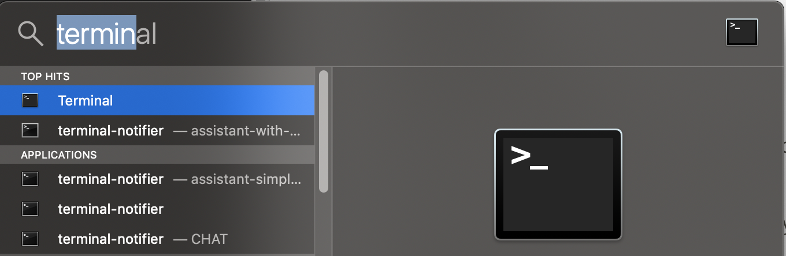

# Prerequisites for the Lab

- Internet Access
- PC with at least:
  - 4 Core CPU
  - 16GB of RAM
  - 30GB of free Disk Space

# Tips and Tricks for getting around in the labs

## Starting the VM

1. Import the VM

   We can now import the VM by double-clicking on the UbuntuTraining.vbox file.

   

2. Start the VM

   You can now start the VM from the Virtual Box interface.

   

## Login to the VM

	The userid is      training
	the password is    passw0rd


---


## Mac Tips

### Opening Terminal

In order to rapidly open the terminal application, hit CMD - SPACE and type terminal.



---


## Minikube Tips

### What is Minikube?

Minikube is an open source tool that enables you to run Kubernetes on your laptop or other local machine. It can work with Linux, Mac, and Windows operating systems. It runs a single-node cluster inside a virtual machine on your local machine.


minikube runs the official stable release of Kubernetes, with support for standard Kubernetes features like:

* LoadBalancer - using `minikube tunnel`
* Multi-cluster - using `minikube start -p <name>`
* NodePorts - using `minikube service`
* Persistent Volumes
* Ingress
* RBAC
* Dashboard - `minikube dashboard`
* Container runtimes
* Configure apiserver and kubelet options via command-line flags
* Addons - a marketplace for developers to share configurations for running services on minikube

### Useful commands

Start a cluster by running:

`minikube start`

Access Kubernetes Dashboard within Minikube:

`minikube dashboard`

Open this exposed endpoint in your browser:

`minikube service hello-minikube`

Start a second local cluster:

`minikube start -p cluster2`

Stop your local cluster:

`minikube stop`

Delete your local cluster:

`minikube delete`


---


## Kubernetes Tips

### Pod Logs

You can look at the logs of any of the pods running under your deployments as follows

```console
$ kubectl logs <podname>
```

Remember that if you have multiple containers running in your pod, you
have to specify the specific container you want to see logs from.

```console
$ kubectl logs <pod-name> <container-name>
```

This subcommand operates like `tail`. Including the `-f` flag will
continue to stream the logs live once the current time is reached.


### kubectl edit and vi

By default, on many Linux and macOS systems, you will be dropped into the editor `vi`.
If you end up in vi you can quit by typing `ESC :q!`

IF you prefer using nano as an editor, execute 

```
export EDITOR=nano
```

On Windows, a copy of `notepad.exe` will be opened with the contents of the file.

### nano basic commands


```
Ctrl-O		To save your work (WriteOut)
Ctrl-X		To exit nano
Ctrl-W		To search for text in a document
Ctrl-K		To cut a line of text
```


### busybox pod

For debugging live, this command frequently helps me:

```console
kubectl run bb --image busybox --restart=Never -it --rm
```

In the busybox image is a basic shell that contains useful utilities.

Utils I often use are `nslookup` and `wget`. 

`nslookup` is useful for testing DNS resolution in a pod.

`wget` is useful for trying to do network requests.

### Service Endpoints

Endpoint resource can be used to see all the service endpoints.

```console
$ kubectl get endpoints <service>
```

### ImagePullPolicy

By default Kubernetes will only pull the image on first use. This can
be confusing during development when you expect changes to show up.

You should be aware of the three `ImagePullPolicy`:

 - IfNotPresent - the default, only request the image if not present.
 - Always - always request the image.
 - Never

More details on image management may be [found here](https://kubernetes.io/docs/concepts/containers/images/).


# Glossary

* **YAML (yml)**

A markup language that relies on spaces and tabulations. All Kubernetes configuration is written using YAML.

You will feel the pain of missing tabs and spaces. Feel free to use a linter, such as <http://www.yamllint.com/>.

* **Container**

*Containers* are an abstraction at the app layer, which packages code and dependencies together.

* **(Container) image**

A lightweight, standalone, executable software package that includes everything you need to run an application: code, runtime, system tools, system libraries and settings.

* **Docker**

A software technology providing operating-system-level virtualization, also known as containers.

Docker uses the resource isolation features of the Linux kernel, such as cgroups and kernel namespaces, and a union-capable file system such as OverlayFS and others to allow independent “containers” to run within a single Linux instance. This avoids the overhead of starting and maintaining virtual machines (VMs).

* **kubectl**

The standard CLI to interact with Kubernetes. We use it a lot in this course.

* **minikube**

A local Kubernetes cluster, useful for testing. We use it a lot in this course.

* **Manifest**

Kubernetes configuration files are called *manifests*. This is a reference to the list or invoice of the passengers or goods being carried by a commercial vehicle or ship (from [wiktionary](https://en.wiktionary.org/wiki/manifest#Noun)).

* **(Kubernetes) objects**

Kubernetes contains a number of abstractions that represent the state of your system: deployed containerized applications and workloads, their associated network and disk resources, and other information about what your cluster is doing. These abstractions are called *objects*, and are represented by a *kind* in the Kubernetes API.

* **(Kubernetes) node**

A node is a worker machine in Kubernetes.

A worker machine may be a VM or physical machine, depending on the cluster. It has the necessary services to run the workloads and is managed by the master components. The services on a node include Docker, `kubelet` and `kube-proxy`.

* **(Kubernetes) cluster**

A set of machines, called nodes, that run containerized applications managed by Kubernetes.

A cluster has several worker nodes and at least one master node.

* **(Kubernetes) master**

The *master* is responsible for managing the cluster. It coordinates all activities in your cluster, such as scheduling applications, maintaining applications’ desired state, scaling applications, and rolling out new updates.

A Kubernetes master automatically handles the scheduling of your services across nodes in the cluster. The master’s automatic scheduling takes the available resources of each node into account.

