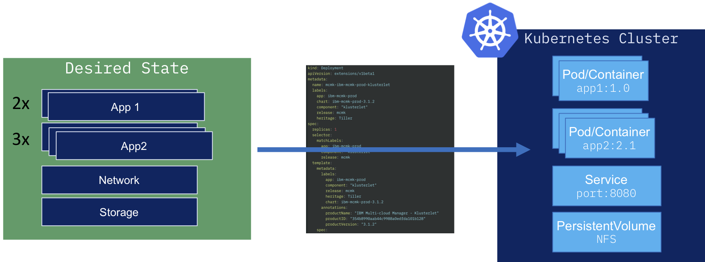
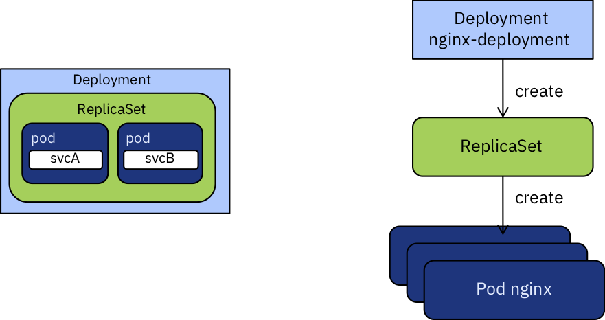

:course_title: JTC02 Kubernetes Labs

:course_desc: This course contains the Kubernetes Labs.  

:course_max: 9

:course_auto: no

:button1_label: Task

:button2_label: Hint

:button2_delay: 9999999

:button3_label: Complete

:button3_delay: 1000

:infotab: <h1>Prerequisites for the Lab</h1>
:infotab: <ul>
:infotab: <li><p>Internet Access</p>
:infotab: </li>
:infotab: <li><p>PC with at least:</p>
:infotab: <ul>
:infotab: <li>4 Core CPU</li>
:infotab: <li>16GB of RAM</li>
:infotab: <li>30GB of free Disk Space</li>
:infotab: 
:infotab: </ul>
:infotab: </li>
:infotab: 
:infotab: </ul>
:infotab: <h1>Tips and Tricks for getting around in the labs</h1>
:infotab: <h2>Login to the VM</h2>
:infotab: <pre><code>The userid is      training
:infotab: <BR>the password is    passw0rd
:infotab: </code></pre>
:infotab: <p>&nbsp;</p>
:infotab: <hr />
:infotab: <p>&nbsp;</p>
:infotab: <h2>Mac Tips</h2>
:infotab: <h3>Opening Terminal</h3>
:infotab: <p>In order to rapidly open the terminal application, hit CMD - SPACE and type terminal.</p>
:infotab: <p></p>
:infotab: <hr />
:infotab: <p>&nbsp;</p>
:infotab: <h2>Minikube Tips</h2>
:infotab: <p>You can open a deployed Kubernetes application by typing:</p>
:infotab: <pre><code>minikube service &lt;my-service-name&gt;
:infotab: </code></pre>
:infotab: <p>&nbsp;</p>
:infotab: <hr />
:infotab: <p>&nbsp;</p>
:infotab: <h2>Kubernetes Tips</h2>
:infotab: <h3>Pod Logs</h3>
:infotab: <p>You can look at the logs of any of the pods running under your deployments as follows</p>
:infotab: <pre><code class='language-console' lang='console'>$<$ kubectl logs &lt;pod-name&gt; &lt;container-name&gt;
:infotab: </code></pre>
:infotab: <p>This subcommand operates like <code>tail</code>. Including the <code>-f</code> flag will
:infotab: continue to stream the logs live once the current time is reached.</p>
:infotab: <h3>kubectl edit and vi</h3>
:infotab: <p>By default, on many Linux and macOS systems, you will be dropped into the editor <code>vi</code>.
:infotab: If you end up in vi you can quit by typing <code>ESC :q!</code></p>
:infotab: <p>IF you prefer using nano as an editor, execute </p>
:infotab: <pre><code>export EDITOR=nano
:infotab: </code></pre>
:infotab: <p>On Windows, a copy of <code>notepad.exe</code> will be opened with the contents of the file.</p>
:infotab: <h3>nano basic commands</h3>
:infotab: <pre><code>Ctrl-O		To save your work (WriteOut)
:infotab: <BR>Ctrl-X		To exit nano
:infotab: <BR>Ctrl-W		To search for text in a document
:infotab: <BR>Ctrl-K		To cut a line of text
:infotab: </code></pre>
:infotab: <p>&nbsp;</p>
:infotab: <h3>busybox pod</h3>
:infotab: <p>For debugging live, this command frequently helps me:</p>
:infotab: <pre><code class='language-console' lang='console'>kubectl run bb --image busybox --restart=Never -it --rm
:infotab: </code></pre>
:infotab: <p>In the busybox image is a basic shell that contains useful utilities.</p>
:infotab: <p>Utils I often use are <code>nslookup</code> and <code>wget</code>. </p>
:infotab: <p><code>nslookup</code> is useful for testing DNS resolution in a pod.</p>
:infotab: <p><code>wget</code> is useful for trying to do network requests.</p>
:infotab: <h3>Service Endpoints</h3>
:infotab: <p>Endpoint resource can be used to see all the service endpoints.</p>
:infotab: <pre><code class='language-console' lang='console'>$ kubectl get endpoints &lt;service&gt;
:infotab: </code></pre>
:infotab: <h3>ImagePullPolicy</h3>
:infotab: <p>By default Kubernetes will only pull the image on first use. This can
:infotab: be confusing during development when you expect changes to show up.</p>
:infotab: <p>You should be aware of the three <code>ImagePullPolicy</code>:</p>
:infotab: <ul>
:infotab: <li>IfNotPresent - the default, only request the image if not present.</li>
:infotab: <li>Always - always request the image.</li>
:infotab: <li>Never</li>
:infotab: 
:infotab: </ul>
:infotab: <p>More details on image management may be <a href='https://kubernetes.io/docs/concepts/containers/images/'>found here</a>.</p>
:infotab: 


#### Task Lab0_LabInformation

----


# Lab0 - Lab information

Kubernetes is a container orchestrator to provision, manage, and scale applications. In other words, Kubernetes allows you to manage the lifecycle of containerized applications within a cluster of nodes (which are a collection of worker machines, for example, VMs, physical machines etc.).

The key paradigm of kubernetes is it’s Declarative model. The user provides the "desired state" and Kubernetes will do it's best make it happen. If you need 5 instances, you do not start 5 separate instances on your own but rather tell Kubernetes that you need 5 instances and Kubernetes will reconcile the state automatically. Simply at this point you need to know that you declare the state you want and Kubernetes makes that happen. If something goes wrong with one of your instances and it crashes, Kubernetes still knows the desired state and creates a new instances on an available node.

In this Lab you will learn the basic concepts for working with Kubernetes.

If you want to learn more about Kubernetes, please take course JTC80.


## Lab sources

All the source code for the lab is available here:

https://github.com/niklaushirt/training


##  Lab overview

* Lab 1: Provides an refresher/overview over Kubernetes.

* Lab 2: This lab walks you through running your first Pod on Kubernetes.

* Lab 3: In this Lab you will deploy a Web Application on Kubernetes, first the Frontend and then the Backend components.

---


#### Hint Lab0_LabInformation

No hint available


#### Complete Lab0_LabInformation

Confirm Lab0_LabInformation complete

----


#### Task Lab0_LabSemantics

----


# Lab0 - Lab semantics


## Nomenclatures

---

### Shell Commands

The commands that you are going to execute to progress the Labs will look like this (you DO NOT have to execute this!):

```
   kubectl create -f redis-slave-service.yaml
	
	> Output Line 1     
	> Output Line 2
	> Output Line 3
	...
	
```


> **IMPORTANT NOTE:** The example output of a command is prefixed by ">" in order to make it more distinguishable. 
> 
> So in the above example you would only enter/copy-paste `kubectl create -f redis-slave-service.yaml` and the output from the command is "Output Line 1" to "Output Line 3" 
> 

---

### Code Examples
Code examples are presented like this:

```yaml
apiVersion: lab.ibm.com/v1beta1
kind: MyResource
metadata:
  name: example
spec:
  size: 3
  image: busybox
```

This is only for illustration and is not being actively used in the Labs.


#### Hint Lab0_LabSemantics

No hint available


#### Complete Lab0_LabSemantics

Confirm Lab0_LabSemantics complete


#### Task Lab0_Prepare

---

# Lab 0 - Prepare the Lab environment

Before starting the Labs, let's make sure that we have the latest source code from the GitHub repository:

https://github.com/niklaushirt/training


1. Open a Terminal window by clicking on the Termnial icon in the left sidebar - we will use this extensively later as well


2. Execute the following commands to pull the latest example code from my GitHub repository

   

```
cd training/
gitrefresh 

~/training/tools/own.sh 
```


#### Hint Lab0_Prepare

No hint available


#### Complete Lab0_Prepare

Confirm Lab0_Prepare complete

----


#### Task Lab1_KubernetesIntroduction

---

# Lab 1. Get to know Kubernetes

Kubernetes was developed by Google as part of the Borg project and handed off to the open source community in 2015. Kubernetes combines more than 15 years of Google research in running a containerized infrastructure with production work loads, open source contributions, and Docker container management tools to provide an isolated and secure app platform that is portable, extensible, and self-healing in case of failovers.


Kubernetes is a solution that automates the orchestration of Container workloads.
It is declarative, which means that you define the desired state and Kubernetes ensures that the state is matched at any given moment. For example you want to deploy three instances of a Container and one dies it will automatically restart a new one to match the desired state.

If you want to learn more about Kubernetes, please follow Course JTC80 Kubernetes Introduction.

In order to define the desired state, we use Resources (aka Objects).
There are a lot of different types of Resources but the most important ones that we will be using are:
* Pods - Smallest deployment unit, usually runs one Container inside
* ReplicaSets - Controls the number of Pods running
* Deployment - defines the deployment of a certain Container - creates a ReplicaSet
* Service - defines how to expose the Container on the network





### Deployment
A Deployment provides declarative updates for Pods (and ReplicaSets).


You describe a desired state in a Deployment, and the Deployment Controller changes the actual state to the desired state at a controlled rate. You can define Deployments to create new ReplicaSets, or to remove existing Deployments and adopt all their resources with new Deployments.

```yaml
kind: Deployment
metadata:
  name: nginx-deployment
spec:
  replicas: 2
  template:
     metadata:
       labels:
         app: nginx
     spec:
       containers:
       - name: nginx
          image: nginx:1.7.9
          ports:
          - containerPort: 80
```




This yaml file defines (amongst others):

|  Field | Description  |
|---|---|-|
|  metadata.name | Name of the Deployment  |
|  spec.replicas | The number of Pods to run simultaneuosly  |
|  spec.template.spec.containers.image |  The Container image to run  
|  spec.template.spec.containers.ports |  The networking ports that should be exposed |    


More information on Deployments can be found [here](https://kubernetes.io/docs/concepts/workloads/controllers/deployment/).

### Service

An abstract way to expose an application running on a set of Pods as a network service.

With Kubernetes you don’t need to modify your application to use an unfamiliar service discovery mechanism. Kubernetes gives Pods their own IP addresses and a single DNS name for a set of Pods, and can load-balance across them.

```yaml
kind: Service
metadata:
  name: nginx-service
spec:
  ports:
  - port: 8000
    targetPort: 80
    protocol: TCP
  selector:
    app: nginx
```


This yaml file defines (amongst others):

|  Field | Description  |
|---|---|-|
|  metadata.name | Name of the Service  |
|  spec.ports |  Port mapping to be exposed (port 80 of the container is exposed as port 8080)   
|  spec. selector.app | Defines the Deployment to map the Servcie to  |  


More information on Services can be found [here](https://kubernetes.io/docs/concepts/services-networking/service/).


#### Hint Lab1_KubernetesIntroduction

No hint available


#### Complete Lab1_KubernetesIntroduction

Confirm Lab1_KubernetesIntroduction complete


#### Task Lab2_DeployPod

----

# Lab 2. Deploy your first Pod


## Introduction

You will learn what a pod is, deploy your first  container, configure Kubernetes, and interact with Kubernetes in the  command line.

The base elements of Kubernetes are pods. Kubernetes will choose how and where to run them. You can also see a `Pod` as an object that requests some CPU and RAM. Kubernetes will take those requirements and decide where to run them.

A`Pod` can be killed and restarted whenever the system has/wants to. So a `Pod` is **ephemeral** and it **will** be destroyed at some point.

### 1. Create the Pod

Let's start to deploy the `nginx` docker image. It's a simple webserver that is used widely in the Kubernetes world.  

```
kubectl run nginx --image=nginx 

> kubectl run --generator=deployment/apps.v1 is DEPRECATED and will be removed in a future version. Use kubectl run --generator=run-pod/v1 or kubectl create instead.
> deployment.apps/nginx created
```


### 2. List the Pods

Now list all the `Pods` running in Kubernetes. `kubectl get` is the `ls` of Kubernetes.

```
kubectl get pods

> NAME                     READY   STATUS              RESTARTS   AGE
> nginx-755464dd6c-2rbgj   0/1     ContainerCreating   0          32s

```


### 3. Get the yaml manifest

Now we can have a look at the `yaml` description of our `Pod`

```
kubectl get pods nginx-755464dd6c-2rbgj -o yaml

> apiVersion: v1
> kind: Pod
> metadata:
>   creationTimestamp: "2019-11-14T08:51:33Z"
>   generateName: nginx-755464dd6c-
>   labels:
>     pod-template-hash: 755464dd6c
>     run: nginx
>   name: nginx-755464dd6c-2rbgj
>   namespace: default
>   ownerReferences:
...
 
```


Here is a simplified version that contains the main elements:

```yaml
apiVersion: v1
kind: Pod
metadata:
  name: nginx-755464dd6c-2rbgj
spec:
  containers:
  - name: nginx
    image: nginx  #hosted on hub.docker.com
```

The  Kubernetes manifest represents a desired state. We do not write the steps to achieve this state. Kubernetes will handle it  for us. 

Let's have a look at the most important fields:

- `apiVersion`: the version of the Kubernetes API we will be using, `v1` here
- `kind`: what resource this object represents, `Pod` for this example
- `metadata`: some metadata about this pod, like its name.
- `spec`: specification of the desired behavior of this `Pod` 
  - `containers`: the list of containers to start in this `Pod` 
    - `name`: the name of the container
    - `image`: which image to start


### 4. Describe the Pod

`Describe` gives us a lot of information about the status and events of a Kubernetes object.


```
kubectl describe pods nginx-755464dd6c-2rbgj

...

Events:
  Type    Reason     Age   From               Message

----    ------     ----  ----               -------

  Normal  Scheduled  90s   default-scheduler  Successfully assigned default/nginx-755464dd6c-2rbgj to minikube
  Normal  Pulling    82s   kubelet, minikube  Pulling image "nginx"
  Normal  Pulled     36s   kubelet, minikube  Successfully pulled image "nginx"
  Normal  Created    36s   kubelet, minikube  Created container nginx
  Normal  Started    34s   kubelet, minikube  Started container nginx


```


### 5. Clean-up

Now to wrap this up, let's delete the `Pod`

```
kubectl delete deployment nginx
```


# Congratulations!!! This concludes Lab 2 on deploying your first Pod


#### Hint Lab2_DeployPod

No hint available


#### Complete Lab2_DeployPod

Confirm Lab2_DeployPod complete


#### Task Lab3_DeployWeb

----

# Lab 3. Set up and deploy your first application

Learn how to deploy an application to a Kubernetes cluster.

Once your client is configured, you are ready to deploy your first application, `k8sdemo`.

## Lab 3 - Deploy the frontend application

In this part of the lab we will deploy an application called `k8sdemo` that has already been built and uploaded to DockerHub under the name `niklaushirt/k8sdemo`.

We will use the following yaml:

```yaml
kind: Deployment
metadata:
  name: k8sdemo
  namespace: default
spec:
  replicas: 1
  template:
    metadata:
      labels:
        app: k8sdemo
    spec:
      containers:
      - name: k8sdemo
        image: niklaushirt/k8sdemo:1.0.0
  	...
          env:   
          - name: PORT
            value : "3000"
          - name: APPLICATION_NAME
            value: k8sdemo
          - name: BACKEND_URL
            value: http://k8sdemo-backend-service.default.svc:3000/api

```

It defines the Container image to deploy (with 1 instances/replicas) and an environment variable BACKEND_URL that points to the backend servcie we will be deploying in the next section.

If you wish you can have a look at the complete yaml file:

```
gedit ~/training/deployment/demoapp.yaml 
```

### Now let's deploy it

1. Start by running `k8sdemo`

	```
	kubectl create -f ~/training/deployment/demoapp.yaml
	```

   This action will take a bit of time. To check the status of the running application, you can use ` kubectl get pods`.

   You should see output similar to the following:

  ```
   kubectl get pods -n default 
   
   > NAME                       READY     STATUS    RESTARTS   AGE
   > k8sdemo-7d46f69d68-bd2cw   0/1       Running   0          17s  
  ```
  
     

3. Eventually, the status should show up as `1/1 Running`.

   ```
    kubectl get pods -n default 
    
    > NAME                          READY     STATUS              RESTARTS   AGE
    > k8sdemo-7d46f69d68-bd2cw      1/1       Running             0          5m
   ```

    The end result of the run command is to create a Deployment resource that manages the lifecycle of those pods.

4. Once the status reads `Running`, we need to expose that deployment as a service so we can access it through the IP of the worker nodes.
   The `k8sdemo` application listens on port 3000.  
   
   Run:
	
	```
	kubectl expose deployment k8sdemo --name k8sdemo-service -n default --type="NodePort" --port=3000
	   
	> service "k8sdemo-service" exposed
	```


5. To find the port used on that worker node, examine your new service:

	```
	 kubectl get service -n default k8sdemo-service
	 
	 > NAME              TYPE       CLUSTER-IP      EXTERNAL-IP   PORT(S)          AGE
	> k8sdemo-service   NodePort   10.109.30.227   <none>        3000:30931/TCP   11m
	```

 We can see that our in this example`<nodeport>` is `31208`. We can see in the output the port mapping from 3000 inside  the pod exposed to the cluster on port 30931. This port in the 31000 range is automatically chosen, and **will probably be different for you**.

1. `k8sdemo` is now running on your cluster, and exposed to the internet. 
    You can open the webpage directly by typing:

    ```  
    minikube service k8sdemo-service
    ```

    where k8sdemo-service is the name of the exposed kubernetes service.

2. Your `k8sdemo` should now be open in the your default browser.
   However it will show an error, because we have not yet deployed the backend.

   **Testing DEMO_API
   STATUS: ERROR	
   Trying to reach backend ....**


#### Hint Lab3_DeployWeb

No hint available


#### Complete Lab3_DeployWeb

Confirm Lab3_DeployWeb complete


#### Task Lab3_DeployBackend

----

## Lab 3 - Deploy the application backend

In this part of the lab we will deploy the application backend called `k8sdemo-backend` that has already been built and uploaded to DockerHub under the name `niklaushirt/k8sdemo-backend`.

  

1. Start by running `k8sdemo-backend`

	```
	kubectl create -f ~/training/deployment/demoapp-backend.yaml
	```

   This action will take a bit of time. To check the status of the running application, you can use ` kubectl get pods`.

   You should see output similar to the following:

  ```
   kubectl get pods -n default
   
   > NAME                              READY     STATUS    RESTARTS   AGE
	> k8sdemo-7d46f69d68-xcgcw          0/1       Running   0          13m
	> k8sdemo-backend-9c777544b-cp59q   0/1       Running   0          1m
	> k8sdemo-backend-9c777544b-jqjz9   0/1       Running   0          1m  
  ```
  
   Eventually, the status should show up as `1/1 Running`.
  
  ```
   kubectl get pods -n default
   
   > NAME                              READY     STATUS    RESTARTS   AGE
	> k8sdemo-7d46f69d68-xcgcw          1/1       Running   0          13m
	> k8sdemo-backend-9c777544b-cp59q   1/1       Running   0          6m35s
	> k8sdemo-backend-9c777544b-jqjz9   1/1       Running   0          6m35s
  ```
  
   The end result of the run command is to create a Deployment resource that manages the lifecycle of those pods.

3. Once the status reads `Running`, we need to expose that deployment as a service so we can access it through the IP of the worker nodes.
   The `k8sdemo` application listens on port 3000.  Run:

  ```
   kubectl expose deployment k8sdemo-backend --name k8sdemo-backend-service -n default --type="NodePort" --port=3000
   
   > service "k8sdemo-service" exposed
  ```

4. Now reload the webpage and verify, that it shows 

	**Testing DEMO_API
	STATUS: OK	
	....**

4. If you reload the webpage several times, you should see, tht the IP Address of the backend API Pod is changing between the two Pods that have been spun up. 

---


# Congratulations!!! This concludes Lab 3 on deploying a web application to Kubernetes

We will be using this deployment in the following Labs.


#### Hint Lab3_DeployBackend 

No hint available


#### Complete Lab3_DeployBackend

Confirm Lab3_DeployBackend complete


