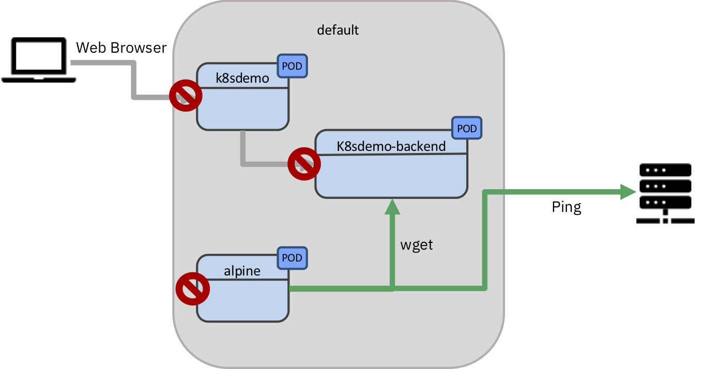
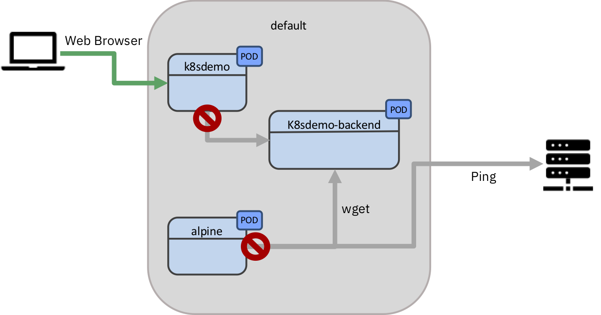

:course_title: JTC16 Kubernetes Security Labs

:course_desc: This course walks you through the Lab preparations for the Journey to Cloud.

:course_max: 22


:course_auto: no

:button1_label: Task

:button2_label: Hint

:button2_delay: 9999999

:button3_label: Complete

:button3_delay: 30


:infotab: <h1>Prerequisites for the Lab</h1>
:infotab: <ul>
:infotab: <li><p>Internet Access</p>
:infotab: </li>
:infotab: <li><p>PC with at least:</p>
:infotab: <ul>
:infotab: <li>4 Core CPU</li>
:infotab: <li>16GB of RAM</li>
:infotab: <li>30GB of free Disk Space</li>
:infotab: 
:infotab: </ul>
:infotab: </li>
:infotab: 
:infotab: </ul>
:infotab: <h1>Tips and Tricks for getting around in the labs</h1>
:infotab: <h2>Login to the VM</h2>
:infotab: <pre><code>The userid is      training
:infotab: <BR>the password is    passw0rd
:infotab: </code></pre>
:infotab: <p>&nbsp;</p>
:infotab: <hr />
:infotab: <p>&nbsp;</p>
:infotab: <h2>Mac Tips</h2>
:infotab: <h3>Opening Terminal</h3>
:infotab: <p>In order to rapidly open the terminal application, hit CMD - SPACE and type terminal.</p>
:infotab: <p></p>
:infotab: <hr />
:infotab: <p>&nbsp;</p>
:infotab: <h2>Minikube Tips</h2>
:infotab: <p>You can open a deployed Kubernetes application by typing:</p>
:infotab: <pre><code>minikube service &lt;my-service-name&gt;
:infotab: </code></pre>
:infotab: <p>&nbsp;</p>
:infotab: <hr />
:infotab: <p>&nbsp;</p>
:infotab: <h2>Kubernetes Tips</h2>
:infotab: <h3>Pod Logs</h3>
:infotab: <p>You can look at the logs of any of the pods running under your deployments as follows</p>
:infotab: <pre><code class='language-console' lang='console'>$<$ kubectl logs &lt;pod-name&gt; &lt;container-name&gt;
:infotab: </code></pre>
:infotab: <p>This subcommand operates like <code>tail</code>. Including the <code>-f</code> flag will
:infotab: continue to stream the logs live once the current time is reached.</p>
:infotab: <h3>kubectl edit and vi</h3>
:infotab: <p>By default, on many Linux and macOS systems, you will be dropped into the editor <code>vi</code>.
:infotab: If you end up in vi you can quit by typing <code>ESC :q!</code></p>
:infotab: <p>IF you prefer using nano as an editor, execute </p>
:infotab: <pre><code>export EDITOR=nano
:infotab: </code></pre>
:infotab: <p>On Windows, a copy of <code>notepad.exe</code> will be opened with the contents of the file.</p>
:infotab: <h3>nano basic commands</h3>
:infotab: <pre><code>Ctrl-O		To save your work (WriteOut)
:infotab: <BR>Ctrl-X		To exit nano
:infotab: <BR>Ctrl-W		To search for text in a document
:infotab: <BR>Ctrl-K		To cut a line of text
:infotab: </code></pre>
:infotab: <p>&nbsp;</p>
:infotab: <h3>busybox pod</h3>
:infotab: <p>For debugging live, this command frequently helps me:</p>
:infotab: <pre><code class='language-console' lang='console'>kubectl run bb --image busybox --restart=Never -it --rm
:infotab: </code></pre>
:infotab: <p>In the busybox image is a basic shell that contains useful utilities.</p>
:infotab: <p>Utils I often use are <code>nslookup</code> and <code>wget</code>. </p>
:infotab: <p><code>nslookup</code> is useful for testing DNS resolution in a pod.</p>
:infotab: <p><code>wget</code> is useful for trying to do network requests.</p>
:infotab: <h3>Service Endpoints</h3>
:infotab: <p>Endpoint resource can be used to see all the service endpoints.</p>
:infotab: <pre><code class='language-console' lang='console'>$ kubectl get endpoints &lt;service&gt;
:infotab: </code></pre>
:infotab: <h3>ImagePullPolicy</h3>
:infotab: <p>By default Kubernetes will only pull the image on first use. This can
:infotab: be confusing during development when you expect changes to show up.</p>
:infotab: <p>You should be aware of the three <code>ImagePullPolicy</code>:</p>
:infotab: <ul>
:infotab: <li>IfNotPresent - the default, only request the image if not present.</li>
:infotab: <li>Always - always request the image.</li>
:infotab: <li>Never</li>
:infotab: 
:infotab: </ul>
:infotab: <p>More details on image management may be <a href='https://kubernetes.io/docs/concepts/containers/images/'>found here</a>.</p>
:infotab: 


#### Task Lab0_LabInformation

----


# Lab0 - Lab information

With Kubernetes rapidly taking over the IT world it is key that the Kubernetes operator and developer knows about basic Kubernetes security concepts.

This Lab provides you with a hands-on with several of those topics.


## Lab sources

All the source code for the lab is available here:

https://github.com/niklaushirt/training


##  Lab overview

In this Lab you will learn about some basic Kubernetes security paradigms.

1. NetworkPolicies
2. Security Tooling


---

#### Hint Lab0_LabInformation

No hint available


#### Complete Lab0_LabInformation

Confirm Lab0_LabInformation complete

----


#### Task Lab0_LabSemantics

----


# Lab0 - Lab semantics


## Nomenclatures

---

### Shell Commands

The commands that you are going to execute to progress the Labs will look like this:

```
   kubectl create -f redis-slave-service.yaml
	
	> Output Line 1     
	> Output Line 2
	> Output Line 3
	...
	
```


> **IMPORTANT NOTE:** The example output of a command is prefixed by ">" in order to make it more distinguishable. 
> 
> So in the above example you would only enter/copy-paste `kubectl create -f redis-slave-service.yaml` and the output from the command is "Output Line 1" to "Output Line 3" 
> 

---

### Code Examples
Code examples are presented like this:

```yaml
apiVersion: lab.ibm.com/v1beta1
kind: MyResource
metadata:
  name: example
spec:
  size: 3
  image: busybox
```

This is only for illustration and is not being actively used in the Labs.


#### Hint Lab0_LabSemantics

No hint available


#### Complete Lab0_LabSemantics

Confirm Lab0_LabSemantics complete


#### Task Lab0_Prepare

---

# Lab 0 - Prepare the Lab environment

Before starting the Labs, let's make sure that we have the latest source code from the GitHub repository:

https://github.com/niklaushirt/training


1. Open a Terminal window by clicking on the Termnial icon in the left sidebar - we will use this extensively later as well

2. Execute the following commands to pull the latest example code from my GitHub repository and adjust user rights

```
cd training/
gitrefresh 

~/training/tools/own.sh 
```


3. Start the demo application


```
kubectl create -f ~/training/deployment/demoapp.yaml
kubectl create -f ~/training/deployment/demoapp-service.yaml
kubectl create -f ~/training/deployment/demoapp-backend.yaml
kubectl create -f ~/training/deployment/demoapp-backend-service.yaml
```


4. Wait for the demo application to be available (the status must be 1/1)


```
kubectl get pods

> NAME                               READY   STATUS    RESTARTS   AGE
> k8sdemo-backend-5b779f567f-2rbgj   1/1     Running   0          21s
> k8sdemo-backend-5b779f567f-p6j76   1/1     Running   0          21s
> k8sdemo-bd6bbd548-jcb6r            1/1     Running   0          21s

```


5. Open the demo application in the browser


```
minikube service k8sdemo-service

> |-----------|-----------------|-------------|------------------------|
> | NAMESPACE |      NAME       | TARGET PORT |          URL           |
> |-----------|-----------------|-------------|------------------------|
> | default   | k8sdemo-service |             | http://10.0.2.15:32123 |
> |-----------|-----------------|-------------|------------------------|
> 🎉  Opening kubernetes service  default/k8sdemo-service in default browser...


```

> If you get the following error 
> 
> ```yaml
> 💣  Error getting machine status: load: filestore "minikube": open /home/training/.minikube/machines/minikube/config.json: permission denied
> 
> 😿  Sorry that minikube crashed. If this was unexpected, we would love to hear from you:
> 👉  https://github.com/kubernetes/minikube/issues/new/choose
> ```
> 
> Please execute: 
> 
> ```
> ~/training/tools/own.sh 
> ```


#### Hint Lab0_Prepare

No hint available


#### Complete Lab0_Prepare

Confirm Lab0_Prepare complete

----


#### Task Lab1_NetworkPoliciesIntro

----


# Lab 1 - Network Policies

Kubernetes network policies specify how pods can communicate with other pods and with external endpoints.
By default, no network policies are set up.
If you have unique security requirements, you can create your own network policies.

The following network traffic is allowed by default:

* A pod accepts external traffic from any IP address to its NodePort or LoadBalancer service or its Ingress resource.
* A pod accepts internal traffic from any other pod in the same cluster.
* A pod is allowed outbound traffic to any IP address.

Network policies let you create additional restrictions on what traffic is allowed.
For example you may want to restrict external inbound or outbound traffic to certain IP addresses.

For this lab we'll use a network policy to restrict traffic between pods.
Let's say that we want to limit access to the `k8sdemo-backend` server to just expose the `k8sdemo` application.
First we can observe that the `k8sdemo-backend` server is open to any pod by spinning up a Linux shell.


#### Hint Lab1_NetworkPoliciesIntro

No hint available


#### Complete Lab1_NetworkPoliciesIntro

Confirm Lab1_NetworkPoliciesIntro complete


#### Task Lab1_NetworkPoliciesFirst Steps

----
First let's create a `Pod` that will assist you in testing the reachability of the different elements.

1. **Open a new Terminal Window or Tab** and run:

	```
	kubectl run -it --rm --restart=Never alpine -n default --image=alpine sh
	
	> If you don't see a command prompt, try pressing enter.
	> / # 

	```


2. Now from **inside** the Pod run the following commands.
3. The `# prompt` indicates that the commands must be executed inside the running Pod.

	```
	# wget -O-  k8sdemo-backend-service.default.svc:3000
	
	> Connecting to k8sdemo-backend-service.default.svc:3000 (10.103.242.14:3000)
	> K8s Demo Backend                   100% |**************************************************************|   197  0:00:00 ETA
	```
	
	You should get the HTML response from the backend server.
	
3. And you should be able to ping external adresses  (45.55.44.56 is Google)

	```
	# ping 45.55.44.56
	
	> PING 45.55.44.56 (45.55.44.56): 56 data bytes
	> 64 bytes from 45.55.44.56: seq=0 ttl=59 time=133.476 ms
	> 64 bytes from 45.55.44.56: seq=1 ttl=59 time=136.036 ms
	> 64 bytes from 45.55.44.56: seq=2 ttl=59 time=125.471 ms
	
	```


#### Hint Lab1_NetworkPoliciesFirst Steps

No hint available


#### Complete Lab1_NetworkPoliciesFirst Steps

Confirm Lab1_NetworkPoliciesFirst complete


#### Task Lab1_NetworkPoliciesIngress

----


## Lab 1 - Control incoming traffic


Now let's create the first `NetworkPolicy` that simply blocks all traffic coming into all pods.

1. Run the following command

	```
	kubectl create -f ~/training/networkpolicies/deny-all-ingress.yaml
	```
	
	This creates the following `NetworkPolicy`
	
	```yaml
	apiVersion: networking.k8s.io/v1
	kind: NetworkPolicy
	metadata:
	  name: default-deny-ingress
	  namespace: default
	spec:
	  podSelector: {}
	  policyTypes:
	  - Ingress
	```

2. Now from inside the Pod run:

	```
	# wget -O-  k8sdemo-backend-service.default.svc:3000
	
	> Connecting to k8sdemo-backend-service.default.svc:3000 (10.103.242.14:3000)
	...
	```
	You should get no response from `k8sdemo-backend`.


3. But you should still be able to ping external adresses 

	```
	# ping 45.55.44.56
	
	> PING 45.55.44.56 (45.55.44.56): 56 data bytes
	> 64 bytes from 45.55.44.56: seq=0 ttl=59 time=133.476 ms
	> 64 bytes from 45.55.44.56: seq=1 ttl=59 time=136.036 ms
	> 64 bytes from 45.55.44.56: seq=2 ttl=59 time=125.471 ms
	```

4. Reload the web application. It should now load again, but with the error from the backend:

	**Testing DEMO_API
	STATUS: ERROR	
	Trying to reach backend ....**

We have just blocked all traffic coming into the pods, but not the outgoing.




#### Clean-up
Delete the `NetworkPolicy` in order to go back to normal.

```
kubectl delete NetworkPolicy -n default default-deny-ingress
```


#### Hint Lab1_NetworkPoliciesIngress

No hint available


#### Complete Lab1_NetworkPoliciesIngress

Confirm Lab1_NetworkPoliciesIngress complete


#### Task Lab1_NetworkPoliciesEgress

----


## Lab 1 - Control outgoing traffic


Now let's create a `NetworkPolicy` that simply blocks all outgoing traffic from all pods.

1. Run the following command
	
	```
	kubectl create -f ~/training/networkpolicies/deny-all-egress.yaml
	```
	
	This creates the following `NetworkPolicy`
	
	```yaml
	apiVersion: networking.k8s.io/v1
	kind: NetworkPolicy
	metadata:
	  name: default-deny-egress
	  namespace: default
	spec:
	  podSelector: {}
	  policyTypes:
	  - Egress
	```

2. Now from inside the Pod run:
	
	```
	# wget -O-  k8sdemo-backend-service.default.svc:3000
	
	> Connecting to k8sdemo-backend-service.default.svc:3000 (10.103.242.14:3000)
	...
	```
	You should get no response from the `k8sdemo-backend` as the web frontend `k8sdemo` outgoing traffic is blocked.


3. And you should not be able to ping external adresses as the `alpine` pod outgoing traffic is blocked.
	
	```
	# ping 45.55.44.56
	
	...
	```
4. Reload the web application. It should now load again, but with the error from the backend:

	**Testing DEMO_API
	STATUS: ERROR	
	Trying to reach backend ....**


We have just blocked all traffic going out of the pods, but not the incoming.




#### Clean-up
Delete the `NetworkPolicy` in order to go back to normal.

```
kubectl delete NetworkPolicy -n default default-deny-egress
```

#### Hint Lab1_NetworkPoliciesEgress

No hint available


#### Complete Lab1_NetworkPoliciesEgress

Confirm Lab1_NetworkPoliciesEgress complete


#### Task Lab1_NetworkPoliciesPodToPod

----


## Lab 1 - Control Pod to Pod communication

Now let's create a `NetworkPolicy` that simply blocks all incoming traffic for the backend (`k8sdemo-backend`) except the one coming from the web frontend (`k8sdemo`).

1. Run the following command
	
	```
	kubectl create -f ~/training/networkpolicies/deny-except-web.yaml
	```
	
	This creates the following `NetworkPolicy`
	
	```yaml
	apiVersion: networking.k8s.io/v1
kind: NetworkPolicy
metadata:
  name: k8sdemo-web-backend
  namespace: default
spec:
  podSelector:
    matchLabels:
      app: k8sdemo-backend
  policyTypes:
  - Ingress
  ingress:
  - from:
    - podSelector:
        matchLabels:
          app: k8sdemo
	```

2. Now from inside the Pod run:
	
	```
	# wget -O-  k8sdemo-backend-service.default.svc:3000
		
	> Connecting to k8sdemo-backend-service.default.svc:3000 (10.103.242.14:3000)
	...
	```
	
	You should get no response from `k8sdemo-backend` as only `k8sdemo` is allowed to access it.


3. You should be able to ping external adresses as outgoing traffic is not blocked.
	
	```
	# ping 45.55.44.56
	
	> PING 45.55.44.56 (45.55.44.56): 56 data bytes
	> 64 bytes from 45.55.44.56: seq=0 ttl=59 time=143.152 ms
	> 64 bytes from 45.55.44.56: seq=1 ttl=59 time=120.875 ms
	> 64 bytes from 45.55.44.56: seq=2 ttl=59 time=130.981 ms
	```
	
4. Reload the web application. It should now load again, without error from the backend:

	**Testing DEMO_API
	STATUS: OK	
	Message from the Backend
<Some Message>
The IP Address is
<IP_ADDRESS>**


We have just blocked all traffic going to `k8sdemo-backend`, except the one coming from `k8sdemo` thus isolating and securing the communication.


#### Clean-up
Delete the `NetworkPolicy` in order to go back to normal.

```
kubectl delete NetworkPolicy -n default k8sdemo-web-backend
```


# Congratulations!!! 
# This concludes Lab 1 on Network Policies

#### Hint Lab1_NetworkPoliciesPodToPod

No hint available


#### Complete Lab1_NetworkPoliciesPodToPod

Confirm Lab1_NetworkPoliciesPodToPod complete


#### Task Lab2_SecurityToolingPolaris

---

# Lab 2 - Security and RBAC Tooling

## Polaris

Polaris runs a variety of checks to ensure that Kubernetes pods and controllers are configured using best practices, helping you avoid problems in the future.

You can get more details [here](https://github.com/FairwindsOps/polaris).


1. Install Polaris Dashboard by running:

	```
	kubectl apply -f https://github.com/FairwindsOps/polaris/releases/latest/download/dashboard.yaml
	
	> namespace/polaris created
	> configmap/polaris created
	> serviceaccount/polaris-dashboard created
	> clusterrole.rbac.authorization.k8s.io/polaris-dashboard created
	> clusterrolebinding.rbac.authorization.k8s.io/polaris-dashboard created
	> service/polaris-dashboard created
	> deployment.apps/polaris-dashboard created
	
	```

2. Wait until the pod si running:

	```
	kubectl get pods -n polaris
	
	> NAME                                 READY     STATUS    RESTARTS   AGE
	> polaris-dashboard-69f5bc4b5d-8jz24   1/1       Running   0          66s
	```
	
3. Once the status reads `Running`, we need to expose the Dashboard as a service so we can access it:

   ```
   kubectl expose deployment polaris-dashboard -n polaris --name polaris-dashboard-service --type="NodePort" --port=8080
   
   > service/polaris-dashboard-service exposed
   ```


4. The Polaris Dashboard is now running in your cluster, and exposed to the internet. 
 	You can open it by typing:
	

  	```
	minikube service polaris-dashboard-service -n polaris
	```   

5. Look around the Dashboard to get familiar with the checks.

	

6. Let's deploy a version of `k8sdemo` that has some more problems by running:

	```
	kubectl create -f ~/training/deployment/demoapp-errors.yaml
	```

   This action will take a bit of time. To check the status of the running application, you can use ` kubectl get pods`.

7. Check out the dashboard for the `k8sdemo-nok` application and you will find that there are a lot more warnings for this deployment.


Now on to the next tool...


#### Hint Lab2_SecurityToolingPolaris

No hint available


#### Complete Lab2_SecurityToolingPolaris

Confirm Lab2_SecurityToolingPolaris complete


#### Task Lab2_SecurityToolingKubeHunter

----


# Kube Hunter

Kube-hunter hunts for security weaknesses in Kubernetes clusters. The tool was developed to increase awareness and visibility for security issues in Kubernetes environments. 

>**IMPORTANT!!! You should NOT run kube-hunter on a Kubernetes cluster you don't own!**

You can get more details [here](https://github.com/aquasecurity/kube-hunter).

Let's examine the list of passive test (non intrusive, aka that do not change the cluster state) that kube-hunter runs:

```
~/kube-hunter/kube-hunter.py --list

> Passive Hunters:
> ----------------
> * Mount Hunter - /var/log
>   Hunt pods that have write access to host's /var/log. in such case, the pod can traverse read files on the host machine
> 
> * Host Discovery when running as pod
>   Generates ip adresses to scan, based on cluster/scan type
> 
> * API Server Hunter
>   Checks if API server is accessible
> 
> * K8s CVE Hunter
>   Checks if Node is running a Kubernetes version vulnerable to specific important CVEs
> 
> * Proxy Discovery
>   Checks for the existence of a an open Proxy service
> 
> * Pod Capabilities Hunter
>   Checks for default enabled capabilities in a pod
> 
> * Kubectl CVE Hunter
>   Checks if the kubectl client is vulnerable to specific important CVEs
...

```

Let's examine the list of passive test (non intrusive, aka that do not change the cluster state) that kube-hunter runs:

```
~/kube-hunter/kube-hunter.py --list --active

> Passive Hunters:
> ----------------
...

> Active Hunters:
> ---------------
> * Kubelet System Logs Hunter
>   Retrieves commands from host's system audit
> 
> * Etcd Remote Access
>   Checks for remote write access to etcd- will attempt to add a new key to the etcd DB
> 
> * Azure SPN Hunter
>   Gets the azure subscription file on the host by executing inside a container
> 
> * Kubelet Container Logs Hunter
>   Retrieves logs from a random container
> 
> * Kubelet Run Hunter
>   Executes uname inside of a random container
> 
...

```

Now let's run an active and passive test against our minikube cluster::

```
~/kube-hunter/kube-hunter.py  --remote localhost --active

> ~ Started
> ~ Discovering Open Kubernetes Services...
> |
> | Etcd:
> |   type: open service
> |   service: Etcd
> |_  location: localhost:2379
> |
> | Kubelet API (readonly):
> |   type: open service
> |   service: Kubelet API (readonly)
> |_  location: localhost:10255
...
```

### Findings

The vulnerability that has been found is due to the fact that `minikube` API by default allows for access with user `system:anonymous`.

```
+-----------------+----------------------+----------------------+----------------------+----------+
| LOCATION        | CATEGORY             | VULNERABILITY        | DESCRIPTION          | EVIDENCE |
+-----------------+----------------------+----------------------+----------------------+----------+
| localhost:10250 | Remote Code          | Anonymous            | The kubelet is       |          |
|                 | Execution            | Authentication       | misconfigured,       |          |
|                 |                      |                      | potentially allowing |          |
|                 |                      |                      | secure access to all |          |
|                 |                      |                      | requests on the      |          |
|                 |                      |                      | kubelet, without the |          |
|                 |                      |                      | need to authenticate |          |
+-----------------+----------------------+----------------------+----------------------+----------+

```
This should (hopefully!) not be the case in your clusters and in this case could be remediated by launching `minikube` with the option `--extra-config=apiserver.anonymous-auth=false`

#### Hint Lab2_SecurityToolingKubeHunter

No hint available


#### Complete Lab2_SecurityToolingKubeHunter

Confirm Lab2_SecurityToolingKubeHunter complete


