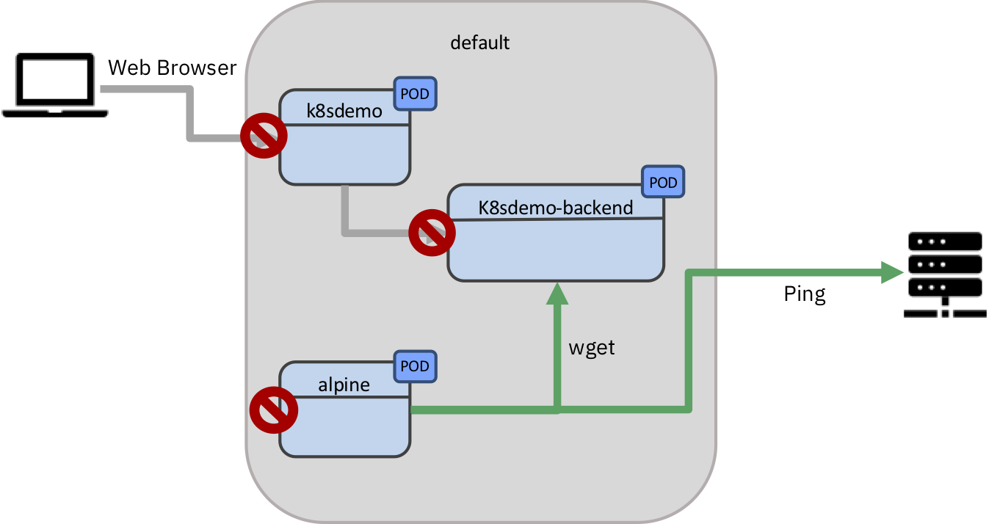
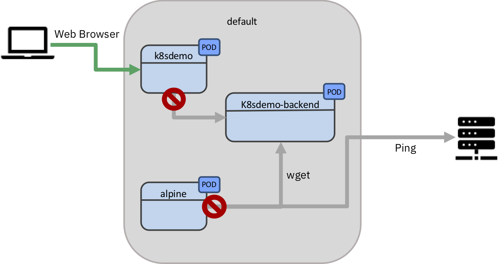
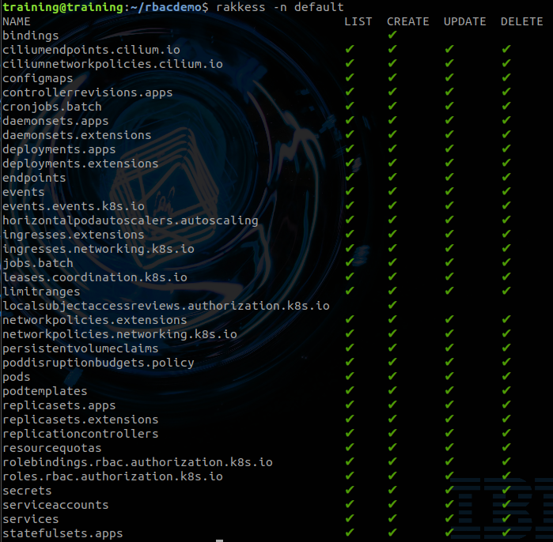
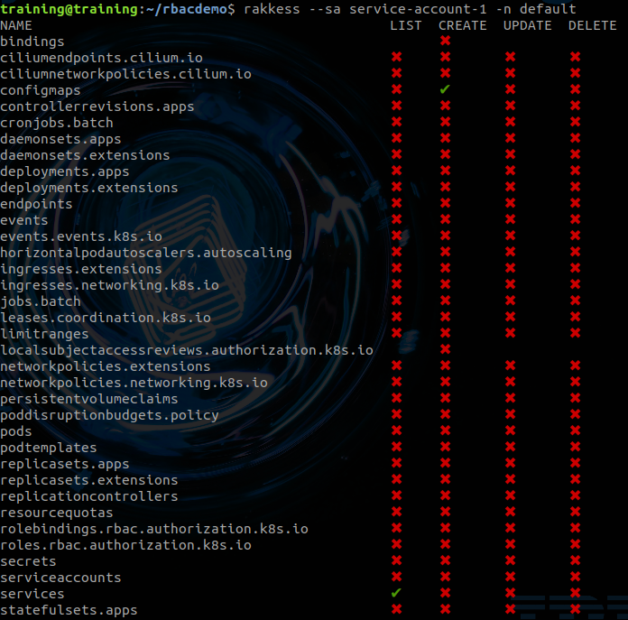
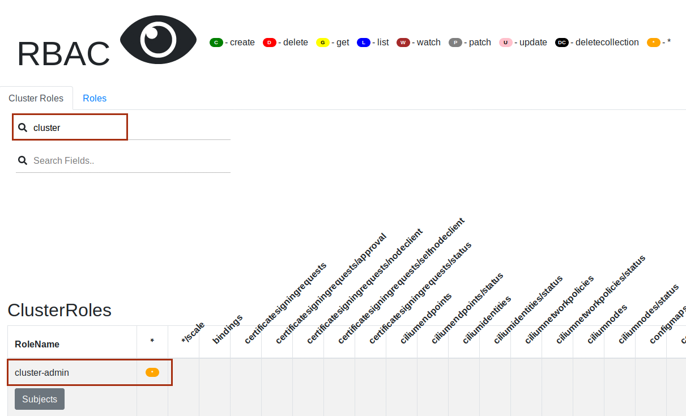
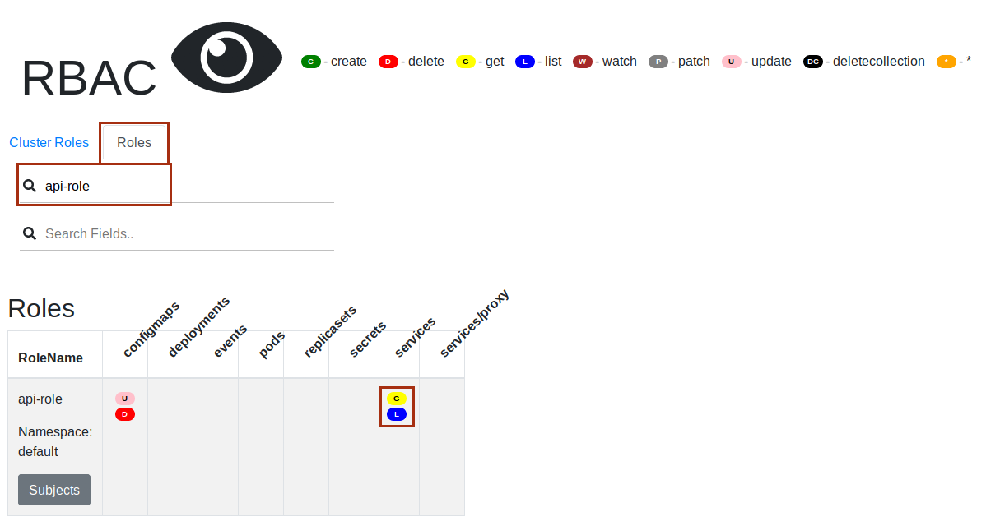
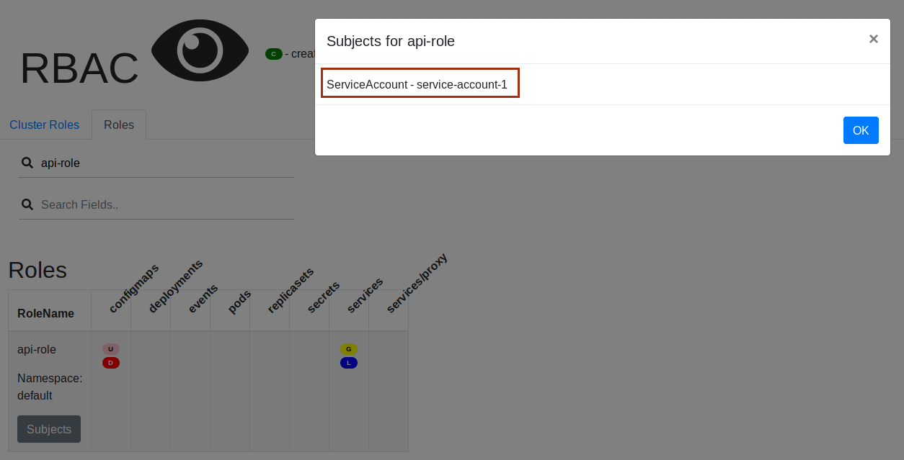

# Lab0 - Lab information

With Kubernetes rapidly taking over the IT world it is key that the Kubernetes operator and developer knows about basic Kubernetes security concepts.

This Lab provides you with a hands-on with several of those topics.


## Lab sources

All the source code for the lab is available here:

https://github.com/niklaushirt/training


##  Lab overview

In this Lab you will learn about some basic Kubernetes security paradigms.

1. NetworkPolicies
2. Role Based Acces Control (RBAC)
3. Service Accounts
4. Security Tooling
5. Image scanning


# Lab0 - Lab semantics


## Nomenclatures

---

### Shell Commands

The commands that you are going to execute to progress the Labs will look like this:

```
   kubectl create -f redis-slave-service.yaml
	
	> Output Line 1     
	> Output Line 2
	> Output Line 3
	...
	
```


> **IMPORTANT NOTE:** The example output of a command is prefixed by ">" in order to make it more distinguishable. 
> 
> So in the above example you would only enter/copy-paste `kubectl create -f redis-slave-service.yaml` and the output from the command is "Output Line 1" to "Output Line 3" 
> 

---

### Code Examples
Code examples are presented like this:

```yaml
apiVersion: lab.ibm.com/v1beta1
kind: MyResource
metadata:
  name: example
spec:
  size: 3
  image: busybox
```

This is only for illustration and is not being actively used in the Labs.


# Lab 0 - Prepare the Lab environment

Before starting the Labs, let's make sure that we have the latest source code from the GitHub repository:

https://github.com/niklaushirt/training


1. Open a Terminal window by clicking on the Termnial icon in the left sidebar - we will use this extensively later as well

2. Execute the following commands to pull the latest example code from my GitHub repository and adjust user rights

```
~/training/tools/own.sh 

cd training/
gitrefresh 
```


3. Start the demo application


```
kubectl create -f ~/training/deployment/demoapp.yaml
kubectl create -f ~/training/deployment/demoapp-service.yaml
kubectl create -f ~/training/deployment/demoapp-backend.yaml
kubectl create -f ~/training/deployment/demoapp-backend-service.yaml
```


4. Wait for the demo application to be available (the status must be 1/1)


```
kubectl get pods

> NAME                               READY   STATUS    RESTARTS   AGE
> k8sdemo-backend-5b779f567f-2rbgj   1/1     Running   0          21s
> k8sdemo-backend-5b779f567f-p6j76   1/1     Running   0          21s
> k8sdemo-bd6bbd548-jcb6r            1/1     Running   0          21s

```


5. Open the demo application in the browser


```
minikube service k8sdemo-service

> |-----------|-----------------|-------------|------------------------|
> | NAMESPACE |      NAME       | TARGET PORT |          URL           |
> |-----------|-----------------|-------------|------------------------|
> | default   | k8sdemo-service |             | http://10.0.2.15:32123 |
> |-----------|-----------------|-------------|------------------------|
> 🎉  Opening kubernetes service  default/k8sdemo-service in default browser...


```

> If you get the following error 
> 
> ```yaml
> 💣  Error getting machine status: load: filestore "minikube": open /home/training/.minikube/machines/minikube/config.json: permission denied
> 
> 😿  Sorry that minikube crashed. If this was unexpected, we would love to hear from you:
> 👉  https://github.com/kubernetes/minikube/issues/new/choose
> ```
> 
> Please execute: 
> 
> ```
> ~/training/tools/own.sh 
> ```


# Lab 1 - Network Policies

Kubernetes network policies specify how pods can communicate with other pods and with external endpoints.
By default, no network policies are set up.
If you have unique security requirements, you can create your own network policies.

The following network traffic is allowed by default:

* A pod accepts external traffic from any IP address to its NodePort or LoadBalancer service or its Ingress resource.
* A pod accepts internal traffic from any other pod in the same cluster.
* A pod is allowed outbound traffic to any IP address.

Network policies let you create additional restrictions on what traffic is allowed.
For example you may want to restrict external inbound or outbound traffic to certain IP addresses.

For this lab we'll use a network policy to restrict traffic between pods.
Let's say that we want to limit access to the `k8sdemo-backend` server to just expose the `k8sdemo` application.
First we can observe that the `k8sdemo-backend` server is open to any pod by spinning up a Linux shell.


#### Hint Lab1_NetworkPoliciesIntro

No hint available


#### Complete Lab1_NetworkPoliciesIntro

Confirm Lab1_NetworkPoliciesIntro complete


#### Task Lab1_NetworkPoliciesFirst Steps

----
First let's create a `Pod` that will assist you in testing the reachability of the different elements.

1. **Open a new Terminal Window or Tab** and run:

	```
	kubectl run -it --rm --restart=Never alpine -n default --image=alpine sh
	
	> If you don't see a command prompt, try pressing enter.
	> / # 

	```


2. Now from **inside** the Pod run the following commands.
3. The `# prompt` indicates that the commands must be executed inside the running Pod.

	```
	# wget -O-  k8sdemo-backend-service.default.svc:3000
	
	> Connecting to k8sdemo-backend-service.default.svc:3000 (10.103.242.14:3000)
	> K8s Demo Backend                   100% |**************************************************************|   197  0:00:00 ETA
	```
	
	You should get the HTML response from the backend server.
	
3. And you should be able to ping external adresses  (45.55.44.56 is Google)

	```
	# ping 45.55.44.56
	
	> PING 45.55.44.56 (45.55.44.56): 56 data bytes
	> 64 bytes from 45.55.44.56: seq=0 ttl=59 time=133.476 ms
	> 64 bytes from 45.55.44.56: seq=1 ttl=59 time=136.036 ms
	> 64 bytes from 45.55.44.56: seq=2 ttl=59 time=125.471 ms
	
	```


## Lab 1 - Control incoming traffic


Now let's create the first `NetworkPolicy` that simply blocks all traffic coming into all pods.

1. Run the following command

	```
	kubectl create -f ~/training/networkpolicies/deny-all-ingress.yaml
	```
	
	This creates the following `NetworkPolicy`
	
	```yaml
	apiVersion: networking.k8s.io/v1
	kind: NetworkPolicy
	metadata:
	  name: default-deny-ingress
	  namespace: default
	spec:
	  podSelector: {}
	  policyTypes:
	  - Ingress
	```

2. Now from inside the Pod run:

	```
	# wget -O-  k8sdemo-backend-service.default.svc:3000
	
	> Connecting to k8sdemo-backend-service.default.svc:3000 (10.103.242.14:3000)
	...
	```
	You should get no response from `k8sdemo-backend`.


3. But you should still be able to ping external adresses 

	```
	# ping 45.55.44.56
	
	> PING 45.55.44.56 (45.55.44.56): 56 data bytes
	> 64 bytes from 45.55.44.56: seq=0 ttl=59 time=133.476 ms
	> 64 bytes from 45.55.44.56: seq=1 ttl=59 time=136.036 ms
	> 64 bytes from 45.55.44.56: seq=2 ttl=59 time=125.471 ms
	```

4. Reload the web application. It should now load again, but with the error from the backend:

	**Testing DEMO_API
	STATUS: ERROR	
	Trying to reach backend ....**

We have just blocked all traffic coming into the pods, but not the outgoing.




#### Clean-up
Delete the `NetworkPolicy` in order to go back to normal.

```
kubectl delete NetworkPolicy -n default default-deny-ingress
```


## Lab 1 - Control outgoing traffic


Now let's create a `NetworkPolicy` that simply blocks all outgoing traffic from all pods.

1. Run the following command
	
	```
	kubectl create -f ~/training/networkpolicies/deny-all-egress.yaml
	```
	
	This creates the following `NetworkPolicy`
	
	```yaml
	apiVersion: networking.k8s.io/v1
	kind: NetworkPolicy
	metadata:
	  name: default-deny-egress
	  namespace: default
	spec:
	  podSelector: {}
	  policyTypes:
	  - Egress
	```

2. Now from inside the Pod run:
	
	```
	# wget -O-  k8sdemo-backend-service.default.svc:3000
	
	> Connecting to k8sdemo-backend-service.default.svc:3000 (10.103.242.14:3000)
	...
	```
	You should get no response from the `k8sdemo-backend` as the web frontend `k8sdemo` outgoing traffic is blocked.


3. And you should not be able to ping external adresses as the `alpine` pod outgoing traffic is blocked.
	
	```
	# ping 45.55.44.56
	
	...
	```
4. Reload the web application. It should now load again, but with the error from the backend:

	**Testing DEMO_API
	STATUS: ERROR	
	Trying to reach backend ....**


We have just blocked all traffic going out of the pods, but not the incoming.




#### Clean-up
Delete the `NetworkPolicy` in order to go back to normal.

```
kubectl delete NetworkPolicy -n default default-deny-egress
```


## Lab 1 - Control Pod to Pod communication

Now let's create a `NetworkPolicy` that simply blocks all incoming traffic for the backend (`k8sdemo-backend`) except the one coming from the web frontend (`k8sdemo`).

1. Run the following command
	
	```
	kubectl create -f ~/training/networkpolicies/deny-except-web.yaml
	```
	
	This creates the following `NetworkPolicy`
	
	```yaml
	apiVersion: networking.k8s.io/v1
kind: NetworkPolicy
metadata:
  name: k8sdemo-web-backend
  namespace: default
spec:
  podSelector:
    matchLabels:
      app: k8sdemo-backend
  policyTypes:
  - Ingress
  ingress:
  - from:
    - podSelector:
        matchLabels:
          app: k8sdemo
	```

2. Now from inside the Pod run:
	
	```
	# wget -O-  k8sdemo-backend-service.default.svc:3000
		
	> Connecting to k8sdemo-backend-service.default.svc:3000 (10.103.242.14:3000)
	...
	```
	
	You should get no response from `k8sdemo-backend` as only `k8sdemo` is allowed to access it.


3. You should be able to ping external adresses as outgoing traffic is not blocked.
	
	```
	# ping 45.55.44.56
	
	> PING 45.55.44.56 (45.55.44.56): 56 data bytes
	> 64 bytes from 45.55.44.56: seq=0 ttl=59 time=143.152 ms
	> 64 bytes from 45.55.44.56: seq=1 ttl=59 time=120.875 ms
	> 64 bytes from 45.55.44.56: seq=2 ttl=59 time=130.981 ms
	```
	
4. Reload the web application. It should now load again, without error from the backend:

	**Testing DEMO_API
	STATUS: OK	
	Message from the Backend
<Some Message>
The IP Address is
<IP_ADDRESS>**


We have just blocked all traffic going to `k8sdemo-backend`, except the one coming from `k8sdemo` thus isolating and securing the communication.


#### Clean-up
Delete the `NetworkPolicy` in order to go back to normal.

```
kubectl delete NetworkPolicy -n default k8sdemo-web-backend
```


# Congratulations!!! 
# This concludes Lab 1 on Network Policies


# Lab 2 - RBAC

RBAC policies are vital for the correct management of your cluster, as they allow you to specify which types of actions are permitted depending on the user and their role in your organization. Examples include:

Secure your cluster by granting privileged operations (accessing secrets, for example) only to admin users.
Force user authentication in your cluster.
Limit resource creation (such as pods, persistent volumes, deployments) to specific namespaces. You can also use quotas to ensure that resource usage is limited and under control.
Have a user only see resources in their authorized namespace. This allows you to isolate resources within your organization (for example, between departments).


## RBAC Roles

Rbac Roles are composed of 

* **RBAC API objects**
	* Pods
	* PersistentVolumes
	* ConfigMaps
	* Deployments
	* Nodes
	* Secrets
	* Namespaces

* **Possible operations** over these resources are:
	* create
	* get
	* delete
	* list
	* update
	* edit
	* watch
	* exec


## RBAC Elements

* **Rules**: A rule is a set of operations (verbs) that can be carried out on a group of resources which belong to different API Groups.

* **Roles and ClusterRoles**: Both consist of rules. The difference between a Role and a ClusterRole is the scope: in a Role, the rules are applicable to a single namespace, whereas a ClusterRole is cluster-wide, so the rules are applicable to more than one namespace. ClusterRoles can define rules for cluster-scoped resources (such as nodes) as well. Both Roles and ClusterRoles are mapped as API Resources inside our cluster.

* **RoleBindings and ClusterRoleBindings**: Just as the names imply, these bind subjects to roles (i.e. the operations a given user can perform). As for Roles and ClusterRoles, the difference lies in the scope: a RoleBinding will make the rules effective inside a namespace, whereas a ClusterRoleBinding will make the rules effective in all namespaces.


* **Subjects**: These correspond to the entity that attempts an operation in the cluster. There are three types of subjects:
	* **User Accounts**: These are global, and meant for humans or processes living outside the cluster. There is no associated resource API Object in the Kubernetes cluster.
	* **Service Accounts**: This kind of account is namespaced and meant for intra-cluster processes running inside pods, which want to authenticate against the API.
	* **Groups**: This is used for referring to multiple accounts. There are some groups created by default such as cluster-admin (explained in later sections).


You can get more detailed information in the official Kubernetes documentation [here](https://kubernetes.io/docs/admin/authorization/rbac/).


# Lab 2 - Users, Roles and RoleBindings
---
---
## Lab 2 - Create user with limited namespace access

In this example, we will create a user with limited namespace access.

The following User Account will be created:

  * Username: demo
  * Group: demogroup

We will add the necessary RBAC policies so this user can fully manage deployments (i.e. use `kubectl run` command) only inside the `rbactest` namespace. At the end, we will test the policies to make sure they work as expected.

## Create the rbactest namespace

  * Execute the `kubectl create` command to create the namespace (as the admin user):
    
    ```
    kubectl create namespace rbactest 
    ```


## Lab 2 - Create the user credentials

Kubernetes does not have API Objects for User Accounts. Of the available ways to manage authentication (see [Kubernetes official documentation](https://kubernetes.io/docs/admin/authentication) for a complete list), we will use OpenSSL certificates for their simplicity. 

### Lab 2 - Create the certificate

  1. Create a private key for your user. In this example, we will name the file `demo.key`.

    Go to a temporary working directory in your terminal.

    ```
    mkdir rbacdemo
    cd rbacdemo
    ```
    
    ```
    openssl genrsa -out demo.key 2048 
        
    > Generating RSA private key, 2048 bit long modulus (2 primes)
    ...
    ```
    
    The private key file `demo.key` has been created:
    
    ```
    ls
        
    > demo.key
    ```


​    
​    
​    
  2. Create a certificate sign request `demo.csr` using the private key you just created (`demo.key` in this example). 
  
     Make sure you specify your username and group in the _-subj_ section (CN is for the username and O for the group). 	 As previously mentioned, we will use `demo` as the name and `demogroup` as the group:

	```
	openssl req -new -key demo.key -out demo.csr -subj "/CN=demo/O=demogroup" 
	```

   The certificate sign request `demo.csr` has been created:

	```
	ls
	    
	> demo.csr  demo.key
	```


​	

  3. We will use the Kubernetes cluster certificate authority (CA) for approving the request and generating the necessary certificate to access the cluster API. 

  Its location usually is `/etc/kubernetes/pki/`. 
  But in our case (for Minikube), it would be `~/.minikube/`. 

  4. Generate the final certificate `demo.crt` by approving the certificate sign request, `demo.csr`, you made earlier. In this example, the certificate will be valid for 500 days:
		    
	```
	openssl x509 -req -in demo.csr -CA ~/.minikube/ca.crt -CAkey ~/.minikube/ca.key -CAcreateserial -out demo.crt -days 500 
	    
	> key -CAcreateserial -out demo.crt -days 500 
	> Signature ok
	> subject=CN = demo, O = demogroup
	> Getting CA Private Key
	
	```

	The final certificate `demo.crt` has been created:
	
	```
	ls
	    
	> demo.crt  demo.csr  demo.key
	```
	
	
	
  5. In a real world example you would now save both `demo.crt` and `demo.key` in a safe location.


### Lab 2 - Create the context

Add a new context with the new credentials for your Kubernetes cluster. This example is for a Minikube cluster but it should be similar for [others](https://kubernetes.io/docs/setup/pick-right-solution/):
		    
1. Set credentials
	    
	```
	kubectl config set-credentials demo --client-certificate=./demo.crt --client-key=./demo.key 
	   
	> User "demo" set.
	```
  
2. Create context
  
	``` 
	kubectl config set-context demo-context --cluster=minikube --namespace=rbactest --user=demo 
	    
	> Context "demo-context" created.
	```
  
3. Check configuration
  
	``` 
	kubectl config view 
	    
	```

We can see that we now have a context `demo-context` and a user `demo` in our configuration that will be used to access the Kubernetes API via `kubectl`.
	
You should get an access denied error when using the `kubectl` CLI with this configuration file. This is expected as we have not defined any permitted operations for this user.

```
kubectl --context=demo-context get pods 
    
> No resources found.
> Error from server (Forbidden): pods is forbidden: User "demo" cannot list resource "pods" in API group "" in the namespace "rbactest"
```


### 1) Create the role for viewing deployments

We are creating the `Rule` that allows a user to execute several `Read Only` operations on Deployments, Pods and ReplicaSets, which belong to the `core` (expressed by “” in the `yaml` file), `apps`, and `extensions` API Groups:
	    
```yaml
kind: Role
apiVersion: rbac.authorization.k8s.io/v1beta1
metadata:
  name: deployment-viewer
  namespace: rbactest
rules:
- apiGroups: ["", "extensions", "apps"]
  resources: ["deployments", "replicasets", "pods"]
  verbs: ["get", "list"] # You can also use ["*"]
```


Create the `Role` in the cluster using:
    
```
kubectl create -f ~/training/rbac/deployment-viewer.yaml 
```


### 2) Bind the viewer role to the demo user

In this step we are creating the `RuleBinding` that binds the `deployment-viewer` `Role` to the User Account `demo` inside the `rbactest` namespace:
    
     
```yaml
kind: RoleBinding
apiVersion: rbac.authorization.k8s.io/v1beta1
metadata:
  name: deployment-viewer-binding
  namespace: rbactest
subjects:
- kind: User
  name: demo
  apiGroup: ""
roleRef:
  kind: Role
  name: deployment-viewer
  apiGroup: ""
```


Create the Role in the cluster using:
    
```
kubectl create -f ~/training/rbac/deployment-viewer-binding.yaml 
```


## Lab 2 - Test the RBAC viewer rule

Now you should be able to execute the following command without any issues:

```
kubectl --context=demo-context get pods 

> No resources found.
```

`No resources found.` simply means that we don't have any `Pods` deployed in this `Namespace`.

If you run the same command for the default namespace with the `--namespace=default` argument, it will fail, as the `demo` user does not have access to this namespace.
    
```
kubectl --context=demo-context get pods --namespace=default 

> No resources found.
> Error from server (Forbidden): pods is forbidden: User "demo" cannot list resource "pods" in API group "" in the namespace "default"
```


Also you still don't have the rights to create or delete `Deployments`:

```
kubectl --context=demo-context run --image alpine alpine                                                                                                                                                                                                                                                                                              

> Error from server (Forbidden): deployments.apps is forbidden: User "demo" cannot create resource "deployments" in API group "apps" in the namespace "rbactest"
```

Now you have created a user with limited Read Only permissions in your cluster.


### 1) Create the role for managing deployments

We are creating the `Rule` that allows a user to execute several `Read and Write` operations on Deployments, Pods and ReplicaSets, which belong to the `core` (expressed by “” in the `yaml` file), `apps`, and `extensions` API Groups:
	    
```yaml
kind: Role
apiVersion: rbac.authorization.k8s.io/v1beta1
metadata:
  name: deployment-manager
  namespace: rbactest
rules:
- apiGroups: ["", "extensions", "apps"]
  resources: ["deployments", "replicasets", "pods"]
  verbs: ["get", "list", "watch", "create", "update", "patch", "delete"] # You can also use ["*"]
```


Create the `Role` in the cluster using:
    
```
kubectl create -f ~/training/rbac/deployment-manager.yaml 
```


### 2) Bind the Manager role to the demo user

In this step we are creating the `RuleBinding` that binds the `deployment-manager` `Role` to the User Account `demo` inside the `rbactest` namespace:
    
     
```yaml
kind: RoleBinding
apiVersion: rbac.authorization.k8s.io/v1beta1
metadata:
  name: deployment-manager-binding
  namespace: rbactest
subjects:
- kind: User
  name: demo
  apiGroup: ""
roleRef:
  kind: Role
  name: deployment-manager
  apiGroup: ""
```


Create the Role in the cluster using:
    
```
kubectl create -f ~/training/rbac/deployment-manager-binding.yaml 
```


## Lab 2 - Test the RBAC manager rule

Now you should be able to execute the following commands without any issues:

```
kubectl --context=demo-context run --image alpine alpine                                                                                                                                                                                                                                                                                              

> deployment.apps/alpine created
```

Check that the alpine Pod is running 

```
kubectl --context=demo-context get pods 

> NAME                      READY     STATUS      RESTARTS   AGE
> alpine-7f866557df-dkmks   0/1       Completed   0          6s
```


However if you run the same command for the default namespace with the `--namespace=default` argument, it will still fail, as the `demo` user still does not have access to this namespace.
    
```
kubectl --context=demo-context get pods --namespace=default 

> No resources found.
> Error from server (Forbidden): pods is forbidden: User "demo" cannot list resource "pods" in API group "" in the namespace "default"
```

Now you have created a user with limited permissions in your cluster but with full Management rights for Deployments in the `rbactest` namespace.


# Congratulations!!! 
# This concludes Lab 2 on RBAC and Roles/RoleBindings.


# Lab 3 - Service Accounts
---
---
## Lab 3 - Create a ServiceAccount for a Deployment

In this chapter we will start this `Pod` with a limited `ServiceAccount`.
    
### Create the resources

To create the `ServiceAccount`:

```yaml
apiVersion: v1
kind: ServiceAccount
metadata:
  name: service-account-1
  labels:
    app: tools-rbac
```

Run the following command:

```
kubectl apply -f ~/training/rbac/service-accounts.yaml

> serviceaccount "service-account-1" 
```

Now we will create a Deployment that runs under the `ServiceAccount` that we have just created.
The `Pod` contains the `kubectl` executable, so that we can test the access rights from withing this `Pod`.


To create the `Deployment`:

```yaml
kind: Deployment
metadata:
  name: kubectl
  labels:
    rbac: service-account-1
spec:
  replicas: 1
 ...
  template:
    metadata:
      labels:
        rbac: service-account-1
    spec:
      serviceAccountName: service-account-1
      containers:
        - name: kubectl
          image: "niklaushirt/kubectl:1.14"
...
```

Run the following command:

```
kubectl apply -f ~/training/rbac/service-account-kubectl.yaml

> deployment.apps/kubectl configured 
```

Great, now lets see how our pod is doing:
    
```    
kubectl get pods 
    
> NAME                                     READY     STATUS         RESTARTS   AGE
> alpine                                   1/1       Running       0          3h48m
> k8sdemo-7d46f69d68-d5dwm                 1/1       Running       0          4h6m
> k8sdemo-backend-9c777544b-knnth          1/1       Running       0          4h2m
> k8sdemo-backend-9c777544b-tztr8          1/1       Running       0          4h2m
> k8sdemo-nok-7b4c444454-h6w6r             1/1       Running       0          3h30m
> kubectl-f8977f5d9-4mm69                  1/1       Running       0          25s
> tools-service-account-7c4c798b7-x7rkv    1/1       Running       0          28m```
```

### Test Access

Now test the access from inside the Pod (**you will have to replace the Pod name**):

```    
kubectl exec kubectl-f8977f5d9-4mm69 kubectl get services

> Error from server (Forbidden): services is forbidden: User "system:serviceaccount:default:service-account-1" cannot list resource "services" in API group "" in the namespace "default"
> command terminated with exit code 1
```
So the access is forbidden for the Pod running under the `ServiceAccount` `service-account-1`, which makes sense, because the `ServiceAccount` has no rights assigned as of now.


## Lab 3 - Add Role and RoleBinding for Service Account

We now are running the `kubectl` `Pod` under the `ServiceAccount` `service-account-1`. 

The following configuration will create a `Role` and a `RoleBinding` for just this service account.

### Create Role and RoleBinding   

1. Create Role

	```yaml
	kind: Role
	apiVersion: rbac.authorization.k8s.io/v1
	metadata:
	  name: api-role
	  namespace: default
	  labels:
	    app: tools-rbac
	rules:
	- apiGroups: [""]
	  resources: ["services"]
	  verbs: ["get", "list"]
	- apiGroups: [""]
	  resources: ["configmaps"]
	  verbs: ["create"]
	- apiGroups: [""]
	  resources: ["configmaps"]
	  resourceNames: ["mqtt-pub-address"]
	  verbs: ["update", "delete"]
	```
	
	The `Role` has the rights to list the `Services`.
	
	```
	kubectl create -f ~/training/rbac/service-accounts-role.yaml
	
	> role.rbac.authorization.k8s.io/api-role configured
	```

2. Now lets bind the Role to the `ServiceAccount` `service-account-1` 
	
	```yaml
	kind: RoleBinding
	apiVersion: rbac.authorization.k8s.io/v1
	metadata:
	  name: service-account-rolebinding
	  namespace: default
	  labels:
	    app: tools-rbac
	subjects:
	- kind: ServiceAccount
	  name: service-account-1
	roleRef:
	  kind: Role
	  name: api-role
	  apiGroup: ""
	```
	
	Create the RoleBinding
	
	```
	kubectl create -f ~/training/rbac/service-accounts-role-binding.yaml
		
	> rolebinding.rbac.authorization.k8s.io/service-account-rolebinding created
	```
  
    Now the `ServiceAccount` `service-account-1` should have the rights to list the `Services`.
  
### Test Access

Let's try this again:
    
```    
kubectl exec kubectl-f8977f5d9-4mm69 kubectl get services

> NAME                      TYPE        CLUSTER-IP     EXTERNAL-IP   PORT(S)          AGE
> k8sdemo-backend-service   NodePort    10.109.88.37   <none>        3000:30601/TCP   4h9m
> k8sdemo-service           NodePort    10.99.195.7    <none>        3000:30456/TCP   4h11m
> kubernetes                ClusterIP   10.96.0.1      <none>        443/TCP          5h20m
```


We can see, that the Pod running under the `ServiceAccount` `service-account-1` can now access the list of `Services` because it is bound to a `Role` that allows for listing them.


However this is still a **ReadOnly** access.


When trying to **modify** (delete) a `Service` we still get an error:

``` 
kubectl exec kubectl-f8977f5d9-4mm69 kubectl delete services k8sdemo-service

> Error from server (Forbidden): services "k8sdemo-service" is forbidden: User "system:serviceaccount:default:service-account-1" cannot delete resource "services" in API group "" in the namespace "default"
> command terminated with exit code 1
```

We have now created a RBAC Policy that gives a `ServiceAccount` specific rights (in this case ReadOnly) to certain ressources. 

---
---

# Congratulations!!! 
# This concludes Lab 3 on RBAC and Service Accounts.


# Lab 4 - Security and RBAC Tooling

## Polaris

Polaris runs a variety of checks to ensure that Kubernetes pods and controllers are configured using best practices, helping you avoid problems in the future.

You can get more details [here](https://github.com/FairwindsOps/polaris).


1. Install Polaris Dashboard by running:

	```
	kubectl apply -f https://github.com/FairwindsOps/polaris/releases/latest/download/dashboard.yaml
	
	> namespace/polaris created
	> configmap/polaris created
	> serviceaccount/polaris-dashboard created
	> clusterrole.rbac.authorization.k8s.io/polaris-dashboard created
	> clusterrolebinding.rbac.authorization.k8s.io/polaris-dashboard created
	> service/polaris-dashboard created
	> deployment.apps/polaris-dashboard created
	
	```

2. Wait until the pod si running:

	```
	kubectl get pods -n polaris
	
	> NAME                                 READY     STATUS    RESTARTS   AGE
	> polaris-dashboard-69f5bc4b5d-8jz24   1/1       Running   0          66s
	```
	
3. Once the status reads `Running`, we need to expose the Dashboard as a service so we can access it:

   ```
   kubectl expose deployment polaris-dashboard -n polaris --name polaris-dashboard-service --type="NodePort" --port=8080
   
   > service/polaris-dashboard-service exposed
   ```


4. The Polaris Dashboard is now running in your cluster, and exposed to the internet. 
 	You can open it by typing:
	

  	```
	minikube service polaris-dashboard-service -n polaris
	```   

5. Look around the Dashboard to get familiar with the checks.

	

6. Let's deploy a version of `k8sdemo` that has some more problems by running:

	```
	kubectl create -f ~/training/deployment/demoapp-errors.yaml
	```

   This action will take a bit of time. To check the status of the running application, you can use ` kubectl get pods`.

7. Check out the dashboard for the `k8sdemo-nok` application and you will find that there are a lot more warnings for this deployment.


Now on to the next tool...


# Kube Hunter

Kube-hunter hunts for security weaknesses in Kubernetes clusters. The tool was developed to increase awareness and visibility for security issues in Kubernetes environments. 

>**IMPORTANT!!! You should NOT run kube-hunter on a Kubernetes cluster you don't own!**

You can get more details [here](https://github.com/aquasecurity/kube-hunter).

Let's examine the list of passive test (non intrusive, aka that do not change the cluster state) that kube-hunter runs:

```
~/kube-hunter/kube-hunter.py --list

> Passive Hunters:
> ----------------
> * Mount Hunter - /var/log
>   Hunt pods that have write access to host's /var/log. in such case, the pod can traverse read files on the host machine
> 
> * Host Discovery when running as pod
>   Generates ip adresses to scan, based on cluster/scan type
> 
> * API Server Hunter
>   Checks if API server is accessible
> 
> * K8s CVE Hunter
>   Checks if Node is running a Kubernetes version vulnerable to specific important CVEs
> 
> * Proxy Discovery
>   Checks for the existence of a an open Proxy service
> 
> * Pod Capabilities Hunter
>   Checks for default enabled capabilities in a pod
> 
> * Kubectl CVE Hunter
>   Checks if the kubectl client is vulnerable to specific important CVEs
...

```

Let's examine the list of passive test (non intrusive, aka that do not change the cluster state) that kube-hunter runs:

```
~/kube-hunter/kube-hunter.py --list --active

> Passive Hunters:
> ----------------
...

> Active Hunters:
> ---------------
> * Kubelet System Logs Hunter
>   Retrieves commands from host's system audit
> 
> * Etcd Remote Access
>   Checks for remote write access to etcd- will attempt to add a new key to the etcd DB
> 
> * Azure SPN Hunter
>   Gets the azure subscription file on the host by executing inside a container
> 
> * Kubelet Container Logs Hunter
>   Retrieves logs from a random container
> 
> * Kubelet Run Hunter
>   Executes uname inside of a random container
> 
...

```

Now let's run an active and passive test against our minikube cluster::

```
~/kube-hunter/kube-hunter.py  --remote localhost --active

> ~ Started
> ~ Discovering Open Kubernetes Services...
> |
> | Etcd:
> |   type: open service
> |   service: Etcd
> |_  location: localhost:2379
> |
> | Kubelet API (readonly):
> |   type: open service
> |   service: Kubelet API (readonly)
> |_  location: localhost:10255
...
```

### Findings

The vulnerability that has been found is due to the fact that `minikube` API by default allows for access with user `system:anonymous`.

```
+-----------------+----------------------+----------------------+----------------------+----------+
| LOCATION        | CATEGORY             | VULNERABILITY        | DESCRIPTION          | EVIDENCE |
+-----------------+----------------------+----------------------+----------------------+----------+
| localhost:10250 | Remote Code          | Anonymous            | The kubelet is       |          |
|                 | Execution            | Authentication       | misconfigured,       |          |
|                 |                      |                      | potentially allowing |          |
|                 |                      |                      | secure access to all |          |
|                 |                      |                      | requests on the      |          |
|                 |                      |                      | kubelet, without the |          |
|                 |                      |                      | need to authenticate |          |
+-----------------+----------------------+----------------------+----------------------+----------+

```
This should (hopefully!) not be the case in your clusters and in this case could be remediated by launching `minikube` with the option `--extra-config=apiserver.anonymous-auth=false`


# Rakkess

Have you ever wondered what access rights you have on a provided kubernetes cluster? For single resources you can use kubectl auth can-i list deployments, but maybe you are looking for a complete overview? This is what rakkess is for. It lists access rights for the current user and all server resources.

You can get more details [here](https://github.com/corneliusweig/rakkess).

Let's examine the RBAC for the default Namespace:

```
rakkess -n default
```




And now the RBAC for the ServiceAccount that we have created earlier: 

```
rakkess --sa service-account-1 -n default
```



We can see that the `ServcieAccount` has the rights to list `Services` and to create `ConfigMaps`.
This corresponds to the `api-role` `Role` that we have defined earlier:

```yaml
...
- apiGroups: [""]
  resources: ["services"]
  verbs: ["get", "list"]
- apiGroups: [""]
  resources: ["configmaps"]
  verbs: ["create"]
...
```


# rbac-view

Polaris runs a variety of checks to ensure that Kubernetes pods and controllers are configured using best practices, helping you avoid problems in the future.


You can get more details [here](https://github.com/jasonrichardsmith/rbac-view).

Just run the following in your Terminal:

```
rbac-view 

> INFO[0000] Getting K8s client                           
> INFO[0000] serving RBAC View and http://localhost:8800  
> INFO[0039] Building full matrix for json                
> INFO[0039] Building Matrix for Roles                    
> INFO[0039] Retrieving RoleBindings                      
> INFO[0039] Building Matrix for ClusterRoles             
> INFO[0039] Retrieving ClusterRoleBindings               
> INFO[0039] Retrieved 49 ClusterRoleBindings             
> INFO[0039] Retrieving ClusterRole system:volume-scheduler 
> INFO[0039] Retrieving ClusterRole system:controller:horizontal-pod-autoscaler 
> INFO[0039] Retrieving ClusterRole system:controller:generic-garbage-collector 
> INFO[0039] Retrieving ClusterRole system:controller:job-controller 
> INFO[0039] Retrieving ClusterRole cilium  
... 
> INFO[0048] Retrieving Role system:controller:bootstrap-signer in namespace kube-public 
> INFO[0048] Retrieving Role kubernetes-dashboard in namespace kubernetes-dashboard 
> INFO[0048] Retrieving Role deployment-manager in namespace rbactest 
> INFO[0051] Built Matrix for Roles                       
> INFO[0051] Matrix for json built           
```

This takes some time and when you see Matrix for json built you can start the browser at http://localhost:8800 or directly use the bookmark.


1. Enter `cluster` in the `SearchRoles` field and examine the `cluster-admin` `Role`.
  The `*` means that it has all access rights to all ressources with all verbs.

	


2. Switch to the Roles tab and enter `api-role` in the `SearchRoles` field and examine it.
  We can see the access rights previously discussed, notably `get` and `list` rights to `Services`.

	
	
3. When you click on the Subjects button you will get the list of Subjects for this `Role`.
  In this cas we can see the `ServiceAccount` `service-account-1` that is a subject of the Role.

	


---
---

# Congratulations!!! 
# This concludes Lab 4 on RBAC and Security Tooling.


# Lab 5 - Image Scanning
---
---
## Lab 5 - Deploy Clair

In this chapter we will deploy the Clair image scanner and scan an example image.
    
    
[Clair](https://github.com/quay/clair) is an open source project for the static analysis of vulnerabilities in application containers (currently including appc and docker).

1. In regular intervals, Clair ingests vulnerability metadata from a configured set of sources and stores it in the database.
1. Clients use the Clair API to index their container images; this creates a list of features present in the image and stores them in the database.
1. Clients use the Clair API to query the database for vulnerabilities of a particular image; correlating vulnerabilities and features is done for each request, avoiding the need to rescan images.
1. When updates to vulnerability metadata occur, a notification can be sent to alert systems that a change has occurred.
  

To make things easier we will use the [Klar](https://github.com/optiopay/klar) command line tool to interact with the Clair engine.
    
    
### Install the Klar command line tool


```
wget https://github.com/optiopay/klar/releases/download/v2.4.0/klar-2.4.0-linux-amd64
sudo chmod +x klar-2.4.0-linux-amd64
sudo mv klar-2.4.0-linux-amd64 /usr/local/bin/klar
```


​    
### Deploy Clair into the Kubernetes Cluster

Make sure that you have executed the following commands to pull the latest example code from my GitHub repository


```shell
cd training/
gitrefresh 
```

1. Go to the directory with the clair resources

	```
	cd ~/training/clair
	```

2. Create the Secret that holds the Clair configuration

	```shell
	kubectl create secret generic clairsecret --from-file=./config.yaml
	
	> from-file=./config.yaml
	> secret/clairsecret created

	```
	
3. Deploy Clair

	```
	kubectl create -f clair-kubernetes.yaml
	
	> service/clairsvc created
	> replicationcontroller/clair created
	> replicationcontroller/clair-postgres created
	> service/postgres created
	
	```


3. Wait for Clair to be running (Ready is 1/1)

	```
	kubectl get pods
	
	> NAME                   READY   STATUS              RESTARTS   AGE
	> clair-jcb6r            1/1     Running             0          17s
	> clair-postgres-2rbgj   1/1     Running             0          17s
	```
	
	
	


### Use Klar to scan an Image

Klar is a simple tool to analyze images stored in a private or public Docker registry for security vulnerabilities using Clair. 
Klar is designed to be used integrated in other CI/CD tools. It's a single binary which requires no dependencies. 

Klar returns:

* 0 if the number of detected high severity vulnerabilities in an image is less than or equal to a threshold 
* 1 if there were more. 
* 2 if an error has prevented the image from being scanned


1. Execute the following command

	```
	CLAIR_ADDR=localhost:30060 FORMAT_OUTPUT=table CLAIR_OUTPUT=High klar niklaushirt/k8sdemo:1.0.1
	
	> clair timeout 1m0s
	> docker timeout: 1m0s
	> no whitelist file
	> Analysing 14 layers
	> Got results from Clair API v1
	> Found 597 vulnerabilities
	> Unknown: 176
	> Negligible: 284
	> Low: 135
	> Medium: 2
	```

	We define several things here:
	
	- `CLAIR_ADDR `: the address of the Clair server 
	- `FORMAT_OUTPUT `: the format for the output (table in this example) 
	- `CLAIR_OUTPUT `: output only vulnerabilities above or equal 
	
	The output shows that there are no HIGH severity vulerabilities.
	
	> **Initialization of Clair takes some time!**
	> If the output shows a completely different count than in this example you have to wait for Clair to ingest all security rules first.


2. Now let's execute it again with a lower OUTPUT (Medium)

	```
	CLAIR_ADDR=localhost:30060 FORMAT_OUTPUT=table CLAIR_OUTPUT=Medium klar niklaushirt/k8sdemo:1.0.1
		
	> clair timeout 1m0s
	> docker timeout: 1m0s
	> no whitelist file
	> Analysing 14 layers
	> Got results from Clair API v1
	> Found 597 vulnerabilities
	> Unknown: 176
	> Negligible: 284
	> Low: 135
	> Medium: 2
		
	> +----------+---------------+-------------+----------------+---------+--------------------------------	> +-----------------------------------------------------------+
	> | SEVERITY | NAME          | FEATURENAME | FEATUREVERSION | FIXEDBY | DESCRIPTION                    | LINK                                                      	> |
	> +----------+---------------+-------------+----------------+---------+--------------------------------	> +-----------------------------------------------------------+
	> | Medium   | CVE-2009-3546 | libwmf      | 0.2.8.4-10.6   |         | The _gdGetColors function      | https://security-tracker.debian.org/tracker/CVE-2009-3546 |
	> |          |               |             |                |         | in gd_gd.c in PHP 5.2.11 and   |                                                           	> |
	> |          |               |             |                |         | 5.3.x before 5.3.1, and the    |                                                           	> |
	> |          |               |             |                |         | GD Graphics Library 2.x, does  |                                                           	> |
	...
	> |          |               |             |                |         | from third party information.  |                                                           	> |
	> +----------+---------------+-------------+----------------+---------+--------------------------------	> +-----------------------------------------------------------+
	> | Medium   | CVE-2007-3996 | libwmf      | 0.2.8.4-10.6   |         | Multiple integer overflows     | https://security-tracker.debian.org/tracker/CVE-2007-3996 |
	> |          |               |             |                |         | in libgd in PHP before 5.2.4   |                                                           	> |
	> |          |               |             |                |         | allow remote attackers to      |                                                           	> |
	...
	> |          |               |             |                |         | function.                      |                                                           	> |
	> +----------+---------------+-------------+----------------+---------+--------------------------------	> +-----------------------------------------------------------+
	
	```

The output shows the detail for the two vulnerabilities with Medum severity.

You can also output the result to JSON Format to be reused in a CI/CD tool.


---
---

# Congratulations!!! 
# This concludes Lab 5 on Image Scanning.


