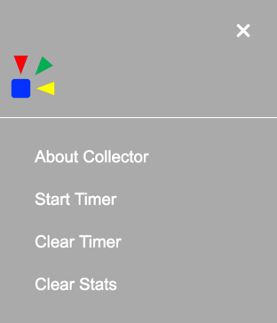
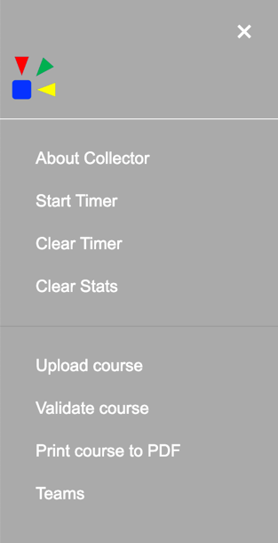
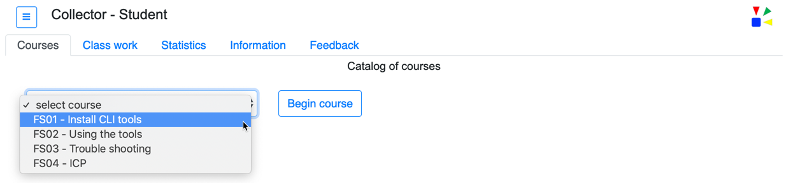

# Collector


docker build -t ibmicpcoc/collector:latest .
docker run --rm -p 3000:3000 -e APP_NAMESPACE=test ibmicpcoc/collector:latest

ibmcloud cr login

docker tag ibmicpcoc/collector:latest registry.eu-gb.bluemix.net/niklaushirt/collector:0.1
docker push registry.eu-gb.bluemix.net/niklaushirt/collector:0.1
ibmcloud cr image-list


docker tag ibmicpcoc/collector:latest de.icr.io/niklaushirt/collector:course0.2
docker push de.icr.io/niklaushirt/collector:0course0.2
ibmcloud cr image-list


docker tag ibmicpcoc/collector:latest niklaushirt/collector:course0.3
docker push niklaushirt/collector:course0.3
ibmcloud cr image-list


ibmcloud login -a https://cloud.ibm.com --sso
ibmcloud ks region-set eu-central
ibmcloud ks cluster-config mycluster
export KUBECONFIG=/Users/$USER/.bluemix/plugins/container-service/clusters/mycluster/kube-config-fra02-mycluster.yml


kubectl delete -f k8s_deployment_course/

kubectl apply -f k8s_deployment_course/
---

Collector is an application developed to assist with enablement and training.  One or more courses can be taught or presented via the user interface. The user interface is browser based and provides two personas, instructor and student.  A series of tabs categorize the actions the user is able to perform.  The student and instructor personas are provided with a core set of common capabilties.  While the instructor persona is provided with additional capabilties that assist with course creation, validation, printing, and usage insights of student interaction. 

----

### Student and Instuctor tabs and menus

The following section provides brief descriptions an images of the student and instructor tabs and menu options.  


#### Student tabs

The student is provided with the following tabs:

1. __Courses__ - A drop-down menu of available courses with a 'Begin Course' button.
2. __Class work__ - This is where the course content is presented.  
3. __Statistics__ - Provides a tracking of the current completed course work.
4. __Information__ - Information that may be helpful in the completion of the course is provided on this tab.
5. __Feedback__ - Provides the ability to submit feedback.  


#### Student menu


The instructor is provided with the following additional menu options:

1. __About Collector__ - About information for Collector.
2. __Start Timer__ - Set and start a timer.
3. __Clear Timer__ - Clear and reset the timer display information.
4. __Clear Stats__ - Reset the information that is shown on the Statistics tab.


--

#### Instructor tabs

The instructor is provided with the same tabs as the student plus the __Insights__ tab.  This tab provides a graphical view of the student interactions with each course.


--

#### Instructor menu

The instructor is provided with the same menu options as the student plus the following additional options:

1. __Upload course__ - Add a course to the existing course catalog instance via a drag-n-drop interface.
2. __Validate course__ - Validate the course to help ensure it will be processed properly within the instruction process of Collector.
3. __Print course to PDF__ - Create a PDF file of the course content.
4. __Teams__ - View the defined team (or) students names and colors that are used when displaying statistics.





----

### User interface tabs

#### Courses tab

The initial screen once started will display the __Courses__ tab.  From this tab select the drop down that contains the list of available courses.  



> Refer the the __Configuration__ section of this documentation for information on making courses available in this drop down menu.

<br>

Once a course is selected, if defined, a brief description of the course is shown below the drop down list.  This description will contain the content as defined by the course author. To start the course press the _Begin Course_ button .  

Example of selected course with description shown. 


> Refer the the __Course authoring__ section of this documentation for detailed information on creating courses.


Once the course has been started the __Class work__ tab will be shown.  This tab will also have adrop down menu of the available work to be performed for this course.  This drop down is dynamic and will change based on the course selected.  The content for the work items are defined by the course author.  

#### Class work tab - course work UI

The course author defines what content will be shown.  As each work item is selected the UI will change based on the course content.  These changes includes the number of sections, number of buttons, an if a _Complete_ button is defined.  When a number and/or capital letter is referenced in the following documentation refer to the matching _red_ numnber or letter in the image below.

* When the work item is selected, number 1, the pale blue section, letter A, will be shown.  This base section is required and will always be shown when a work item is selected. 

* Buttons number 2 and 3 and setions B and C are optional.

* When button number 2 is defined and it is pressed the pale green section, letter B, will be shown.

* When button number 3 is defined and it is pressed the pale orange section, letter C, will be shown.

* Letter D, the complete button, is optional and can be defined to display in one or more of the lettered sections.  If defined, when pressed this button records the completion of the work item.  The completion information is tracked on the __Statistics__ tab.


#### Statistics tab

The statistics tab will display the progress of the course work.  The number of _red circle_ and _green checkmarks_ is dynamic.  The number of red circle is defined by the course author when creating the course content.  The number of _green checkmarks_ shown is controlled by the number of completed work items.  Completed work items can be created by defining the _complete_ button or by using the auto complete feature.  

> Refer to the Auto complete section of the documentation for details on how to use this feature.


<br><br>

----
## Course authoring


The course content used within Collector is created using Markdown.  Markdown is a lightweight markup language with plain text formatting syntax. Its design allows it to be converted to many output formats.  

The Collector UI (user interface) will display the rendered markdown using two primary tabs __Courses__ and __Class work__.  Multiple courses can be available in the drop down of the __Courses__ tab.   

Each course shown in the drop down is a seperate markdown file that is parssed and rendered when Collector is started.  

Select a course from the frop down and press the button labeled _"Begin course"_.  


----

Once a course is selected and the "Begin course" button has been pressed the title of the course will be shown in the top header line of the UI.  In the following screen shot the FS01 - Install CLI tools course was selected from the drop down.  The pressing of the button will also cause the UI to switch to the __Class work__ tab.  This tab also has a drop down that is comprised of the work that is available for the course.  As shown in the following image there are three work items for the __FS01 - Install CLI tools__ course.  


----

When a course work item is selected from the drop down the UI will provide the detail work instructions.  A course work item labeled __Topic Example__ was selected.

The initial work instructions are shown with a pale blue background display area, label: __A__.  Two optional an additional sets of work instructions can also be displayed.  These are areas labeled: __B__ pale green background, and labeled: __C__ pale orange background.  

The two optional work instructions areas are displayed by pressing the associated green button labeled: __2__ and the orange button labeled: __3__.  The buttons to display the associated work areas may not initially show when the work item is selected.  The course author can define a time delay before the button is shown.  Defining this time delay and the label for the button is described in a later section of this document titled, _Course parameters_. 

The following images, Course content (rendered) and Course content (markdown) are for the course titled: __Collector course content examples__.  

### Course content (rendered) 


### Course content (markdown) 

The course content that was used to create the above rendered view is shown in the following image.  The red labeled items of both images attempt to demonstrate what source was used to create the rendered output.  

Example:  Source line number 7, __:button3_label: Answer__ is what was used to define the rendered orange "Answer" button (red number three in both images).  The lines 1 through 9 define the parameters needed for this course.  Details regarding the parameters are described in a later section of this document titled, _Course parameters_. 


### Manual completion of class work

Within the markdown for the course a manual completion button can be inserted (shown below).  This button allows the student to indicate the work is completed.  This is identifed in the above images as the item with red number four. 


----

### Course parameters

Collector course content requires parameters that provide configuration and runtime information.  The following table provides an overview of the parameters and a brief description.  

```
NOTICE: All keywords start an end with colon ":".  These beginning and ending colons are REQUIRED.  
```

When defing the parameter use one or more spaces the separate the parameter key from the parameter value. 

| Parameter | Description | Default |
| :--- | :--- | :--- |
| :course_desc:| A brief course description that will be shown in the __Courses__ tab UI when a course is selected from the drop down. | Learning provided by IBM |
| :course_title: | A brief course title that is shown in the __Courses__ tab UI drop down.  This title is what is selected to show the course description. | Student course |
| :course_max: | A numeric value that defines the maximum number of Completed Work items shown in the __Statistics__ tab of the UI. | 10 |
| :course_auto: | Controls if the course is using auto completion reporting.  Valid values are: yes (or) no | no |
| :course&#95;auto&#95;links: | If using automated completion (parameter :course_auto: = yes) this parameter defines how to track completion events.  Detail information for configuring this parameter is discussed later in this document.| n/a |
| :button1_label: | A text value that defines the H4 (####) work segment 1.  This value is used in the drop down list of the __Course work__ tab in the UI.  Detailed information for this parameter is provided later in this document. | Question |
| :button2_label: | A text value that defines the H4 (####) work segment 2.  The text value that is shown for "Button 2" in the __Class work__ UI tab. | Hint |
| :button2_delay: | A numeric value that defines the number of milliseconds to delay the displaying of "Button 2". | 5000 |
| :button3_label: | A text value that defines the H4 (####) work segment 3.  The text value that is shown for "Button 3" in the __Class work__ UI tab. | Answer |
| :button3_delay: | A numeric value that defines the number of milliseconds to delay the displaying of "Button 3". | 15000 | 
| :infotab: | Provides the ability to define the content that will be shown on the __Information__ tab of the UI.  Details and examples of this parameter are provide later in this document. | n/a |


The following provides two example course definitions.  Example one has a maximum of 3 units of class work, no auto completion

The second example is defined with auto completion and Button 3 delay of 30 seconds.  


### Example 1

```
:course_title: FS01 - Install CLI tools
:course_desc: This course provides the student with the necessary steps to install the required CLIs (command line interface) tools needed to complete the additional courses. <br><br>If the any of CLI tools are already installed it is recommended the student should update them to the latest verison.  
:course_max: 3
:course_auto: no

:button1_label: Task
:button2_label: Hint
:button3_label: Complete

:infotab: <hr>
:infotab: <h5>Example debug flow:</h5>
:infotab: 


```

### Example 2

```
:course_title: FS03 - Trouble shooting
:course_desc: This course provides the student with the opportunity to trouble shoot multiple problems regarding containers, security, yaml, networking, resources, etc. <br><br>The first lab the student will deploy a new pod to gain an understanding of the process.  All other labs will use the approach of having the team/student research exisitng pods, diagnose the issue, and then resolve the issue.  <br><br>Once the issue is successfully resolved the running container will report the completion of the lab.  No manual process is needed to indicate completion of the lab.
:course_auto: yes
:course_auto_links: house=Create,baker=Syntax,carbon=Resources,doors=Images,avail=Security,eagle=Networking,floor=Running,gonzo=Starting
:course_max: 8

:button1_label: Lab
:button2_label: Hint
:button3_label: Step-by-Step
:button3_delay: 30000

:infotab: <br><a href="https://github.com/IBM-ICP-CoC/faststart-eu/blob/master/documents/M4ICP001-fast-start-2019.pptx"  target="_blank">Presentation - Powerpoint document </a>
:infotab: <br><a href="https://github.com/IBM-ICP-CoC/faststart-eu/blob/master/documents/M4ICP001-fast-start-2019.pdf"  target="_blank">Presentation - PDF document </a>


```

<br><br>

----
## Configuration


<br><br>

----
### Maintainer

IBM ICP CoC
<br>

### License


Copyright &#x00A9; 2019 IBM®

<br>

Permission is hereby granted, free of charge, to any person obtaining a copy of this software and associated documentation files (the
"Software"), to deal in the Software without restriction, including without limitation the rights to use, copy, modify, merge, publish,
distribute, sublicense, and/or sell copies of the Software, and to permit persons to whom the Software is furnished to do so, subject to
the following conditions:

<br>

The above copyright notice and this permission notice shall be included in all copies or substantial portions of the Software.

<br>

THE SOFTWARE IS PROVIDED "AS IS", WITHOUT WARRANTY OF ANY KIND, EXPRESS OR IMPLIED, INCLUDING BUT NOT LIMITED TO THE WARRANTIES OF
MERCHANTABILITY, FITNESS FOR A PARTICULAR PURPOSE AND NONINFRINGEMENT. IN NO EVENT SHALL THE AUTHORS OR COPYRIGHT HOLDERS BE
LIABLE FOR ANY CLAIM, DAMAGES OR OTHER LIABILITY, WHETHER IN AN ACTION OF CONTRACT, TORT OR OTHERWISE, ARISING FROM, OUT OF OR IN CONNECTION
WITH THE SOFTWARE OR THE USE OR OTHER DEALINGS IN THE SOFTWARE.


