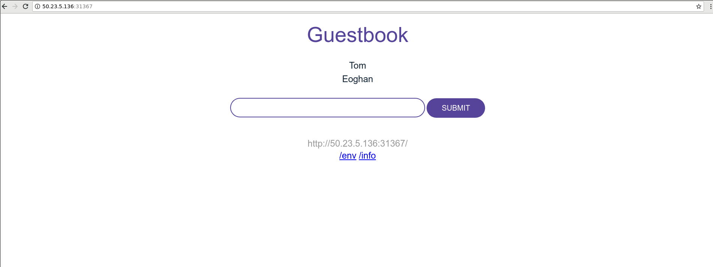

:course_title: KUBADV03 Helm

:course_desc: This course provides the student with the necessary steps to get a basic understanding of Helm.  

:course_max: 9

:course_auto: no

:button1_label: Task

:button2_label: Hint

:button2_delay: 9999999

:button3_label: Complete

:button3_delay: 10000


:infotab: <h1 id="toc_0">Tips and Tricks for getting around in the labs</h1>
:infotab: 
:infotab: <h2 id="toc_1">Mac Tips</h2>
:infotab: 
:infotab: <h3 id="toc_2">Opening Terminal</h3>
:infotab: 
:infotab: <p>In order to rapidly open the terminal application, hit CMD - SPACE and type terminal.</p>
:infotab: 
:infotab: <p></p>
:infotab: <HR>
:infotab: <h2 id="toc_3">Kubernetes Tips</h2>
:infotab: 
:infotab: <h3 id="toc_4">Pod Logs</h3>
:infotab: 
:infotab: <p>You can look at the logs of any of the pods running under your deployments as follows</p>
:infotab: 
:infotab: <div><pre><code class="language-console">$ kubectl logs &lt;podname&gt;</code></pre></div>
:infotab: 
:infotab: <p>Remember that if you have multiple containers running in your pod, you
:infotab: have to specify the specific container you want to see logs from.</p>
:infotab: 
:infotab: <div><pre><code class="language-console">$ kubectl logs &lt;pod-name&gt; &lt;container-name&gt;</code></pre></div>
:infotab: 
:infotab: <p>This subcommand operates like <code>tail</code>. Including the <code>-f</code> flag will
:infotab: continue to stream the logs live once the current time is reached.</p>
:infotab: 
:infotab: <h3 id="toc_5">kubectl edit and vi</h3>
:infotab: 
:infotab: <p>By default, on many Linux and macOS systems, you will be dropped into the editor <code>vi</code>.
:infotab: If you end up in vi you can quit by typing <code>ESC :q!</code></p>
:infotab: 
:infotab: <p>IF you prefer using nano as an editor, execute </p>
:infotab: 
:infotab: <div><pre><code class="language-none">export EDITOR=nano</code></pre></div>
:infotab: 
:infotab: <p>On Windows, a copy of <code>notepad.exe</code> will be opened with the contents of the file.</p>
:infotab: 
:infotab: <h3 id="toc_6">nano basic commands</h3>
:infotab: 
:infotab: <div><pre><code class="language-none">Ctrl-O      To save your work (WriteOut)
:infotab: <BR>Ctrl-X      To exit nano
:infotab: <BR>Ctrl-W      To search for text in a document
:infotab: <BR>Ctrl-K      To cut a line of text</code></pre></div>
:infotab: 
:infotab: <h3 id="toc_7">busybox pod</h3>
:infotab: 
:infotab: <p>For debugging live, this command frequently helps me:</p>
:infotab: 
:infotab: <div><pre><code class="language-console">kubectl run bb --image busybox --restart=Never -it --rm</code></pre></div>
:infotab: 
:infotab: <p>In the busybox image is a basic shell that contains useful utilities.</p>
:infotab: 
:infotab: <p>Utils I often use are <code>nslookup</code> and <code>wget</code>. </p>
:infotab: 
:infotab: <p><code>nslookup</code> is useful for testing DNS resolution in a pod.</p>
:infotab: 
:infotab: <p><code>wget</code> is useful for trying to do network requests.</p>
:infotab: 
:infotab: <h3 id="toc_8">Service Endpoints</h3>
:infotab: 
:infotab: <p>Endpoint resource can be used to see all the service endpoints.</p>
:infotab: 
:infotab: <div><pre><code class="language-console">$ kubectl get endpoints &lt;service&gt;</code></pre></div>
:infotab: 
:infotab: <h3 id="toc_9">ImagePullPolicy</h3>
:infotab: 
:infotab: <p>By default Kubernetes will only pull the image on first use. This can
:infotab: be confusing during development when you expect changes to show up.</p>
:infotab: 
:infotab: <p>You should be aware of the three <code>ImagePullPolicy</code>:</p>
:infotab: 
:infotab: <ul>
:infotab: <li>IfNotPresent - the default, only request the image if not present.</li>
:infotab: <li>Always - always request the image.</li>
:infotab: <li>Never</li>
:infotab: </ul>
:infotab: 
:infotab: <p>More details on image management may be <a href="https://kubernetes.io/docs/concepts/containers/images/">found here</a>.</p>


----
#### Task Introduction

----
# Why Helm?

[Helm](https://docs.helm.sh/) is often described as the Kubernetes application package manager. So, what does Helm give you over using kubectl directly?

# Objectives

These labs provide an insight on the advantages of using Helm over using Kubernetes directly through `kubectl`. When you complete all the labs, you'll:

* Understand the core concepts of Helm
* Understand the advantages of deployment using Helm over Kubernetes directly, looking at:
  * Application management
  * Updates
  * Configuration
  * Revision management
  * Repositories and chart sharing

# Prerequisites

* Have a running Kubernetes cluster.	

# Helm Overview

Helm is a tool that streamlines installation and management of Kubernetes applications. It uses a packaging format called "charts", which are a collection of files that describe Kubernetes resources. It can run anywhere (laptop, CI/CD, etc.) and is available for various operating systems, like OSX, Linux and Windows.


It has a client-server architecture with the client called `helm` and the server called `Tiller`. The client is a CLI which users interact with to perform different operations like install/upgrade/delete etc. The client interacts with Tiller and the chart repository. Tiller interacts with the Kubernetes API server. It renders Helm template files into Kubernetes manifest files which it uses to perform operations on the Kubernetes cluster via the Kubernetes API. See the [Helm Architecture](https://docs.helm.sh/architecture/) for more details. 

A [chart](https://docs.helm.sh/developing_charts) is organized as a collection of files inside of a directory where the directory name is the name of the chart. It contains template YAML files which facilitates providing configuration values at runtime and eliminates the need of modifying YAML files. These templates provide programming logic as they are based on the [Go template language](https://golang.org/pkg/text/template/), functions from the [Sprig lib](https://github.com/Masterminds/sprig) and other [specialized functions](https://docs.helm.sh/developing_charts/#chart-development-tips-and-tricks).

The chart repository is a location where packaged charts can be stored and shared. This is akin to the image repository in Docker. Refer to [The Chart Repository Guide](https://github.com/helm/helm/blob/master/docs/chart_repository.md) for more details.

# Helm Abstractions

Helm terms :

* Chart - It contains all of the resource definitions necessary to run an application, tool, or service inside of a Kubernetes cluster. A chart is basically a package of pre-configured Kubernetes resources.
* Config - Contains configuration information that can be merged into a packaged chart to create a releasable object.
* helm - Helm client. Communicates to Tiller through the Helm API - [HAPI](https://docs.helm.sh/developers/#the-helm-api-hapi) which uses [gRPC](https://grpc.io/).
* Release - An instance of a chart running in a Kubernetes cluster.
* Repository - Place where charts reside and can be shared with others.
* Tiller - Helm server. It interacts directly with the [Kubernetes API](https://kubernetes.io/docs/concepts/overview/kubernetes-api/) server to install, upgrade, query, and remove Kubernetes resources.


### Workshop

* Lab 1 - Download the Sample Application
* Lab 2 - Make sure minikube is running
* Lab 3 - Installing Helm
* Lab 4 - I just want to deploy
* Lab 5 - I need to change but want none of the hassle
* Lab 6 - Keeping track of the deployed application
* Lab 7 - I like sharing
* Lab 8 - What about my own Apps?


----


#### Hint Introduction

No hint available


#### Complete Introduction

> Confirm Introduction complete


----
#### Task Get Source Code

----

# Lab 1 - Download the Workshop Source Code
Repo `guestbook` has the application that we'll be deploying.
While we're not going to build it we will use the deployment configuration files from that repo.
Guestbook application has two versions v1 and v2 which we will use to demonstrate some rollout
functionality later. All the configuration files we use are under the directory guestbook/v1.


```
$ git clone https://github.com/niklaushirt/helm101.git
```

#### Hint Get Source Code 

No hint available


#### Complete Get Source Code 

> Confirm Check Minikube complete


#### Task minikube

---

# Lab 2 - Minikube


## Make sure minikube is running 


* Verify that minikube is running
	If not please complete KUB01 Lab Setup


	```
	$ minikube status
	
	host: Running
	kubelet: Running
	apiserver: Running
	kubectl: Correctly Configured: pointing to minikube-vm at 192.168.99.100
	```
	
* Verify kubectl can communicate with your cluster.

	```
	$ kubectl get nodes
	
	NAME       STATUS    ROLES     AGE       VERSION
	minikube   Ready     master    32m       v1.14.1
	```


## Enable Kubernetes Dashboard

```
$ minikube dashboard                                                                                              

🔌  Enabling dashboard ...
🤔  Verifying dashboard health ...
🚀  Launching proxy ...
🤔  Verifying proxy health ...
🎉  Opening http://127.0.0.1:58935/api/v1/namespaces/kube-system/services/http:kubernetes-dashboard:/proxy/ in your default browser...
```


After a while the Kubernetes Dashboard will open

	
	
## Getting to know minikube

### What is Minikube?

Minikube is an open source tool that enables you to run Kubernetes on your laptop or other local machine. It can work with Linux, Mac, and Windows operating systems. It runs a single-node cluster inside a virtual machine on your local machine.


minikube runs the official stable release of Kubernetes, with support for standard Kubernetes features like:

* LoadBalancer - using `minikube tunnel`
* Multi-cluster - using `minikube start -p <name>`
* NodePorts - using `minikube service`
* Persistent Volumes
* Ingress
* RBAC
* Dashboard - `minikube dashboard`
* Container runtimes
* Configure apiserver and kubelet options via command-line flags
* Addons - a marketplace for developers to share configurations for running services on minikube

### Useful commands

Start a cluster by running:

`minikube start`

Access Kubernetes Dashboard within Minikube:

`minikube dashboard`

Open this exposed endpoint in your browser:

`minikube service hello-minikube`

Start a second local cluster:

`minikube start -p cluster2`

Stop your local cluster:

`minikube stop`

Delete your local cluster:

`minikube delete`


#### Hint minikube

No hint available


#### Complete minikube

> Confirm minikube complete


#### Task Installing Helm

----

# Lab 3 - Installing Helm

There are two parts to installing Helm: the client (helm) and the server (Tiller). Helm can be installed from source or pre-built binary releases. In this lab, we are going to use the pre-built binary release (Linux amd64) from the Helm community. Refer to the [Helm install docs](https://docs.helm.sh/using_helm/#install-helm) for more details. 


### Installing the Helm Client (helm)

1. Install the [latest release Helm](https://github.com/helm/helm/releases) for your environment, either manually or by typing:

	```
	$ curl -L https://git.io/get_helm.sh | bash
	```

4. The Helm client is now installed and can be tested with the command, `helm help`. Refer to the doc [installing Client](https://docs.helm.sh/using_helm/#installing-the-helm-client) for more details.

### Installing the Helm Server (Tiller)

1. Run the command: 

	```
	$ helm init
	```
	
	This will initialize the Helm CLI and also install Tiller into the Kubernetes cluster under the `tiller-namespace`.

2. You can verify that the client and server are installed correctly by running the command, `helm version`. This should return both the client and server versions. Refer to the doc [installing Tiller](https://docs.helm.sh/using_helm/#installing-tiller) for more details.

### Conclusion

You are now ready to start using Helm.


#### Hint Installing Helm

No hint available


#### Complete Installing Helm

> Confirm Installing Helm complete


#### Task JustDeploy

----


# Lab 4 - I just want to deploy!

Let's investigate how Helm can help us focus on other things by letting a chart do the work for us. We'll first deploy an application to a Kubernetes cluster by using `kubectl` and then show how we can offload the work to a chart by deploying the same app with Helm.

The application is the [Guestbook App](https://github.com/niklaushirt/guestbook), which is a sample multi-tier web application.

# Deploy the application using `kubectl`

In this part of the lab, we will deploy the application using the Kubernetes client `kubectl`. We will use [Version 1](https://github.com/v/guestbook/tree/master/v1) of the app for deploying here. If not yet done, clone the [Guestbook App](https://github.com/niklaushirt/guestbook) repo to get the files: 
```$ git clone https://github.com/niklaushirt/guestbook.git``` .

1. Use the configuration files in the cloned Git repository to deploy the containers and create services for them by using the following commands:

   ```
   $ cd guestbook/v1

   $ kubectl create -f redis-master-deployment.yaml
   deployment.apps/redis-master created

   $ kubectl create -f redis-master-service.yaml
   service/redis-master created

   $ kubectl create -f redis-slave-deployment.yaml
   deployment.apps/redis-slave created

   $ kubectl create -f redis-slave-service.yaml
   service/redis-slave created

   $ kubectl create -f guestbook-deployment.yaml
   deployment.apps/guestbook-v1 created

   $ kubectl create -f guestbook-service.yaml
   service/guestbook created
   ```
   Refer to the [guestbook README](https://github.com/niklaushirt/guestbook) for more details.
 
2. View the guestbook:

   You can now play with the guestbook that you just created by opening it in a browser (it might take a few moments for the guestbook to come up).


	To view the guestbook on a remote host, locate the external port of the load balancer in the **PORTS** columns of the `$ kubectl get services` output. 
	
	       ```
	       $ kubectl get services
	       NAME           TYPE           CLUSTER-IP       EXTERNAL-IP   PORT(S)          AGE
	       guestbook      LoadBalancer   172.21.252.107   50.23.5.136   3000:31838/TCP   14m
	       redis-master   ClusterIP      172.21.97.222    <none>        6379/TCP         14m
	       redis-slave    ClusterIP      172.21.43.70     <none>        6379/TCP         14m
	       .........
	       ```
	
	You can open the demo app by navigating to http://192.168.99.100: 31838
	
	* replace 192.168.99.100 with the address of your cluster
	* replace the port number with the one from the Service created (here it is 31838)
	
	You should see the guestbook now displaying in your browser:

       

# Deploy the application using Helm

In this part of the lab, we will deploy the application by using Helm. We will set a release name of `guestbook-demo` to distinguish it from the previous deployment. 

A chart is defined as a collection of files that describe a related set of Kubernetes resources. 

We probably then should take a look at the the files before we go and install the chart. The files for the `guestbook` chart are as follows:

* Chart.yaml: A YAML file containing information about the chart.
* LICENSE: A plain text file containing the license for the chart.
* README.md: A README providing information about the chart usage, configuration, installation etc.
* templates: A directory of templates that will generate valid Kubernetes manifest files when combined with values.yaml. Files contained are as follows:
   * \_helper.tpl: Template helpers/definitions that are re-used throughout the chart.
   * NOTES.txt: A plain text file containing short usage notes about how to access the app post install.
   * guestbook-deployment.yaml: Guestbook app container resource.
   * guestbook-service.yaml: Guestbook app service resource.
   * redis-master-deployment.yaml: Redis master container resource.
   * redis-master-service.yaml: Redis master service resource.
   * redis-slave-deployment.yaml: Redis slave container resource.
   * redis-slave-service.yaml: Redis slave service resource.
* values.yaml: The default configuration values for the chart.

Note: The template files shown above will be rendered into Kubernetes manifest files by Tiller before being passed to the Kubernetes API server. Therefore, they map to the manifest files that we deployed when we used `kubectl` (minus the helper and notes files). 

Let's go ahead and install the chart now.

1. Install the app as a Helm chart:

    ```$ helm install ./guestbook/ --name guestbook-demo --namespace helm-demo```
    
    Note: `$ helm install` command will create the `helm-demo` namespace if it does not exist.
    
    You should see output similar to the following:
    
    ```
    NAME:   guestbook-demo
    LAST DEPLOYED: Fri Sep 21 14:26:01 2018
    NAMESPACE: helm-demo
    STATUS: DEPLOYED
    
    RESOURCES:
    ==> v1/Service
    NAME            AGE
    guestbook-demo  0s
    redis-master    0s
    redis-slave     0s
    
    ==> v1/Deployment
    guestbook-demo  0s
    redis-master    0s
    redis-slave     0s

    ==> v1/Pod(related)
    NAME                             READY  STATUS             RESTARTS  AGE
    guestbook-demo-5dccd68c88-hqlws  0/1    ContainerCreating  0         0s
    guestbook-demo-5dccd68c88-sdhcv  0/1    ContainerCreating  0         0s
    redis-master-5d8b66464f-g9q7m    0/1    ContainerCreating  0         0s
    redis-slave-586b4c847c-ct77m     0/1    ContainerCreating  0         0s
    redis-slave-586b4c847c-nrzwj     0/1    ContainerCreating  0         0s

    NOTES:
	    1. Get the application URL by running these commands:
	      NOTE: It may take a few minutes for the LoadBalancer IP to be available.
	            You can watch the status of by running 'kubectl get svc -w guestbook-demo --namespace helm-demo'
	      export SERVICE_IP=$(kubectl get svc --namespace helm-demo guestbook-demo -o jsonpath='{.status.loadBalancer.ingress[0].ip}')
	      echo http://$SERVICE_IP:3000
    ```
    
    The chart install performs the Kubernetes deployments and service creations of the redis master and slaves, and the guestbook app, as one. This is because the chart is a collection of files that describe a related set of Kubernetes resources and Helm manages the creation of these resources via the Kubernetes API.    
    
    To check the deployment, you can use 
    
    `$ kubectl get deployment guestbook-demo --namespace helm-demo`
    
    You should see output similar to the following:
    
    ```
    NAME             DESIRED   CURRENT   UP-TO-DATE   AVAILABLE   AGE
    guestbook-demo   2         2         2            2           51m
    ```
    
    To check the status of the running application, you can use 
    
    `$ kubectl get pods --namespace helm-demo`.
    
    ```
    NAME                            READY     STATUS    RESTARTS   AGE
    guestbook-demo-6c9cf8b9-jwbs9   1/1       Running   0          52m
    guestbook-demo-6c9cf8b9-qk4fb   1/1       Running   0          52m
    redis-master-5d8b66464f-j72jf   1/1       Running   0          52m
    redis-slave-586b4c847c-2xt99    1/1       Running   0          52m
    redis-slave-586b4c847c-q7rq5    1/1       Running   0          52m
    ```
   
    To check the services, you can run 
    
    `$ kubectl get services --namespace helm-demo`.
    
    ```
    NAME             TYPE           CLUSTER-IP       EXTERNAL-IP   PORT(S)          AGE
    guestbook-demo   LoadBalancer   172.21.43.244    <pending>     3000:31367/TCP   50m
    redis-master     ClusterIP      172.21.12.43     <none>        6379/TCP         50m
    redis-slave      ClusterIP      172.21.176.148   <none>        6379/TCP         50m
    ```
    
3. View the guestbook:

   You can now play with the guestbook that you just created by opening it in a browser (it might take a few moments for the guestbook to come up).

To view the guestbook on a remote host, locate the external port of the load balancer in the **PORTS** columns of the `$ kubectl get services` output. 
	
	       ```
	       $ kubectl get services
	       NAME           TYPE           CLUSTER-IP       EXTERNAL-IP   PORT(S)          AGE
	       guestbook      LoadBalancer   172.21.252.107   50.23.5.136   3000:31838/TCP   14m
	       redis-master   ClusterIP      172.21.97.222    <none>        6379/TCP         14m
	       redis-slave    ClusterIP      172.21.43.70     <none>        6379/TCP         14m
	       .........
	       ```
	
You can open the demo app by navigating to http://192.168.99.100: 31838
	
* replace 192.168.99.100 with the address of your cluster
* replace the port number with the one from the Service created (here it is 31838)
	
You should see the guestbook now displaying in your browser:

   

# Conclusion

Congratulations, you have now deployed an application by using two different methods to Kubernetes! From this lab, you can see that using Helm required less commands and less to think about (by giving it the chart path and not the individual files) versus using `kubectl`. Helm's application management provides the user with this simplicity.


#### Hint JustDeploy

No hint available


#### Complete JustDeploy

> Confirm Just Deploy complete

#### Task JustChange

----


# Lab 5 - I need to change but want none of the hassle

In Lab 4, we installed the guestbook sample app by using Helm and saw the benefits over using `kubectl`. You probably think that you're done and know enough to use Helm. But what about updates or improvements to the chart? How do you update your running app to pick up these changes? 

In this lab, we're going to look at how to update our running app when the chart has been changed. To demonstrate this, we're going to make changes to the original `guestbook` chart by:

* Removing the Redis slaves and using just the in-membory DB
* Changing the type from `LoadBalancer` to `NodePort`.

It seems contrived but the goal of this lab is to show you how to update your apps with Kubernetes and Helm. So, how easy is it to do this? Let's take a look below.

# Update the application using `kubectl`

In this part of the lab we will update the previously deployed application [Guestbook](https://github.com/niklaushirt/guestbook), using Kubernetes directly.

1. This is an optional step, that it is not necessary to update your running app. The reason for doing this step is "house keeping" - you want to have the correct files for the current configuration that you have deployed. This avoids making mistakes if you have future updates or even rollbacks. In this updated configuration, we remove the Redis slaves. That is why you should move/archive or remove the Redis slave files to keep abreast of the update:

   ```
   redis-slave-service.yaml
   redis-slave-deployment.yaml
   ```

2. Delete the Redis slave service and pods:

   ```
   $ kubectl delete svc redis-slave --namespace default
   service "redis-slave" deleted
   $ kubectl delete deployment redis-slave --namespace default
   deployment.extensions "redis-slave" deleted
   ```

3. Update the guestbook service from `LoadBalancer` to `NodePort` type:

   ```
   $ sed -i.bak 's/LoadBalancer/NodePort/g' guestbook-service.yaml
   ```

   Note: Like in Step 1, you may want to archive before making the changes.
   
4. Delete the guestbook service:
    
    ```
    $ kubectl delete svc guestbook --namespace default
    ```
    
5. Re-create the service with `NodePort` type:

    ```
    $ kubectl create -f guestbook-service.yaml
    ```
    
6. To check the updates, you can run ```$ kubectl get all --namespace default```:
    
    ```
    NAME                                READY     STATUS    RESTARTS   AGE
    pod/guestbook-v1-7fc76dc46-9r4s7    1/1       Running   0          1h
    pod/guestbook-v1-7fc76dc46-hspnk    1/1       Running   0          1h
    pod/guestbook-v1-7fc76dc46-sxzkt    1/1       Running   0          1h
    pod/redis-master-5d8b66464f-pvbl9   1/1       Running   0          1h
    
    NAME                   TYPE        CLUSTER-IP      EXTERNAL-IP   PORT(S)          AGE
    service/guestbook      NodePort    172.21.45.29    <none>        3000:31989/TCP   31s
    service/kubernetes     ClusterIP   172.21.0.1      <none>        443/TCP          9d
    service/redis-master   ClusterIP   172.21.232.61   <none>        6379/TCP         1h
    
    NAME                           DESIRED   CURRENT   UP-TO-DATE   AVAILABLE   AGE
    deployment.apps/guestbook-v1   3         3         3            3           1h
    deployment.apps/redis-master   1         1         1            1           1h
    
    NAME                                      DESIRED   CURRENT   READY     AGE
    replicaset.apps/guestbook-v1-7fc76dc46    3         3         3         1h
    replicaset.apps/redis-master-5d8b66464f   1         1         1         1h
    ```
    Note: The service type has changed (to `NodePort`) and a new port has been allocated (`31989` in this output case) to the guestbook 
    service. All `redis-slave` resources have been removed.

5. View the guestbook as per Lab4, using the updated port for the guestbook service.
   
# Update the application using Helm

In this section, we'll update the previously deployed `guestbook-demo` application by using Helm.

Before we start, let's take a few minutes to see how Helm simplifies the process compared to using Kubernetes directly. Helm's use of a [template language](https://docs.helm.sh/chart_template_guide/) provides great flexibility and power to chart authors, which removes the complexity to the chart user. In the guestbook example, we'll use the following capabilities of templating:

* Values: An object that provides access to the values passed into the chart. An example of this is in `guestbook-service`, which contains the line `type: {{ .Values.service.type }}`. This line provides the capability to set the service type during an upgrade or install.
* Control structures: Also called “actions” in template parlance, control structures provide the template author with the ability to control the flow of a template’s generation. An example of this is in `redis-slave-service`, which contains the line `{{- if .Values.redis.slaveEnabled -}}`. This line allows us to enable/disable the REDIS master/slave during an upgrade or install.

The complete `redis-slave-service.yaml` file shown below, demonstrates how the file becomes redundant when the `slaveEnabled` flag is disabled and also how the port value is set. There are more examples of templating functionality in the other chart files. 

```
{{- if .Values.redis.slaveEnabled -}}
apiVersion: v1
kind: Service
metadata:
  name: redis-slave
  labels:
    app: redis
    role: slave
spec:
  ports:
  - port: {{ .Values.redis.port }}
    targetPort: redis-server
  selector:
    app: redis
    role: slave
{{- end }}
```

Enough talking about the theory. Now let's give it a go!

1. Update the application:

    ```$ helm upgrade guestbook-demo ./guestbook --set redis.slaveEnabled=false,service.type=NodePort --namespace helm-demo```
    
    A Helm upgrade takes an existing release and upgrades it according to the information you provide. You should see output similar to the following:
    
    ```
    Release "guestbook-demo" has been upgraded. Happy Helming!
    LAST DEPLOYED: Mon Sep 24 10:36:18 2018
    NAMESPACE: helm-demo
    STATUS: DEPLOYED
    
    RESOURCES:
    ==> v1/Service
    NAME            AGE
    guestbook-demo  1h
    redis-master    1h
    
    ==> v1/Deployment
    guestbook-demo  1h
    redis-master    1h
    
    ==> v1/Pod(related)
    
    NAME                           READY  STATUS   RESTARTS  AGE
    guestbook-demo-6c9cf8b9-dhqk9  1/1    Running  0         1h
    guestbook-demo-6c9cf8b9-zddn2  1/1    Running  0         1h
    redis-master-5d8b66464f-g7sh6  1/1    Running  0         1h
    
    
    NOTES:
    1. Get the application URL by running these commands:
      export NODE_PORT=$(kubectl get --namespace helm-demo -o jsonpath="{.spec.ports[0].nodePort}" services guestbook-demo)
      export NODE_IP=$(kubectl get nodes --namespace helm-demo -o jsonpath="{.items[0].status.addresses[0].address}")
      echo http://$NODE_IP:$NODE_PORT
    ```
    
    The `upgrade` command upgrades the app to a specified version of a chart, removes the `redis-slave` resources, and updates the app `service.type` to `NodePort`.
        
    To check the updates, you can run ```$ kubectl get all --namespace helm-demo```
    
    ```
    NAME                                READY     STATUS    RESTARTS   AGE
    pod/guestbook-demo-6c9cf8b9-dhqk9   1/1       Running   0          1h
    pod/guestbook-demo-6c9cf8b9-zddn2   1/1       Running   0          1h
    pod/redis-master-5d8b66464f-g7sh6   1/1       Running   0          1h
    
    NAME                     TYPE        CLUSTER-IP      EXTERNAL-IP   PORT(S)          AGE
    service/guestbook-demo   NodePort    172.21.43.244   <none>        3000:31202/TCP   1h
    service/redis-master     ClusterIP   172.21.12.43    <none>        6379/TCP         1h
    
    NAME                             DESIRED   CURRENT   UP-TO-DATE   AVAILABLE   AGE
    deployment.apps/guestbook-demo   2         2         2            2           1h
    deployment.apps/redis-master     1         1         1            1           1h
    
    NAME                                      DESIRED   CURRENT   READY     AGE
    replicaset.apps/guestbook-demo-6c9cf8b9   2         2         2         1h
    replicaset.apps/redis-master-5d8b66464f   1         1         1         1h
    ```
    Note: The service type has changed (to `NodePort`) and a new port has been allocated (`31202` in this output case) to the guestbook service. All `redis-slave` resources have been removed.
    
2. View the guestbook as per Lab4, using the updated port for the guestbook service.

# Conclusion

Congratulations, you have now updated the applications! Helm does not require any manual changing of resources and is therefore so much easier to upgrade! All configurations can be set on the fly on the command line or by using override files. This is made possible from when the logic was added to the template files, which enables or disables the capability, depending on the flag set.


#### Hint JustChange

No hint available


#### Complete JustChange

> Confirm JustChange complete


#### Task KeepTrack

----


# Lab 6 - Keeping track of the deployed application

Let's say you deployed different release versions of your application (i.e., you upgraded the running application). How do you keep track of the versions and how can you do a rollback?

# Revision management using Kubernetes

In this part of the lab, we should illustrate revision management of `guestbook` by using Kubernetes directly, but we can't. This is because Kubernetes does not provide any support for revision management. The onus is on you to manage your systems and any updates or changes you make. However, we can use Helm to conduct revision management.

# Revision management using Helm

In this part of the lab, we illustrate revision management on the deployed application `guestbook-demo` by using Helm.

With Helm, every time an install, upgrade, or rollback happens, the revision number is incremented by 1. The first revision number is always 1. Helm persists release metadata in configmaps, stored in the Kubernetes cluster. Every time your release changes, it appends that to the existing data. This provides Helm with the capability to rollback to a previous release.

Let's see how this works in practice.

1. Check the number of deployments:

    ```
    $ helm history guestbook-demo
    ```
    
    You should see output similar to the following because we did an upgrade in Lab 5 after the initial install in Lab 4:
    
    ```
    REVISION	UPDATED                 	STATUS    	CHART          	DESCRIPTION
    1       	Mon Sep 24 08:54:04 2018	SUPERSEDED	guestbook-0.1.0	Install complete
    2       	Mon Sep 24 10:36:18 2018	DEPLOYED  	guestbook-0.1.0	Upgrade complete
    ```
        
2. Roll back to the previous revision:

    In this rollback, Helm checks the changes that occured when upgrading from the revision 1 to revision 2. This information enables it to makes the calls to the Kubernetes API server, to update the deployed application as per the initial deployment - in other words with Redis slaves and using a load balancer.

    Rollback with this command
    
    ```$ helm rollback guestbook-demo 1```
    
    ```
    Rollback was a success! Happy Helming!
    ```
    Check the history again, 
    
    `$ helm history guestbook-demo`
    
    You should see output similar to the following:
    
    ```
    REVISION	UPDATED                 	STATUS    	CHART          	DESCRIPTION     
    1       	Mon Sep 24 08:54:04 2018	SUPERSEDED	guestbook-0.1.0	Install complete
    2       	Mon Sep 24 10:36:18 2018	SUPERSEDED	guestbook-0.1.0	Upgrade complete
    3       	Mon Sep 24 11:59:18 2018	DEPLOYED  	guestbook-0.1.0	Rollback to 1
    ```
    
    To check the rollback, you can run 
    
    `$ kubectl get all --namespace helm-demo`:
    
    ```
    NAME                                READY     STATUS    RESTARTS   AGE
    pod/guestbook-demo-6c9cf8b9-dhqk9   1/1       Running   0          3h
    pod/guestbook-demo-6c9cf8b9-zddn2   1/1       Running   0          3h
    pod/redis-master-5d8b66464f-g7sh6   1/1       Running   0          3h
    pod/redis-slave-586b4c847c-tkfj5    1/1       Running   0          2m
    pod/redis-slave-586b4c847c-xxrdn    1/1       Running   0          2m
    
    NAME                     TYPE           CLUSTER-IP      EXTERNAL-IP   PORT(S)          AGE
    service/guestbook-demo   LoadBalancer   172.21.43.244   <pending>     3000:31202/TCP   3h
    service/redis-master     ClusterIP      172.21.12.43    <none>        6379/TCP         3h
    service/redis-slave      ClusterIP      172.21.232.16   <none>        6379/TCP         2m
    
    NAME                             DESIRED   CURRENT   UP-TO-DATE   AVAILABLE   AGE
    deployment.apps/guestbook-demo   2         2         2            2           3h
    deployment.apps/redis-master     1         1         1            1           3h
    deployment.apps/redis-slave      2         2         2            2           2m
    
    NAME                                      DESIRED   CURRENT   READY     AGE
    replicaset.apps/guestbook-demo-6c9cf8b9   2         2         2         3h
    replicaset.apps/redis-master-5d8b66464f   1         1         1         3h
    replicaset.apps/redis-slave-586b4c847c    2         2         2         2m
    ```
   
    You can see from the output that the Redis master/slave deployment has returned. 
    This shows a complete rollback from the upgrade in Lab 5.

# Conclusion

From this lab, we can say that Helm does revision management well and Kubernetes does not have the capability built in! You might be wondering why we need `helm rollback` when you could just re-run the `helm upgrade` from a previous version. And that's a good question. Technically, you should end up with the same resources (with same parameters) deployed. However, the advantage of using `helm rollback` is that helm manages (ie. remembers) all of the variations/parameters of the previous `helm install\upgrade` for you. Doing the rollback via a `helm upgrade` requires you (and your entire team) to manually track how the command was previously executed. That's not only tedious but very error prone. It is much easier, safer and reliable to let Helm manage all of that for you and all you need to do it tell it which previous version to go back to, and it does the rest.


#### Hint KeepTrack

No hint available


#### Complete KeepTrack

> Confirm KeepTrack complete


#### Task Share

----


# Lab 7 - I like sharing

A key aspect of providing an application means sharing with others. Sharing can be direct counsumption (by users or in CI/CD pipelines) or as a dependency for other charts. If people can't find your app then they can't use it.

A means of sharing is a chart repository, which is a location where packaged charts can be stored and shared. As the chart repository only applies to Helm, we will just look at the usage and storage of Helm charts.

# Using charts from a public repository

Helm charts can be available on a remote repository or in a local environment/repository. The remote repositories can be public like [Helm Charts](https://github.com/helm/charts) or [IBM Helm Charts](https://github.com/IBM/charts), or hosted repositories like on Google Cloud Storage or GitHub. Refer to [Helm Chart Repository Guide](https://github.com/helm/helm/blob/master/docs/chart_repository.md) for more details. 

In this part of the lab, we show you how to install the `guestbook` chart from the [Helm101 repo](https://github.com/niklaushirt/helm101/).

1. Check the repositories configured on your system:

   ```$ helm repo list```
   
   The output should be similar to the following:
   
   ```
   NAME  	URL                                             
   stable	https://kubernetes-charts.storage.googleapis.com
   local 	http://127.0.0.1:8879/charts                   
   ```
   
   Note: The Helm charts repository is installed by default with Helm. It is installed with the repositories `local` and `stable`. You can run the `local` repo using the [helm serve](https://github.com/helm/helm/blob/master/docs/helm/helm_serve.md) command. The `stable` repo is located at `https://kubernetes-charts.storage.googleapis.com/`.

2. Add `helm101` repo:

   ```$ helm repo add helm101 https://raw.githubusercontent.com/niklaushirt/helm101/master/```
   
   Should generate an output as follows:
   
   ```"helmm101" has been added to your repositories```
   
   You can also search your repositories for charts by running the following command, ```$ helm search helm101```:
   
   ```
   NAME             	CHART VERSION	APP VERSION	DESCRIPTION                                                 
   helm101/guestbook	0.1.0        	           	A Helm chart to deploy Guestbook three tier web application.
   ```
      
3. Install the chart

   As mentioned we are going to install the `guestbook` chart from the [Helm101 repo](https://github.com/niklaushirt/helm101). As the repo is installed in our local respoitory we can reference the chart using the `repo name/chart name`, in other words `helm101/guestbook`. This means we can install the chart like we did previously with the command:

   ```$ helm install helm101/guestbook --name guestbook-demo --namespace repo-demo```
   
   The output should be similar to the following:
   
   ```
   NAME:   guestbook-demo
   LAST DEPLOYED: Thu Dec 13 07:36:18 2018
   NAMESPACE: repo-demo
   STATUS: DEPLOYED
   
   RESOURCES:
   ==> v1/Service
   NAME                      TYPE          CLUSTER-IP     EXTERNAL-IP  PORT(S)         AGE
   guestbook-demo-guestbook  LoadBalancer  10.98.43.107   <pending>    3000:31241/TCP  2s
   redis-master              ClusterIP     10.103.16.208  <none>       6379/TCP        2s
   redis-slave               ClusterIP     10.99.249.122  <none>       6379/TCP        2s
   
   ==> v1/Deployment
   NAME                      READY  UP-TO-DATE  AVAILABLE  AGE
   guestbook-demo-guestbook  0/2    2           0          2s
   redis-master              0/1    1           0          2s
   redis-slave               0/2    2           0          2s
   
   ==> v1/Pod(related)
   NAME                                       READY  STATUS             RESTARTS  AGE
   guestbook-demo-guestbook-75f5f9cf84-jcbtb  0/1    Pending            0         2s
   guestbook-demo-guestbook-75f5f9cf84-lzsw4  0/1    ContainerCreating  0         2s
   redis-master-7b5cc58fc8-2bzw6              0/1    ContainerCreating  0         2s
   redis-slave-5db5dcfdfd-24249               0/1    ContainerCreating  0         2s
   redis-slave-5db5dcfdfd-nkcpt               0/1    ContainerCreating  0         1s
   
   
   NOTES:
   Get the application URL by running these commands:
   export NODE_PORT=$(kubectl get --namespace repo-demo -o jsonpath="{.spec.ports[0].nodePort}" services guestbook-demo-guestbook)
   export NODE_IP=$(kubectl get nodes -o jsonpath={.items[*].status.addresses[?\(@.type==\"ExternalIP\"\)].address})
   echo http://$NODE_IP:$NODE_PORT
   
   ```
   
   

   
   
# Conclusion

This lab provided you with a brief introduction to the Helm repositories to show how charts can be installed. The ability to share your chart means ease of use to both you and your consumers.


#### Hint Share

No hint available


#### Complete Share

> Confirm Share complete


#### Task Create Charts

----
# Lab 8 - What about my own Apps?

In this tutorial, you learn how to transform your web app to a Helm chart, which can be deployed on Kubernetes.


## Prerequisites

 
  1. You must have access to a Kubernetes Cluster.

## Estimated time

Completing this tutorial should take about 20-30 minutes.


## Prepare the Helm chart

``` 
$ helm create demo                                                   

Creating demo

$ cd demo

$ ls                                                    

-rw-r--r--  1 nhirt  staff   100 May  3 17:26 Chart.yaml
drwxr-xr-x  2 nhirt  staff    64 May  3 17:26 charts
drwxr-xr-x  7 nhirt  staff   224 May  3 17:26 templates
-rw-r--r--  1 nhirt  staff  1019 May  3 17:26 values.yaml
``` 


Find more details in the [Helm Documentation](https://helm.sh/docs/developing_charts/).


### Chart.yaml

A YAML file containing information about the chart

``` 
apiVersion: v1
appVersion: "1.0"
description: A Helm chart for Kubernetes
name: demo
version: 0.1.0
``` 
Every chart must have a version number. Packages in repositories are identified by name plus version.
For example, an nginx chart whose version field is set to version: 1.2.3 will be named:
`nginx-1.2.3.tgz`.


### values.yaml

The default configuration values for this chart.

Values that are supplied via a values.yaml file (or via the --set flag) are accessible from the .Values object in a template. But there are other pre-defined pieces of data you can access in your templates.

``` 
# Default values for demo.
# This is a YAML-formatted file.
# Declare variables to be passed into your templates.

replicaCount: 1

image:
  repository: nginx
  tag: stable
  pullPolicy: IfNotPresent

service:
  type: ClusterIP
  port: 80

ingress:
  enabled: false
  annotations: {}
    # kubernetes.io/ingress.class: nginx
    # kubernetes.io/tls-acme: "true"
  path: /
  hosts:
    - chart-example.local
  tls: []
  #  - secretName: chart-example-tls
  #    hosts:
  #      - chart-example.local

resources: {}
  # We usually recommend not to specify default resources and to leave this as a conscious
  # choice for the user. This also increases chances charts run on environments with little
  # resources, such as Minikube. If you do want to specify resources, uncomment the following
  # lines, adjust them as necessary, and remove the curly braces after 'resources:'.
  # limits:
  #  cpu: 100m
  #  memory: 128Mi
  # requests:
  #  cpu: 100m
  #  memory: 128Mi

nodeSelector: {}

tolerations: []

affinity: {}
``` 

**Predefined values**

The following values are pre-defined, are available to every template, and cannot be overridden. As with all values, the names are _case sensitive_.

  * `Release.Name`: The name of the release (not the chart)
  * `Release.Time`: The time the chart release was last updated. This will match the `Last Released` time on a Release object.
  * `Release.Namespace`: The namespace the chart was released to.
  * `Release.Service`: The service that conducted the release. Usually this is `Tiller`.
  * `Release.IsUpgrade`: This is set to true if the current operation is an upgrade or rollback.
  * `Release.IsInstall`: This is set to true if the current operation is an install.
  * `Release.Revision`: The revision number. It begins at 1, and increments with each `helm upgrade`.
  * `Chart`: The contents of the `Chart.yaml`. Thus, the chart version is obtainable as `Chart.Version` and the maintainers are in `Chart.Maintainers`.
  * `Files`: A map-like object containing all non-special files in the chart. This will not give you access to templates, but will give you access to additional files that are present (unless they are excluded using `.helmignore`). Files can be accessed using `{{index .Files "file.name"}}` or using the `{{.Files.Get name}}` or `{{.Files.GetString name}}` functions. You can also access the contents of the file as `[]byte` using `{{.Files.GetBytes}}`
  * `Capabilities`: A map-like object that contains information about the versions of Kubernetes (`{{.Capabilities.KubeVersion}}`, Tiller (`{{.Capabilities.TillerVersion}}`, and the supported Kubernetes API versions (`{{.Capabilities.APIVersions.Has "batch/v1"`)


### templates directory          

A directory of templates that, when combined with values, will generate valid Kubernetes manifest files.
All template files are stored in a chart’s templates/ folder. When Helm renders the charts, it will pass every file in that directory through the template engine.

Values for the templates are supplied two ways:

  * Chart developers may supply a file called `values.yaml` inside of a chart. This file can contain default values.
  * Chart users may supply a YAML file that contains values. This can be provided on the command line with `helm install`.


* Values: An object that provides access to the values passed into the chart. An example of this is in `guestbook-service`, which contains the line `type: {{ .Values.service.type }}`. This line provides the capability to set the service type during an upgrade or install.


**deployment.yaml**
```
apiVersion: v1
kind: Deployment
...
spec:
   template:
    spec:
      containers:
          image: "{{ .Values.image.repository }}:{{ .Values.image.tag }}"
```   
For example the value `{{ .Values.image.repository }}` will resolve to `nginx` coming out of the `values.yaml` file.

## Adapting the files

You can now add your own files and adapt the existing ones as needed.

As an example, open the `values.yaml `file and 

* change the `image.tag` from `stable` to `1.16`
* change the `service.type` from `ClusterIP` to `NodePort`
Then open the templates/service.yaml file

## Packaging charts
   
Helm charts can be packaged easily 
1. Check the repositories configured on your system:

   ```
   $ helm package demo
   Successfully packaged chart and saved it to: /Users/nhirt/TEMP/tmp/istio/demo-0.1.0.tgz
   ```
   


### Deploy helmchart 

You can now install your helm chart into your Kubernetes cluster by using 

```
$ helm install demo-0.1.0.tgz                                         master ?

NAME:   open-salamander
LAST DEPLOYED: Fri May  3 20:01:37 2019
NAMESPACE: default
STATUS: DEPLOYED

RESOURCES:
==> v1/Service
NAME                  TYPE      CLUSTER-IP    EXTERNAL-IP  PORT(S)       AGE
open-salamander-demo  NodePort  10.101.8.186  <none>       80:32093/TCP  0s

==> v1beta2/Deployment
NAME                  DESIRED  CURRENT  UP-TO-DATE  AVAILABLE  AGE
open-salamander-demo  1        1        1           0          0s

==> v1/Pod(related)
NAME                                   READY  STATUS             RESTARTS  AGE
open-salamander-demo-676f4dcd49-dv575  0/1    ContainerCreating  0         0s


NOTES:
1. Get the application URL by running these commands:
  export NODE_PORT=$(kubectl get --namespace default -o jsonpath="{.spec.ports[0].nodePort}" services open-salamander-demo)
  export NODE_IP=$(kubectl get nodes --namespace default -o jsonpath="{.items[0].status.addresses[0].address}")
  echo http://$NODE_IP:$NODE_PORT
```

You can open the demo app by navigating to http://192.168.99.100:32093

* replace 192.168.99.100 with the address of your cluster
* replace the port number with the one from the Service created (here it is 32093)

You should see the welcome page for the nginx server you just created.


### Delete helmchart
 
```
$ helm list                                                      ✘   master ?
NAME            	REVISION	UPDATED                 	STATUS  	CHART     NAMESPACE
open-salamander 	1       	Fri May  3 20:01:37 2019	DEPLOYED	demo-0.1.0default
``` 
 
You can now delete your helm chart by using 

```
$ helm delete open-salamander --purge

release "open-salamander" deleted
```

 
 

## Summary

In this tutorial, you saw how to create a basic helm chart and how to deploy it in a Kubernetes cluster. This approach is also another way to convert your conventional web app to a microservice. 


#### Hint Create Charts

No hint available


#### Complete v

> Confirm Create Charts complete


