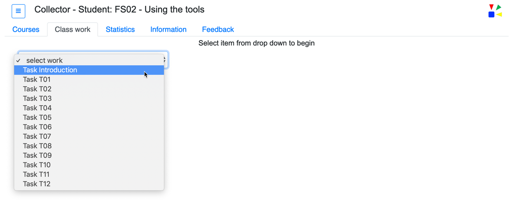
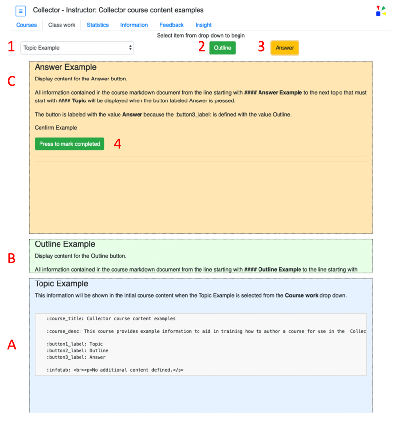
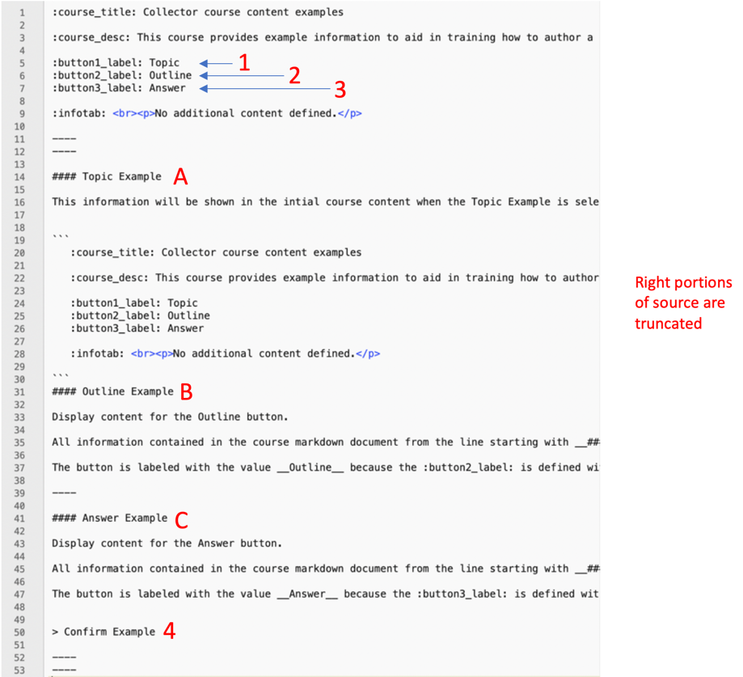

#Course content creation
---

The course content used within Collector is created using Markdown.  Markdown is a lightweight markup language with plain text formatting syntax. Its design allows it to be converted to many output formats.  

The Collector UI (user interface) will display the rendered markdown using two primary tabs __Courses__ and __Class work__.  Multiple courses can be available in the drop down of the __Courses__ tab.   

Each course shown in the drop down is a seperate markdown file that is parssed and rendered when Collector is started.  

Select a course from the frop down and press the button labeled _"Begin course"_.  


----

Once a course is selected and the "Begin course" button has been pressed the title of the course will be shown in the top header line of the UI.  In the following screen shot the FS01 - Install CLI tools course was selected from the drop down.  The pressing of the button will also cause the UI to switch to the __Class work__ tab.  This tab also has a drop down that is comprised of the work that is available for the course.  As shown in the following image there are three work items for the __FS01 - Install CLI tools__ course.  




----

When a course work item is selected from the drop down the UI will provide the detail work instructions.  A course work item labeled __Topic Example__ was selected.

The initial work instructions are shown with a pale blue background display area, label: __A__.  Two optional an additional sets of work instructions can also be displayed.  These are areas labeled: __B__ pale green background, and labeled: __C__ pale orange background.  

The two optional work instructions areas are displayed by pressing the associated green button labeled: __2__ and the orange button labeled: __3__.  The buttons to display the associated work areas may not initially show when the work item is selected.  The course author can define a time delay before the button is shown.  Defining this time delay and the label for the button is described in a later section of this document titled, _Course parameters_. 

The following images, Course content (rendered) and Course content (markdown) are for the course titled: __Collector course content examples__.  

### Course content (rendered) 




### Course content (markdown) 

The course content that was used to create the above rendered view is shown in the following image.  The red labeled items of both images attempt to demonstrate what source was used to create the rendered output.  

Example:  Source line number 7, __:button3_label: Answer__ is what was used to define the rendered orange "Answer" button (red number three in both images).  The lines 1 through 9 define the parameters needed for this course.  Details regarding the parameters are described in a later section of this document titled, _Course parameters_. 




### Manual completion of class work

Within the markdown for the course a manual completion button can be inserted (shown below).  This button allows the student to indicate the work is completed.  This is identifed in the above images as the item with red number four. 


----

### Course parameters

Collector course content requires parameters that provide configuration and runtime information.  The following table provides an overview of the parameters and a brief description.  

```
NOTICE: All keywords start an end with colon ":".  These beginning and ending colons are REQUIRED.  
```

When defing the parameter use one or more spaces the separate the parameter key from the parameter value. 

| Parameter | Description | Default |
| :--- | :--- | :--- |
| :course_desc:| A brief course description that will be shown in the __Courses__ tab UI when a course is selected from the drop down. | Learning provided by IBM |
| :course_title: | A brief course title that is shown in the __Courses__ tab UI drop down.  This title is what is selected to show the course description. | Student course |
| :course_max: | A numeric value that defines the maximum number of Completed Work items shown in the __Statistics__ tab of the UI. | 10 |
| :course_auto: | Controls if the course is using auto completion reporting.  Valid values are: yes (or) no | no |
| :course&#95;auto&#95;links: | If using automated completion (parameter :course_auto: = yes) this parameter defines how to track completion events.  Detail information for configuring this parameter is discussed later in this document.| n/a |
| :button1_label: | A text value that defines the H4 (####) work segment 1.  This value is used in the drop down list of the __Course work__ tab in the UI.  Detailed information for this parameter is provided later in this document. | Question |
| :button2_label: | A text value that defines the H4 (####) work segment 2.  The text value that is shown for "Button 2" in the __Class work__ UI tab. | Hint |
| :button2_delay: | A numeric value that defines the number of milliseconds to delay the displaying of "Button 2". | 5000 |
| :button3_label: | A text value that defines the H4 (####) work segment 3.  The text value that is shown for "Button 3" in the __Class work__ UI tab. | Answer |
| :button3_delay: | A numeric value that defines the number of milliseconds to delay the displaying of "Button 3". | 15000 | 
| :infotab: | Provides the ability to define the content that will be shown on the __Information__ tab of the UI.  Details and examples of this parameter are provide later in this document. | n/a |


The following provides two example course definitions.  Example one has a maximum of 3 units of class work, no auto completion

The second example is defined with auto completion and Button 3 delay of 30 seconds.  


### Example 1

```
:course_title: FS01 - Install CLI tools
:course_desc: This course provides the student with the necessary steps to install the required CLIs (command line interface) tools needed to complete the additional courses. <br><br>If the any of CLI tools are already installed it is recommended the student should update them to the latest verison.  
:course_max: 3
:course_auto: no

:button1_label: Task
:button2_label: Hint
:button3_label: Complete

:infotab: <hr>
:infotab: <h5>Example debug flow:</h5>
:infotab: 


```

### Example 2

```
:course_title: FS03 - Trouble shooting
:course_desc: This course provides the student with the opportunity to trouble shoot multiple problems regarding containers, security, yaml, networking, resources, etc. <br><br>The first lab the student will deploy a new pod to gain an understanding of the process.  All other labs will use the approach of having the team/student research exisitng pods, diagnose the issue, and then resolve the issue.  <br><br>Once the issue is successfully resolved the running container will report the completion of the lab.  No manual process is needed to indicate completion of the lab.
:course_auto: yes
:course_auto_links: house=Create,baker=Syntax,carbon=Resources,doors=Images,avail=Security,eagle=Networking,floor=Running,gonzo=Starting
:course_max: 8

:button1_label: Lab
:button2_label: Hint
:button3_label: Step-by-Step
:button3_delay: 30000

:infotab: <br><a href="https://github.com/IBM-ICP-CoC/faststart-eu/blob/master/documents/M4ICP001-fast-start-2019.pptx"  target="_blank">Presentation - Powerpoint document </a>
:infotab: <br><a href="https://github.com/IBM-ICP-CoC/faststart-eu/blob/master/documents/M4ICP001-fast-start-2019.pdf"  target="_blank">Presentation - PDF document </a>


```

----


