:course_title: JTC14 MultiCloud Management Advanced

:course_desc: This course contains the MultiCloud Manager Labs.  

:course_max: 11

:course_auto: no

:button1_label: Task

:button2_label: Hint

:button2_delay: 9999999

:button3_label: Complete

:button3_delay: 300

#### Task Introduction

In this initial part we will verify that the Lab prerequisites have been installed.

# Tutorial

This Proof of Technology explores how you can define and deploy applications across clusters based on policy

Enterprises are deploying multiple Kubernetes clusters to address their specific needs. Some are deploying clusters across public and private clouds, and some are deploying clusters across regions, and some are deploying clusters, to support development and test needs. As organizations deploy more clusters, new challenges are introduced.

  * Where are my services running?
  * How can I monitor applications across clusters and clouds?
  * How can I manage clusters as if they were one environment?
  * How do I monitor usage across clouds?
  * Where are the failed components?
  * How do I deploy applications across these environments?
  * How do I move workloads across environments?
  * How do I set consistent security policies across environments?
  * Which clusters are compliant?
  * How can I place workloads based on capacity, policy?

IBM Multicloud Manager addresses all the above challenges. In this tutorial, we will address issues such as placing workloads across clusters based on policies and moving workloads across clusters.

In this tutorial, you will explore the following key capabilities: 

  * Understand IBM Multicloud Manager.
  * Deploy an application chart from the catalog.
  * Manipulate Placement Policies to place different services within an application across clusters.

#### Hint Introduction

No hint available

#### Complete Introduction

> Confirm Introduction complete

#### Task CheckLabPrerequisites

In this initial part we will verify that the Lab prerequisites have been installed.

# 1. Check ICP instance

* Click on the link you have received in the eMail
* Enter the password below the link

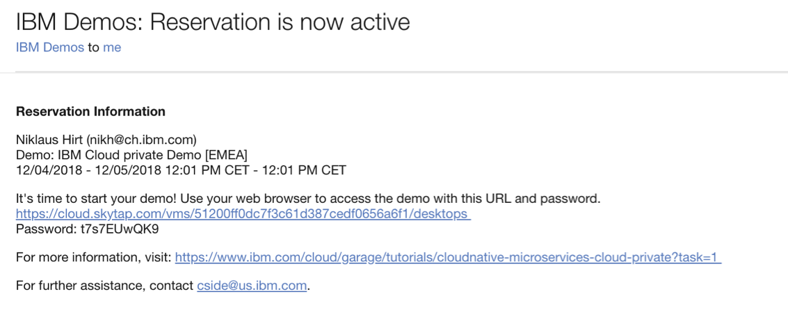

#### Hint CheckLabPrerequisites

No hint available

#### Complete CheckLabPrerequisites

> Confirm CheckLabPrerequisites complete

#### Task Course overview 

---

#  Course overview 

Deploying, managing, and monitoring applications in the heterogeneous mix of a private and public multicloud environment is complex to say the least. In a multicloud infrastructure, you need a layer of automated management operation so that your business can scale with the expansion of services in the multicloud environment. 

To manage a complex multicloud environment, you can use IBM Multicloud Manager. In this course, you learn about the capabilities of Multicloud Manager, its architecture, components, and topologies that you might want to consider at installation time. You also install Multicloud Manager and learn about policy enforcement and compliance with application monitoring and management.

## Prerequisites

  * A foundational understanding of cloud concepts
  * Familiarity with containers, microservices, and Kubernetes
  * A basic understanding of IBM Cloud Private, its components, and its monitoring capabilities

## Objectives

  * Articulate the need for Multicloud Manager
  * Identify Multicloud Manager components
  * Describe how Multicloud Manager works
  * Get familiar with the Multicloud Manager command-line tool and console for management
  * Consider a topology for installation and configuration
  * Define and deploy applications across clusters in IBM Cloud Private based on policy by using Multicloud Manager
  * Monitor applications and services
  * Articulate the relationship between Multicloud Manager and IBM Cloud Automation Manager

#### Hint Course overview 

No hint available

#### Complete Course overview 

> Confirm Course overview  complete

#### Task IBMMulticloudManager

---

#  IBM Multicloud Manager 

Most enterprises view their future cloud environments as both hybrid and multicloud. In a hybrid approach, your teams run applications across private, dedicated, and multitenant public cloud infrastructures. In a multicloud approach, you use multiple vendors to support a breadth of enterprise workloads.

The cloud is becoming a broader landscape that encompasses public and private resources, vendors' capabilities, and the ability to deploy applications based on the needs of workloads.

One of the goals in cloud adoption is to reduce the cost of operations. However, with cloud adoption comes the challenges of training people to work with cloud applications and operating in a cloud environment. Your enterprise must mitigate those challenges to reduce cost, complexity, and retraining. You need a layer of management and automation to excel and reap the benefits of a multicloud infrastructure.

Multicloud Manager is the enterprise-grade multicloud management solution for Kubernetes. It provides visibility across multicloud infrastructures, offering built-in support for compliance management and enabling consistent application management across cloud environments. Multicloud Manager reduces skills barriers and the need to retrain the workforce. It also provides a single source to provision applications and enforce access and security policies across heterogeneous cloud environments.

# Why use Multicloud Manager?

Multicloud Manager provides visibility, security and governance, automation, management across clouds and clusters, and more.

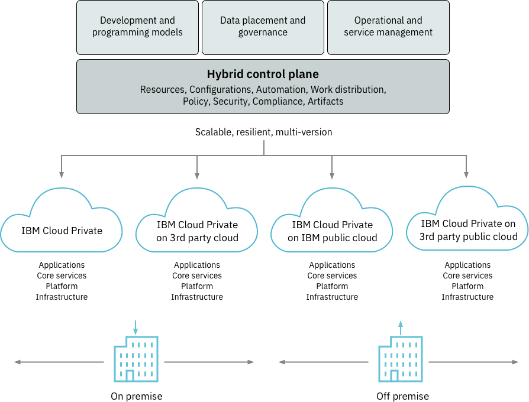

## Visibility

Multicloud Manager improves visibility across all Kubernetes environments. Every team has better visibility into the information that it requires. Development teams can see deployments, Pods, and Helm releases. Operations teams can look at clusters and nodes. Security teams can see who has access to which features by using a single user interface. Organizations no longer need to manually check each cluster to learn what is happening in their environments. Instead, they can view the dashboard in Multicloud Manager.

## Security and governance

Multicloud Manager helps teams manage environments with a consistent set of configuration and security policies so that an increase in the number of clusters doesn't result in a change. These policies are enforced in the target clusters. You can operate effectively even when you lose connectivity to the management system.

## Automation

Multicloud Manager uses IBM Cloud Automation Manager services to provision, configure, and deliver individual Kubernetes clusters as a service in any cloud that Cloud Automation Manager supports.

## Management across clouds and clusters

Whether your enterprise application is a modernized traditional application or a cloud-native, 12-factor application, Multicloud Manager provides a consistent way to deploy your application across clusters. Placement policy provides control of deployment that is based on several factors.

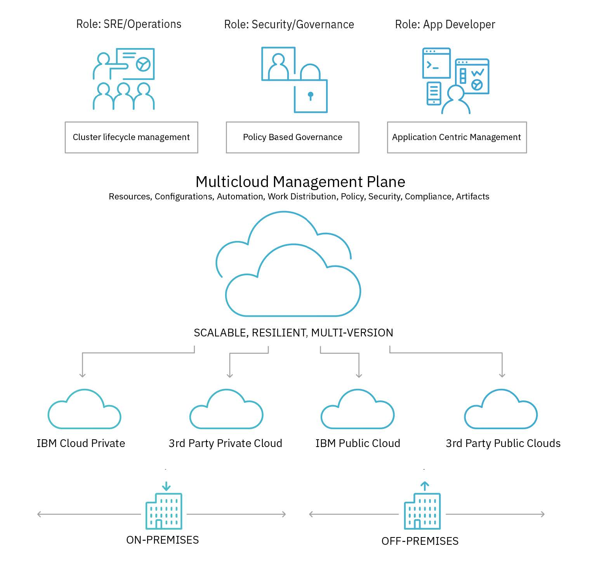

## Improved cost and flexibility

With the ability to manage environments in private clouds and public clouds, enterprises can optimize for performance, scale, or cost. You can deploy applications in a public cloud environment when elastic scaling is needed and use the private cloud for more control.

## Integration with management tools and processes

With the ability to connect to process and tools, Multicloud Manager fits into all the capabilities that enterprises build to manage mission-critical environments. Events from the Kubernetes clusters can be sent to event management or alert management tools.

## IBM’s commitment to open source and community

IBM continues to contribute to open source communities and is a platinum member of the Cloud Native Computing Foundation (CNCF). Multicloud Manager is built on open source capabilities and uses open standards to avoid lock-in.

#### Hint IBMMulticloudManager

No hint available

#### Complete IBMMulticloudManager

> Confirm IBMMulticloudManager complete

#### Task Components and architecture

---

#  Components and architecture 

Multicloud Manager is built on Kubernetes and written in GoLang. It is deployed and run as a Kubernetes component. For example, Multicloud Manager can run on IBM Cloud Private. Currently, IBM Cloud Private is the only supported runtime. Multicloud Manager has four main components: the Multicloud Manager Controller, the Multicloud Manager Klusterlet, the Multicloud Manager command-line interface (CLI), and the Multicloud Manager console.

## Multicloud Manager Controller

The Controller asynchronously aggregates clusters' information and maintains the state of managed clusters and applications. The Multicloud Manager Controller stores information in etcd, typically by using the host Kubernetes or IBM Cloud Private etcd. Interaction with Multicloud Manager Controller is completed through a set of REST APIs. 

## Multicloud Manager Klusterlet

The Klusterlet is an agent that runs on a managed Kubernetes cluster. It initiates a connection with the Multicloud Manager Controller by using a unidirectional communication pattern. Cluster inventory, application management, and policy enforcement operations are communicated through the Klusterlet in a Multicloud Manager environment. 

## Multicloud Manager CLI

Operators can use the CLI to get clusters, Pods, or other cluster resources. You can use the CLI to deploy Helm charts and initiate policy checks. 

## Multicloud Manager console (UI)

The console is where you operate the Multicloud Manager environment. It is integrated with the IBM Cloud Private Management console in the Multicloud menu. 

The following diagram shows a potential topology of a Multicloud Manager environment where IBM Cloud Private clusters that are on-premises and public infrastructure as a service (IaaS) are managed. 

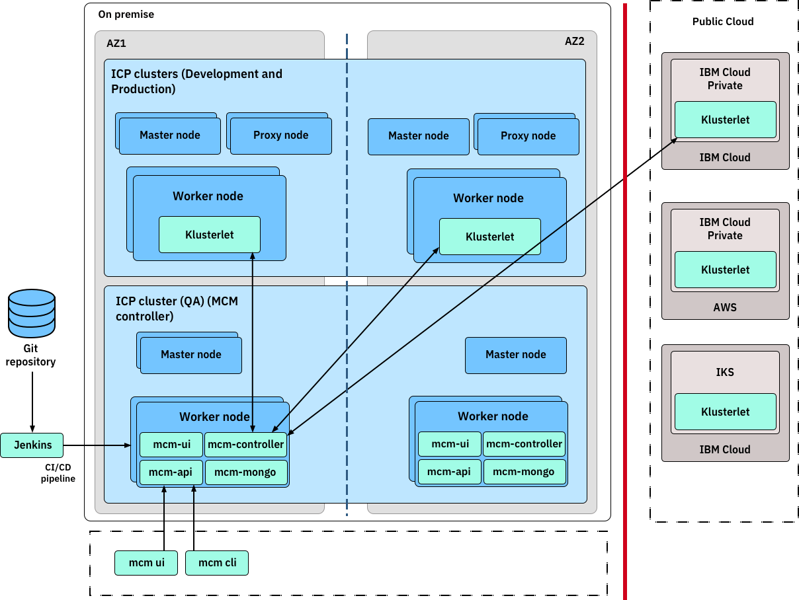

In a multicloud configuration, the first instance of Multicloud Manager on IBM Cloud Private must have all the components installed on it. That Multicloud Manager instance is referred to as the _hub-cluster_. 

On IBM Cloud Private instances that are in other cloud environments, you need to install only the Klusterlet. The IBM Cloud Private instances that have only the Multicloud Manager Klusterlet installed are called _managed-clusters_. The hub-cluster is the master and provides the managed-clusters with the Multicloud Manager configuration and provisioning information

#### Hint Components and architecture

No hint available

#### Complete Components and architecture

> Confirm Components and architecture complete

#### Task ClusterCommunication

---

#  Cluster communication 

Take a look at the Multicloud Manager component in IBM Cloud Private and explore other aspects, such as hub-cluster and managed-cluster, network communication, and authorization and access level.

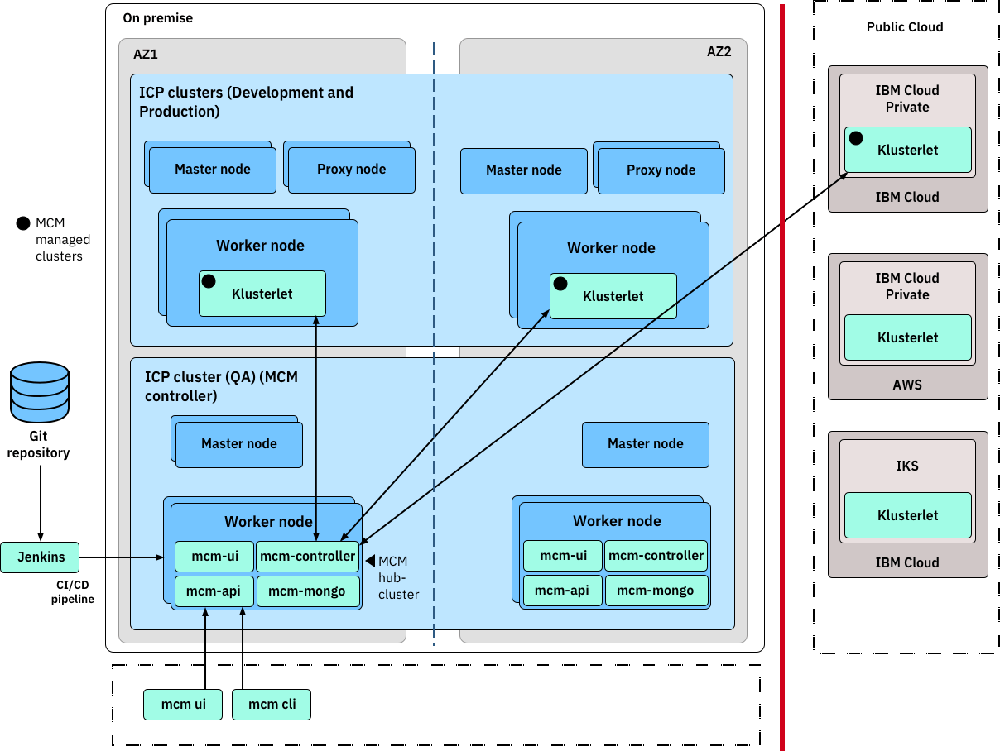

The diagram shows two availability zones: AZ1 and AZ2. The Multicloud Manager hub-cluster with all the Multicloud Manager components is installed on the IBM Cloud Private cluster (QA). As the diagram also implicitly shows, Multicloud Manager is a cloud-native, container-based microservices application that is deployed with Kubernetes on worker nodes in that cluster.

The other IBM Cloud Private instances have only Multicloud Manager Klusterlet installed on them. All the Multicloud Manager Klusterlets communicate with the Multicloud Manager Controller in the Multicloud Manager hub-cluster, which is typically installed on the IBM Cloud Private master node.

In general, you need to allow two-way networking connectivity between the Multicloud Manager Controller on the IBM Cloud Private hub-cluster with all the managed clusters by using the Multicloud Manager Klusterlet. Remember that you're in a heterogeneous multicloud environment, with some clouds that are on-premises and others are public clouds offered by different public cloud providers.

In special cases, you can force the Multicloud Manager Controller to pull the information from managed clusters to avoid the Klusterlet communicating back to the controller.

If firewalls exist between the clusters, likely when projects are isolated by VPC or an IaaS account, you need to allow certain Multicloud Manager ports to go through.

Installing Multicloud Manager Controller and Klusterlet requires ClusterAdmin role access on the associated instance of IBM Cloud Private. As a result, the operation team for IBM Cloud Private platform must be involved. To get cluster inventory for all the clusters, you need admin access to the namespace where the Multicloud Manager Controller is deployed to. Similarly, to deploy or start the mcmctl CLI, you need admin access to the Multicloud Manager namespace.

#### Hint ClusterCommunication

No hint available

#### Complete ClusterCommunication

> Confirm ClusterCommunication complete

#### Task Topology

---

#  Topology 

It's important to design and implement a topology that allows high availability (HA) and future expansion. You need to decide where to place and configure your Multicloud Manager hub-cluster, which is a full Multicloud Manager installation on IBM Cloud Private, and where to configure Klusterlets.

Look at this diagram one more time from a slightly different perspective: 

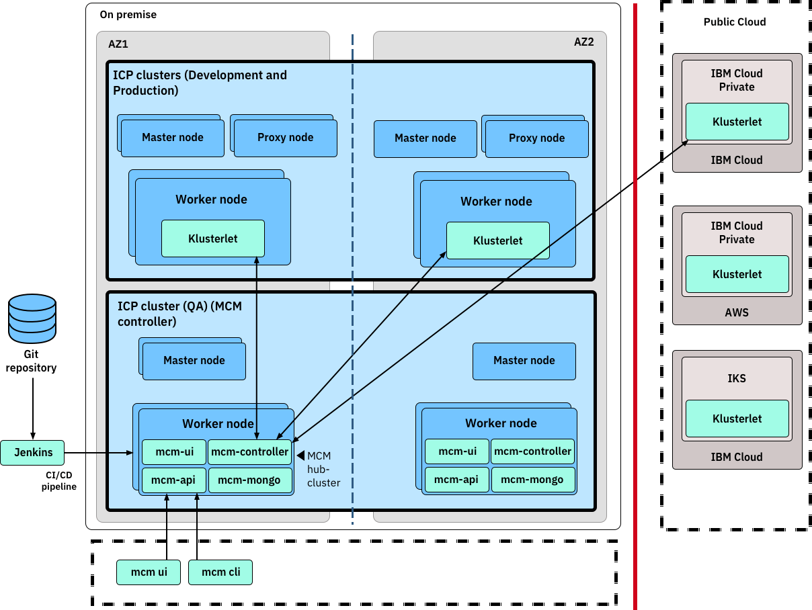

The Multicloud Manager hub-cluster is configured on the IBM Cloud Private cluster (QA). Notice the on-premises development and production clusters where only Multicloud Manager Klusterlets are installed. Then, notice the off-premises public clouds where only Multicloud Manager Klusterlets are configured. All the Klusterlets communicate with the Multicloud Manager Controller on the IBM Cloud Private cluster (QA). The Multicloud Manager CLI is installed on an on-premises node for management and administration tasks, which then uses Multicloud Manager Controller.

Next, look at this topology from an HA perspective:

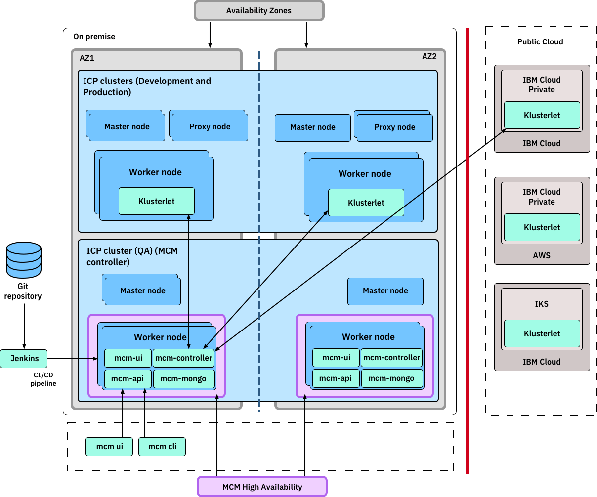

In this diagram, two IBM Cloud Private on-premises availability zones, AZ1 and AZ2, are horizontally arranged for development and production workloads. The IBM Cloud Private cluster with master node is also horizontally replicated for IBM Cloud Private HA across the AZ1 and AZ2 availability zones. The Multicloud Manager hub-cluster is also configured in two availability zones to support HA for the Multicloud Manager Controller.

#### Hint Topology

No hint available

#### Complete Topology

> Confirm Topology complete

#### Task Command-line interface

---

#  Command-line interface 

The Multicloud Manager command-line tool, mcmctl, is used to manage and operate Multicloud Manager clusters. To script and automate many tasks, you use the CLI instead of the Multicloud Manager console.

It's important to prepare the computer that you intend to use to run Multicloud Manager CLI commands. On that computer, you need to first install the prerequisites package, which includes Docker, the Kubernetes command-line tool, the IBM Cloud Private command-line tool, and Helm. You can then install the mcmctl tool.

A few examples of mcmctl commands are included for your reference.

## Get clusters inventory
    
     # Need to login to the MCM controller node before any Operation 
     cloudctl login -a https://172.16.40.25:8443/ --skip-ssl-validation 
       
     # Get all the clusters managed by MCM controller by namespace 
     mcmctl get clusters --all-namespaces  
      
     # To examine the detail of a cluster 
     mcmctl describe clusters sedev -n mcm-sedev # the namespace is the remote cluster's representation 

## Get Pods inventory
    
     # Get Pods from all managed clusters 
     mcmctl get pods --all-namespaces   
     
     # Get Pods from MCM application deployed to MCM Clusters 
     mcmctl get pods   
     
     # Get Pods from a specific Cluster 
     mcmctl get pods -n {mcm managed cluster namespace} 

## Add a managed cluster
    
     # Add a manager cluster requires to install MCM Klusterlet on the remote cluster 
     # please check the installation section on how to install Klusterlet 

#### Hint Command-line interface

No hint available

#### Complete Command-line interface

> Confirm Command-line interface complete

#### Task Compliance

---

#  IBM Multicloud Manager Compliance Manager 

Without a multicluster, multicloud management tool, managing individual Kubernetes clusters is expensive, error-prone, and time consuming. The larger the number of clusters, the more impractical it becomes. To understand the failures of Pods, storage, and other services, you need to log in to each cluster. Clusters must be configured individually, increasing the probability of errors. Compliance checks take time, as they must be done across clusters, and multicluster applications must be deployed in parts and then connected together. Monitoring an application can require several consoles.

Configuration management tools, such as Chef and Ansible, are imperative for managing infrastructure configuration at scale. However, no major configuration management solution exists for Kubernetes-native resources such as deployments, quotas, roles, role bindings, and others.

Multicloud Manager solves this problem with its Compliance Manager feature. Multicloud Manager Compliance Manager provides a state-based management approach to inform and enforce the policy compliance of a set of clusters that are managed by Multicloud Manager.

Multicloud Manager Compliance Manager works based on three attributes: template, policy, and compliance.

## Template

A template is the most important concept to grasp, as everything revolves around it. A template is defined in a YAML file. Each template defines a list of policyRules that determine whether a Kubernetes resource is compliant. These rules are a list of attributes that the Kubernetes resource must have or not have to be compliant.

Look at this example YAML file and see the descriptions for a few of the attributes:

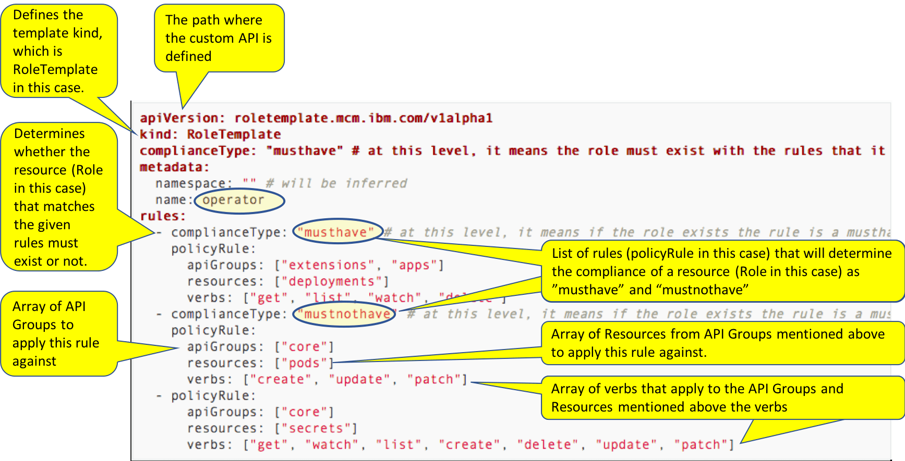

## Policy

A policy is responsible for these actions: 

  * Take a list of templates and enforce their rules in a cluster 

  * Determine which namespaces to enforce the rules into 

  * Determine what remediation action to take when compliance isn't met 

To better understand a policy, look a YAML file for a policy object and learn about the attributes:

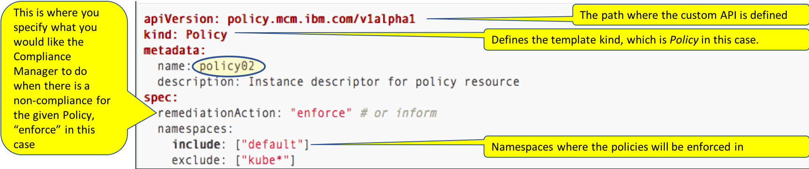

## Compliance

You now understand that a template defines the rules to enforce, and a policy defines how and where (namespaces) the rules are enforced in a cluster. However, a policy must still be applied to each cluster. Manually applying the policies might be fine for one or two clusters. But the more abundant and more granular the policies become and the more clusters you have, the more cumbersome managing the policies becomes.

The Multicloud Manager Compliance Manager can manage policies for you by using a compliance object. A compliance object takes a list of policy objects and their respective templates and determines what clusters to apply them to based on cluster selectors. A compliance is the final piece that ties the policies into the actual infrastructure (clusters) and fully implements compliance.

To better understand a compliance, look at a YAML file for a compliance object that contains a policy object:

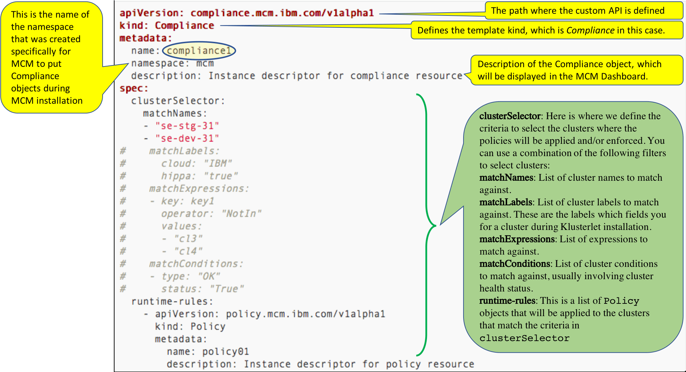

The compliance object is responsible for applying the specified policy objects to the matching clusters and reporting status back to the Compliance Manager dashboard in Multicloud Manager.

#### Hint Compliance

No hint available

#### Complete Compliance

> Confirm Compliance complete

#### Task ComplianceStatus

---

#  View compliance status on the dashboard 

To see a demonstration of the Multicloud Manager console and policy management, watch this video:

You can access the Compliance Manager dashboard to view the compliance status of all the policies and inspect noncompliant policies to understand the rules in the policy templates.

Follow these steps to view compliance status on the Multicloud Manager dashboard:

 1. To access the Policies view for the Compliance Manager, in new browser window, go to `https://${MCM_HUB_CLUSTER_MASTER_IP}:8443/multicloud/policies`, 

   where _${MCM_HUB_CLUSTER_MASTER_IP}_ is the IP address of the master node in the Multicloud Manager hub-cluster.

 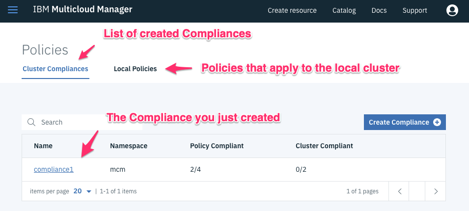

  In the Policy Compliant column, only two out of four created policies are compliant, which means that for both clusters, only one of the policies is compliant. The 0/2 value in the Cluster Compliant column indicates that none of the clusters are 100% compliant.

 2. Click **compliance1** to see more information about the compliance object.

  High-level details about the compliance are shown, which are like what you saw earlier:

  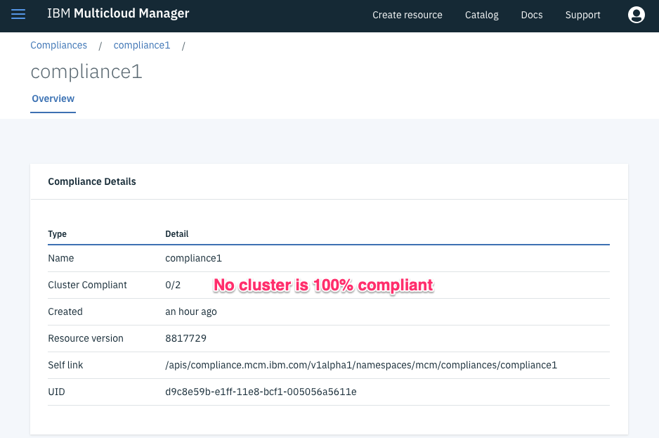

 3. Scroll down to view the Compliance Status and Compliance Policies sections.

  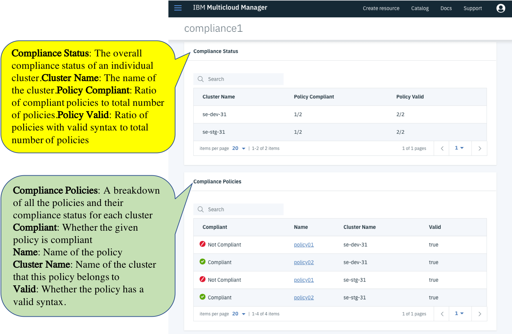

  You viewed the compliance status on the dashboard. Next, you view an individual policy.

#### Hint ComplianceStatus

No hint available

#### Complete ComplianceStatus

> Confirm ComplianceStatus complete

#### Task Policy

---

#  View an individual policy 

You learned how to get a high-level compliance status for each policy on each cluster. For example, to investigate what is causing the policies to show a noncompliant status, you inspect the contents of the policy. 

Now, view the contents of a policy:

  1. In the Compliance Policies section, click the name of the policy. For the purposes of this course, click **policy01** from the se-dev-31 cluster.

  The high-level policy details are shown. The policy is noncompliant and the enforcement type is "inform".

  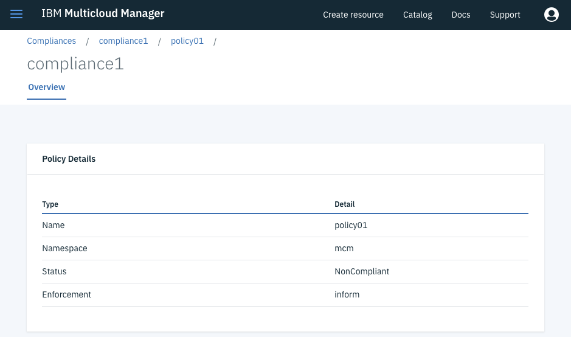

  2. Scroll down to the Template Details and Rules sections.

   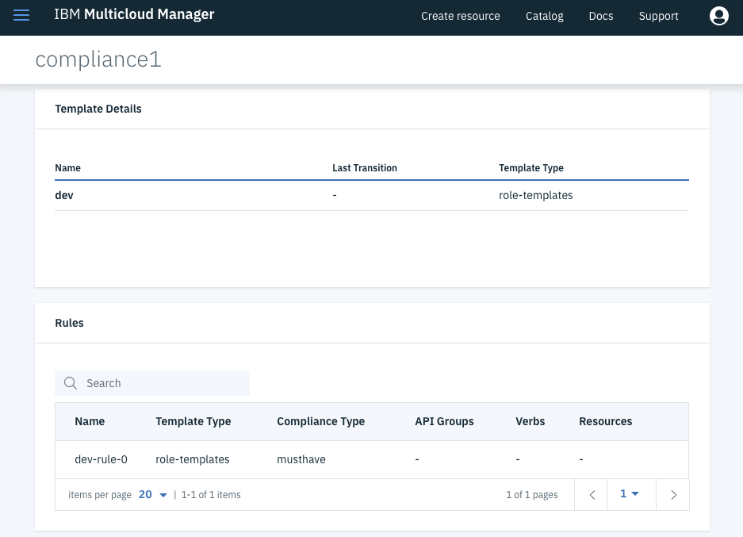

The more that you use the Compliance Manager and implement compliance objects into clusters, the easier it becomes to maintain complicated configurations across clusters. You can also use the YAML files to edit and update the compliance information.

#### Hint Policy

No hint available

#### Complete Policy

> Confirm Policy complete

#### Task DeployApplications

---

# Define and deploy applications across clusters

To address their needs, enterprises are deploying Kubernetes clusters. Some enterprises are deploying clusters across public and private clouds, some are deploying clusters across regions, and some are deploying clusters to support development and test needs. As organizations deploy more clusters, new challenges are introduced.

To explore how you can define and deploy applications across clusters based on policy, complete the Multi-cluster Application Management tutorial.

#### Hint DeployApplications

No hint available

#### Complete DeployApplications

> Confirm DeployApplications complete

#### Task DevOps

---

#  DevOps with IBM Cloud Private and Multicloud Manager 

Provisioning and maintaining IBM Cloud Private clusters can be a challenge. Beyond that challenge, deploying applications to environments by using a continuous integration continuous delivery (CICD) pipeline requires highly detailed coordination. The more environments that you have, the more cumbersome and time consuming it is to manage Kubernetes service account credentials and their expiration dates.

If your application is composed of 50 microservices that must be deployed on a cluster where you have three clusters, a total of 150 pipelines need the right environment credentials. When those clusters span different private and public clouds, the complexity becomes arduous and defeats the benefits of adopting cloud and cloud-native applications in a CICD pipeline.

With Multicloud Manager, you can securely provide and store your clusters' endpoints and certificates. If the certificates expire, Multicloud Manager automatically renews them. 

Multicloud Manager takes advantage of its certificate management in its ability to deploy a Helm chart to clusters with a single command. In the Helm chart, the developer uses selector labels to specify what clusters to deploy the chart to. When a user or pipeline runs a `helm install` command against the Multicloud Manager cluster, Multicloud Manager uses the labels to find the clusters to deploy the chart to.

By using labels, you can implement a code promotion pipeline that completes these actions:

  * Deploys a Helm chart to all clusters that have a label with the `environment` type and the `dev` value

  * Runs smoke tests against the dev clusters

  * If tests succeed, deploys the Helm chart to all the clusters that have a label with the `environment` type and the `staging` value 

#### Hint DevOps

No hint available

#### Complete DevOps

> Confirm DevOps complete

#### Task IBMCloudAutomationManager 

---

#  Multicloud Manager and IBM Cloud Automation Manager 

In a multicloud topology with different combinations of private and public clouds, your management, operations, and monitoring tasks become complex and abundant. You need automation.

Multicloud Manager and IBM Cloud Automation Manager provide complementary capabilities in a multicloud management solution. Multicloud Manager uses the multicloud automation services from Cloud Automation Manager to provision, configure, and deliver Kubernetes clusters as services in any cloud that Cloud Automation Manager supports.

In the context of [Cloud Service Management and Operations](https://www.ibm.com/cloud/garage/content/field-guide/csmo-field-guide/) and automation to scale, you can use Cloud Automation Manager and Terraform templates to provision an IBM Cloud Private cluster on a private or public cloud that is driven by Multicloud Manager policies.

## Infrastructure topology

This diagram outlines how different products and components work together to provision and manage IBM Cloud Private (Kubernetes) clusters in a multicloud infrastructure:

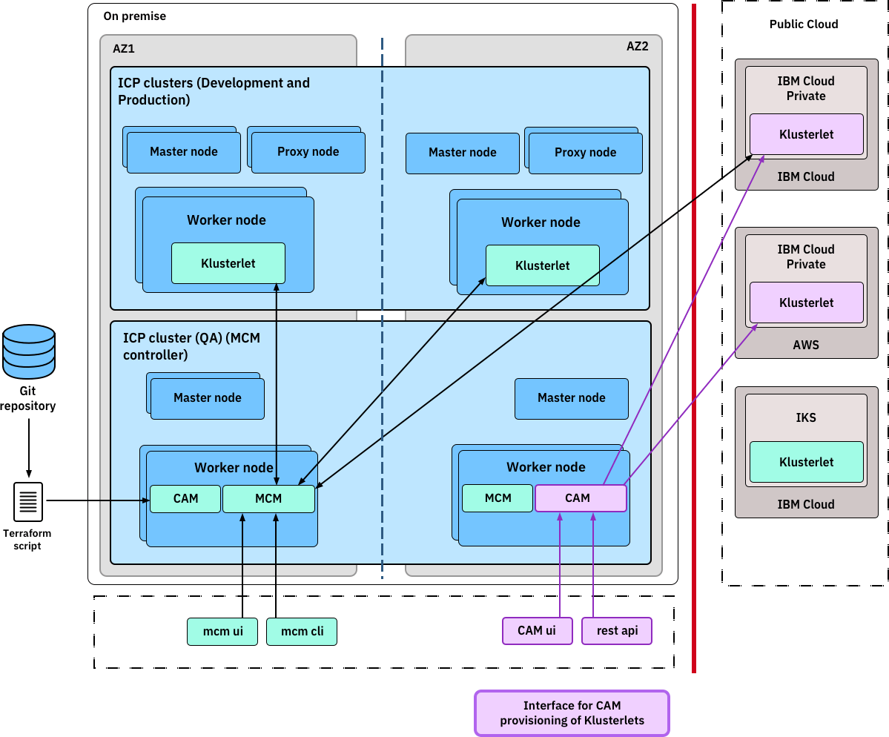

This architecture applies two key aspects to multicloud solution:

  * Cloud Automation Manager is the provisioning engine for the Kubernetes cluster and resources and for non-Kubernetes resources, such as VMs and middleware to cloud providers. For Multicloud Manager, a service that is provided by Cloud Automation Manager installs a Klusterlet to the newly provisioned IBM Cloud Private cluster. That service is exposed to the IBM Cloud Private catalog through the open services broker. 

  * Multicloud Manager regulates and governs the Cloud Automation Manager provision process by using policies and compliances. For example, Multicloud Manager might control where the worker nodes of a new IBM Cloud Private cluster can be placed.

## Automation scripts

The IBM Cloud Architecture and Solution Engineering team developed a set of Terraform scripts with instructions to automate the IBM Cloud Private provisioning process in several cloud-provider environments. You can access the scripts on the Course evaluation page at the end of this course.

#### Hint IBMCloudAutomationManager

No hint available

#### Complete IBMCloudAutomationManager

> Confirm IBMCloudAutomationManager complete

#### Task Monitoring

---

#  Monitoring 

In the heterogeneous mix of a private and public multicloud environment, monitoring has multiple dimensions.

Cloud Service Management and Operations is an emerging practice. To get a better understanding of Cloud Service Management and Operations is a critical part of reinventing your operations for the cloud, watch this video:

## How Multicloud Manager monitoring works

After Multicloud Manager is installed, Prometheus and Grafana are installed. Prometheus is an open source monitoring tool. Grafana is visualization software. Together, they monitor the Multicloud Manager deployment infrastructure components. The Grafana dashboards provide various views of the time series data that Prometheus collects. If you're unfamiliar with Prometheus and Grafana, see [Logging and monitoring](https://www.ibm.com/cloud/garage/content/course/ibm-cloud-private-introduction/16) in the Introduction to IBM Cloud Private course. 

## Private cloud versus public cloud

You can rely on your public cloud provider to manage the public cloud infrastructure based on your service level agreement (SLA) with the provider. However, you must monitor and manage your private cloud infrastructure.

## Application monitoring

After the initial deployment of Multicloud Manager is completed, you need a dashboard that is application- and service-centric and that shows metrics that are important to your application. You might want your application and service to be shown on a high-level dashboard but still be able to explore details about the components that support or compose the application or service.

To implement such a dashboard, a few requirements must be met: 

  1. The application must expose its metrics based on the concepts of build-to-manage. 

  2. The metrics must be collected, processed, and displayed. You can either extend or create an instance of Grafana or Prometheus. 

  3. As part of processing the metrics, you need a model or topology that describes the relationship between the components that compose an application or service. You can manually build the model or topology or extract it from the provisioning component of Multicloud Manager. 

Two typical scenarios for application or service monitoring are build-to-manage and exporting the monitoring information.

### Build-to-manage

Prometheus collects metrics from monitored systems by "scraping" metrics on the HTTP endpoints of those systems. In Prometheus terms, the things that Prometheus monitors are _targets_. The Prometheus server scrapes targets at a defined interval and stores the information in a time-series database. The targets and the time interval for scraping metrics is defined in the `prometheus.yml` configuration file.

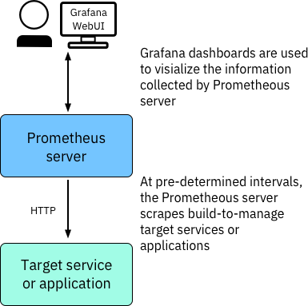

If the application or service doesn't have the build-to-manage capability, you might need to either build the capability into the application or use a different approach. 

To add the build-to-manage capability to your application, follow the [Cloud Service Management and Operations Learning Journey](https://www.ibm.com/cloud/garage/courses/csmo). 

### Exporting the monitoring information

If the application can't be modified, you can use an exporter to get data that is related to the application. An exporter is a software component that collects metrics from a third-party system and exports the data to a metrics format that the Prometheus server can use.

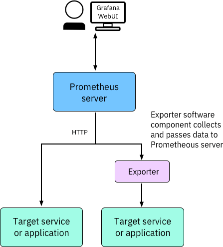

A common exporter component is the collectd exporter. For more information about the collectd exporter, including the Dockerfile and documentation, see [its public GitHub page](https://github.com/prometheus/collectd_exporter).

#### Hint Monitoring

No hint available

#### Complete Monitoring

> Confirm Monitoring complete

#### Task aaaa

---

TODO

#### Hint aaaa

No hint available

#### Complete aaaa

> Confirm aaaa complete

#### Task aaaa

---

TODO

#### Hint aaaa

No hint available

#### Complete aaaa

> Confirm aaaa complete

#### Task aaaa

---

TODO

#### Hint aaaa

No hint available

#### Complete aaaa

> Confirm aaaa complete

#### Task aaaa

---

TODO

#### Hint aaaa

No hint available

#### Complete aaaa

> Confirm aaaa complete

#### Task aaaa

---

TODO

