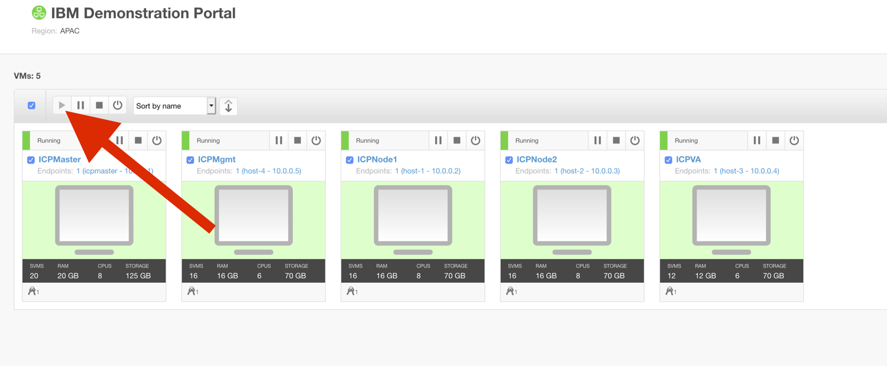

:course_title: ICP00 Lab Setup

:course_desc: This course provides the student with the necessary steps to get the Lab setup for IBM Cloud Private.  

:course_max: 4

:course_auto: no

:button1_label: Task

:button2_label: Hint

:button2_delay: 999999

:button3_label: Complete

:button3_delay: 30

:infotab: 

:infotab: <h2 id="toc_0">3. Login to ICP</h2>
:infotab: 
Console: Open firefox browser in the Skytap window and click on IBMCloudPrivateConsole bookmark.

:infotab: 
<pre><code class="language-none">The userid is        admin     
:infotab:  
:infotab: the password is    icp1nCl0ud</code></pre>

:infotab: <h2 id="toc_1">4. Prepare command line</h2>
:infotab: 
CommandLine: Open a terminal window by clicking on the Terminal icon and run: 

:infotab: 
<pre><code class="language-none">sudo su - </code></pre>

:infotab: 
password is <code>A1rb0rn3</code>.

:infotab: 
and then run 

:infotab: 
<pre><code class="language-none">scripts/bin/kubcli.sh admin admin </code></pre>

:infotab: 
Then, you can start running kubectl commands.

:infotab: 

----
#### Task Introduction

----

A Kubernetes-based container platform, IBM Cloud Private, can help you quickly move, modernize and automate workloads or build new cloud-native applications. Development and deployment takes place on your infrastructure, in your data center, or across multiple clouds, both public and private. 

If you're familiar with Kubernetes, you can explore the IBM Cloud Private environment on your own. It starts with a quick registration step and then you'll have access to 6 server instances hosting Kubernetes nodes, preconfigured with sample applications and services. 

The sections below are areas that you can explore and include sample applications.

In this tutorial, you will explore the following key capabilities: 

  
1. Getting to know the Skytap interface
1. Access the IBM Cloud Private management console
1. Modify registry permissions
1. Deploy the Application
1. Launch the Application
1. Expose the Application
1. Upgrade Helm Release
1. Scale the Application
1. Monitoring
1. Logging
1. Kubernetes Storage
1. Authentication

#### Hint Introduction

No hint available

#### Complete Introduction

> Confirm Introduction complete

----
#### Task Getting an IBMid

----

**If you already have an IBMid you can directly skip to the next step.**

[Sign up for an IBM Account](http://ibm.biz/COURSE_SIGNUP) (free)

**Please use your “real” work eMail address.**

**Public eMail addresses (Gmail, Yahoo, …) do NOT work.**

#### Hint Getting an IBMid

No hint available

#### Complete Getting an IBMid

> Confirm Getting an IBMid complete

----
#### Task Getting an ICP Instance

----

# Getting your ICP Instance

## 1. Open the reservation page

[Create a Kubernetes Instance (free)](https://www.ibm.com/cloud/garage/dte/tutorial/ibm-cloud-private-hosted-trial) (free)

## 2. Login to your IBM Account

## 3. Reserve an Instance

## 4. Confirmation mail

A few minutes after completing the reservation form, check your inbox for an email that contains instructions about the environment you reserved. Follow the instructions to log in to the instance.

#### Hint Getting an ICP Instance

No hint available

#### Complete Getting an ICP Instance

> Confirm Getting an ICP Instance complete

----
#### Task SkytapStart

----

# Starting your Skytap environment

## 1. Starting your environment

When you log in to your environment for the first time, your VMs may be suspended. 

To start it, click the play icon in the upper-right corner. 

It takes 10 - 15 minutes for IBM Cloud Private to fully start when you first start the environment.

Check if all VMs are «Running».

It takes some minutes for the Kubernetes Cluster to start inside the VM.

#### Hint SkytapStart

No hint available

#### Complete SkytapStart

> Confirm SkytapStart complete

