:course_title: ICP01 IBM Cloud Private

:course_desc: This course provides the student with the necessary steps to get a basic understanding of IBM Cloud Private.  

:course_max: 7

:course_auto: no

:button1_label: Task

:button2_label: Hint

:button2_delay: 999999

:button3_label: Complete

:button3_delay: 30


:infotab: <hr>

:infotab: <h1 id="toc_0">References</h1>
:infotab: <p><a href="https://istio.io/docs/tasks/">Istio.io</a></p>
:infotab: <h1 id="toc_1">License</h1>
:infotab: <p>This code pattern is licensed under the Apache Software License, Version 2.  Separate third party code objects invoked within this code pattern are licensed by their respective providers pursuant to their own separate licenses. Contributions are subject to the <a href="https://developercertificate.org/">Developer Certificate of Origin, Version 1.1 (DCO)</a> and the <a href="http://www.apache.org/licenses/LICENSE-2.0.txt">Apache Software License, Version 2</a>.</p>
:infotab: <p><a href="http://www.apache.org/foundation/license-faq.html#WhatDoesItMEAN">Apache Software License (ASL) FAQ</a></p>

:infotab: <hr>


----
#### Task Introduction

----

In this tutorial, you install and run a cloud-native microservices application on an IBM® Cloud Private platform on Kubernetes. The application implements a simple storefront that displays a catalog of computing devices. People can search for and buy products from the application's web interface. For a reference implementation diagram for the application, see [Microservices with Kubernetes](./architectures/microservices/1_0).

The application is composed of several microservices. With microservices, an application can be partitioned into smaller independent services that communicate with each other. This structure allows for the application to be developed, deployed, and managed by different teams. When you implement microservices and incorporate the [Circuit Breaker pattern](./content/manage/practice_circuit_breaker_pattern/), your application can remain partially operational even when one of the microservices is unavailable.

The application is called "BlueCompute" in the source code. You can see the code for the application on [GitHub](https://github.com/ibm-cloud-architecture/refarch-cloudnative-kubernetes). 

  * The user interface is provided by the web application which also acts as a BFF component, following the Backends for Frontends pattern. In this layer, front-end developers write back-end logic for the front end. The Web BFF is implemented by using the Node.js Express Framework. The microservices are packaged as Docker containers and are managed by the IBM Cloud Private Kubernetes cluster.

  * The BFF invokes a layer of reusable microservices that are written in Java™. The microservices run inside IBM Cloud Private using Docker and retrieve their data from databases. The catalog service retrieves items from a searchable JSON datasource by using ElasticSearch. The inventory service uses MySQL. ElasticSearch and MySQL databases are implemented as Docker containers.

In this tutorial, you will explore the following key capabilities: 

  * Access the IBM Cloud Private management console
  * Deploy a cloud-native microservices application to IBM Cloud Private
  * Validate the deployment


#### Hint Introduction

No hint available


#### Complete Introduction

> Confirm Introduction complete


----
#### Task Skytap

----

# Getting to know your Skytap environment

## 1. Starting your environment

Your IBM Cloud Private should now be fully operational. Otherwise please complete ICP00.

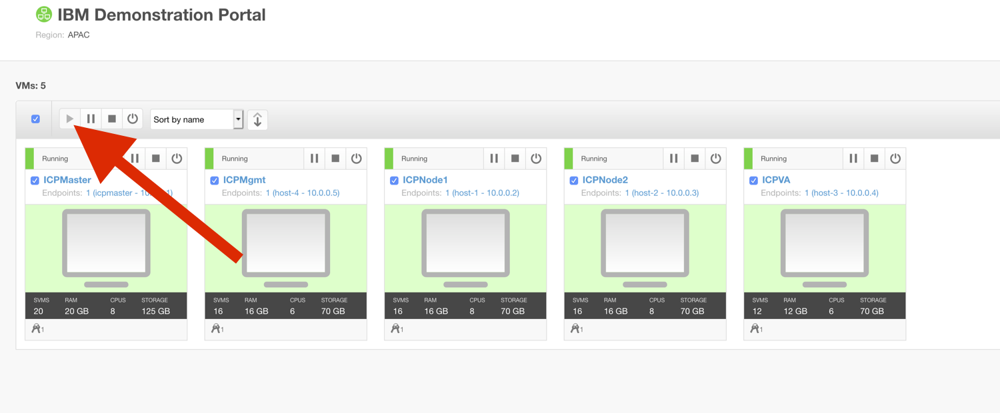


1. Verify that all VMs are «Running».
1. Click on the ICP Master icon to launch the web access.

## 2. Interface

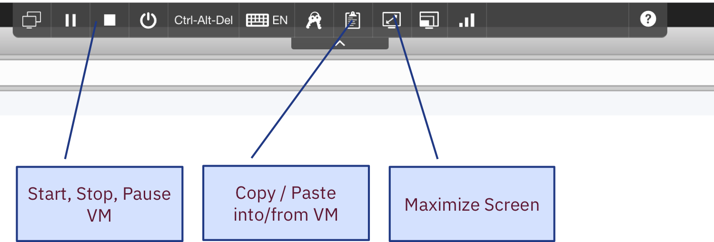


> After 2 hours of inactivity, the environment is suspended. If you want to resume your work, click the play icon in the upper-right corner. The restart process takes 3 - 5 minutes. When all the VMs are restarted, you can complete the tutorials by clicking the compute image on the Desktop image.

TODO

	FIREFOX
	
	CATALOG
	
## 3. Login to ICP

Console: Open firefox browser in the Skytap window and click on IBMCloudPrivateConsole bookmark.

	The userid is      admin
	the password is    icp1nCl0ud


## 4.Prepare command line
 
CommandLine: Open a terminal window by clicking on the Terminal icon and run: 

```
sudo su - 
```
password is `A1rb0rn3`.


and then run 

```
scripts/kubcli.sh <userid> <password>. 
TODO
```
Then, you can start running kubectl commands.

## 5. Prepare registry permissions

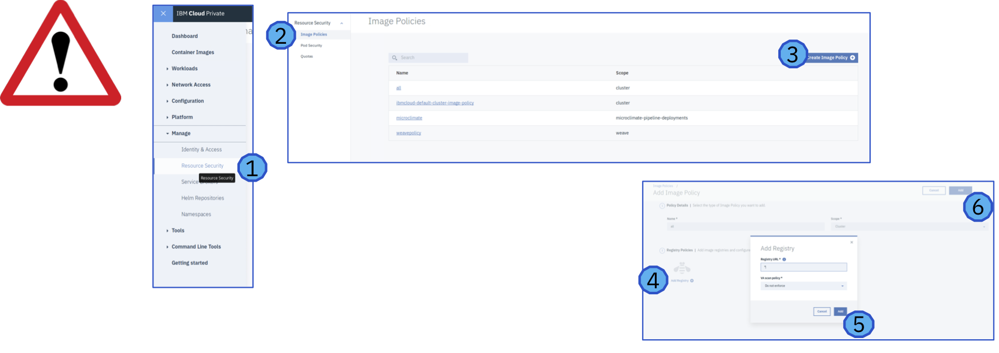

Change registry permissions

1. Click on `Manage` / `Resource Security`
1. `Image Policies`
1. `Create Image Policy`
1. Name it «`all`» and select `Add Registry`
1. Create with URL `*`
1. Click `Add`


#### Hint Skytap

No hint available


#### Complete Skytap

> Confirm Skytap complete


----
#### Task Access the IBM Cloud Private Management Console

----


In this task, you connect to an IBM Cloud Private cluster and log in to the IBM Cloud Private management console. From the management console, you can manage the IBM Cloud Private cluster platform, workloads, security, and catalog.

  1. From a machine that is hosting your environment, open a web browser and go to one of the following URLs to access the IBM Cloud Private management console:

    * If you're using a Skytap-based demo, go to `https://10.0.0.1:8443`.
    * If you're using a Vagrant-based local IBM Cloud Private instance, go to `https://192.168.27.100:8443`.
  2. Log in by typing `admin` for the user name and password.

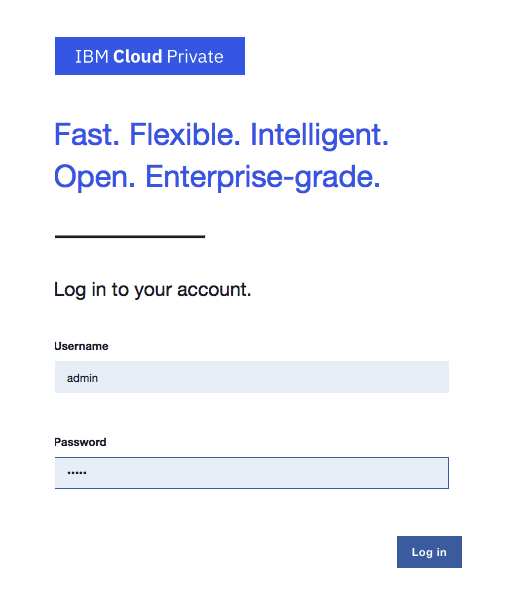


#### Hint Access the IBM Cloud Private Management Console

No hint available


#### Complete Access the IBM Cloud Private Management Console

> Confirm Access the IBM Cloud Private Management Console complete


----
#### Task Tutorial

----

### Tutorial

In this 10-minute demo, you deploy a storefront shopping application, bluecompute, that displays a catalog of antique computing devices. The bluecompute application includes these components:

  * A web application that provides the user interface through the web browser. The web application also acts as a BFF component, following the Backends for Frontends pattern. In this layer, front-end developers write back-end logic for the front end.

  * The Web BFF is implemented by using the Node.js Express Framework. These microservices are packaged as Docker containers and are managed by the IBM Cloud Private Kubernetes cluster. The BFF invokes a layer of reusable microservices that are written in Java™. The microservices run inside IBM Cloud Private by using Docker and retrieve their data from databases. The catalog service retrieves items from a searchable JSON datasource by using ElasticSearch. The inventory service uses MySQL. ElasticSearch and MySQL databases are implemented as Docker containers.

More details about this application are available in [GitHub](https://github.com/ibm-cloud-architecture/refarch-cloudnative-kubernetes).

All the microservices are packaged together as an application by using [Helm](https://docs.helm.sh/architecture), called a Helm chart, and are displayed in the IBM Cloud Private catalog.

In this guided demo, you complete these tasks:

  * Access the IBM Cloud Private Dashboard
  * Deploy a cloud-native microservices app to IBM Cloud Private
  * Validate the deployment

[

### Deploy the microservices app on IBM Cloud Private


  1. On the login page, type `admin` for both the username and password. Click **Log in**.

In the next few steps, you connect to a Helm chart repository (repo) to view a list of pre-packaged apps that can be installed to run on Kubernetes.

  2. In the upper-left corner, click the menu and click **Manage > Helm Repositories** to specify a new Helm chart repo.

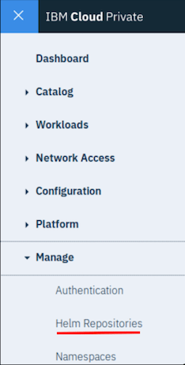

  3. Click **Sync repositories** and click **OK**.

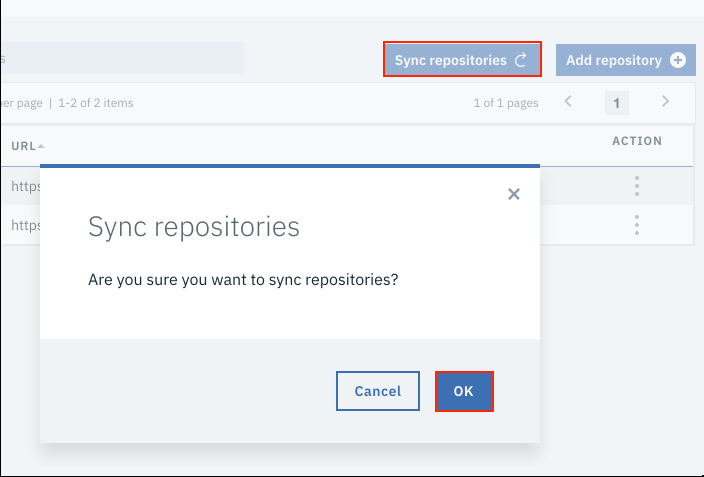

  4. In the header, click **Catalog**. In the Catalog, you can view the Helm charts for the app packages.


  5. Click **bluecompute-ce**.

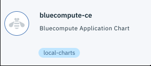

  6. Review the description, scroll down, and click **Configure**.

  7. For the release name, type `bluecompute-ce`. For the target namespace, select **default** and click **Install**.

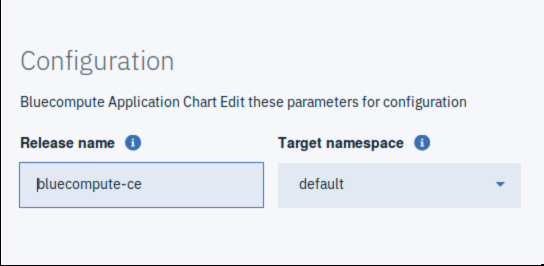

  8. In the Success window, click **View Helm Release**.

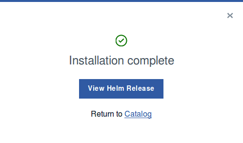

The package is deployed asynchronously in approximately 5 minutes.

While you're waiting for the microservices to deploy, you can explore other areas of the interface or watch this short video to learn more about IBM Cloud Private. 

The bluecompute-ce Helm release is composed of several microservices. Each microservice is deployed to IBM Cloud Private on Kubernetes as a deployment resource. Think of a deployment as the release unit of your app.

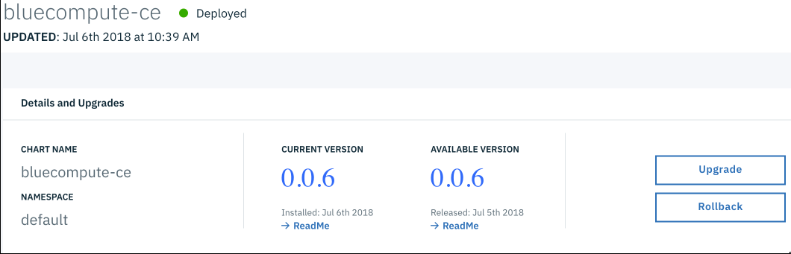

All the resources of the bluecompute-ce application are displayed. In the Deployment section, a value of `1` in the Available column indicates that the deployment was successful. All bluecompute microservices must be available before you can continue. It can take 5 - 8 minutes to deploy the microservices to the IBM Cloud Private Kubernetes cluster.

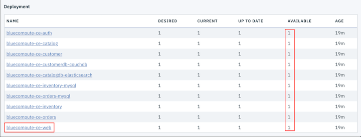

  9. In the Deployment section, click **bluecompute-ce-web**. To see the bluecompute-ce-web interface, click **Launch**.

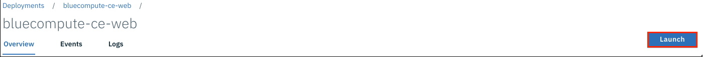

  10. Click **Browse Item Catalog** to browse, shop, and explore your running app.

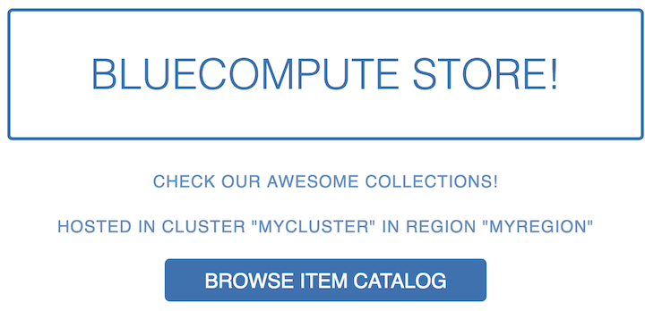


#### Hint Tutorial

No hint available


#### Complete Tutorial

> Confirm Tutorial complete


----
#### Task Deploy the Application Workload

----

Application workloads can be deployed to run on an IBM Cloud Private cluster. The deployment of an application workload must be made available as a Helm package. Such packages must either be made available for deployment on a Helm repository, or loaded into an IBM Cloud Private internal Helm repository.

In this task, you use the IBM Cloud Private management console to deploy the Bluecompute Community Edition (bluecompute-ce) application workload that is hosted on a Helm repository.

  1. Go to the IBM Cloud Private management console that you opened in task 1.

  2. In the upper-left corner, click the menu and click **Manage > Helm Repositories**.


  3. Click **Add repository** to add the Helm repository that hosts the sample bluecompute-ce application workload.

a. For the name, type `ibmcase`.

b. For the URL, type ` http://gitlab.10.0.0.1.nip.io/skytap/refarch-cloudnative-kubernetes/raw/spring/docs/charts/bluecompute-ce`

**Note:** This URL might not be accessible from the browser.

c. Click **Add**.

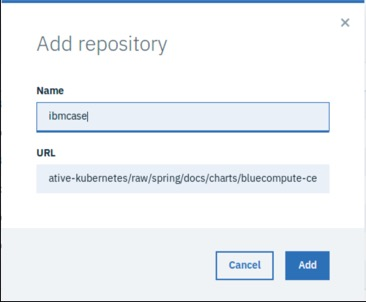

d. Click **Sync Repositories** and then click **OK **and wait for 3~4 minutes for the synchronization to complete.

  4. Click the menu and click **Catalog > Helm Charts**. The catalog might take a few seconds to open.

  5. Expand **Repositories** and select the **ibmcase** check box. The Catalog contents are filtered to show only the packages that are hosted on the ibmcase Helm repository.

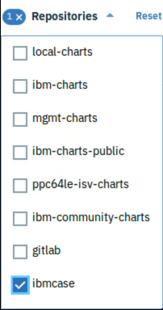

  6. To deploy the application, find the chart **bluecompute-ce **and click on it. The package deployment page opens.

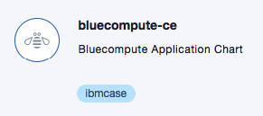

  7. By default, the latest version of the chart is selected. Click **Configure** to set any deployment values.

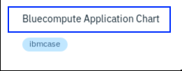

  8. Type `bluecompute-ce` for the release name and make sure the target namespace is set to **default**. Accept the default values for the other configuration settings. Click **Install**.

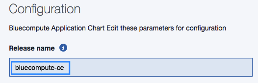

IBM Cloud Private starts processing the Helm charts that are in the package to deploy five microservices, three database backend services, and a web front-end application.

  9. After the deployment for all the resources is completed, an installation confirmation message is shown. Click **View Helm Release**.

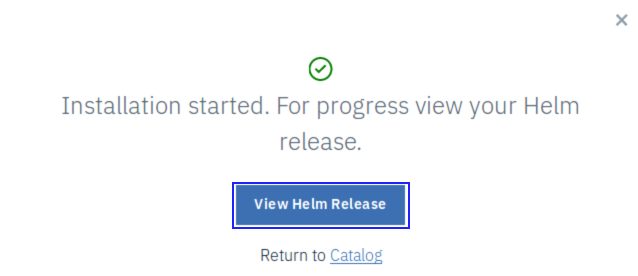

  10. Wait a few minutes for the resources that are deployed to the underlying Kubernetes cluster to become operational and available.

a. Go to the release details page by clicking **bluecompute-ce** on the Helm releases page. Scroll down and check the AVAILABLE column in the DEPLOYMENT section to ensure that all resources have a nonzero value, which indicates that at least one instance of each resource is available.

b. Scroll further down the page and verify that the **customer-create-user** job has also completed successfully.

You might need to refresh the page a few times.

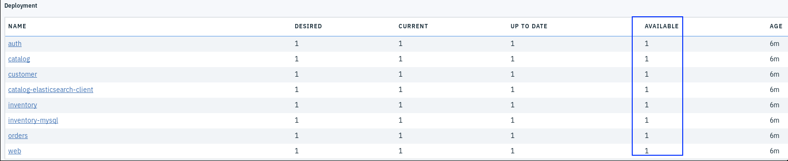

  11. After all the deployment resources are available, scroll up on the bluecompute-ce Helm releases page and click **Launch**.

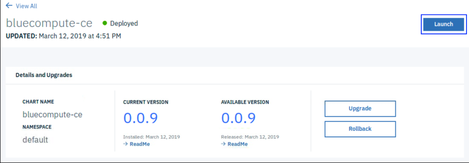

Next, you verify that the deployed application is functional.


#### Hint Deploy the Application Workload

No hint available


#### Complete Deploy the Application Workload

> Confirm Deploy the Application Workload to IBM Cloud Private complete


----
#### Task Expose the Application Workload

----
TODO
adsfsdafadsaa


#### Hint Expose the Application Workload


No hint available


#### Complete Expose the Application Workload


> Confirm aaa complete


----
#### Task Validate the Deployed Application

----

Now the application is installed in your IBM Cloud Private cluster, make sure that it's working as expected.

  1. Go to the browser tab that is displaying the sample application.

**Note:** If you see a `Your connection is not secure` message, click **Advanced** and then click **Add Exception** to add the security exception.

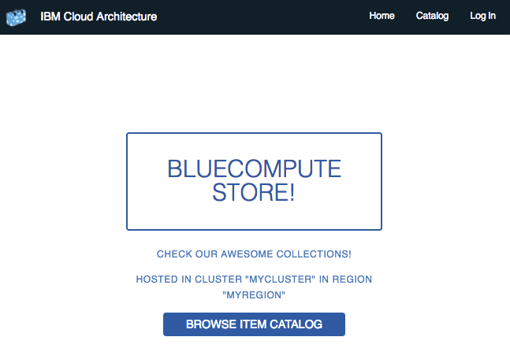

  2. Click **BROWSE ITEM CATALOG** to load the list of items.

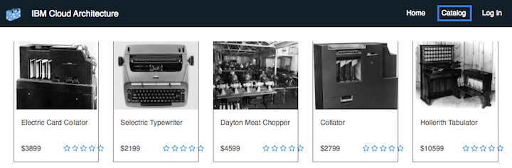

  3. Click **Log in**. For the user name, type `user`, and for the password, type `passw0rd`. Click **Sign in**.

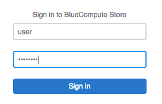

  4. Click one of the items to show the item details page.

  5. Select an item quantity and click **Buy**. A message is displayed to confirm that your order was placed successfully.

  6. Click **Profile** and view the order history. Review the date, item, and quantity of the order that you placed.

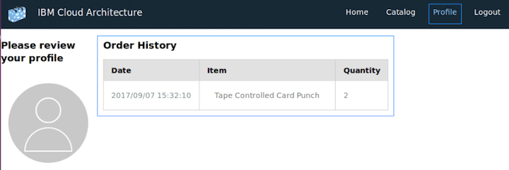


#### Hint Validate the Deployed Application

No hint available


#### Complete Validate the Deployed Application

> Confirm Validate the Deployed Application complete


----
#### Task aaa

----


#### Hint aaa

No hint available


#### Complete aaa

> Confirm aaa complete


----
#### Task aaa

----


#### Hint aaa

No hint available


#### Complete aaa

> Confirm aaa complete


----
#### Task aaa

----


#### Hint aaa

No hint available


#### Complete aaa

> Confirm aaa complete


----
#### Task aaa

----


#### Hint aaa

No hint available


#### Complete aaa

> Confirm aaa complete


