:course_title: JTC03 MultiCloud Management

:course_desc: This course contains the MultiCloud Manager Labs.  

:course_max: 3


:course_auto: no

:button1_label: Task

:button2_label: Hint

:button2_delay: 9999999

:button3_label: Complete

:button3_delay: 300


#### Task CheckLabPrerequisitesMinikube

In this initial part we will verify that the Lab prerequisites have been installed.


# 1. Check Minikube
## Make sure minikube is running 


* Verify that minikube is running
	If not please complete KUB99 Lab Setup

	```
	$ minikube status
	
	host: Running
	kubelet: Running
	apiserver: Running
	kubectl: Correctly Configured: pointing to minikube-vm at 192.168.99.100
	```
	
* Verify kubectl can communicate with your cluster.

	```
	$ kubectl get nodes
	
	NAME       STATUS    ROLES     AGE       VERSION
	minikube   Ready     master    32m       v1.14.1
	```


#### Hint CheckLabPrerequisitesMinikube

No hint available


#### Complete CheckLabPrerequisitesMinikube

> Confirm CheckLabPrerequisitesMinikube complete


#### Task Introduction

In this initial part we will verify that the Lab prerequisites have been installed.


### Tutorial

This Proof of Technology explores how you can define and deploy applications across clusters based on policy

Enterprises are deploying multiple Kubernetes clusters to address their specific needs. Some are deploying clusters across public and private clouds, and some are deploying clusters across regions, and some are deploying clusters, to support development and test needs. As organizations deploy more clusters, new challenges are introduced.

  * Where are my services running?
  * How can I monitor applications across clusters and clouds?
  * How can I manage clusters as if they were one environment?
  * How do I monitor usage across clouds?
  * Where are the failed components?
  * How do I deploy applications across these environments?
  * How do I move workloads across environments?
  * How do I set consistent security policies across environments?
  * Which clusters are compliant?
  * How can I place workloads based on capacity, policy?

IBM Multicloud Manager addresses all the above challenges. In this tutorial, we will address issues such as placing workloads across clusters based on policies and moving workloads across clusters.

In this tutorial, you will explore the following key capabilities: 

  * Understand IBM Multicloud Manager.
  * Deploy an application chart from the catalog.
  * Manipulate Placement Policies to place different services within an application across clusters.


#### Hint Introduction

No hint available


#### Complete Introduction

> Confirm Introduction complete


#### Task Cluster Topology

In this initial part we will verify that the Lab prerequisites have been installed.


### Cluster Topology

For this Proof of Technology, we have two IBM Cloud Private clusters.

  * DMZ cluster - label with datacenter **Raleigh**
  * Non DMZ Cluster - label with datacenter **Austin**

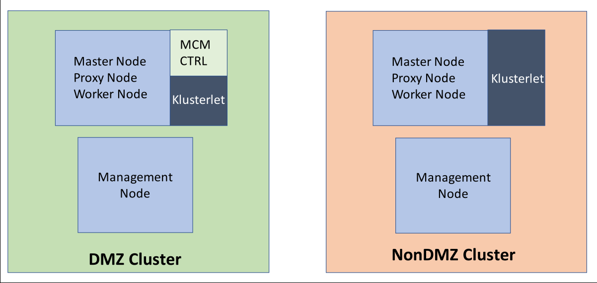

### Solution Overview

In this tutorial, we will use a stock trader application and walk you through steps on how you can move the application components between clusters using IBM Multicloud Manager placement policies.

The IBM Stock Trader application is a simple stock trading sample, where you can create various stock portfolios and add shares of stock to each for a commission. It keeps track of each portfolio’s total value and its loyalty level, notifying you of changes in level, which affect the commission charged per transaction. The concept demonstrates how to run a microservices-based application in a Kubernetes environment. This sample demonstrates usage of various IBM middleware products, such as Db2, MQ, and ODM, which are **preinstalled** on DMZ cluster to speed up the process.

In this POT you complete these tasks:

  * Starting the virtual machine.
  * Log in to the DMZ cluster.
  * Deploy stock trader application to DMZ cluster.
  * Verify that the application is running on DMZ cluster.
  * Modify the placement policy to move the stock trader application to NON DMZ cluster.
  * Verify the application is running on non DMZ cluster.
  * Modify the replicas and see the behavior.


#### Hint Cluster Topology

No hint available


#### Complete Cluster Topology

> Confirm Cluster Topology complete


#### Task Start the Virtual Machine

In this initial part we will verify that the Lab prerequisites have been installed.


### Start the Virtual Machine

When a virtual machine has been provisioned, an email will be sent to you with a URL that you will use to access the proof of technology image. The virtual machine is running in a [Skytap](https://www.skytap.com/) environment. Skytap allows for the provisioning of virtual machines in a Cloud environment. Access to a virtual machine is done through the use of a browser window, with almost the same capabilities as if you were running the lab on your local desktop.

To use Skytap Cloud virtual machines, you need:

  * A modern browser such as Chrome, Firefox, Microsoft Edge, Internet Explorer 11, or Safari.
  * A good network connection for connecting to VMs. This means: 
    * At least 1.2 Mbps for each concurrent browser session with a virtual machine.
    * Low latency (150ms or less) to the region where your virtual machines are located.

When you access the URL provided, the Skytap console similar to this one will be displayed in your browser (**Note**: The virtual machine name may be different).

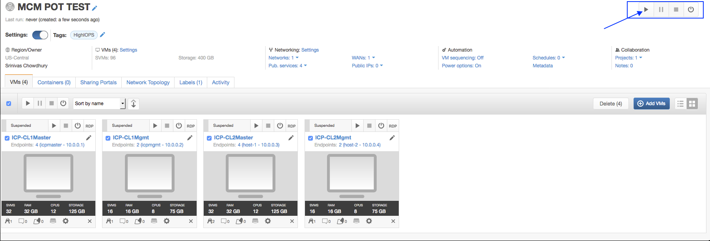

To start your virtual machine, click on the run arrow. The process to start the machine and all the applications will take about 10~15 minutes.

Before logging onto the server, there are a few administrative settings that you may want to change. At the top of the browser window, there will be a control bar similar to the following:

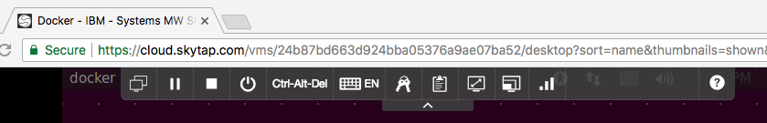

There are three options that you should be aware of:

  * Keyboard Selection
  * Fit to Window
  * Bandwidth Setting

The keyboard selection allows you to change the keyboard that Skytap is emulating to the virtual machine. By default, Skytap emulates a US keyboard but you can change it to your local layout.

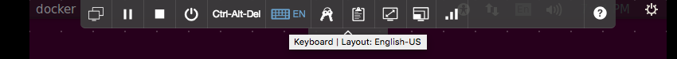

The Fit to Window option should be used to expand the size of the desktop to fit the space of your browser. The default size of the virtual machine console is only 800x600 so you will want to resize it as soon as it starts.

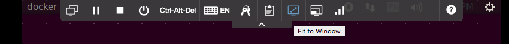

The Bandwidth setting is used to check your current network performance and to adjust the amount of data that is sent from Skytap to your browser. The signal icon gives you an indication of the performance of your network.

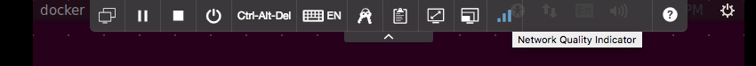

You can adjust the amount of bandwidth used for communication by clicking on the icon and adjusting the value in the performance panel.

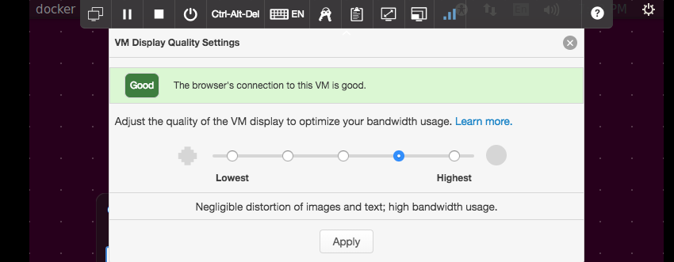

If you find it difficult to scroll or move your cursor, you may want to adjust the setting down. The default setting is usually sufficient for most applications. A lower setting will result in less lag but with some moiré in the displayed graphics.


#### Hint Start the Virtual Machine

No hint available


#### Complete Start the Virtual Machine

> Confirm Start the Virtual Machine complete


#### Task LogIn To The DMZ Cluster

In this initial part we will verify that the Lab prerequisites have been installed.


### LogIn To The DMZ Cluster

In this step we will log in to the DMZ cluster.

Click the **ICP-CL1Master** which is our DMZ cluster and hub cluster. This opens the **linux desktop** in a new tab.

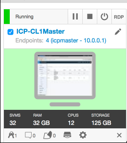

Open a Firefox browser inside the desktop and click on the Bookmark which says **IBM Cloud Private** or use the URL **[https://10.0.0.1:8443](https://10.0.0.1:8443)**. Log in with Username **admin** Password **admin**

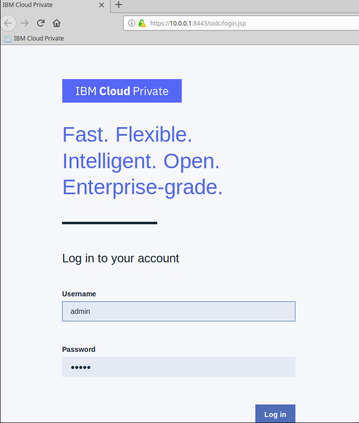

Launch a terminal window and run **./fixklusterlet.sh two times**. This fixes any communication issues between the two kubernetes clusters during suspension and startup mode.

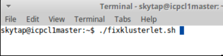


#### Hint LogIn To The DMZ Cluster

No hint available


#### Complete LogIn To The DMZ Cluster

> Confirm LogIn To The DMZ Cluster complete


#### Task Deploy Stock Trader Application to DMZ Cluster

In this initial part we will verify that the Lab prerequisites have been installed.


### Deploy Stock Trader Application to DMZ Cluster

In this step, we will deploy a helm chart from the ICP catalog.

To start, the **Helm Repositories** needs to be synchronized. This ensures that the catalog shows the right information for each helm chart. Click on **Menu** ==> **Manage** ==> **Helm** Repositories. Click the **Sync repositories** button and then click the **Ok** button.


Click the **Catalog** on the top right corner of the page and once the page is loaded, drop down **Repositories** and select **hubmcm-local**, this should display the **stocktraderapp.** 

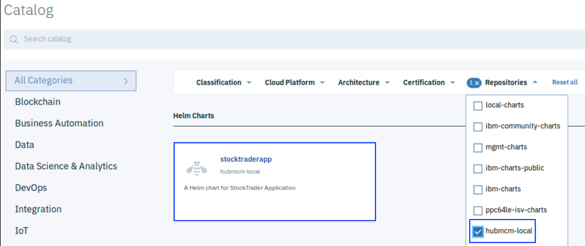

 

Clicking the **stocktraderapp** will launch the overview of the stock trader application.

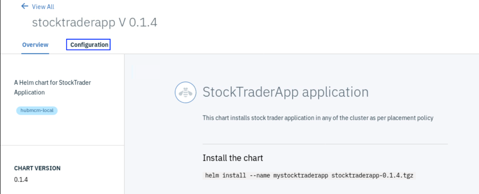

Click the **Configure** button. Give Helm release name as **trade1**, choose Target namespace as **default** and click  **Local Install**. Click the  **View Helm Release **to view the details of the deployed application.

 

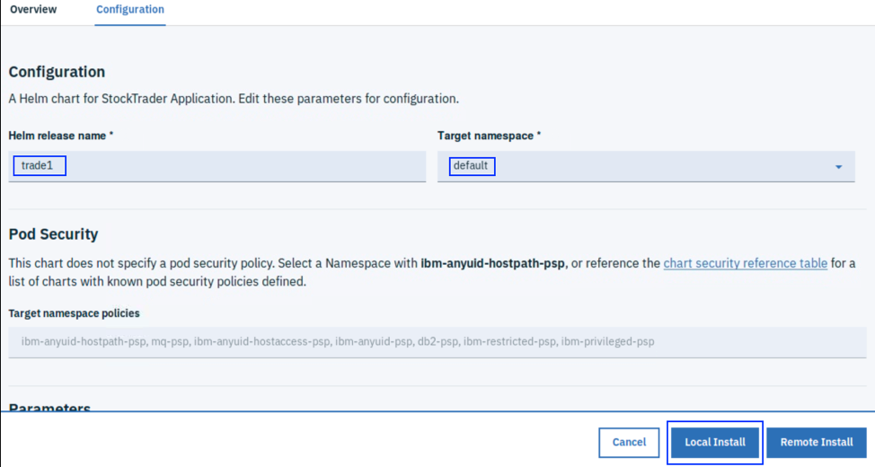

In a few minutes, the stocktraderapp will be deployed to the DMZ cluster.


#### Hint Deploy Stock Trader Application to DMZ Cluster

No hint available


#### Complete Deploy Stock Trader Application to DMZ Cluster

> Confirm Deploy Stock Trader Application to DMZ Cluster complete


#### Task Verify the Application is Running on the DMZ Cluster

In this initial part we will verify that the Lab prerequisites have been installed.


### Verify the Application is Running on the DMZ Cluster

In this step, we will verify the deployed stock trader application.

You can check the application and its details from the IBM Multicloud Manager console. Click on **Menu** ==> **Multi-cloud** ==> **Applications**

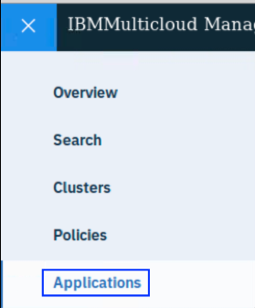

The list of the applications deployed in Multicloud Manager will be displayed.

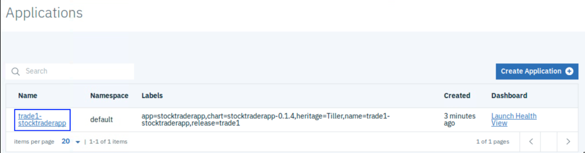

Click on the **deployed application** and then, scroll down and check the **placement policies.**

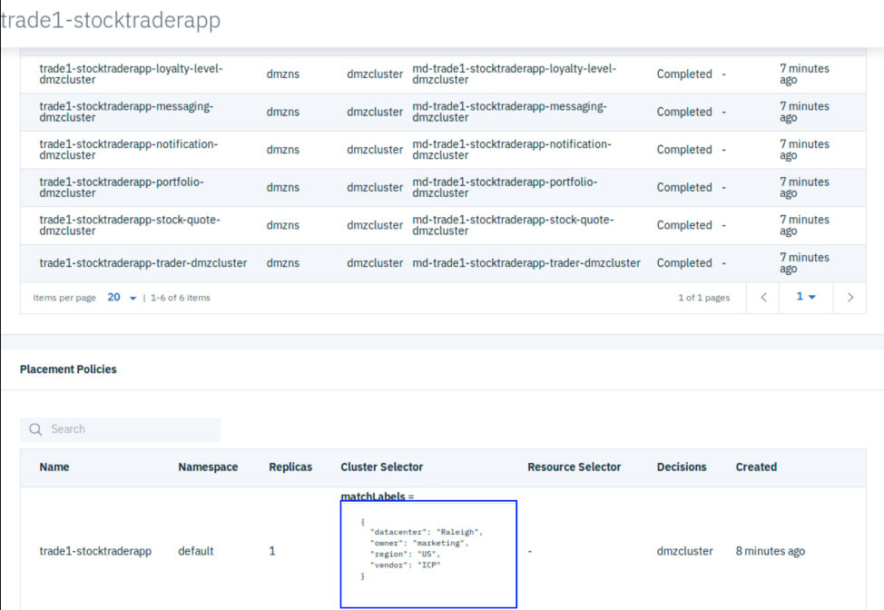

Click the **Diagram** tab to see the application dependencies. This shows the dependencies of the various components as defined in the helm chart.

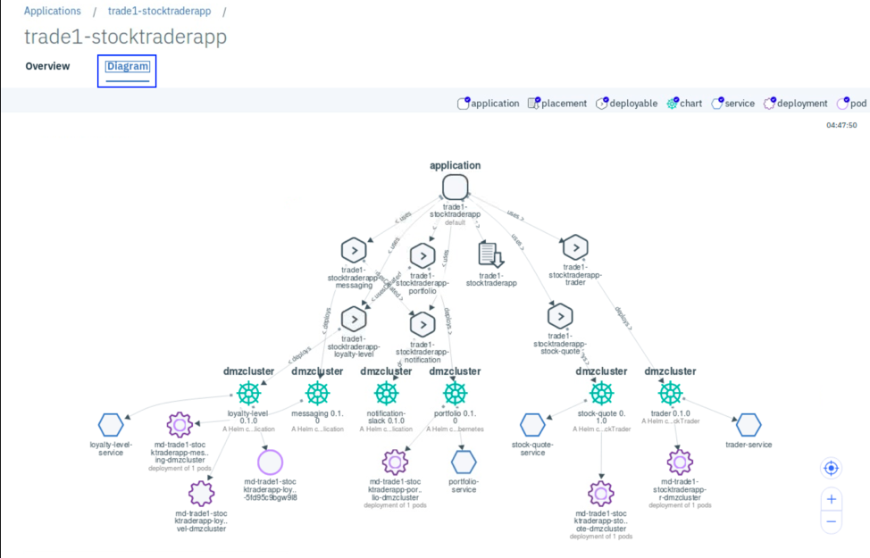

 

Now let's launch the stock trader application itself. Click  **Menu** ==> **Manager Local Cluster**, and then **Menu** ==> **NetworkAccess** ==> **Services** and search for **trader-service**. Click the **trader-service**.

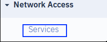

Click the **Node port** https link as highlighted below to launch WebSphere Liberty Console.

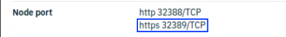

Append **/trader** to the URL to launch trader application. As per the above image, the URL will be **[https://10.0.0.1:32389/trader](https://10.0.0.1:32389/trader)**

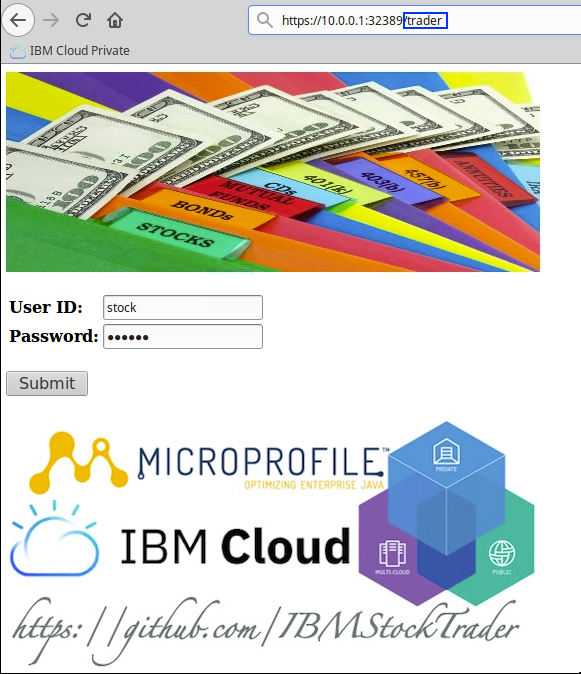

Log in with User ID **stock **and Password **trader**. Now you can play with the application.

Open a terminal window on the desktop and run the following the command **./kubcli.sh admin admin default**

 

From the terminal, run the command **mcmctl get pods | grep trade1.** You should see the pods running in DMZ cluster.

 

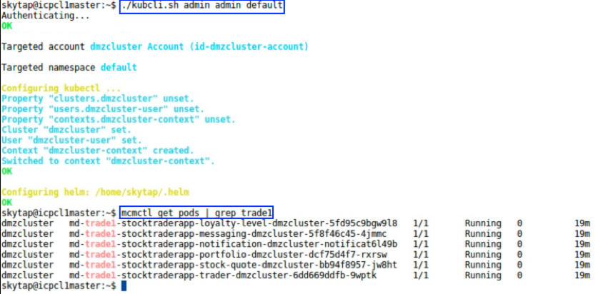


#### Hint Verify the Application is Running on the DMZ Cluster

No hint available


#### Complete Verify the Application is Running on the DMZ Cluster

> Confirm Verify the Application is Running on the DMZ Cluster complete


#### Task Modify the Placement Policy

In this initial part we will verify that the Lab prerequisites have been installed.


### Modify the Placement Policy to Move the Stock Trader Application To Non DMZ Cluster

In this step, we will modify the placement policy of the application from the command line. The two clusters we have in this environment are identified by unique labels, the DMZ cluster is labeled **datacenter=Raleigh** and the Non DMZ cluster is labeled  **datacenter=Austin**. We will be modifying the datacenter label as part of the policy change.

 

You can modify the placement policy either by using the console or the CLI. First, you try to modify the placement policy using the console. 

Launch the application details of stock trader application from **Menu **=> **Muticloud Manager **and then **Menu** ==> **Applications. ** Click the **trade1-stocktraderapp**. Scroll down to the **Application Deployments** section, to see the current placement of the application. In the previous step, the application was deployed to **Raleigh** datacenter which is represented by **dmzcluster.** 

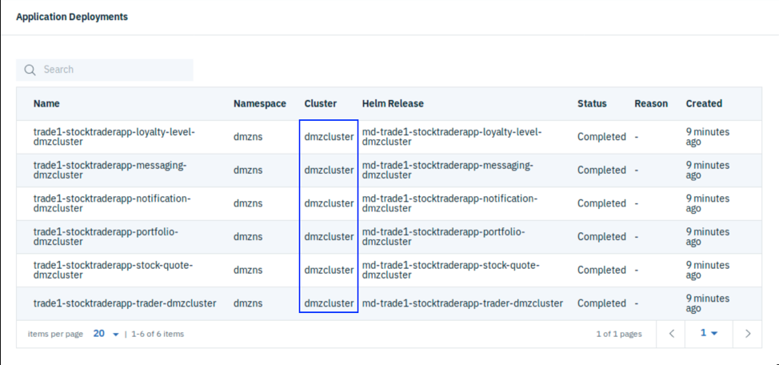

Go to the placement policy section, then click the **three dots** and Edit as highlighted below.

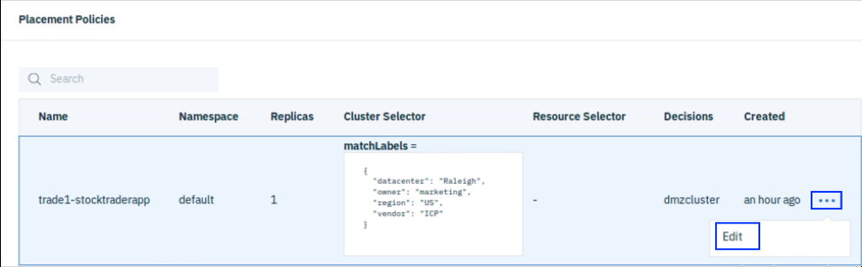

Change the value **datacenter: Raleigh** to **datacenter: Austin** and click Submit.

**Note**: Key and Value pair are case sensitive, hence the new value should be **datacenter: Austin**

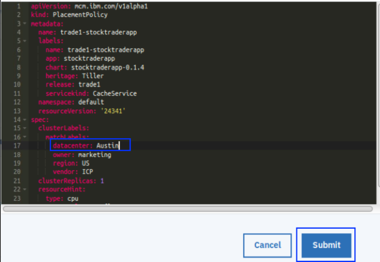

The placement policy change automatically triggers the application placement change. The application will be deployed to **Austin** datacenter which is represented by **nondmzcluster**.

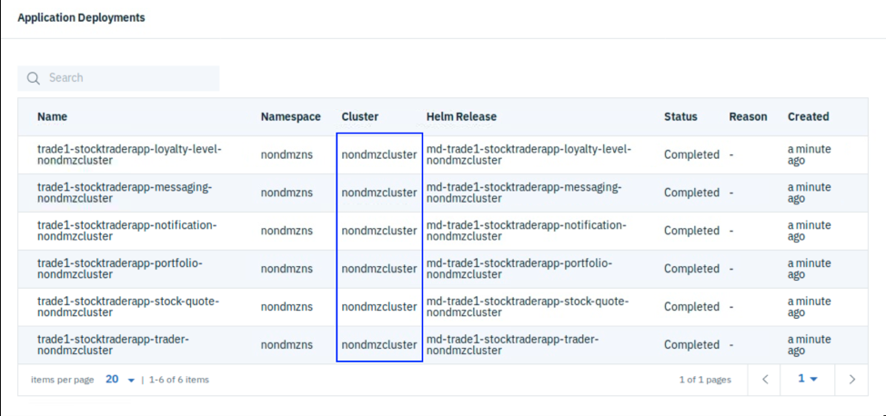


#### Hint Modify the Placement Policy

No hint available


#### Complete Modify the Placement Policy

> Confirm Modify the Placement Policy complete


#### Task Check the Application is Running on the Non DMZ Cluster

In this initial part we will verify that the Lab prerequisites have been installed.


### Verify the Application is Running on the Non DMZ Cluster

In this step, we will validate the application running on the Non DMZ cluster

Run the command **mcmctl get pods | grep trader-stocktraderapp** from the terminal. You should see the pods running in non DMZ cluster.

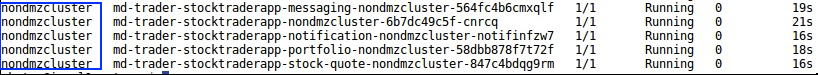

Go to **Menu** ==> **Muticloud Manager **and then **Menu** ==> **Clusters**. You will see both clusters listed in the table.  To launch the console of **nondmzcluster**, click  the **launch** link of that cluster. Log in to the console using **admin** for both username and password.

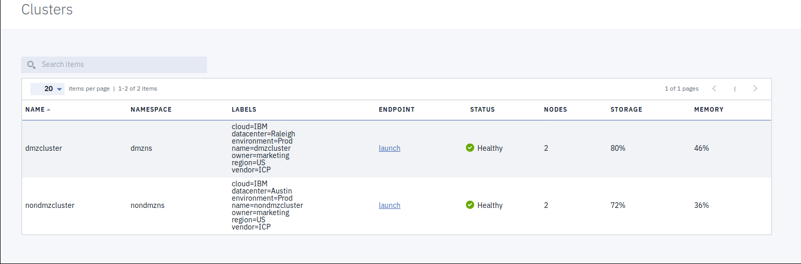

Now let's launch the stock trader application itself. Click on **Menu** ==> **NetworkAccess** ==> **Services** and search for **trader-service**


Click on https link as highlighted below to launch WebSphere Liberty Console.


Append **/trader** to the URL to launch trader application.

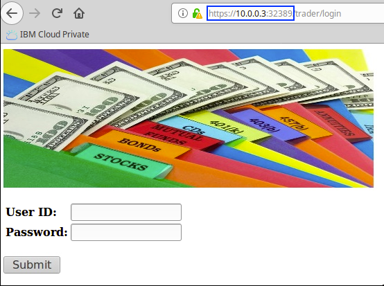

Log in with User ID **stock** and Password **trader**. Now you can play with the application.

#### Hint Check the Application is Running on the Non DMZ Cluster

No hint available


#### Complete Check the Application is Running on the Non DMZ Cluster

> Confirm Check the Application is Running on the Non DMZ Cluster complete


#### Task Change the Replicas and See the Behavior

In this initial part we will verify that the Lab prerequisites have been installed.


### Change the Replicas and See the Behavior

In this step, let's modify the replica count in the placement policy and remove the **datacenter** label and see if multiple replicas are running on both the clusters.

You will modify the placement policy from the command line. From a terminal window, run the command **kubectl get pp** to get the placement policy of the application we just launched and make a note of that policy.

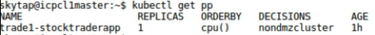

Run the command **kubectl edit pp <name>** where name is the name of the placement policy returned from the above command.**kubectl edit pp trade1-stocktraderapp**. This will open the placement policy file.  Delete the **datacenter** line, modify the **clusterReplicas** to **2 **and save the file. This triggers to deploy the application to deploy to **dmzcluster** also.

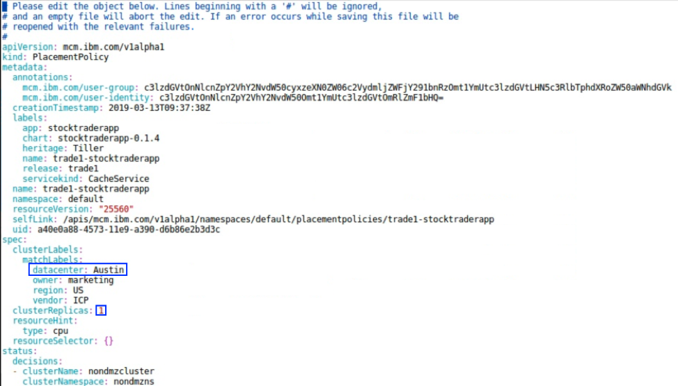

 

Run the command **mcmctl get pods --all-namespaces | grep trade1** and grep for the pods with your name to filter.

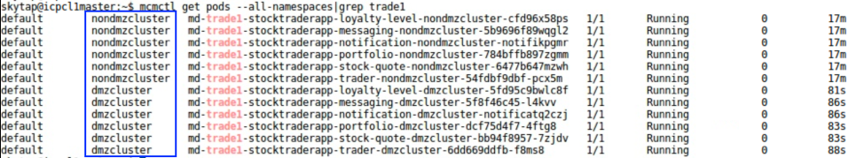

This shows multiple replicas of the application pointing to the same database and queuemanager, running across clusters. You can log in to the stock trader application on both clusters as described in **Section - Verify the application is running on non DMZ cluster** and **Section - Verify the application is running on DMZ cluster**.


#### Hint Change the Replicas and See the Behavior

No hint available


#### Complete Change the Replicas and See the Behavior

> Confirm Change the Replicas and See the Behavior complete


#### Task Summary

In this initial part we will verify that the Lab prerequisites have been installed.


### Summary

You completed the IBM Multicloud Manager tutorial: Multi-cluster Application Management. Throughout the tutorial, you explored the key takeaways:  

  1. Understand IBM Multicloud Manager
  2. Deploy an application chart from the catalog
  3. Manipulate Placement Policies to place different services within an application across clusters.

#### Hint Summary

No hint available


#### Complete Summary

> Confirm Summary complete


